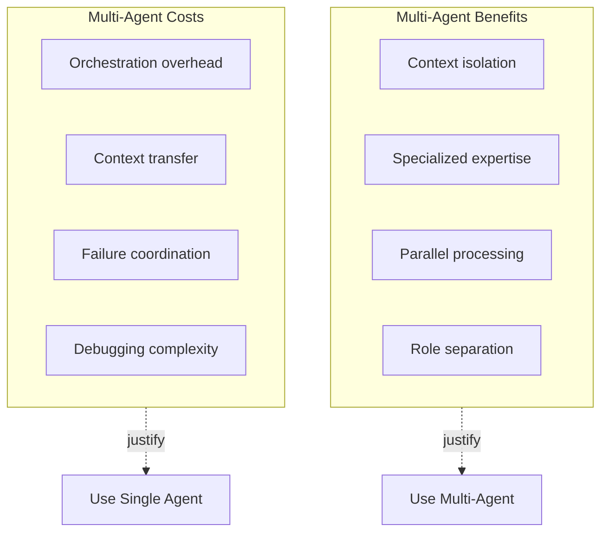
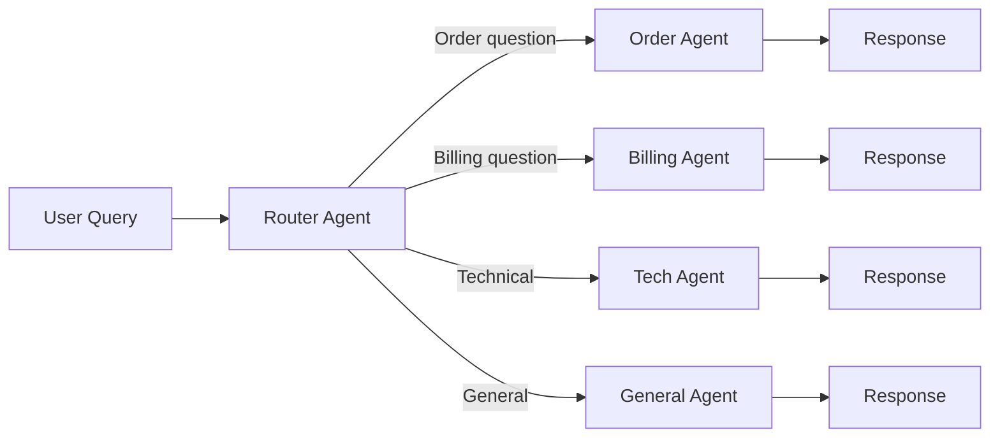
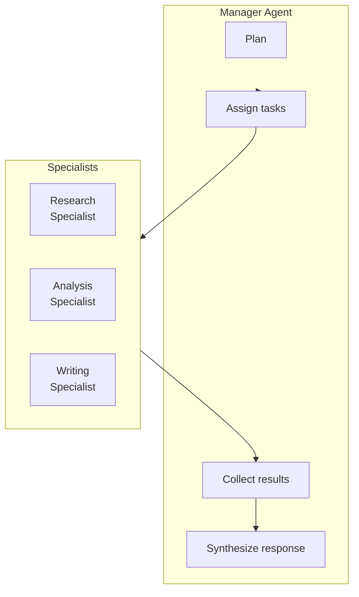
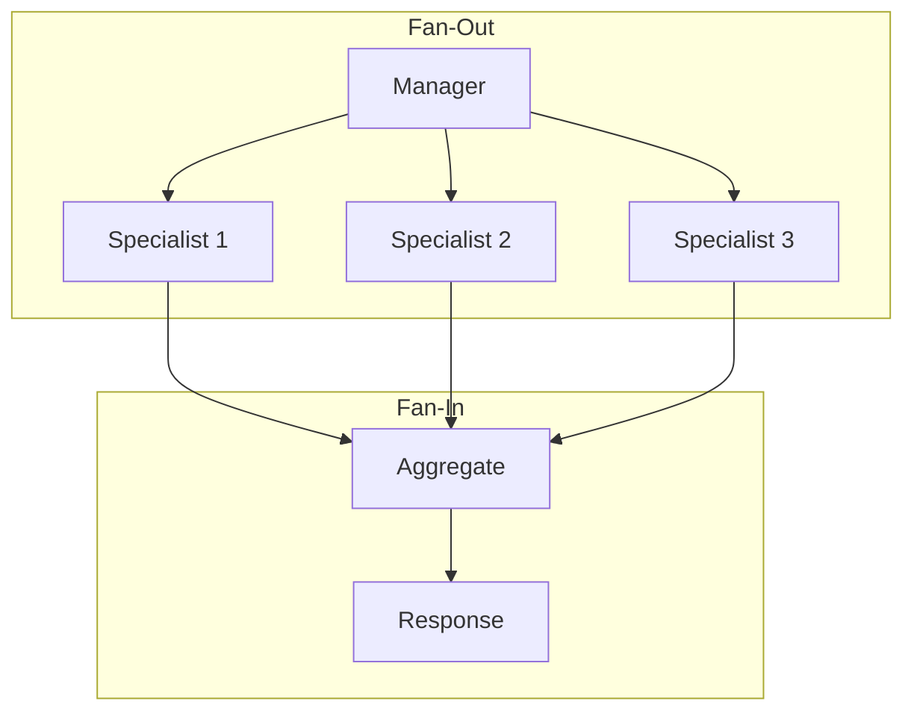
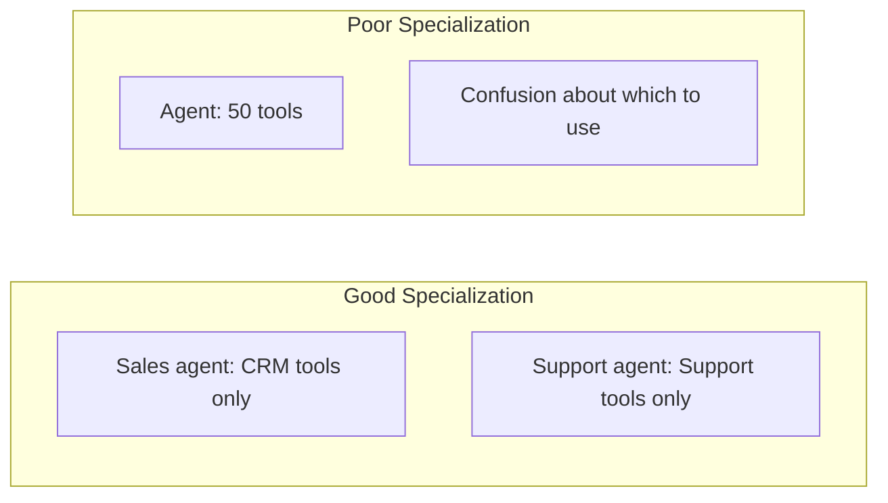

# Lesson 5: Router, Manager, and Specialist Patterns

## Learning Outcome

By the end of this lesson, you will be able to:
- Implement router and classifier patterns
- Design manager-specialist architectures
- Handle parallel fan-out and aggregation
- Predict failure containment in specialist systems

## Prerequisites

- Lesson 1: Architecture decisions
- Lesson 2: Bounded autonomy

---

## Concept: When Multi-Agent Is Worth It

Multi-agent systems add complexity. Make sure the benefit justifies it:



### Multi-Agent Decision Checklist

| Signal | Use Multi-Agent? |
|--------|----------------|
| Different LLM models needed | ✅ Yes |
| Tools conflict | ✅ Yes |
| Need parallel execution | ✅ Yes |
| Context isolation important | ✅ Yes |
| Single expertise area | ❌ No |
| Simple task | ❌ No |

---

## Concept: Router Pattern

The simplest multi-agent pattern: classify and delegate.



### When to Use

| Use Case | Router Type |
|----------|-------------|
| Multiple domains | Classifier |
| Priority levels | Priority router |
| Complexity levels | Complexity router |
| User types | Segmentation router |

### Implementation

```python
from enum import Enum

class Route(str, Enum):
    ORDER = "order_agent"
    BILLING = "billing_agent"
    TECHNICAL = "technical_agent"
    GENERAL = "general_agent"

class RouterAgent:
    def __init__(self):
        self.llm = OpenAIModel("gpt-4o")
        self.routes = {
            Route.ORDER: order_agent,
            Route.BILLING: billing_agent,
            Route.TECHNICAL: technical_agent,
            Route.GENERAL: general_agent,
        }
    
    async def route(self, query: str) -> Route:
        """Classify the query and return the route."""
        prompt = f"""
Classify this customer query into one of these categories:
- order_agent: Questions about orders, shipping, delivery
- billing_agent: Questions about payments, invoices, refunds
- technical_agent: Technical support, troubleshooting
- general_agent: General questions, other topics

Query: {query}

Return JSON with 'route' field only.
"""
        
        result = await self.llm.generate(
            prompt,
            response_format={"route": Route}
        )
        
        return Route(result.route)
    
    async def process(self, query: str) -> str:
        route = await self.route(query)
        agent = self.routes[route]
        return await agent.process(query)
```

---

## Concept: Manager + Specialist Pattern

Centralized control with specialized execution.



### When to Use

| Scenario | Manager + Specialist? |
|----------|---------------------|
| Complex task with distinct phases | ✅ Yes |
| Different expertise per phase | ✅ Yes |
| Need centralized control | ✅ Yes |
| Simple single-task | ❌ No |

### Implementation

```python
class ManagerAgent:
    def __init__(self):
        self.specialists = {
            "researcher": ResearchSpecialist(),
            "analyst": AnalystSpecialist(),
            "writer": WriterSpecialist(),
        }
    
    async def plan_and_execute(self, task: str) -> str:
        # 1. Plan the approach
        plan = await self.create_plan(task)
        
        # 2. Execute phases
        results = {}
        for phase in plan.phases:
            specialist = self.specialists[phase.specialist]
            result = await specialist.execute(phase.input)
            results[phase.name] = result
        
        # 3. Synthesize final output
        return await self.synthesize(task, results)
    
    async def create_plan(self, task: str) -> Plan:
        prompt = f"""
Plan this complex task into phases:

Task: {task}

Return JSON with 'phases' array:
[
  {{"name": "research", "specialist": "researcher", "input": "..."}},
  {{"name": "analysis", "specialist": "analyst", "input": "..."}},
  {{"name": "writing", "specialist": "writer", "input": "..."}}
]
"""
        return await self.llm.generate(prompt, response_format=Plan)
```

---

## Concept: Parallel Fan-out / Fan-in

Execute tasks in parallel, then aggregate results.



### Use Cases

| Use Case | Benefit |
|----------|---------|
| Multiple document analysis | Parallel processing |
| Multi-perspective analysis | Different viewpoints |
| Competitive research | Gather multiple sources |

### Implementation

```python
import asyncio

class ParallelManager:
    async def parallel_execute(
        self,
        task: str,
        perspectives: list[str]
    ) -> str:
        # Create specialist tasks
        async def run_specialist(perspective: str):
            specialist = self.get_specialist(perspective)
            return await specialist.analyze(task)
        
        # Execute all in parallel
        results = await asyncio.gather(
            *[run_specialist(p) for p in perspectives]
        )
        
        # Aggregate results
        return await self.aggregate(task, results)
    
    async def aggregate(self, task: str, results: list[str]) -> str:
        prompt = f"""
Analyze the following perspectives on this task and provide a synthesis:

Task: {task}

Perspectives:
{chr(10).join(f'- {r}' for r in results)}

Provide a balanced synthesis.
"""
        return await self.llm.generate(prompt)
```

---

## Concept: Context Isolation and Specialization Boundaries

### Why Context Isolation Matters

| Without Isolation | With Isolation |
|------------------|----------------|
| Tool conflicts | Clear boundaries |
| Confusion about role | Focused expertise |
| Context pollution | Clean context per specialist |

### Specialization Patterns



### Best Practices

| Practice | Why |
|----------|-----|
| Limit tools per agent | Reduces confusion |
| Clear role definitions | Improves routing |
| Explicit handoff protocols | Smooth transitions |
| Shared context store | When needed for coordination |

---

## Exercise: Design a Multi-Agent System

### Scenario

Build a system that reviews pull requests:
- Security expert (finds vulnerabilities)
- Style expert (checks code style)
- Test expert (reviews test coverage)
- Summary expert (compiles report)

### Your Task

1. **Choose architecture** — Router vs. Manager + Specialists vs. Parallel
2. **Define boundaries** — What each agent can/cannot do
3. **Design handoffs** — How results flow between agents
4. **Estimate tradeoffs** — Latency, cost, quality

### Template

```markdown
## PR Review Multi-Agent Design

### Architecture Choice
[Which pattern did you choose and why?]

### Agent Definitions
| Agent | Role | Tools | Context |
|-------|------|-------|---------|
| Security | | | |
| Style | | | |
| Test | | | |
| Summary | | | |

### Handoff Flow
[Describe how results flow]

### Tradeoff Analysis
| Factor | Value | Notes |
|--------|-------|-------|
| Latency | | |
| Cost | | |
| Quality | | |
| Complexity | | |
```

---

## What You Learned

1. **Router for classification** — Simple routing to specialized agents
2. **Manager + Specialist for phases** — Centralized control, delegated execution
3. **Parallel for independent tasks** — Fan-out, gather, aggregate
4. **Context isolation is key** — Clear boundaries reduce confusion

---

## Common Failure Mode

**Too many specialists**

```python
# ❌ Over-specialized
agents = [
    EmailAgent(), CalendarAgent(), TodoAgent(), 
    SlackAgent(), GitHubAgent(), JiraAgent(), 
    ConfluenceAgent(), DriveAgent(), 
    # ... 20 more agents
]

# ✅ Appropriate specialization
support_agents = {
    "order": OrderAgent(tools=[check_status, update_address]),
    "refund": RefundAgent(tools=[process_refund, send_email]),
    "technical": TechAgent(tools=[diagnose, run_command]),
}
```

---

## Next Step

Continue to [Lesson 6: Handoffs, human review, and control surfaces](./lesson-6-handoffs-human-review-and-control-surfaces.md) to implement human-in-the-loop.

### Or Explore

- [Multi-agent Tutorial](/docs/tutorials/from-examples/multiagent.md) — Implementation
- [Handoff Tutorial](/docs/tutorials/from-examples/handoff.md) — Agent transitions
