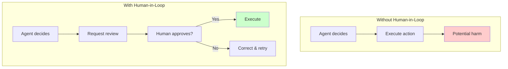
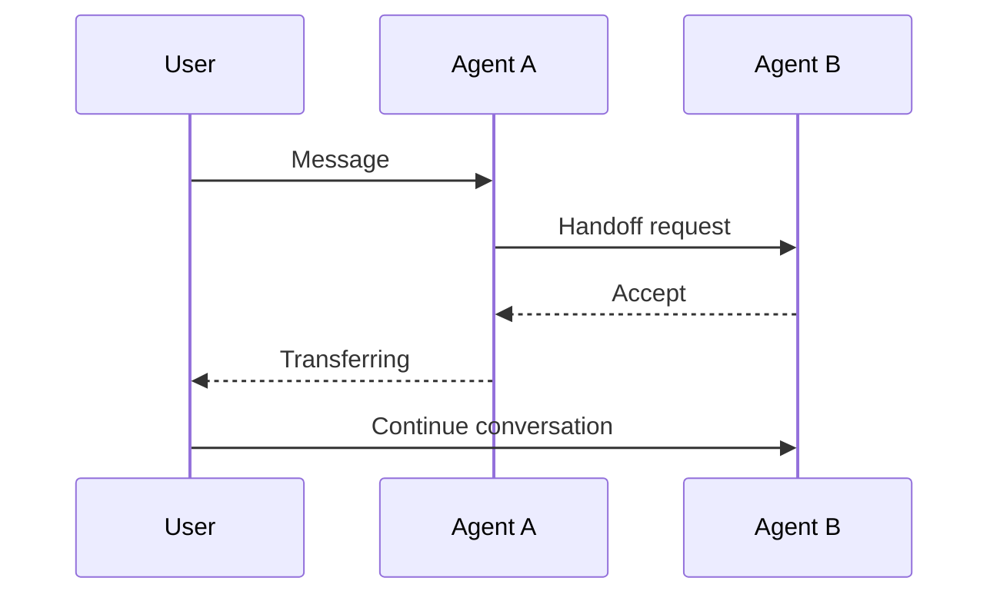
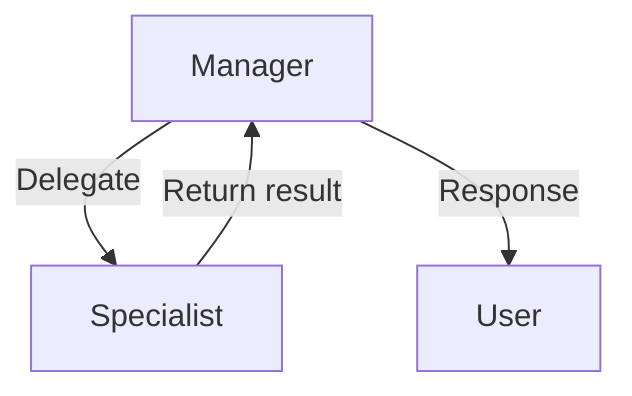
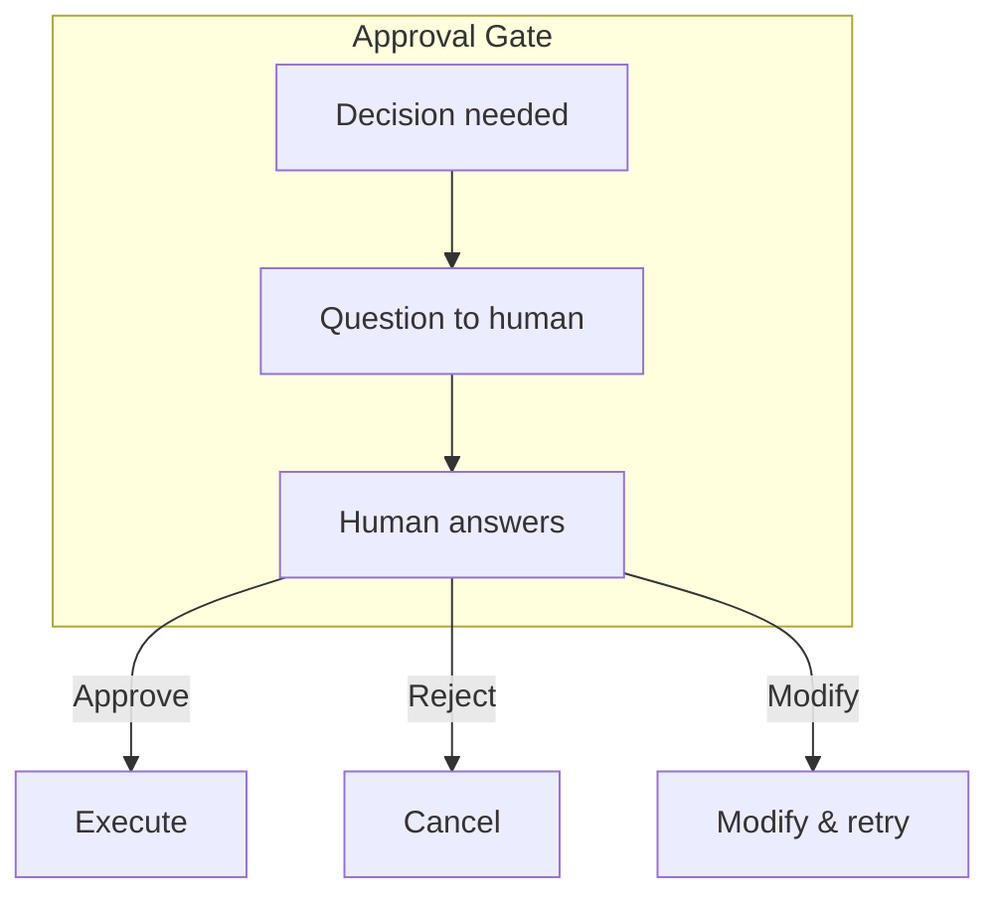
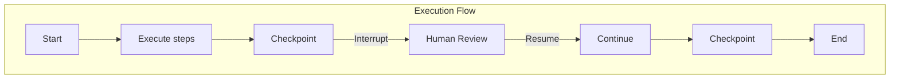
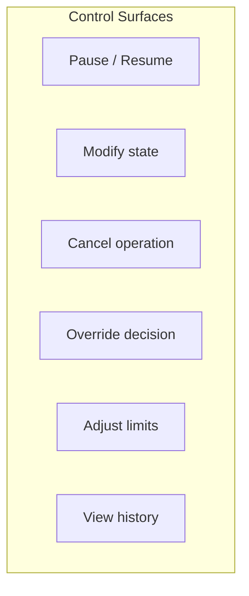

# Lesson 6: Handoffs, Human Review, and Control Surfaces

## Learning Outcome

By the end of this lesson, you will be able to:
- Implement peer handoffs and decentralized control
- Design approval gates for risky actions
- Build interrupt and resume semantics
- Create control surfaces for human oversight

## Prerequisites

- Lesson 5: Multi-agent patterns
- [Checkpointing concepts](/docs/concepts/checkpointing-and-threads.md)

---

## Concept: Human-in-the-Loop Design

Human oversight is essential for risky or irreversible actions:



### When Human-in-the-Loop Is Required

| Action Type | Required? | Rationale |
|-------------|-----------|------------|
| Send email | ✅ Always | Irreversible |
| Delete data | ✅ Always | Destructive |
| Spend money | ✅ Always | Financial risk |
| Public statements | ✅ Always | Reputation risk |
| Read data | ❌ No | Low risk |

---

## Concept: Handoff Patterns

### Peer-to-Peer Handoff

Equal agents transfer conversation context:



### Manager-to-Specialist Handoff

Centralized control with delegated execution:



### Implementation

```python
class HandoffManager:
    def __init__(self):
        self.agents = {}
        self.current_agent = None
    
    async def handoff_to(
        self,
        target_agent: str,
        context: dict,
        reason: str = None
    ) -> str:
        """Handoff to another agent with context transfer."""
        
        # Capture current state
        current_state = self.capture_state()
        
        # Create handoff context
        handoff_context = {
            "from_agent": self.current_agent,
            "to_agent": target_agent,
            "reason": reason,
            "captured_state": current_state,
            "user_context": context
        }
        
        # Transfer to target agent
        target = self.agents[target_agent]
        result = await target.resume_with(handoff_context)
        
        # Update current agent
        self.current_agent = target_agent
        
        return result
```

---

## Concept: Approval Gates

### Gate Design



### Implementation

```python
from enum import Enum
from pydantic import BaseModel

class ApprovalStatus(Enum):
    PENDING = "pending"
    APPROVED = "approved"
    REJECTED = "rejected"
    MODIFIED = "modified"

class ApprovalGate(BaseModel):
    action: str
    description: str
    risk_level: str
    context: dict
    status: ApprovalStatus = ApprovalStatus.PENDING
    human_response: str = None

class ApprovalManager:
    def __init__(self):
        self.pending_approvals = {}
    
    async def request_approval(
        self,
        action: str,
        description: str,
        risk_level: str,
        context: dict
    ) -> ApprovalGate:
        """Request human approval for an action."""
        
        gate = ApprovalGate(
            action=action,
            description=description,
            risk_level=risk_level,
            context=context
        )
        
        # Store for human review
        approval_id = self.generate_id()
        self.pending_approvals[approval_id] = gate
        
        # Send to human review system
        await self.notify_human(approval_id, gate)
        
        return gate
    
    async def wait_for_approval(self, approval_id: str) -> ApprovalGate:
        """Wait for human response."""
        while self.pending_approvals[approval_id].status == ApprovalStatus.PENDING:
            await asyncio.sleep(1)  # Poll or use async notifications
        
        return self.pending_approvals[approval_id]
```

### Risk-based Approval

```python
RISK_APPROVAL_REQUIRED = {
    "low": False,      # Execute directly
    "medium": False,   # Log and continue
    "high": True,      # Require approval
    "critical": True,  # Require approval + supervisor
}

def should_approve(action: str, risk_level: str) -> bool:
    """Determine if approval is needed."""
    return RISK_APPROVAL_REQUIRED.get(risk_level, False)
```

---

## Concept: Interrupt and Resume Semantics

### Durable Execution with Interrupts



### Interrupt Patterns

| Pattern | When to Use | Implementation |
|---------|-------------|----------------|
| **Pause** | Need human input | Save state, await response |
| **Cancel** | User cancels | Rollback, cleanup |
| **Modify** | Human edits | Update state, continue |
| **Resume** | Continue from checkpoint | Restore state, continue |

### Implementation

```python
from enum import Enum

class InterruptType(Enum):
    APPROVAL = "approval"
    USER_REVISION = "user_revision"
    ERROR_RECOVERY = "error_recovery"
    CANCEL = "cancel"

class Interrupt:
    def __init__(
        self,
        interrupt_type: InterruptType,
        checkpoint_id: str,
        state: dict,
        request: dict
    ):
        self.type = interrupt_type
        self.checkpoint_id = checkpoint_id
        self.state = state
        self.request = request

class DurableAgent:
    def __init__(self, checkpointer):
        self.checkpointer = checkpointer
    
    async def execute_with_interrupts(self, task: str) -> str:
        state = self.initialize_state(task)
        
        for step in self.plan_steps(task):
            # Execute step
            result = await self.execute_step(state, step)
            
            # Checkpoint before potentially risky operation
            if step.requires_checkpoint:
                await self.checkpointer.save(state)
            
            # Check if interrupt needed
            if step.requires_approval:
                interrupt = Interrupt(
                    InterruptType.APPROVAL,
                    checkpoint_id=self.checkpointer.last_id,
                    state=state,
                    request=result
                )
                
                # Wait for human response
                response = await self.wait_for_interrupt(interrupt)
                
                if response.status == "rejected":
                    return self.handle_rejection(state, step)
                elif response.status == "modified":
                    state.update(response.modified_state)
            
            state.update(result)
        
        return self.format_final_output(state)
    
    async def wait_for_interrupt(self, interrupt: Interrupt) -> InterruptResponse:
        """Wait for human to respond to interrupt."""
        # Implementation depends on your notification system
        pass
```

---

## Concept: Control Surfaces

### What to Expose for Control



### API Design for Control

```python
# Control surface API
class AgentControl:
    @app.post("/api/agent/{thread_id}/pause")
    async def pause_agent(thread_id: str):
        """Pause agent execution."""
        await agent.pause(thread_id)
        return {"status": "paused", "checkpoint_id": agent.current_checkpoint}
    
    @app.post("/api/agent/{thread_id}/resume")
    async def resume_agent(thread_id: str, action: str = "continue"):
        """Resume agent execution."""
        if action == "continue":
            return await agent.resume()
        elif action == "modify":
            # Human will provide modified state
            return {"status": "awaiting_modification"}
    
    @app.post("/api/agent/{thread_id}/cancel")
    async def cancel_agent(thread_id: str):
        """Cancel agent execution."""
        return await agent.cancel()
    
    @app.post("/api/agent/{thread_id}/approve/{action_id}")
    async def approve_action(thread_id: str, action_id: str, decision: ApprovalDecision):
        """Approve or reject pending action."""
        return await agent.handle_approval(action_id, decision)
    
    @app.get("/api/agent/{thread_id}/history")
    async def get_history(thread_id: str):
        """Get execution history for debugging."""
        return await agent.get_execution_history(thread_id)
```

---

## Exercise: Add Approval Gate to an Agent

### Your Task

Take this agent and add approval gates:

```python
class EmailAgent:
    async def process(self, request: SendEmailRequest) -> str:
        # Draft email
        email = await self.draft_email(request)
        
        # Currently sends directly - ADD APPROVAL GATE
        await self.send_email(email)
        
        return "Email sent successfully"
```

### Requirements

1. Add approval request before sending
2. Support approve, reject, modify actions
3. Handle timeout if no response
4. Log all approval decisions

### Expected Implementation

```python
class EmailAgentWithApproval:
    def __init__(self, approval_manager):
        self.approval_manager = approval_manager
        # ...
    
    async def process(self, request: SendEmailRequest) -> str:
        # Draft email
        email = await self.draft_email(request)
        
        # Request approval
        approval = await self.approval_manager.request_approval(
            action="send_email",
            description=f"To: {email.to}, Subject: {email.subject}",
            risk_level="high",
            context={"email": email.dict()}
        )
        
        if approval.status == "approved":
            await self.send_email(email)
            return "Email sent successfully"
        elif approval.status == "rejected":
            return "Email rejected by human"
        elif approval.status == "modified":
            await self.send_email(approval.modified_email)
            return "Modified email sent"
```

---

## What You Learned

1. **Human oversight for risky actions** — Approval gates prevent harm
2. **Handoffs transfer context** — Peer or manager-specialist patterns
3. **Durable execution with interrupts** — Checkpoint, pause, resume
4. **Control surfaces enable oversight** — APIs for pause, resume, modify

---

## Common Failure Mode

**No approval for risky actions**

```python
# ❌ Dangerous - no approval
@tool(name="delete_data")
def delete_data(table: str):
    db.execute(f"DROP TABLE {table}")
    return "Deleted"

# ✅ Safer - approval required
@tool(name="delete_data", requires_approval=True)
def delete_data(table: str):
    db.execute(f"DROP TABLE {table}")
    return "Deleted"
```

---

## Next Step

Continue to [Lesson 7: Memory, checkpoints, artifacts, and durable execution](./lesson-7-memory-checkpoints-artifacts-and-durable-execution.md) to implement runtime durability.

### Or Explore

- [Handoff Tutorial](/docs/tutorials/from-examples/handoff.md) — Implementation
- [Background Tasks Reference](/docs/reference/python/background-tasks.md) — Long-running tasks
