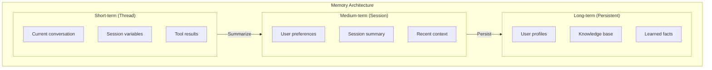
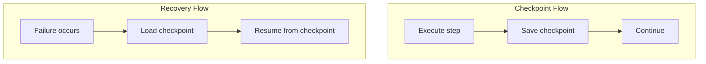
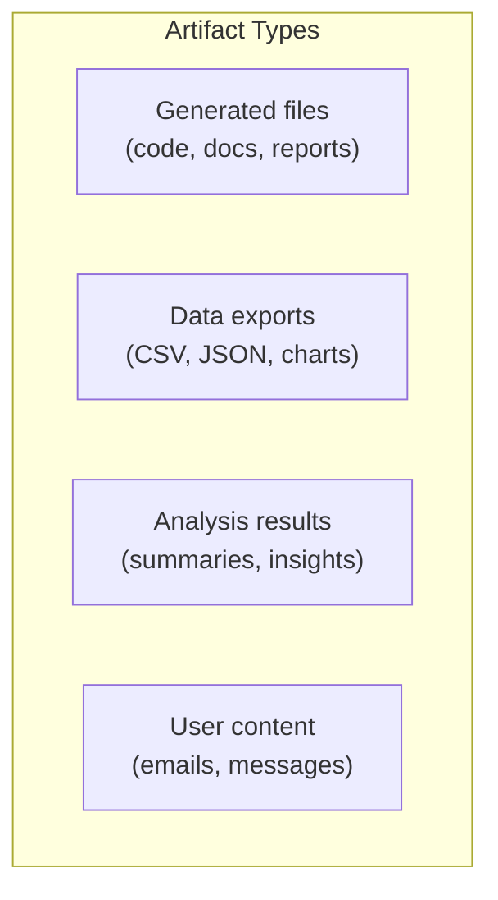
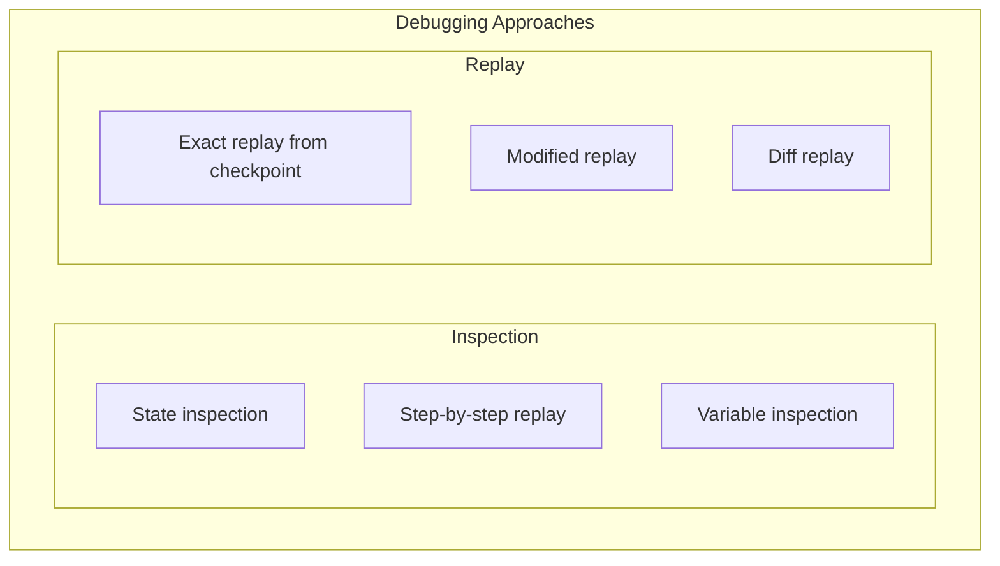

# Lesson 7: Memory, Checkpoints, Artifacts, and Durable Execution

## Learning Outcome

By the end of this lesson, you will be able to:
- Distinguish between short-term state and long-term memory
- Implement durable execution with checkpoints
- Design artifact management systems
- Build debugging and recovery workflows

## Prerequisites

- Lesson 5: State and memory
- Lesson 6: Human-in-the-loop

---

## Concept: Memory Is Broader Than a Vector Store

Memory has multiple layers:



### What Belongs Where

| Memory Type | Duration | Storage | Example |
|-------------|----------|---------|---------|
| **Thread state** | Current request | In-memory | Conversation turns |
| **Checkpoint** | Until session ends | Checkpointer | Full state snapshot |
| **Session memory** | Session lifetime | Database | User preferences |
| **Long-term memory** | Permanent | Vector store | Learned facts |

---

## Concept: Checkpoints Are Runtime Primitives

Checkpoints enable durable execution—they're not optional:



### What to Checkpoint

| Component | Checkpoint? | Why |
|-----------|-------------|-----|
| Conversation history | ✅ Yes | Preserve context |
| Tool results | ✅ Yes | Avoid re-execution |
| Intermediate variables | ⚠️ Sometimes | If expensive to recompute |
| LLM context window | ❌ No | Reconstructed from history |

### Implementation

```python
class CheckpointableAgent:
    def __init__(self, checkpointer):
        self.checkpointer = checkpointer
    
    async def run_with_checkpoints(
        self,
        thread_id: str,
        input_message: str
    ) -> str:
        # Load existing state or create new
        state = await self.checkpointer.load(thread_id)
        
        if not state:
            state = self.initialize_state(thread_id, input_message)
        
        # Execute with checkpointing
        for step in self.plan_steps(state):
            # Execute step
            result = await self.execute_step(state, step)
            state.update(result)
            
            # Checkpoint after each step
            await self.checkpointer.save(thread_id, state)
        
        return self.format_output(state)
```

---

## Concept: Artifacts and Intermediate Outputs

Agents produce artifacts that need management:



### Artifact Management

| Artifact Type | Storage | Retention | Access |
|--------------|---------|-----------|--------|
| **Generated files** | File storage | Until user downloads | User only |
| **Data exports** | Object storage | Configurable | User + audit |
| **Analysis results** | Database | Permanent | System + user |
| **User content** | Message store | Thread-based | Context only |

### Implementation

```python
from dataclasses import dataclass
from enum import Enum
from datetime import datetime

class ArtifactType(Enum):
    GENERATED_FILE = "generated_file"
    DATA_EXPORT = "data_export"
    ANALYSIS_RESULT = "analysis_result"
    MESSAGE_CONTENT = "message_content"

@dataclass
class Artifact:
    artifact_id: str
    artifact_type: ArtifactType
    filename: str
    storage_path: str
    size_bytes: int
    created_at: datetime
    created_by: str  # thread_id or user_id
    accessed_at: datetime
    expires_at: datetime = None  # Optional expiration

class ArtifactManager:
    def __init__(self, storage_backend):
        self.storage = storage_backend
        self.metadata_store = {}
    
    async def save_artifact(
        self,
        content: bytes,
        artifact_type: ArtifactType,
        filename: str,
        created_by: str
    ) -> Artifact:
        # Generate ID
        artifact_id = str(uuid.uuid4())
        
        # Store file
        path = f"{artifact_type.value}/{created_by}/{artifact_id}/{filename}"
        await self.storage.put(path, content)
        
        # Create artifact record
        artifact = Artifact(
            artifact_id=artifact_id,
            artifact_type=artifact_type,
            filename=filename,
            storage_path=path,
            size_bytes=len(content),
            created_at=datetime.now(),
            created_by=created_by,
            accessed_at=datetime.now()
        )
        
        self.metadata_store[artifact_id] = artifact
        return artifact
    
    async def get_artifact(self, artifact_id: str) -> Artifact:
        artifact = self.metadata_store[artifact_id]
        artifact.accessed_at = datetime.now()
        return artifact
```

---

## Concept: Background Tasks and Long-Running Workflows

### When to Use Background Tasks

| Scenario | Use Background? | Why |
|----------|----------------|-----|
| Long report generation | ✅ Yes | Can't wait for response |
| Multi-step workflow | ✅ Yes | Needs checkpointing |
| Batch processing | ✅ Yes | High volume |
| Simple Q&A | ❌ No | Real-time expected |
| User waiting | ❌ No | Sync response needed |

### Implementation

```python
from enum import Enum

class TaskStatus(Enum):
    PENDING = "pending"
    RUNNING = "running"
    PAUSED = "paused"
    COMPLETED = "completed"
    FAILED = "failed"

class BackgroundTask:
    def __init__(
        self,
        task_id: str,
        task_type: str,
        input_data: dict,
        created_at: datetime
    ):
        self.task_id = task_id
        self.task_type = task_type
        self.input_data = input_data
        self.created_at = created_at
        self.status = TaskStatus.PENDING
        self.progress = 0.0
        self.checkpoint_id = None
        self.error = None

class BackgroundTaskManager:
    def __init__(self, checkpointer):
        self.checkpointer = checkpointer
        self.task_queue = asyncio.Queue()
        self.running_tasks = {}
    
    async def submit_task(
        self,
        task_type: str,
        input_data: dict,
        user_id: str
    ) -> BackgroundTask:
        task = BackgroundTask(
            task_id=str(uuid.uuid4()),
            task_type=task_type,
            input_data=input_data,
            created_at=datetime.now()
        )
        
        self.running_tasks[task.task_id] = task
        await self.task_queue.put(task)
        
        return task
    
    async def process_task(self, task: BackgroundTask):
        try:
            task.status = TaskStatus.RUNNING
            
            # Get or create checkpoint
            if task.checkpoint_id:
                state = await self.checkpointer.load(task.checkpoint_id)
            else:
                state = self.initialize_task_state(task)
            
            # Execute with progress updates
            for step in self.plan_task_steps(task, state):
                result = await self.execute_task_step(state, step)
                state.update(result)
                
                # Update progress
                task.progress = step.progress_percentage
                
                # Checkpoint periodically
                if step.should_checkpoint:
                    task.checkpoint_id = await self.checkpointer.save(
                        task.task_id,
                        state
                    )
                
                # Check for interrupts
                if await self.should_pause(task.task_id):
                    task.status = TaskStatus.PAUSED
                    return
            
            task.status = TaskStatus.COMPLETED
            
        except Exception as e:
            task.status = TaskStatus.FAILED
            task.error = str(e)
    
    async def get_task_status(self, task_id: str) -> BackgroundTask:
        return self.running_tasks.get(task_id)
```

---

## Concept: Debugging and Operational Replay

### Debugging Strategies



### Debugging Implementation

```python
class AgentDebugger:
    def __init__(self, checkpointer):
        self.checkpointer = checkpointer
    
    async def replay_from_checkpoint(
        self,
        thread_id: str,
        checkpoint_id: str = None
    ):
        """Replay execution from a specific checkpoint."""
        
        # Load checkpoint
        state = await self.checkpointer.load(thread_id, checkpoint_id)
        
        # Replay steps
        for step in state.execution_history:
            print(f"Step: {step.name}")
            print(f"  Input: {step.input}")
            print(f"  Tool calls: {step.tool_calls}")
            print(f"  Output: {step.output}")
            print()
    
    async def diff_checkpoints(
        self,
        thread_id: str,
        checkpoint_a: str,
        checkpoint_b: str
    ):
        """Compare two checkpoints to find differences."""
        
        state_a = await self.checkpointer.load(thread_id, checkpoint_a)
        state_b = await self.checkpointer.load(thread_id, checkpoint_b)
        
        return {
            "messages_added": len(state_b.messages) - len(state_a.messages),
            "steps_added": len(state_b.execution_history) - len(state_a.execution_history),
            "state_diffs": self.compute_diffs(state_a, state_b)
        }
    
    async def get_execution_timeline(self, thread_id: str) -> list:
        """Get a timeline of execution for debugging."""
        
        checkpoints = await self.checkpointer.get_checkpoints(thread_id)
        
        timeline = []
        for cp in checkpoints:
            state = await self.checkpointer.load(thread_id, cp.id)
            timeline.append({
                "checkpoint_id": cp.id,
                "timestamp": cp.timestamp,
                "step_count": len(state.execution_history),
                "message_count": len(state.messages),
                "duration_ms": cp.duration_ms
            })
        
        return timeline
```

---

## Exercise: Add Recovery Plan to a Workflow

### Your Task

Design a recovery plan for this long-running task:

**Task**: Generate a comprehensive report that:
1. Gathers data from 5 sources
2. Analyzes trends
3. Generates visualizations
4. Compiles into PDF

### Recovery Plan Template

```markdown
## Recovery Plan: Report Generation

### Failure Points
| Step | Potential Failure | Impact | Recovery Action |
|------|------------------|--------|-----------------|
| 1. Data gathering | API timeout | Partial data | Retry with cached partial |
| 2. Analysis | Out of memory | No analysis | Use smaller dataset |
| 3. Visualization | Rendering error | Missing charts | Skip failed chart |
| 4. PDF compilation | File error | No PDF | Generate HTML instead |

### Checkpoint Strategy
- [ ] Checkpoint after: [Which steps?]
- [ ] What state to save: [What data?]

### Resume Behavior
- [ ] If failed at step 2: [What to do?]
- [ ] If failed at step 3: [What to do?]

### User Notification
- [ ] When to notify user of failure
- [ ] What information to provide
- [ ] How to allow manual recovery
```

---

## What You Learned

1. **Memory has layers** — Short-term, medium-term, and long-term
2. **Checkpoints enable durability** — Not optional for production
3. **Artifacts need management** — Storage, retrieval, expiration
4. **Background tasks need monitoring** — Progress, checkpoints, recovery

---

## Common Failure Mode

**No checkpoint strategy**

```python
# ❌ No durability
async def long_task():
    for step in steps:
        result = await execute(step)
        save_result(result)  # Lost if server crashes!
    return final_result

# ✅ With checkpoints
async def durable_task():
    state = load_or_init()
    for step in steps:
        result = await execute(state, step)
        state.update(result)
        await checkpoint.save(state)  # Durable!
    return final_result
```

---

## Next Step

Continue to [Lesson 8: Observability, testing, security, and deployment](./lesson-8-observability-testing-security-and-deployment.md) to complete production readiness.

### Or Explore

- [Checkpointers Reference](/docs/reference/python/checkpointers.md) — Implementation
- [Memory Tutorial](/docs/tutorials/from-examples/memory.md) — Memory patterns
