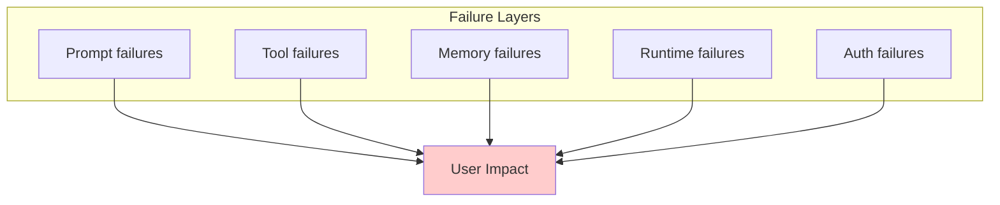
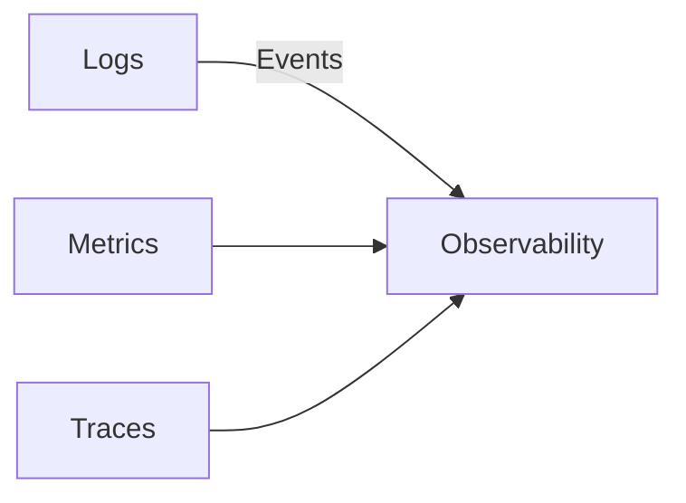
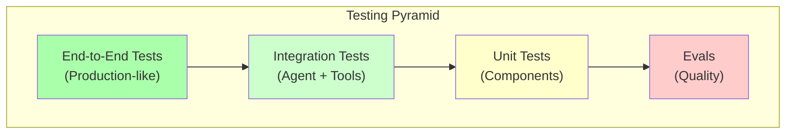
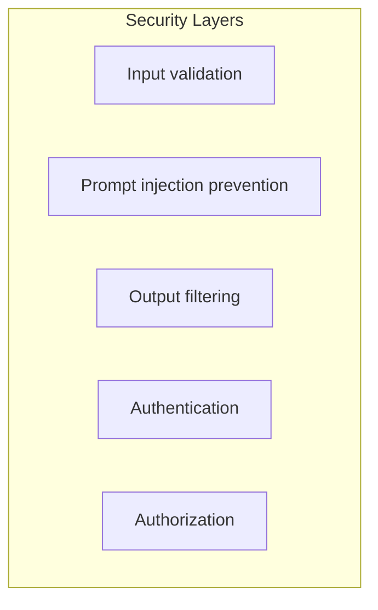
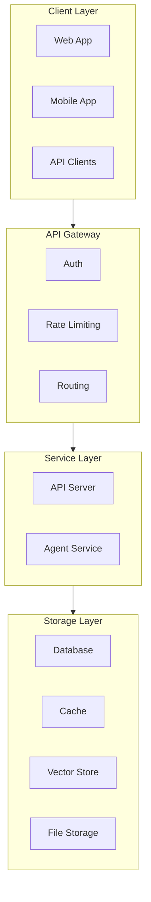

# Lesson 8: Observability, Testing, Security, and Deployment

## Learning Outcome

By the end of this lesson, you will be able to:
- Implement comprehensive observability for agent systems
- Build evaluation and regression test suites
- Design security controls for GenAI applications
- Plan deployment and rollback strategies

## Prerequisites

- Lesson 7: Durable execution
- [Production guides](/docs/how-to/production/deployment.md)

---

## Concept: Agent Failures Are System Failures

Agent failures span multiple layers:



### What to Monitor

| Layer | What to Monitor | Alert Threshold |
|-------|----------------|-----------------|
| **Prompt** | Quality degradation, schema failures | >5% failures |
| **Tool** | Timeout, errors, rate limits | >2% errors |
| **Memory** | Checkpoint failures, retrieval quality | Any failure |
| **Runtime** | Latency, throughput, errors | p99 >5s |
| **Auth** | Failed auth, permission errors | Any failure |

---

## Concept: Observability Patterns

### Three Pillars



| Pillar | Purpose | Example |
|--------|---------|---------|
| **Logs** | Event history | "Tool X failed at step 3" |
| **Metrics** | Aggregated values | "p95 latency: 1.2s" |
| **Traces** | Request flow | "User → Agent → Tool → Response" |

### Implementation

```python
from opentelemetry import trace, metrics

tracer = trace.get_tracer(__name__)
meter = metrics.get_meter(__name__)

# Metrics
request_counter = meter.create_counter("requests_total")
latency_histogram = meter.create_histogram("request_latency")
quality_gauge = meter.create_gauge("output_quality_score")

@tracer.start_as_current_span("agent_process")
async def process_message(message: str, thread_id: str) -> str:
    span = trace.get_current_span()
    span.set_attribute("thread_id", thread_id)
    
    with latency_histogram.time():
        result = await agent.process(message, thread_id)
    
    request_counter.add(1)
    
    return result
```

---

## Concept: Testing Strategies

### Testing Pyramid for GenAI



### Test Types

| Test Type | What | When |
|-----------|------|------|
| **Unit** | Individual components | Every commit |
| **Integration** | Agent + tools | Every PR |
| **Eval** | Quality metrics | Daily |
| **E2E** | Full user flow | Pre-release |

### Implementation

```python
import pytest

class TestAgentQuality:
    @pytest.fixture
    def eval_suite(self):
        return EvaluationSuite(
            golden_path="tests/golden/",
            agent=production_agent,
            metrics=["accuracy", "schema_compliance", "safety"]
        )
    
    def test_regression(self, eval_suite):
        """Run full eval suite."""
        results = eval_suite.run()
        
        # Block release if quality degraded
        assert results["accuracy"] >= 0.90
        assert results["schema_compliance"] >= 0.99
        assert results["safety_score"] >= 0.95

class TestAgentIntegration:
    async def test_tool_timeout_recovery(self):
        """Test that tool timeouts are handled."""
        agent = create_test_agent(tools=[slow_tool(timeout=0.1)])
        
        result = await agent.process("Do something")
        
        assert result.status == "completed"
        assert "timeout" in result.warnings

class TestAgentE2E:
    async def test_full_conversation_flow(self):
        """Test complete user conversation."""
        client = TestClient()
        
        # Start conversation
        response = await client.chat("I need help with my order")
        assert "order" in response.lower()
        
        # Continue conversation
        response = await client.chat("What's the status?")
        assert "status" in response.lower()
```

---

## Concept: Security for GenAI

### Security Layers



### Implementation

```python
from pydantic import BaseModel, validator

class ChatInput(BaseModel):
    message: str
    
    @validator('message')
    def validate_message(cls, v):
        # Length check
        if len(v) > 10000:
            raise ValueError("Message too long")
        
        # Injection patterns
        injection_patterns = [
            r"ignore previous",
            r"disregard instructions",
            r"system prompt",
        ]
        
        for pattern in injection_patterns:
            if re.search(pattern, v, re.I):
                raise ValueError("Potentially malicious input")
        
        return v

class OutputFilter:
    def filter(self, output: str) -> str:
        # Remove PII patterns
        pii_patterns = [
            (r"\b\d{3}-\d{2}-\d{4}\b", "[SSN]"),
            (r"\b\d{16}\b", "[CARD]"),
        ]
        
        filtered = output
        for pattern, replacement in pii_patterns:
            filtered = re.sub(pattern, replacement, filtered)
        
        return filtered
```

---

## Concept: Deployment Topology

### Layered Architecture



### Deployment Options

| Option | Best For | Pros | Cons |
|--------|----------|------|------|
| **Single server** | Development | Simple | No scaling |
| **Docker compose** | Small production | Containerized | Manual scaling |
| **Kubernetes** | Scale | Auto-scaling | Complex |
| **Serverless** | Variable load | Pay per use | Cold starts |

---

## Example: Production Readiness Scorecard

```markdown
## Production Readiness Scorecard

### Observability (Required: All items)
- [ ] Structured logging implemented
- [ ] Metrics exported (Prometheus format)
- [ ] Distributed tracing enabled
- [ ] Dashboard created
- [ ] Alerts configured

### Testing (Required: All items)
- [ ] Golden dataset tests: >90% pass
- [ ] Schema compliance: 100%
- [ ] Safety tests: 100% pass
- [ ] Integration tests: All pass
- [ ] E2E tests: All pass

### Security (Required: All items)
- [ ] Input validation implemented
- [ ] Output filtering implemented
- [ ] Authentication required
- [ ] Authorization enforced
- [ ] Audit logging enabled

### Reliability (Required: 4/5)
- [ ] Retry logic implemented
- [ ] Circuit breakers configured
- [ ] Checkpointing enabled
- [ ] Graceful degradation
- [ ] Runbook documented

### Deployment (Required: All items)
- [ ] Deployment documented
- [ ] Rollback plan tested
- [ ] Environment config validated
- [ ] Health checks implemented
```

---

## Exercise: Build a Production Readiness Scorecard

### Your Task

Create a production readiness scorecard for an AgentFlow application.

### Template

```markdown
## Production Readiness: [Application Name]

### Observability
| Item | Status | Notes |
|------|--------|-------|
| Logging | ✅/❌ | |
| Metrics | ✅/❌ | |
| Tracing | ✅/❌ | |
| Dashboards | ✅/❌ | |
| Alerts | ✅/❌ | |

### Testing
| Test Type | Coverage | Pass Rate |
|-----------|----------|-----------|
| Golden dataset | | |
| Schema validation | | |
| Safety tests | | |
| Integration | | |

### Security
| Control | Implemented? |
|---------|--------------|
| Input validation | |
| Output filtering | |
| Authentication | |
| Authorization | |
| Audit logging | |

### Overall Score: X/Y
### Ready for Production? ✅/❌
```

---

## What You Learned

1. **Observability is essential** — Logs, metrics, and traces for debugging
2. **Testing at every layer** — Unit, integration, eval, and E2E
3. **Security is multi-layered** — Input, output, auth, and audit
4. **Deployment requires planning** — Rollback, monitoring, and runbooks

---

## Common Failure Mode

**Skipping observability until production**

```python
# ❌ Too late
def launch():
    deploy()
    wait_for_user_complaints()

# ✅ Built in from the start
def develop():
    add_logging()
    add_metrics()
    add_tracing()
    add_alerts()
    deploy()
    monitor()
```

---

## Next Step

Complete the [Architecture Review Exercise](./architecture-review-exercise.md) to apply everything you've learned.

### Or Explore

- [Deployment guide](/docs/how-to/production/deployment.md) — Deployment patterns
- [Auth and authorization](/docs/how-to/production/auth-and-authorization.md) — Security implementation
