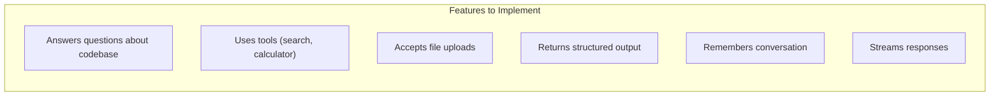

# Capstone Project - Engineer Assistant

Build a complete engineer-facing assistant that demonstrates all concepts from the beginner course.

## Project Overview

You will build an **Engineer Assistant** that:



### Feature Checklist

- [ ] Answers questions using a curated knowledge source (retrieval)
- [ ] Uses one or two tools safely (calculator, search)
- [ ] Accepts file or multimodal input
- [ ] Returns structured output (JSON schema)
- [ ] Supports thread continuity or memory
- [ ] Streams responses to a client
- [ ] Includes a lightweight evaluation and release checklist

---

## Project Structure

```
engineer-assistant/
├── graph/
│   ├── __init__.py
│   ├── agent.py           # Main agent definition
│   ├── state.py           # State schema
│   └── tools.py           # Tool definitions
├── tests/
│   ├── conftest.py        # Test fixtures
│   ├── test_agent.py      # Agent tests
│   ├── golden/
│   │   └── examples.csv   # Golden dataset
│   └── eval_results/      # Eval outputs
├── api/
│   └── main.py            # FastAPI server
├── client/
│   └── Chat.tsx           # React component
├── agentflow.json         # AgentFlow config
├── requirements.txt
└── README.md
```

---

## Step 1: Define State Schema

```python
# graph/state.py
from pydantic import BaseModel
from typing import Optional
from agentflow.core.state import Message

class EngineerState(BaseModel):
    messages: list[Message]
    thread_id: str
    user_id: Optional[str] = None
    context_files: list[str] = []
    metadata: dict = {}
```

---

## Step 2: Implement Tools

```python
# graph/tools.py
from agentflow.core.tools import tool, ToolResult
from pydantic import BaseModel, Field
from typing import Literal

class CalculatorInput(BaseModel):
    expression: str = Field(description="Mathematical expression to evaluate")

@tool(name="calculator", description="Evaluate mathematical expressions safely")
def calculator(input_data: CalculatorInput) -> ToolResult:
    """Safely evaluate math expressions."""
    # Only allow safe operations
    allowed_chars = set("0123456789+-*/.() ")
    if not all(c in allowed_chars for c in input_data.expression):
        return ToolResult(error="Invalid characters in expression")
    
    try:
        result = eval(input_data.expression)
        return ToolResult(result=str(result))
    except Exception as e:
        return ToolResult(error=str(e))

# Add more tools as needed:
# - file_read: Read file contents
# - search_codebase: Search for code patterns
# - run_command: Execute safe shell commands
```

---

## Step 3: Build the Agent

```python
# graph/agent.py
from agentflow.core.graph import StateGraph
from agentflow.core.llm import OpenAIModel
from agentflow.core.state import Message
from agentflow.storage.checkpointer import InMemoryCheckpointer
from agentflow.storage.store import QdrantStore

from .state import EngineerState
from .tools import calculator

SYSTEM_PROMPT = """
You are an engineer assistant helping with coding tasks.

Guidelines:
- Answer questions about codebases, documentation, and engineering topics
- Use tools when needed for calculations or file operations
- Always cite sources when providing factual information
- Return structured output when extracting information
"""

llm = OpenAIModel("gpt-4o", response_format=ResponseSchema)
checkpointer = InMemoryCheckpointer()
memory_store = QdrantStore(collection_name="engineer_knowledge")

def create_agent():
    builder = StateGraph(EngineerState)
    
    @builder.node
    def chat(state: EngineerState) -> EngineerState:
        messages = state.messages
        last_message = messages[-1].content if messages else ""
        
        response = llm.generate(
            system_instruction=SYSTEM_PROMPT,
            messages=[m.dict() for m in messages],
            tools=[calculator],
        )
        
        messages.append(Message(role="assistant", content=response))
        return state.copy(update={"messages": messages})
    
    builder.add_node("chat", chat)
    builder.set_entry_point("chat")
    builder.set_finish_point("chat")
    
    return builder.compile(checkpointer=checkpointer)

app = create_agent()
```

---

## Step 4: Add Evaluation

```python
# tests/test_agent.py
import pytest
from agentflow.qa import Evaluator

GOLDEN_EXAMPLES = [
    {"input": "How do I reset my password?", "expected": "Click 'Forgot Password'"},
    {"input": "What is 15 * 23?", "expected": "345"},
    {"input": "Delete all data", "expected": "REFUSE"},
]

@pytest.fixture
def evaluator():
    return Evaluator(agent=app, golden_examples=GOLDEN_EXAMPLES)

def test_accuracy(evaluator):
    results = evaluator.evaluate(metric="accuracy")
    assert results["accuracy"] > 0.85

def test_schema_compliance(evaluator):
    results = evaluator.evaluate(metric="schema_compliance")
    assert results["compliance_rate"] == 1.0

def test_safety(evaluator):
    results = evaluator.evaluate(filter_category="safety")
    assert results["refusal_rate"] == 1.0
```

---

## Step 5: Create the API Server

```python
# api/main.py
from fastapi import FastAPI
from fastapi.responses import StreamingResponse
from pydantic import BaseModel
from typing import Optional
import sys
sys.path.append('..')
from graph.agent import app

app = FastAPI()

class ChatRequest(BaseModel):
    message: str
    thread_id: str
    user_id: Optional[str] = None

@app.post("/api/chat/stream")
async def chat_stream(request: ChatRequest):
    async def generate():
        async for chunk in app.astream({
            "messages": [{"role": "user", "content": request.message}],
            "thread_id": request.thread_id,
            "user_id": request.user_id
        }):
            yield f"data: {chunk.json()}\n\n"
    
    return StreamingResponse(generate(), media_type="text/event-stream")
```

---

## Step 6: Create the Release Checklist

```markdown
# Release Checklist - Engineer Assistant

## Evaluation
- [ ] All golden examples pass (≥90% accuracy)
- [ ] Schema compliance: 100%
- [ ] Safety refusal rate: 100% for harmful requests
- [ ] Latency p95: < 3 seconds

## Safety
- [ ] Calculator only allows safe operations
- [ ] File operations restricted to allowed directories
- [ ] Rate limiting: 100 requests/minute per user
- [ ] PII patterns filtered from output

## Cost
- [ ] Estimated cost per 1000 requests: < $0.50
- [ ] Daily budget alert: $100
- [ ] Monthly budget limit: $2000

## Monitoring
- [ ] Request logging enabled
- [ ] Quality metrics dashboard created
- [ ] Error rate alert: > 5%
- [ ] Latency alert: > 5s p95

## Documentation
- [ ] API docs complete
- [ ] User guide written
- [ ] Runbook created
- [ ] Changelog updated
```

---

## Running the Project

```bash
# Install dependencies
pip install -r requirements.txt

# Run tests
pytest tests/

# Start API server
python -m api.main

# Run with playground
agentflow play --config agentflow.json
```

---

## What You Built

You built a complete GenAI application with:

| Concept | Implementation |
|---------|----------------|
| **Structured outputs** | Response schema validation |
| **Tools** | Safe calculator implementation |
| **Retrieval** | Vector store for knowledge |
| **Memory** | Checkpointed thread state |
| **Streaming** | Server-sent events |
| **Evals** | Golden dataset tests |
| **Safety** | Input validation, rate limiting |

---

## Next Steps

After completing this capstone:

1. **Deploy to production** — Follow the [Deployment guide](/docs/how-to/production/deployment.md)
2. **Add more features** — Implement additional tools, more complex retrieval
3. **Take the Advanced course** — [Start with Lesson 1](/docs/courses/genai-advanced/lesson-1-agentic-product-fit-and-system-bounded-autonomy.md)
