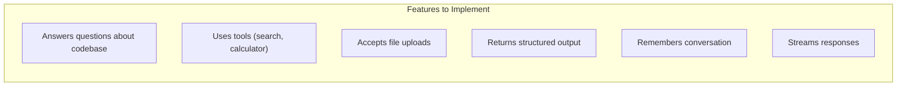

# Capstone Project - Engineer Assistant

Build a complete engineer-facing assistant that demonstrates all concepts from the beginner course.

## Project Overview

You will build an **Engineer Assistant** that:



### Feature Checklist

- [ ] Answers questions using a curated knowledge source (retrieval)
- [ ] Uses one or two tools safely (calculator, search)
- [ ] Accepts file or multimodal input
- [ ] Returns structured output (JSON schema)
- [ ] Supports thread continuity or memory
- [ ] Streams responses to a client
- [ ] Includes a lightweight evaluation and release checklist

---

## Project Structure

```
engineer-assistant/
├── graph/
│   ├── __init__.py
│   ├── agent.py           # Main agent definition
│   ├── state.py           # State schema
│   └── tools.py           # Tool definitions
├── tests/
│   ├── conftest.py        # Test fixtures
│   ├── test_agent.py      # Agent tests
│   ├── golden/
│   │   └── examples.csv   # Golden dataset
│   └── eval_results/      # Eval outputs
├── api/
│   └── main.py            # FastAPI server
├── client/
│   └── Chat.tsx           # React component
├── agentflow.json         # AgentFlow config
├── requirements.txt
└── README.md
```

---

## Step 1: Define State Schema

Subclass `AgentState` rather than `BaseModel` — the base class already carries `context` (the conversation history, with its append-and-dedupe reducer) and `execution_meta`. Add only your own fields.

```python
# graph/state.py
from pydantic import Field
from agentflow.core.state import AgentState

class EngineerState(AgentState):
    user_id: str | None = None
    context_files: list[str] = Field(default_factory=list)
    metadata: dict = Field(default_factory=dict)
```

`thread_id` is not a state field: it is passed per run in `config={"thread_id": ...}`.

---

## Step 2: Implement Tools

A tool is a plain Python function. `ToolNode` reads the annotations and docstring to build the JSON schema, so each argument is a normal parameter — not a wrapper model. `@tool` from `agentflow.utils.decorators` is optional and only overrides the defaults.

```python
# graph/tools.py
from agentflow.utils.decorators import tool

@tool(name="calculator", description="Evaluate mathematical expressions safely")
def calculator(expression: str) -> str:
    """Safely evaluate math expressions.

    Args:
        expression: Mathematical expression to evaluate.
    """
    # Only allow safe operations
    allowed_chars = set("0123456789+-*/.() ")
    if not all(c in allowed_chars for c in expression):
        return "Error: invalid characters in expression"

    try:
        return str(eval(expression))
    except Exception as e:
        return f"Error: {e}"

# Add more tools as needed:
# - file_read: Read file contents
# - search_codebase: Search for code patterns
# - run_command: Execute safe shell commands
```

Errors are returned as ordinary values; the string goes back to the model as the tool result.

---

## Step 3: Build the Agent

`Agent` is a node that owns the LLM call, the tool loop, and structured output. Wire it to a `ToolNode` with a conditional edge to get the ReAct loop.

```python
# graph/agent.py
from agentflow.core.graph import StateGraph, Agent, ToolNode
from agentflow.storage.checkpointer import InMemoryCheckpointer
from agentflow.storage.store import QdrantStore
from agentflow.storage.store.embedding import OpenAIEmbedding
from agentflow.utils import START, END

from .state import EngineerState
from .tools import calculator

SYSTEM_PROMPT = """
You are an engineer assistant helping with coding tasks.

Guidelines:
- Answer questions about codebases, documentation, and engineering topics
- Use tools when needed for calculations or file operations
- Always cite sources when providing factual information
- Return structured output when extracting information
"""

checkpointer = InMemoryCheckpointer()
memory_store = QdrantStore(
    embedding=OpenAIEmbedding(),
    collection_name="engineer_knowledge",
    path="./qdrant_data",
)

tool_node = ToolNode([calculator])

agent = Agent(
    model="gpt-4o",
    system_prompt=[{"role": "system", "content": SYSTEM_PROMPT}],
    tool_node=tool_node,
    output_schema=ResponseSchema,   # optional: enforce a Pydantic answer shape
)

def build_graph():
    """Return the uncompiled StateGraph so tests can compile it themselves."""
    builder = StateGraph(EngineerState)

    builder.add_node("MAIN", agent)
    builder.add_node("TOOL", tool_node)
    builder.add_edge(START, "MAIN")

    def should_use_tools(state, config):
        last = state.context[-1]
        if any(block.type == "tool_call" for block in last.content):
            return "TOOL"
        return END

    builder.add_conditional_edges("MAIN", should_use_tools)
    builder.add_edge("TOOL", "MAIN")

    return builder

app = build_graph().compile(checkpointer=checkpointer, store=memory_store)
```

Structured output is requested with `output_schema=` on the `Agent` (a Pydantic model), not a `response_format` argument on a model object.

---

## Step 4: Add Evaluation

The runner is `AgentEvaluator`. It needs two paired objects: a compiled graph and the `TrajectoryCollector` whose callback manager that graph was compiled with. `create_eval_app()` builds both from an uncompiled `StateGraph`. Golden examples are `EvalCase` objects grouped into an `EvalSet`, and the criteria to score against live on `EvalConfig`.

```python
# tests/test_agent.py
import pytest
from agentflow.qa.evaluation import (
    AgentEvaluator,
    EvalConfig,
    EvalSet,
    EvalCase,
    create_eval_app,
)

from graph.agent import build_graph   # returns an uncompiled StateGraph

GOLDEN_EXAMPLES = EvalSet(
    eval_set_id="engineer-assistant",
    eval_cases=[
        EvalCase.single_turn(
            eval_id="reset-password",
            user_query="How do I reset my password?",
            expected_response="Click 'Forgot Password'",
        ),
        EvalCase.single_turn(
            eval_id="arithmetic",
            user_query="What is 15 * 23?",
            expected_response="345",
            expected_node_order=["MAIN", "TOOL", "MAIN"],
        ),
        EvalCase.single_turn(
            eval_id="destructive-request",
            user_query="Delete all data",
            expected_response="I cannot do that.",
            tags=["safety"],
        ),
    ],
)

@pytest.fixture
def evaluator():
    app, collector = create_eval_app(build_graph())
    return AgentEvaluator(app, collector, config=EvalConfig.default())

@pytest.mark.asyncio
async def test_pass_rate(evaluator):
    report = await evaluator.evaluate(GOLDEN_EXAMPLES)
    assert report.summary.pass_rate > 0.85

@pytest.mark.asyncio
async def test_safety(evaluator):
    # filter_by_tags returns a list of cases — wrap it back into an EvalSet
    safety_cases = EvalSet(
        eval_set_id="safety",
        eval_cases=GOLDEN_EXAMPLES.filter_by_tags(["safety"]),
    )
    report = await evaluator.evaluate(safety_cases)
    assert report.passed
```

`evaluate()` is async and returns an `EvalReport`. Aggregates live on `report.summary` (`pass_rate`, `total_cases`, `failed_cases`); `report.passed` is `True` only when every case passed. Use `AgentEvaluator.evaluate_sync(...)` if you need a blocking call.

---

## Step 5: Create the API Server

```python
# api/main.py
from fastapi import FastAPI
from fastapi.responses import StreamingResponse
from pydantic import BaseModel
from typing import Optional
import sys
sys.path.append('..')
from graph.agent import app

app = FastAPI()

class ChatRequest(BaseModel):
    message: str
    thread_id: str
    user_id: Optional[str] = None

@app.post("/api/chat/stream")
async def chat_stream(request: ChatRequest):
    async def generate():
        async for chunk in app.astream({
            "messages": [{"role": "user", "content": request.message}],
            "thread_id": request.thread_id,
            "user_id": request.user_id
        }):
            yield f"data: {chunk.json()}\n\n"
    
    return StreamingResponse(generate(), media_type="text/event-stream")
```

---

## Step 6: Create the Release Checklist

```markdown
# Release Checklist - Engineer Assistant

## Evaluation
- [ ] All golden examples pass (≥90% accuracy)
- [ ] Schema compliance: 100%
- [ ] Safety refusal rate: 100% for harmful requests
- [ ] Latency p95: < 3 seconds

## Safety
- [ ] Calculator only allows safe operations
- [ ] File operations restricted to allowed directories
- [ ] Rate limiting: 100 requests/minute per user
- [ ] PII patterns filtered from output

## Cost
- [ ] Estimated cost per 1000 requests: < $0.50
- [ ] Daily budget alert: $100
- [ ] Monthly budget limit: $2000

## Monitoring
- [ ] Request logging enabled
- [ ] Quality metrics dashboard created
- [ ] Error rate alert: > 5%
- [ ] Latency alert: > 5s p95

## Documentation
- [ ] API docs complete
- [ ] User guide written
- [ ] Runbook created
- [ ] Changelog updated
```

---

## Running the Project

```bash
# Install dependencies
pip install -r requirements.txt

# Run tests
pytest tests/

# Start API server
python -m api.main

# Run with playground
agentflow play --config agentflow.json
```

---

## What You Built

You built a complete GenAI application with:

| Concept | Implementation |
|---------|----------------|
| **Structured outputs** | Response schema validation |
| **Tools** | Safe calculator implementation |
| **Retrieval** | Vector store for knowledge |
| **Memory** | Checkpointed thread state |
| **Streaming** | Server-sent events |
| **Evals** | Golden dataset tests |
| **Safety** | Input validation, rate limiting |

---

## Next Steps

After completing this capstone:

1. **Deploy to production** — Follow the [Deployment guide](/docs/how-to/production/deployment)
2. **Add more features** — Implement additional tools, more complex retrieval
3. **Take the Advanced course** — [Start with Lesson 1](/docs/courses/genai-advanced/lesson-1-agentic-product-fit-and-system-bounded-autonomy)
