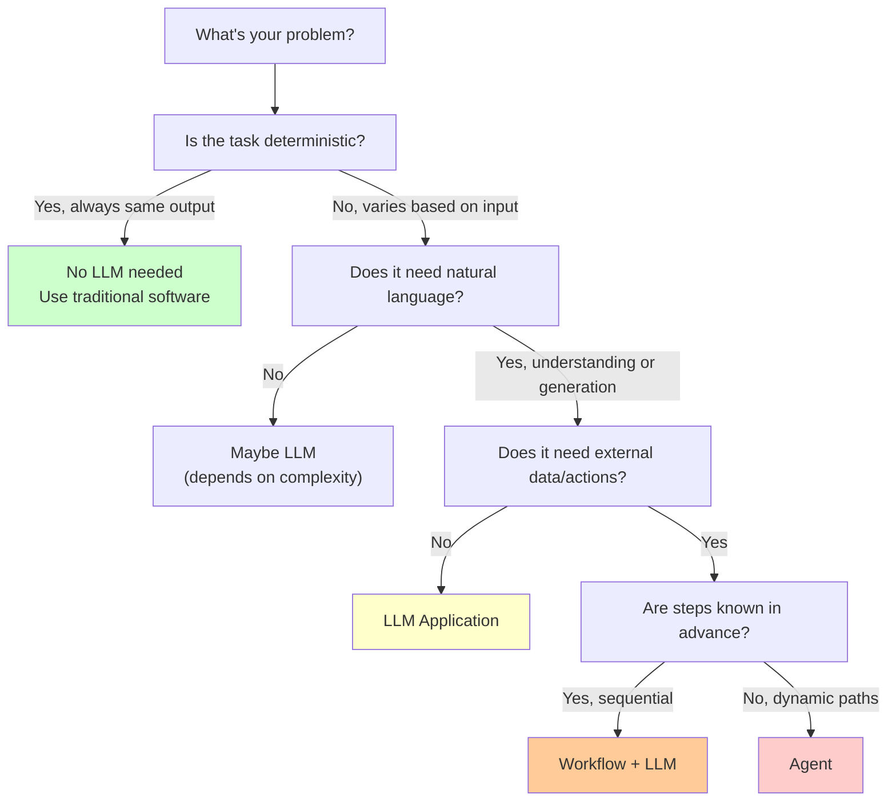
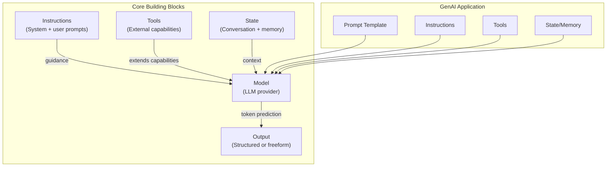
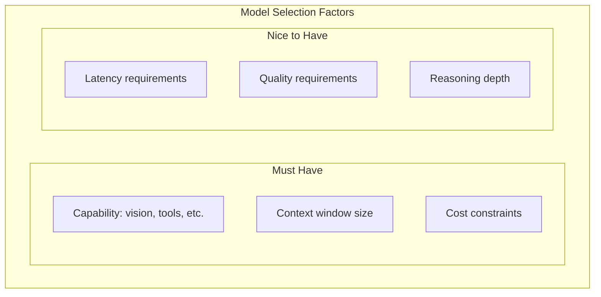
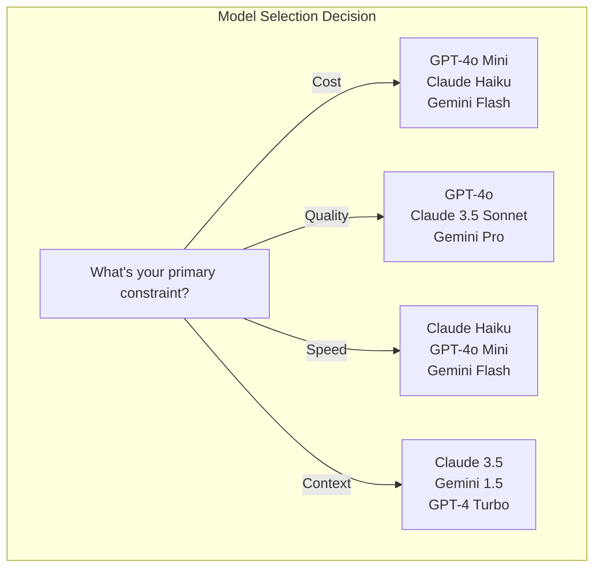
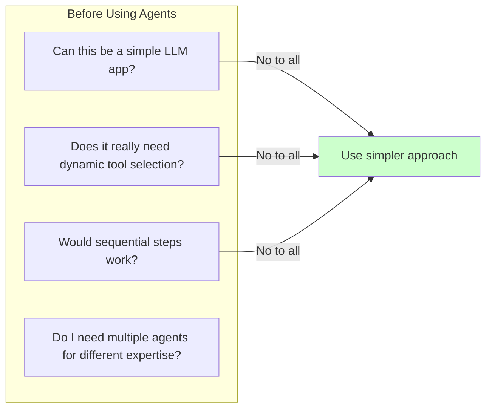

# Lesson 1: Use Cases, Models, and the LLM App Lifecycle

## Learning Outcome

By the end of this lesson, you will be able to:
- Classify a problem as suitable for GenAI or traditional software
- Identify the core building blocks of a GenAI application
- Make an informed model selection based on requirements
- Build your first simple GenAI app with AgentFlow

## Prerequisites

- Read [LLM basics for engineers](/docs/courses/shared/llm-basics-for-engineers.md) for foundational context

---

## Concept: The LLM App Lifecycle

Before diving into specific problems, understand the typical lifecycle of a GenAI application:

```mermaid
flowchart TB
    subgraph Lifecycle["LLM App Lifecycle"]
        subgraph Phase1["1. Discovery"]
            D1["Identify use case"]
            D2["Assess fit"]
            D3["Define requirements"]
        end
        
        subgraph Phase2["2. Design"]
            D4["Design prompt"]
            D5["Choose model"]
            D6["Plan architecture"]
        end
        
        subgraph Phase3["3. Build"]
            D7["Implement agent"]
            D8["Add tools"]
            D9["Handle state"]
        end
        
        subgraph Phase4["4. Evaluate"]
            D10["Build tests"]
            D11["Measure quality"]
            D12["Iterate"]
        end
        
        subgraph Phase5["5. Deploy"]
            D13["Add safety"]
            D14["Monitor"]
            D15["Maintain"]
        end
    end
    
    Phase1 --> Phase2 --> Phase3 --> Phase4 --> Phase5
```



This lesson focuses on **Phase 1 and 2**—understanding when and how to use GenAI.

---

## Concept: What Problems Fit GenAI?

Not every problem needs an LLM. Understanding fit is the first skill for building GenAI systems.

```mermaid
flowchart TB
    subgraph Fit["Problem Fit Spectrum"]
        subgraph Simple["No LLM"]
            N1["Deterministic calculations"]
            N2["Fixed rules"]
            N3["Database queries"]
        end
        
        subgraph LLMApps["LLM Application"]
            L1["Classification"]
            L2["Generation"]
            L3["Extraction"]
            L4["Summarization"]
        end
        
        subgraph Workflows["Workflow + LLM"]
            W1["Sequential steps"]
            W2["LLM for specific steps"]
            W3["Human approval gates"]
        end
        
        subgraph Agents["Agentic System"]
            A1["Dynamic tool use"]
            A2["Variable paths"]
            A3["Multi-turn reasoning"]
        end
    end
    
    Simple --> LLMApps --> Workflows --> Agents
    
    style Simple fill:#ccffcc
    style LLMApps fill:#ffffcc
    style Workflows fill:#ffcc99
    style Agents fill:#ffcccc
```



### Decision Tree: Do You Need an LLM?



### When to Use (and Not Use) LLMs

| Use LLM When | Don't Use LLM When |
|--------------|-------------------|
| Natural language understanding needed | Precise calculations required |
| Flexible output format acceptable | Exact, deterministic output needed |
| Knowledge is broad or dynamic | Knowledge is fixed and small |
| Content generation required | Data transformation (use ETL) |
| Classification with context | Binary true/false logic |
| Summarization of text | Copying data between systems |

---

## Concept: Core Building Blocks

Every GenAI application has the same fundamental building blocks:



| Block | What It Is | Example |
|-------|-----------|---------|
| **Model** | The LLM that generates responses | GPT-4o, Claude, Gemini |
| **Instructions** | Prompts that guide behavior | System instructions, user messages |
| **Tools** | Functions the model can call | Calculator, search, database |
| **State** | What the system remembers | Conversation history, variables |
| **Output** | The response format | JSON, text, streaming tokens |

---

## Concept: Model Selection Deep Dive

Model choice is an engineering decision. Consider these factors:



### Provider Comparison

| Provider | Model | Context | Strengths | Best For |
|----------|-------|---------|-----------|---------|
| **OpenAI** | GPT-4o | 128K | Balanced, tool use | General purpose |
| **OpenAI** | GPT-4o Mini | 128K | Fast, cheap | High volume |
| **Anthropic** | Claude 3.5 Sonnet | 200K | Long context, reasoning | Complex tasks |
| **Anthropic** | Claude 3 Haiku | 200K | Fast, affordable | Speed-sensitive |
| **Google** | Gemini 1.5 Pro | 1M | Massive context | Long documents |

### Model Selection Decision Matrix



### Cost Estimation

```python
def estimate_monthly_cost(
    daily_requests: int,
    avg_input_tokens: int,
    avg_output_tokens: int,
    model: str = "gpt-4o"
) -> float:
    """Estimate monthly API costs."""
    
    costs = {
        "gpt-4o": {"input": 5.00, "output": 15.00},  # per 1M tokens
        "gpt-4o-mini": {"input": 0.15, "output": 0.60},
        "claude-3-5-sonnet": {"input": 3.00, "output": 15.00},
    }
    
    model_costs = costs.get(model, costs["gpt-4o"])
    
    daily_input_cost = (daily_requests * avg_input_tokens / 1_000_000) * model_costs["input"]
    daily_output_cost = (daily_requests * avg_output_tokens / 1_000_000) * model_costs["output"]
    
    return (daily_input_cost + daily_output_cost) * 30  # monthly
```

---

## Example: Building Your First GenAI App

Here's how the building blocks come together in AgentFlow:

### Step 1: Set Up Your Environment

```python
# Install AgentFlow
pip install 10xscale-agentflow

# Import the core components
from agentflow.core.graph import StateGraph, AgentState
from agentflow.core.state import Message
from agentflow.core.llm import OpenAIModel
```

### Step 2: Define Your Model

```python
# Choose a model
model = OpenAIModel(
    "gpt-4o",
    temperature=0.7  # 0 = deterministic, 1 = creative
)
```

### Step 3: Create the Agent Graph

```python
from agentflow.core.graph import StateGraph

# Create a state graph
builder = StateGraph(AgentState)

# Define a simple chat node
@builder.node
def chat(state: AgentState) -> AgentState:
    messages = state.get("messages", [])
    
    # Get the last user message
    last_message = messages[-1].content if messages else ""
    
    # Generate a response
    response = model.generate(
        system_instruction="You are a helpful coding assistant.",
        messages=[m.dict() for m in messages]
    )
    
    # Add the response to messages
    messages.append(Message(role="assistant", content=response))
    
    return {"messages": messages}

# Add the node and set entry/finish points
builder.add_node("chat", chat)
builder.set_entry_point("chat")
builder.set_finish_point("chat")

# Compile the graph
app = builder.compile()
```

### Step 4: Run the App

```python
# Create an initial state
initial_state = {
    "messages": [
        Message(role="user", content="Hello! What is AgentFlow?")
    ]
}

# Invoke the agent
result = app.invoke(initial_state)

# Get the response
response = result["messages"][-1].content
print(response)
```

### Step 5: Add Streaming (Better UX)

```python
# Stream responses for better perceived latency
for chunk in app.stream(initial_state):
    if hasattr(chunk, 'content'):
        print(chunk.content, end="", flush=True)
    print()  # newline at the end
```

### Complete Code

```python
from agentflow.core.graph import StateGraph, AgentState
from agentflow.core.state import Message
from agentflow.core.llm import OpenAIModel

# Initialize model
model = OpenAIModel("gpt-4o")

# Create graph
builder = StateGraph(AgentState)

@builder.node
def chat(state: AgentState) -> AgentState:
    messages = state.get("messages", [])
    response = model.generate(
        system_instruction="You are a helpful coding assistant.",
        messages=[m.dict() for m in messages]
    )
    messages.append(Message(role="assistant", content=response))
    return {"messages": messages}

builder.add_node("chat", chat)
builder.set_entry_point("chat")
builder.set_finish_point("chat")

app = builder.compile()

# Run
result = app.invoke({
    "messages": [Message(role="user", content="Hello!")]
})
print(result["messages"][-1].content)
```

---

## Exercise: Classify Product Ideas

For each product idea, decide:

1. **No LLM** — Traditional software
2. **LLM App** — Single prompt + structured output
3. **Workflow** — Sequential steps with LLM
4. **Agent** — Dynamic tool use and decisions

### Product Ideas

| # | Idea | Classification | Reasoning |
|---|------|---------------|-----------|
| 1 | Email spam classifier | | |
| 2 | Research paper summarizer | | |
| 3 | Automated customer support chatbot | | |
| 4 | Code review assistant | | |
| 5 | Daily news digest generator | | |
| 6 | Trading bot with live data | | |
| 7 | Meeting notes action extractor | | |
| 8 | Form auto-filler | | |
| 9 | Customer sentiment analyzer | | |
| 10 | Personal calendar scheduler | | |

### Answer Key

<details>
<summary>Click to reveal answers</summary>

| # | Classification | Reasoning |
|---|---------------|-----------|
| 1 | No LLM | Binary classification, can use traditional ML |
| 2 | LLM App | Summarization is a core LLM capability |
| 3 | Agent | Needs tools (KB, orders), dynamic responses |
| 4 | LLM App or Agent | Depends on complexity |
| 5 | LLM App | Summarization + formatting |
| 6 | Agent | Dynamic tool use (APIs), decision-making |
| 7 | LLM App | Extraction from text |
| 8 | No LLM | Form filling is deterministic |
| 9 | LLM App | Classification task |
| 10 | Workflow or Agent | Depends on complexity |

</details>

---

## What You Learned

1. **Problem fit matters** — Not every problem needs an LLM or agent
2. **GenAI apps have 5 building blocks** — Model, instructions, tools, state, output
3. **Model selection is a tradeoff** — Quality vs. speed vs. cost vs. capabilities
4. **AgentFlow provides StateGraph** — Simple way to compose GenAI applications
5. **Start simple** — Add complexity only when needed

---

## Common Failure Mode

**Starting with an agent when a workflow would work**

Teams often over-engineer by jumping straight to multi-agent systems. Before reaching for agents, ask:



Agents add complexity. Make sure you need that complexity.

---

## Next Step

Continue to [Lesson 2: Prompting, context engineering, and structured outputs](./lesson-2-prompting-context-and-structured-outputs.md) to learn how to build reliable outputs.

### Or Explore

- [AgentFlow Architecture](/docs/concepts/architecture.md) — How AgentFlow packages fit together
- [StateGraph concepts](/docs/concepts/state-graph.md) — The core graph structure
- [First Python Agent tutorial](/docs/get-started/first-python-agent.md) — Hands-on implementation
