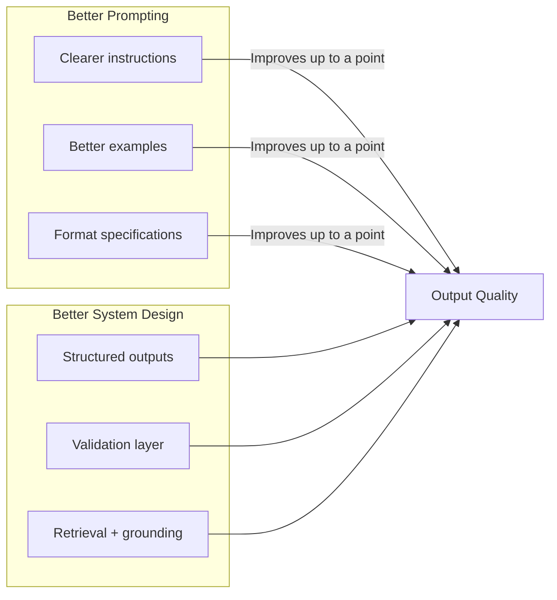
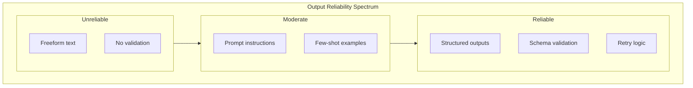
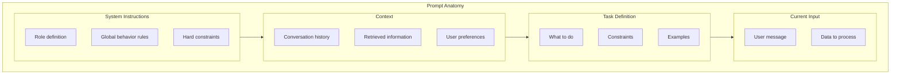
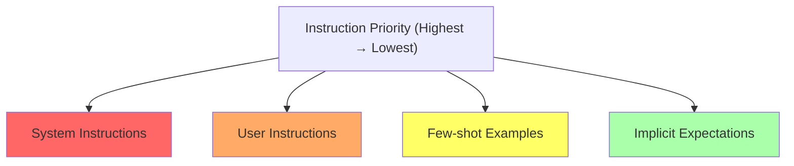
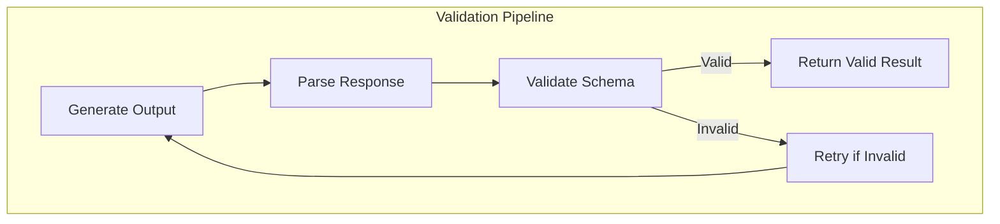
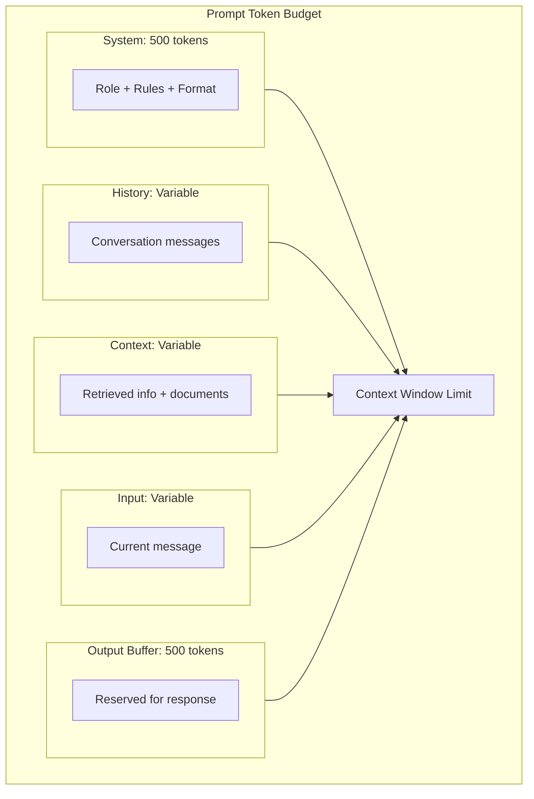

# Lesson 2: Prompting, Context Engineering, and Structured Outputs

## Learning Outcome

By the end of this lesson, you will be able to:
- Design prompts that produce reliable, consistent outputs
- Use structured outputs to guarantee response formats
- Manage context efficiently to stay within token limits
- Implement validation and error handling for production systems

## Prerequisites

- Read [LLM basics for engineers](/docs/courses/shared/llm-basics-for-engineers) for failure mode context
- Read [Prompt patterns cheatsheet](/docs/courses/shared/prompt-and-output-patterns-cheatsheet) for pattern reference
- Read [Tokenization and context windows](/docs/courses/shared/tokenization-and-context-windows) for context management

---

## Concept: Better Prompting vs. Better System Design

There's a limit to what better prompting can achieve. Sometimes you need better system design.



### The Reliability Spectrum



### When Prompting Alone Isn't Enough

| Problem | Prompting Fix | Better Solution |
|---------|--------------|-----------------|
| Inconsistent format | Add format instructions | Use structured outputs |
| Wrong information | "Answer accurately" | Ground with retrieval |
| Missing edge cases | "Consider X, Y, Z" | Add validation layer |
| Slow responses | "Be concise" | Use faster model |
| Hallucination | "Don't make things up" | Retrieval + citations |
| Brittle behavior | Many examples | Structured outputs + validation |

---

## Concept: Prompt Structure for Reliability

### The Anatomy of a Reliable Prompt



### Instruction Hierarchy

Prompts have a priority order. Higher-priority instructions override lower-priority ones:



### Prompt Positioning

Important information should appear:
1. **At the beginning** — Set the stage
2. **At the end** — Reinforce the task

```python
prompt = """
[BEGINNING] You are a technical support assistant for Acme Corp.
Be helpful, concise, and professional.

Always cite sources when providing factual information.
Never make up information you don't know.

[CONTEXT] The user is asking about password reset.

[TASK] Answer their question directly. If you don't know, say so.

User: How do I reset my password?
"""
```

### System Prompt Template

```python
SYSTEM_PROMPT = """
You are a {ROLE} with expertise in {DOMAIN}.

Your responsibilities:
1. {Responsibility 1}
2. {Responsibility 2}
3. {Responsibility 3}

IMPORTANT RULES:
- Never {Rule 1}
- Always {Rule 2}
- If unsure, {Fallback behavior}

OUTPUT FORMAT:
{Format requirements}
"""
```

---

## Concept: Structured Outputs

Structured outputs guarantee format consistency. This is essential for production systems.

### Why Structured Outputs Matter

```mermaid
flowchart LR
    subgraph Without["Without Structured Outputs"]
        Q["Question"] --> LLM1["LLM"]
        LLM1 --> R1["'Sure, the weather is...'"]
        Q --> LLM2["LLM"]
        LLM2 --> R2["'Here is the weather:'"]
        Q --> LLM3["LLM"]
        LLM3 --> R3["Weather: 72°F"]
        
        R1 & R2 & R3 --> Parse["Parse? → Often fails"]
    end
    
    subgraph With["With Structured Outputs"]
        Q2["Question"] --> LLM4["LLM + Schema"]
        LLM4 --> R4['{"temp": 72, "unit": "f"}']
        Q2 --> LLM5["LLM + Schema"]
        LLM5 --> R5['{"temp": 72, "unit": "f"}']
        
        R4 & R5 --> Parse2["Parse → Always works"]
    end
    
    style Parse fill:#ffcccc
    style Parse2 fill:#ccffcc
```

### Schema Definition with Pydantic

```python
from pydantic import BaseModel, Field
from enum import Enum

class Priority(str, Enum):
    URGENT = "urgent"
    HIGH = "high"
    MEDIUM = "medium"
    LOW = "low"

class TicketClassification(BaseModel):
    category: str = Field(description="Ticket category")
    priority: Priority = Field(description="Urgency level")
    confidence: float = Field(description="Confidence score 0-1")
    reasoning: str = Field(description="Brief explanation")
    
    class Config:
        use_enum_values = True
```

### Structured Output in AgentFlow

Structured output is requested on the `Agent` node with `output_schema=`, a Pydantic model. The agent asks the provider for JSON matching that schema and validates the reply.

```python
from agentflow.core.graph import StateGraph, Agent
from agentflow.utils import START, END

# Agent node with structured output
classifier = Agent(
    model="gpt-4o",
    system_prompt=[{"role": "system", "content": "Classify the support ticket."}],
    output_schema=TicketClassification,
)

builder = StateGraph()
builder.add_node("classify", classifier)
builder.add_edge(START, "classify")
builder.add_edge("classify", END)

app = builder.compile()
```

---

## Concept: Validation and Error Handling

Structured outputs can still fail. You need validation.

### Validation Pipeline



### Validation Error Handling

```python
from pydantic import ValidationError
from typing import Optional

def safe_generate(
    prompt: str,
    schema: type[BaseModel],
    max_retries: int = 3
) -> tuple[bool, Optional[BaseModel], str]:
    """
    Generate with validation and retry.
    
    Returns:
        (success, result, error_message)
    """
    for attempt in range(max_retries):
        try:
            response = llm.generate(prompt, response_format=schema)
            return True, response, None
        
        except ValidationError as e:
            # Try to fix common issues
            error_msg = str(e)
            
            if attempt < max_retries - 1:
                # Add correction hint to prompt
                prompt += f"\n\nPlease fix: {error_msg}"
                continue
            
            return False, None, error_msg
        
        except Exception as e:
            return False, None, str(e)
    
    return False, None, "Max retries exceeded"
```

### Error Recovery Patterns

```python
def parse_with_fallback(response: str, schema: type[BaseModel]) -> BaseModel:
    """Try parsing, fall back to extraction."""
    try:
        return schema.parse_raw(response)
    
    except Exception:
        # Try to extract JSON from text
        import re
        match = re.search(r'\{[\s\S]*\}', response)
        
        if match:
            try:
                return schema.parse_raw(match.group())
            except:
                pass
        
        # Last resort: raise
        raise ValueError(f"Could not parse response: {response[:100]}")
```

---

## Example: Building a Reliable Classification System

### Complete Implementation

```python
from enum import Enum
from pydantic import BaseModel, Field
from agentflow.core.graph import StateGraph, Agent
from agentflow.core.state import Message
from agentflow.utils import START, END

# 1. Define the schema
class TicketPriority(str, Enum):
    URGENT = "urgent"      # Needs immediate attention
    HIGH = "high"          # Important but not critical
    MEDIUM = "medium"      # Standard priority
    LOW = "low"            # Can wait

class ClassificationResult(BaseModel):
    category: str = Field(description="Ticket category: billing, technical, general, etc.")
    priority: TicketPriority
    confidence: float = Field(ge=0.0, le=1.0, description="Confidence 0-1")
    reasoning: str = Field(description="Brief explanation of classification")
    suggested_response: str = Field(description="Suggested first response")

# 2. Create the system prompt
SYSTEM_PROMPT = """
You are a customer support ticket classifier for Acme Corp.

Classify each ticket accurately based on:
1. Category: What type of issue is this?
2. Priority: How urgent is it?
3. Reasoning: Why did you choose this classification?

Be conservative with HIGH and URGENT - only use when truly critical.
"""

# 3. Create the classifier
classifier = Agent(
    model="gpt-4o",
    system_prompt=[{"role": "system", "content": SYSTEM_PROMPT}],
    output_schema=ClassificationResult,
)

builder = StateGraph()
builder.add_node("classify", classifier)
builder.add_edge(START, "classify")
builder.add_edge("classify", END)

app = builder.compile()

# 4. Safe wrapper with validation
def classify_safe(message: str) -> dict:
    try:
        result = app.invoke(
            {"messages": [Message.text_message(message)]},
            config={"thread_id": "classify-1"},
        )

        # The final message holds the JSON produced against ClassificationResult
        raw = result["messages"][-1].text()
        return {
            "success": True,
            "classification": ClassificationResult.model_validate_json(raw),
        }

    except ValidationError as e:
        return {
            "success": False,
            "error": f"Validation failed: {e}"
        }
    
    except Exception as e:
        return {
            "success": False,
            "error": f"Unexpected error: {e}"
        }
```

### Testing the Classifier

```python
# Test cases
test_tickets = [
    "My entire website is down!",
    "I have a question about my invoice",
    "Can you help me reset my password?",
    "URGENT: Production database is corrupted",
    "What are your business hours?",
]

for ticket in test_tickets:
    result = classify_safe(ticket)
    
    if result["success"]:
        print(f"Ticket: {ticket[:50]}...")
        print(f"  Category: {result['classification']['category']}")
        print(f"  Priority: {result['classification']['priority']}")
        print()
```

---

## Context Management

### Token Budget for Prompts



### Automatic Context Truncation

You do not count tokens or trim the message list by hand. Attach a context manager to the graph and set `trim_context=True` on the agent; the framework trims the history before every LLM call. System messages are never dropped.

`MessageContextManager` keeps the most recent N user messages and discards the rest. `SummaryContextManager` instead summarizes what falls outside the window with an LLM call, and can be driven by a token budget:

```python
from agentflow.core.graph import StateGraph, Agent
from agentflow.core.state import SummaryContextManager

ctx_mgr = SummaryContextManager(
    model="gpt-4o-mini",     # model used to write the summary
    token_budget=8000,       # leave room for the response
    keep_recent=8,           # most recent messages kept verbatim
)

agent = Agent(
    model="gpt-4o",
    system_prompt=[{"role": "system", "content": SYSTEM_PROMPT}],
    trim_context=True,       # required — the manager only runs when this is set
)

builder = StateGraph(context_manager=ctx_mgr)
builder.add_node("classify", agent)
```

The summary is stored in `state.context_summary` and injected ahead of the retained messages on the next call.

---

## Exercise: Build a Code Review Assistant

### Your Task

Build a code review assistant with structured output:

1. **Define a schema** for code review results:
   - Bug severity (critical, high, medium, low)
   - Files affected (list of strings)
   - Suggested fixes (list of strings)
   - Overall recommendation (approve, request_changes, reject)

2. **Create an agent** that uses the schema

3. **Test** with this vulnerable code:

```python
# Vulnerable code to review
code = '''
def get_user(user_id):
    query = f"SELECT * FROM users WHERE id = {user_id}"
    return db.execute(query)

def login(username, password):
    user = db.query(f"SELECT * FROM users WHERE username = '{username}'")
    if user.password == password:
        return jwt.encode({user_id: user.id})
'''
```

### Expected Output Structure

```python
class CodeReviewResult(BaseModel):
    bugs: list[dict] = Field(description="List of bugs found")
    severity: str = Field(description="critical/high/medium/low")
    files_affected: list[str]
    suggested_fixes: list[str]
    recommendation: str = Field(description="approve/request_changes/reject")
    reasoning: str
```

---

## What You Learned

1. **Prompting has limits** — Sometimes you need better system design
2. **Prompt structure matters** — Clear hierarchy, positioning, and examples
3. **Structured outputs guarantee consistency** — Use schemas for production
4. **Validation is essential** — Structured outputs can still fail
5. **Context management prevents overflow** — Truncate or summarize when needed

---

## Common Failure Mode

**Relying on prompt instructions for format without schema validation**

Even with explicit format instructions, LLMs sometimes deviate:

```python
# ❌ Don't trust the output without validation
response = llm.generate("Return JSON with name and age")
data = json.loads(response)  # Might fail or be wrong!

# ❌ Don't even trust structured outputs blindly
response = llm.generate(
    "Return JSON",
    response_format=PersonSchema
)
# Still might fail in edge cases

# ✅ Always validate
def safe_generate(prompt: str, schema: type):
    try:
        result = llm.generate(prompt, response_format=schema)
        return result
    except (ValidationError, Exception) as e:
        # Handle gracefully
        return fallback_result(e)
```

---

## Next Step

Continue to [Lesson 3: Tools, files, and MCP basics](./lesson-3-tools-files-and-mcp-basics.md) to extend your agent with external capabilities.

### Or Explore

- [Tools Reference](/docs/reference/python/tools) — AgentFlow tool patterns
- [Agents and Tools concepts](/docs/concepts/agents-and-tools) — Tool design principles
- [Prompt patterns cheatsheet](/docs/courses/shared/prompt-and-output-patterns-cheatsheet) — Pattern reference
