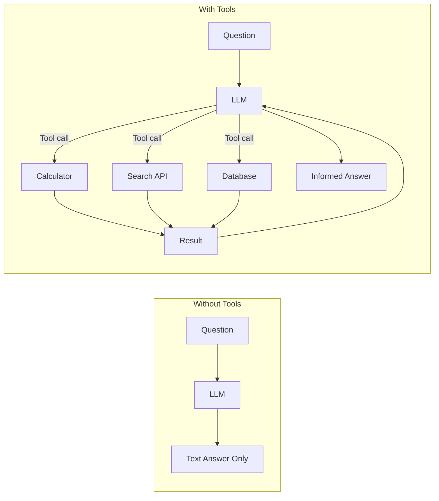
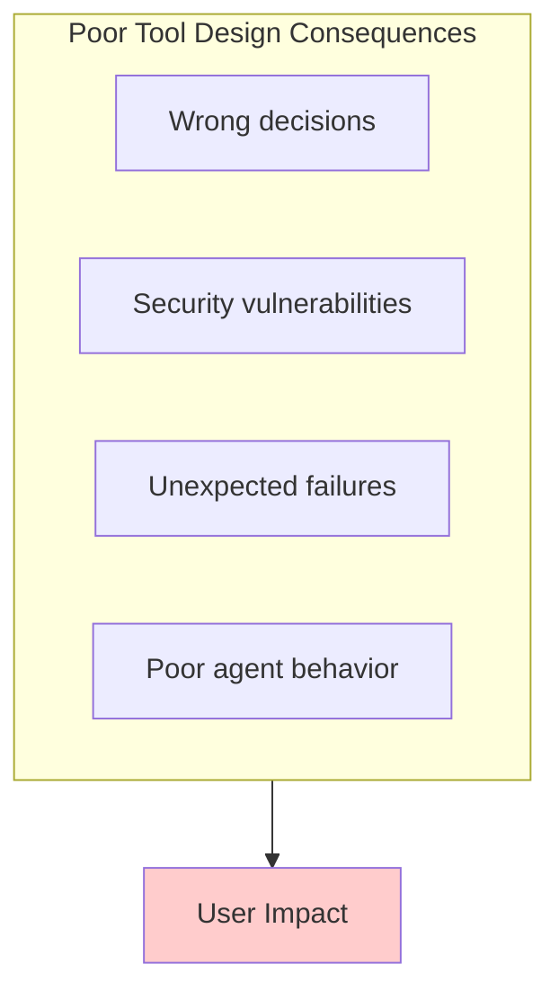
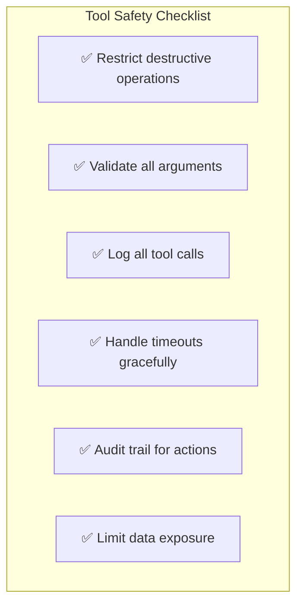
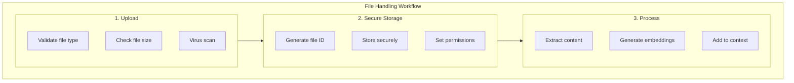
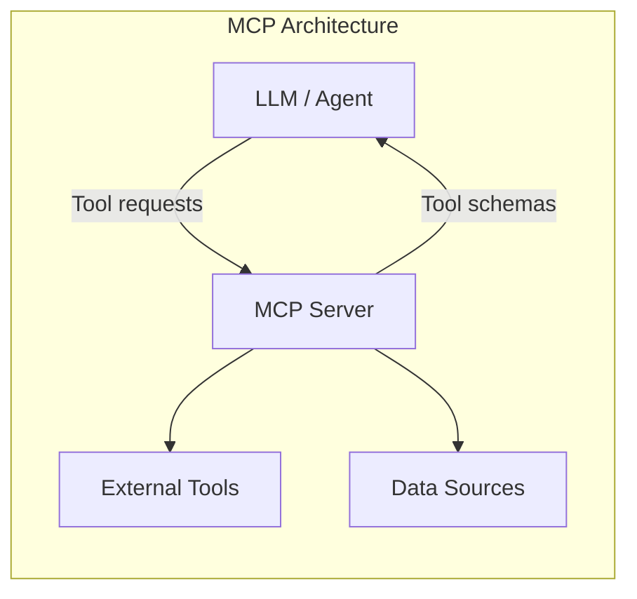

# Lesson 3: Tools, Files, and MCP Basics

## Learning Outcome

By the end of this lesson, you will be able to:
- Design and implement safe tools for agent use
- Handle file inputs and outputs in agent workflows
- Use MCP-style integration for external capabilities
- Build agents that call multiple tools reliably

## Prerequisites

- Lesson 2: Prompting and structured outputs
- [Agents and Tools concepts](/docs/concepts/agents-and-tools)
- [Prompt patterns cheatsheet](/docs/courses/shared/prompt-and-output-patterns-cheatsheet)

---

## Concept: Tools Extend Agent Capabilities

Tools allow the LLM to interact with the real world. Without tools, an agent can only generate text. With tools, it can take actions.



### Tool Categories

| Category | Characteristics | Examples |
|----------|-----------------|----------|
| **Read-only** | Query external data, no side effects | Search, database read, file read |
| **Write** | Modify state, trigger events | Send email, update database |
| **Destructive** | Irreversible changes | DROP TABLE, rm files | ⚠️ Restrict heavily |

---

## Concept: Tool Design Quality

Tool design is as important as prompt design. A poorly designed tool can:



### Tool Description Quality

Good tool descriptions help the LLM know when and how to use tools:

```python
# ❌ Poor description - LLM doesn't know when to use
def calculate(x, y, op):
    """Performs a calculation."""
    pass

# ✅ Good description - Clear, complete, safe
def calculator(
    x: float, 
    y: float, 
    operation: str = "add"
) -> float:
    """
    Perform basic arithmetic operations.
    
    Args:
        x: First number (required)
        y: Second number (required)
        operation: One of "add", "subtract", "multiply", "divide"
                  Defaults to "add"
    
    Returns:
        The result of the arithmetic operation.
    
    Raises:
        ValueError: If operation is invalid
        ZeroDivisionError: If dividing by zero
    
    Example:
        calculator(10, 5, "add")  # Returns 15.0
        calculator(10, 5, "divide")  # Returns 2.0
    """
    pass
```

### Tool Schema Design

```python
# Tool schema for LLM
tool_schema = {
    "name": "calculator",
    "description": "Perform basic arithmetic operations. Use when the user asks for calculations.",
    "parameters": {
        "type": "object",
        "properties": {
            "x": {
                "type": "number",
                "description": "First number"
            },
            "y": {
                "type": "number", 
                "description": "Second number"
            },
            "operation": {
                "type": "string",
                "enum": ["add", "subtract", "multiply", "divide"],
                "description": "Arithmetic operation to perform"
            }
        },
        "required": ["x", "y", "operation"]
    }
}
```

---

## Concept: Safe Tool Design

### The Golden Rules



### Permission Levels

```python
from enum import Enum

class ToolPermission(Enum):
    READ_ONLY = "read"      # Can query, cannot modify
    READ_WRITE = "write"    # Can query and modify
    ADMIN = "admin"        # Full access (restricted!)
    DENIED = "denied"     # Blocked completely

# Assign permissions based on user role
user_permissions = {
    "calculator": ToolPermission.READ_ONLY,
    "file_read": ToolPermission.READ_ONLY,
    "file_write": ToolPermission.READ_WRITE,
    "database_delete": ToolPermission.DENIED,  # Never allow!
    "database_update": ToolPermission.READ_WRITE,
}
```

### Dangerous Patterns to Avoid

```python
# ❌ NEVER do this
def execute_sql(sql: str):
    """Execute any SQL query."""
    db.execute(sql)  # SECURITY RISK!

# ✅ Do this instead
def get_orders(customer_id: str, limit: int = 10):
    """Get recent orders for a customer.
    
    Args:
        customer_id: The customer ID
        limit: Maximum orders to return (default 10, max 100)
    
    Returns:
        List of order summaries
    """
    # Parameterized query - safe!
    return db.query(
        "SELECT * FROM orders WHERE customer_id = ? LIMIT ?",
        [customer_id, min(limit, 100)]
    )
```

---

## Concept: File Handling in GenAI Workflows

Files are a common input for GenAI applications.

### File Handling Workflow



### Common File Patterns

| Pattern | Use Case | Example |
|---------|----------|---------|
| **Upload + Store** | Persistent files | User uploads contract PDF |
| **Upload + Process** | One-time analysis | User uploads image for vision |
| **Upload + Embed** | Searchable documents | Indexing for RAG |

### File Type Handling

| File Type | How to Handle | Considerations |
|-----------|--------------|-----------------|
| **Images** | Vision API, base64 | Size limits, processing cost |
| **PDF** | Text extraction, OCR | Complex layouts harder |
| **Code files** | Direct text reading | Preserve syntax |
| **CSV/JSON** | Structured parsing | Validate schema |
| **Documents** | Convert to markdown | Preserve formatting |

---

## Concept: MCP (Model Context Protocol)

MCP is a standard pattern for connecting AI systems to external tools and data sources.

### MCP Architecture



### MCP Benefits

| Benefit | Description |
|---------|-------------|
| **Standardization** | Consistent interface for all tools |
| **Security** | Centralized permission and audit |
| **Scalability** | Easy to add new tools |
| **Testability** | Tools can be tested in isolation |

### MCP in AgentFlow

```python
from fastmcp import Client

from agentflow.core.graph import ToolNode

# Connect to an MCP server. AgentFlow uses the fastmcp client directly.
mcp_client = Client("http://mcp-server:8080/mcp")

# Hand the client to a ToolNode; it discovers the server's tools for you.
tool_node = ToolNode([], client=mcp_client)

# Inspect what the server exposes
tools = await tool_node.all_tools()
print(tools)

# Or hand the same client to a prebuilt ReactAgent
from agentflow.prebuilt.agent import ReactAgent

agent = ReactAgent(model="gpt-4o", tools=[], client=mcp_client)
app = agent.compile()
```

---

## Example: Building Safe Tools in AgentFlow

### Step 1: Define Tool with Validation

AgentFlow builds the JSON schema from the function signature itself: annotate each parameter and describe it in the docstring. There is no separate schema class to declare, and no result wrapper to return — return a plain value, and report failures as ordinary return values so the model can read and recover from them.

```python
from typing import Literal

from agentflow.utils.decorators import tool

@tool(
    name="calculator",
    description="Perform basic arithmetic operations. Use when the user asks for calculations.",
)
def calculator(
    x: float,
    y: float,
    operation: Literal["add", "subtract", "multiply", "divide"],
) -> str:
    """Safely perform calculations with validation.

    Args:
        x: First number.
        y: Second number.
        operation: Arithmetic operation to perform.
    """
    match operation:
        case "add":
            return str(x + y)
        case "subtract":
            return str(x - y)
        case "multiply":
            return str(x * y)
        case "divide":
            if y == 0:
                return "Error: division by zero not allowed"
            return str(x / y)
    return f"Error: unknown operation {operation}"
```

`Literal` annotations become an `enum` in the schema, so the model can only pick one of the four operations.

### Step 2: Define File Read Tool with Security

Bounds that a Pydantic field would have enforced (`ge`, `le`) become explicit checks in the function body, since the model sees only the JSON schema types.

```python
from pathlib import Path

from agentflow.utils.decorators import tool

@tool(
    name="file_read",
    description="Read content from a file in the allowed directories.",
)
def file_read(path: str, max_lines: int = 100) -> str:
    """Read file with path validation and limits.

    Args:
        path: Relative path to file.
        max_lines: Max lines to read (1-1000).
    """
    # Security: Only allow reads in allowed directories
    allowed_dirs = ["/app/project", "/app/docs", "/app/data"]
    allowed_extensions = {".txt", ".md", ".py", ".json", ".csv"}

    max_lines = max(1, min(max_lines, 1000))

    try:
        file_path = Path(path).resolve()

        # Check directory
        if not any(str(file_path).startswith(d) for d in allowed_dirs):
            return f"Error: {path} is outside allowed directories"

        # Check file exists
        if not file_path.exists():
            return f"Error: file not found: {path}"

        # Check extension
        if file_path.suffix not in allowed_extensions:
            return f"Error: file type not allowed: {file_path.suffix}"

        # Read file
        lines = file_path.read_text().splitlines()[:max_lines]
        return "\n".join(lines)

    except PermissionError:
        return "Error: permission denied"

    except Exception as e:
        return f"Error: {e}"
```

AgentFlow also ships a hardened `file_read` in `agentflow.prebuilt.tools` if you would rather not write your own.

### Step 3: Register Tools with Agent

`ReactAgent` builds the graph; `compile()` turns it into the runnable app. The model is a plain string.

```python
from agentflow.core.state import Message
from agentflow.prebuilt.agent import ReactAgent

# Create agent with tools
agent = ReactAgent(
    model="gpt-4o",
    tools=[calculator, file_read],
)
app = agent.compile()

# Agent can now use these tools
result = app.invoke(
    {"messages": [Message.text_message("Calculate 15 * 23")]},
    config={"thread_id": "tools-1"},
)
print(result["messages"][-1].text())

# Or with streaming
for chunk in app.stream(
    {"messages": [Message.text_message("What's in file.txt?")]},
    config={"thread_id": "tools-2"},
):
    if chunk.event == "message" and chunk.message:
        print(chunk.message.text(), end="", flush=True)
```

### Complete Tool Example

```python
import re

from agentflow.utils.decorators import tool

@tool(
    name="web_search",
    description="Search the web for information. Use when the user asks about current events or factual information.",
    tags=["search", "web"],
)
def web_search(query: str, max_results: int = 5) -> list[dict] | str:
    """Safe web search with input validation.

    Args:
        query: Search query (not a URL).
        max_results: Number of results to return (1-20).

    Returns:
        A list of results with 'title', 'url', and 'snippet' keys.
    """
    # Security: Reject URLs as queries
    if re.match(r"^https?://", query):
        return "Error: please enter a search query, not a URL"

    # Security: Limit query length
    if len(query) > 200:
        return "Error: query too long (max 200 characters)"

    max_results = max(1, min(max_results, 20))

    try:
        # Perform search (example with search API)
        return search_api.search(query=query, max_results=max_results)
    except Exception as e:
        return f"Error: search failed: {e}"
```

The `tags` argument lets an `Agent` expose only a subset of registered tools via `tools_tags={"search"}`.

---

## Exercise: Build Safe Tools

### Your Task

Build two safe tools:

1. **`get_current_time`** - Returns current time in a timezone
2. **`unit_converter`** - Converts between units

### Requirements

```python
from typing import Literal

from agentflow.utils.decorators import tool

# Tool 1: get_current_time
@tool(name="get_current_time", description="...")
def get_current_time(timezone: str) -> str:
    """Return the current time in a timezone.

    Args:
        timezone: Timezone (e.g., 'America/New_York', 'UTC').
    """
    # Must:
    # - Validate timezone format
    # - Return readable time format
    # - Handle invalid timezones gracefully
    ...

# Tool 2: unit_converter
@tool(name="unit_converter", description="...")
def unit_converter(
    value: float,
    from_unit: str,
    to_unit: str,
    category: Literal["length", "weight", "temperature", "time"],
) -> str:
    """Convert a value between units.

    Args:
        value: Value to convert.
        from_unit: Source unit.
        to_unit: Target unit.
        category: Unit category.
    """
    # Must:
    # - Validate units within category
    # - Handle invalid conversions
    # - Return clear result
    ...
```

### Test Cases

| Tool | Input | Expected |
|------|-------|----------|
| get_current_time | timezone="UTC" | Current UTC time |
| get_current_time | timezone="Invalid/Zone" | Error message |
| unit_converter | 100, "km", "mi", "length" | 62.1371 miles |
| unit_converter | 32, "celsius", "fahrenheit", "temperature" | 89.6°F |
| unit_converter | 100, "km", "kg", "length" | Error (unit mismatch) |

---

## What You Learned

1. **Tools extend agent capabilities** — Without tools, agents are limited to text generation
2. **Tool design is critical** — Poor tool design causes failures and security issues
3. **Safety must be built in** — Validate inputs, restrict destructive operations, log everything
4. **MCP standardizes tool access** — Consistent interface for external capabilities
5. **File handling requires security** — Validate paths, types, and content

---

## Common Failure Mode

**Allowing unrestricted tool access**

Never expose tools that can:

```python
# ❌ DANGEROUS - Never allow these directly
@tool(name="execute_code")
def execute_code(code: str):
    exec(code)  # SECURITY NIGHTMARE!

@tool(name="delete_file")
def delete_file(path: str):
    os.remove(path)  # DANGEROUS!

@tool(name="run_shell")
def run_shell(command: str):
    subprocess.run(command, shell=True)  # EXTREMELY DANGEROUS!

# ✅ SAFE - Restrict and validate
@tool(name="safe_calculator")
def safe_calculator(a: float, b: float, op: str):
    # Only allows specific operations
    allowed_ops = {"add", "subtract", "multiply", "divide"}
    if op not in allowed_ops:
        raise ValueError(f"Operation must be one of: {allowed_ops}")
    # ...
```

---

## Next Step

Continue to [Lesson 4: Retrieval, grounding, and citations](./lesson-4-retrieval-grounding-and-citations.md) to learn how to ground agent responses in real knowledge.

### Or Explore

- [MCP Client Tutorial](/docs/tutorials/from-examples/mcp-client) — Using MCP in AgentFlow
- [Media and Files concepts](/docs/concepts/media-and-files) — File handling in depth
- [Tools Reference](/docs/reference/python/tools) — Complete tool API reference
