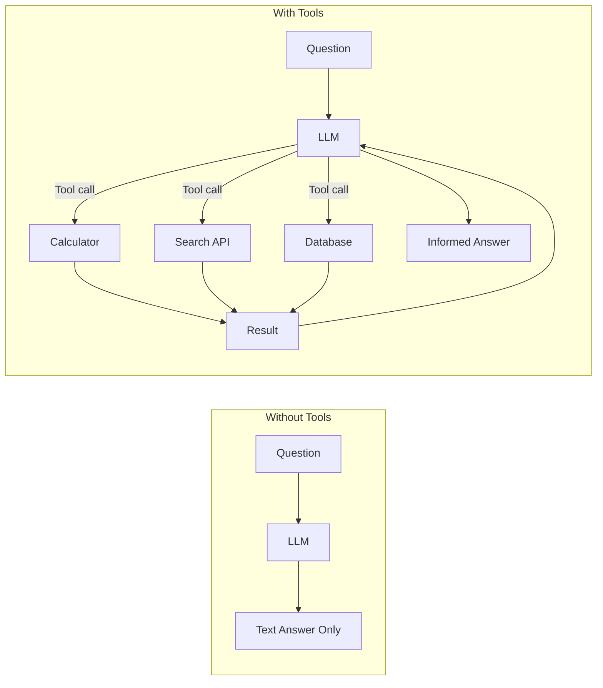
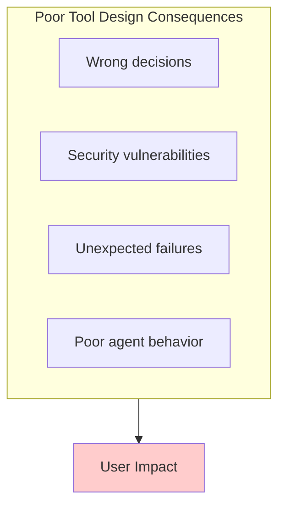
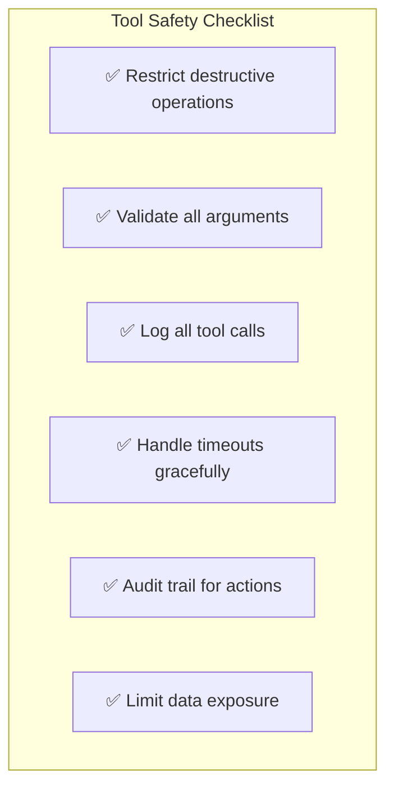
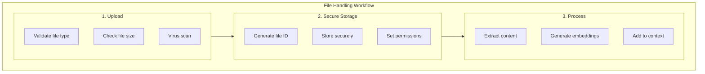
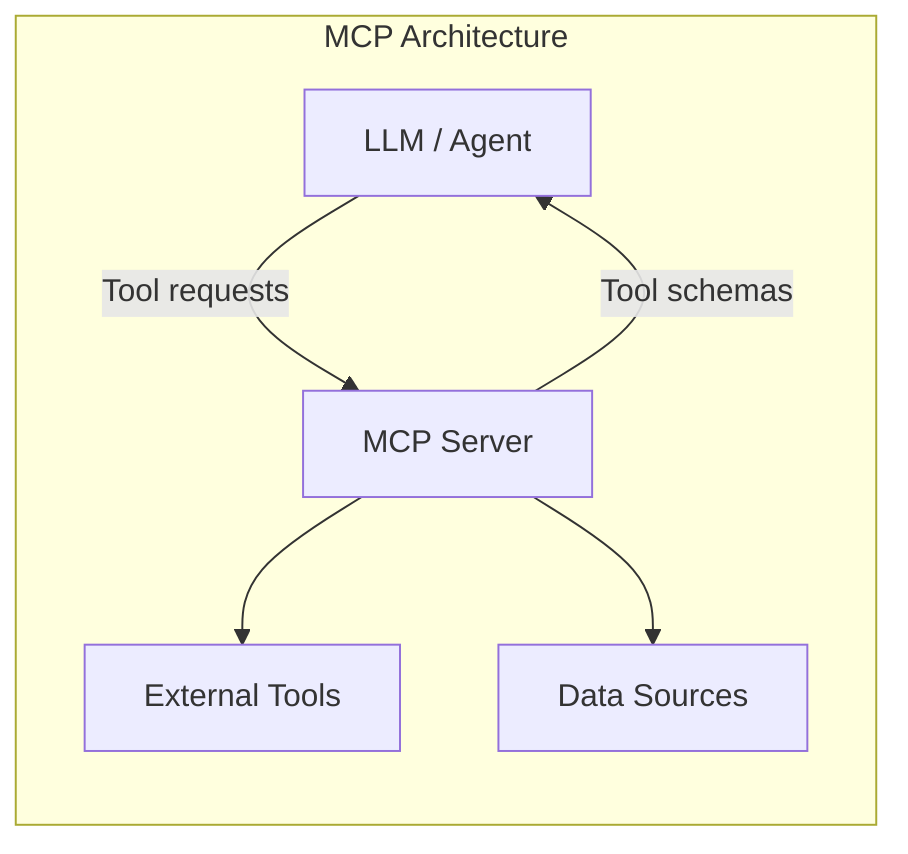

# Lesson 3: Tools, Files, and MCP Basics

## Learning Outcome

By the end of this lesson, you will be able to:
- Design and implement safe tools for agent use
- Handle file inputs and outputs in agent workflows
- Use MCP-style integration for external capabilities
- Build agents that call multiple tools reliably

## Prerequisites

- Lesson 2: Prompting and structured outputs
- [Agents and Tools concepts](/docs/concepts/agents-and-tools.md)
- [Prompt patterns cheatsheet](/docs/courses/shared/prompt-and-output-patterns-cheatsheet.md)

---

## Concept: Tools Extend Agent Capabilities

Tools allow the LLM to interact with the real world. Without tools, an agent can only generate text. With tools, it can take actions.



### Tool Categories

| Category | Characteristics | Examples |
|----------|-----------------|----------|
| **Read-only** | Query external data, no side effects | Search, database read, file read |
| **Write** | Modify state, trigger events | Send email, update database |
| **Destructive** | Irreversible changes | DROP TABLE, rm files | ⚠️ Restrict heavily |

---

## Concept: Tool Design Quality

Tool design is as important as prompt design. A poorly designed tool can:



### Tool Description Quality

Good tool descriptions help the LLM know when and how to use tools:

```python
# ❌ Poor description - LLM doesn't know when to use
def calculate(x, y, op):
    """Performs a calculation."""
    pass

# ✅ Good description - Clear, complete, safe
def calculator(
    x: float, 
    y: float, 
    operation: str = "add"
) -> float:
    """
    Perform basic arithmetic operations.
    
    Args:
        x: First number (required)
        y: Second number (required)
        operation: One of "add", "subtract", "multiply", "divide"
                  Defaults to "add"
    
    Returns:
        The result of the arithmetic operation.
    
    Raises:
        ValueError: If operation is invalid
        ZeroDivisionError: If dividing by zero
    
    Example:
        calculator(10, 5, "add")  # Returns 15.0
        calculator(10, 5, "divide")  # Returns 2.0
    """
    pass
```

### Tool Schema Design

```python
# Tool schema for LLM
tool_schema = {
    "name": "calculator",
    "description": "Perform basic arithmetic operations. Use when the user asks for calculations.",
    "parameters": {
        "type": "object",
        "properties": {
            "x": {
                "type": "number",
                "description": "First number"
            },
            "y": {
                "type": "number", 
                "description": "Second number"
            },
            "operation": {
                "type": "string",
                "enum": ["add", "subtract", "multiply", "divide"],
                "description": "Arithmetic operation to perform"
            }
        },
        "required": ["x", "y", "operation"]
    }
}
```

---

## Concept: Safe Tool Design

### The Golden Rules



### Permission Levels

```python
from enum import Enum

class ToolPermission(Enum):
    READ_ONLY = "read"      # Can query, cannot modify
    READ_WRITE = "write"    # Can query and modify
    ADMIN = "admin"        # Full access (restricted!)
    DENIED = "denied"     # Blocked completely

# Assign permissions based on user role
user_permissions = {
    "calculator": ToolPermission.READ_ONLY,
    "file_read": ToolPermission.READ_ONLY,
    "file_write": ToolPermission.READ_WRITE,
    "database_delete": ToolPermission.DENIED,  # Never allow!
    "database_update": ToolPermission.READ_WRITE,
}
```

### Dangerous Patterns to Avoid

```python
# ❌ NEVER do this
def execute_sql(sql: str):
    """Execute any SQL query."""
    db.execute(sql)  # SECURITY RISK!

# ✅ Do this instead
def get_orders(customer_id: str, limit: int = 10):
    """Get recent orders for a customer.
    
    Args:
        customer_id: The customer ID
        limit: Maximum orders to return (default 10, max 100)
    
    Returns:
        List of order summaries
    """
    # Parameterized query - safe!
    return db.query(
        "SELECT * FROM orders WHERE customer_id = ? LIMIT ?",
        [customer_id, min(limit, 100)]
    )
```

---

## Concept: File Handling in GenAI Workflows

Files are a common input for GenAI applications.

### File Handling Workflow



### Common File Patterns

| Pattern | Use Case | Example |
|---------|----------|---------|
| **Upload + Store** | Persistent files | User uploads contract PDF |
| **Upload + Process** | One-time analysis | User uploads image for vision |
| **Upload + Embed** | Searchable documents | Indexing for RAG |

### File Type Handling

| File Type | How to Handle | Considerations |
|-----------|--------------|-----------------|
| **Images** | Vision API, base64 | Size limits, processing cost |
| **PDF** | Text extraction, OCR | Complex layouts harder |
| **Code files** | Direct text reading | Preserve syntax |
| **CSV/JSON** | Structured parsing | Validate schema |
| **Documents** | Convert to markdown | Preserve formatting |

---

## Concept: MCP (Model Context Protocol)

MCP is a standard pattern for connecting AI systems to external tools and data sources.

### MCP Architecture



### MCP Benefits

| Benefit | Description |
|---------|-------------|
| **Standardization** | Consistent interface for all tools |
| **Security** | Centralized permission and audit |
| **Scalability** | Easy to add new tools |
| **Testability** | Tools can be tested in isolation |

### MCP in AgentFlow

```python
from agentflow.integrations.mcp import MCPClient

# Connect to MCP server
mcp_client = MCPClient("http://mcp-server:8080")

# List available tools
tools = mcp_client.list_tools()
print(tools)
# [{'name': 'filesystem_read', ...}, {'name': 'database_query', ...}]

# Use tools in agent
agent = ReactAgent(
    tools=mcp_client.get_tools(),
    model=OpenAIModel("gpt-4o")
)
```

---

## Example: Building Safe Tools in AgentFlow

### Step 1: Define Tool with Validation

```python
from agentflow.core.tools import tool, ToolResult
from agentflow.core.tools.schema import ToolSchema
from pydantic import BaseModel, Field
from typing import Literal

class CalculatorInput(BaseModel):
    x: float = Field(description="First number")
    y: float = Field(description="Second number")
    operation: Literal["add", "subtract", "multiply", "divide"] = Field(
        description="Arithmetic operation to perform"
    )

@tool(
    name="calculator",
    description="Perform basic arithmetic operations. Use when the user asks for calculations.",
    schema=CalculatorInput
)
def calculator(input_data: CalculatorInput) -> ToolResult:
    """Safely perform calculations with validation."""
    try:
        match input_data.operation:
            case "add":
                result = input_data.x + input_data.y
            case "subtract":
                result = input_data.x - input_data.y
            case "multiply":
                result = input_data.x * input_data.y
            case "divide":
                if input_data.y == 0:
                    return ToolResult(
                        success=False,
                        error="Division by zero not allowed"
                    )
                result = input_data.x / input_data.y
        
        return ToolResult(success=True, result=result)
    
    except Exception as e:
        return ToolResult(success=False, error=str(e))
```

### Step 2: Define File Read Tool with Security

```python
from pathlib import Path
import hashlib

class FileReadInput(BaseModel):
    path: str = Field(description="Relative path to file")
    max_lines: int = Field(default=100, ge=1, le=1000, description="Max lines to read")

@tool(
    name="file_read",
    description="Read content from a file in the allowed directories.",
    schema=FileReadInput
)
def file_read(input_data: FileReadInput) -> ToolResult:
    """Read file with path validation and limits."""
    # Security: Only allow reads in allowed directories
    allowed_dirs = ["/app/project", "/app/docs", "/app/data"]
    allowed_extensions = {".txt", ".md", ".py", ".json", ".csv"}
    
    try:
        file_path = Path(input_data.path).resolve()
        
        # Check directory
        if not any(str(file_path).startswith(d) for d in allowed_dirs):
            return ToolResult(
                success=False,
                error=f"Access denied: {input_data.path} is outside allowed directories"
            )
        
        # Check file exists
        if not file_path.exists():
            return ToolResult(
                success=False,
                error=f"File not found: {input_data.path}"
            )
        
        # Check extension
        if file_path.suffix not in allowed_extensions:
            return ToolResult(
                success=False,
                error=f"File type not allowed: {file_path.suffix}"
            )
        
        # Read file
        lines = file_path.read_text().splitlines()[:input_data.max_lines]
        
        return ToolResult(
            success=True,
            result="\n".join(lines),
            metadata={"line_count": len(lines)}
        )
    
    except PermissionError:
        return ToolResult(success=False, error="Permission denied")
    
    except Exception as e:
        return ToolResult(success=False, error=str(e))
```

### Step 3: Register Tools with Agent

```python
from agentflow.core.graph import StateGraph, AgentState
from agentflow.prebuilt.agent import ReactAgent

# Create agent with tools
agent = ReactAgent(
    tools=[calculator, file_read],
    model=OpenAIModel("gpt-4o")
)

# Agent can now use these tools
result = agent.invoke({
    "messages": [Message(role="user", content="Calculate 15 * 23")]
})

# Or with streaming
for chunk in agent.stream({
    "messages": [Message(role="user", content="What's in file.txt?")]
}):
    print(chunk, end="", flush=True)
```

### Complete Tool Example

```python
from agentflow.core.tools import tool, ToolResult
from agentflow.core.tools.schema import ToolSchema
from pydantic import BaseModel, Field
from typing import Optional
from datetime import datetime

class SearchInput(BaseModel):
    query: str = Field(description="Search query (not a URL)")
    max_results: int = Field(default=5, ge=1, le=20)

class SearchResult(BaseModel):
    title: str
    url: str
    snippet: str

@tool(
    name="web_search",
    description="Search the web for information. Use when the user asks about current events or factual information.",
    schema=SearchInput
)
def web_search(input_data: SearchInput) -> ToolResult:
    """Safe web search with input validation."""
    import re
    
    # Security: Reject URLs as queries
    url_pattern = r'^https?://'
    if re.match(url_pattern, input_data.query):
        return ToolResult(
            success=False,
            error="Please enter a search query, not a URL"
        )
    
    # Security: Limit query length
    if len(input_data.query) > 200:
        return ToolResult(
            success=False,
            error="Query too long (max 200 characters)"
        )
    
    try:
        # Perform search (example with search API)
        results = search_api.search(
            query=input_data.query,
            max_results=input_data.max_results
        )
        
        return ToolResult(
            success=True,
            result=results,
            metadata={"query": input_data.query, "count": len(results)}
        )
    
    except Exception as e:
        return ToolResult(success=False, error=f"Search failed: {str(e)}")
```

---

## Exercise: Build Safe Tools

### Your Task

Build two safe tools:

1. **`get_current_time`** - Returns current time in a timezone
2. **`unit_converter`** - Converts between units

### Requirements

```python
# Tool 1: get_current_time
class TimeInput(BaseModel):
    timezone: str = Field(description="Timezone (e.g., 'America/New_York', 'UTC')")

@tool(name="get_current_time", description="...", schema=TimeInput)
def get_current_time(input_data: TimeInput) -> ToolResult:
    # Must:
    # - Validate timezone format
    # - Return readable time format
    # - Handle invalid timezones gracefully
    pass

# Tool 2: unit_converter
class ConverterInput(BaseModel):
    value: float = Field(description="Value to convert")
    from_unit: str = Field(description="Source unit")
    to_unit: str = Field(description="Target unit")
    category: Literal["length", "weight", "temperature", "time"] = Field(
        description="Unit category"
    )

@tool(name="unit_converter", description="...", schema=ConverterInput)
def unit_converter(input_data: ConverterInput) -> ToolResult:
    # Must:
    # - Validate units within category
    # - Handle invalid conversions
    # - Return clear result
    pass
```

### Test Cases

| Tool | Input | Expected |
|------|-------|----------|
| get_current_time | timezone="UTC" | Current UTC time |
| get_current_time | timezone="Invalid/Zone" | Error message |
| unit_converter | 100, "km", "mi", "length" | 62.1371 miles |
| unit_converter | 32, "celsius", "fahrenheit", "temperature" | 89.6°F |
| unit_converter | 100, "km", "kg", "length" | Error (unit mismatch) |

---

## What You Learned

1. **Tools extend agent capabilities** — Without tools, agents are limited to text generation
2. **Tool design is critical** — Poor tool design causes failures and security issues
3. **Safety must be built in** — Validate inputs, restrict destructive operations, log everything
4. **MCP standardizes tool access** — Consistent interface for external capabilities
5. **File handling requires security** — Validate paths, types, and content

---

## Common Failure Mode

**Allowing unrestricted tool access**

Never expose tools that can:

```python
# ❌ DANGEROUS - Never allow these directly
@tool(name="execute_code")
def execute_code(code: str):
    exec(code)  # SECURITY NIGHTMARE!

@tool(name="delete_file")
def delete_file(path: str):
    os.remove(path)  # DANGEROUS!

@tool(name="run_shell")
def run_shell(command: str):
    subprocess.run(command, shell=True)  # EXTREMELY DANGEROUS!

# ✅ SAFE - Restrict and validate
@tool(name="safe_calculator")
def safe_calculator(a: float, b: float, op: str):
    # Only allows specific operations
    allowed_ops = {"add", "subtract", "multiply", "divide"}
    if op not in allowed_ops:
        raise ValueError(f"Operation must be one of: {allowed_ops}")
    # ...
```

---

## Next Step

Continue to [Lesson 4: Retrieval, grounding, and citations](./lesson-4-retrieval-grounding-and-citations.md) to learn how to ground agent responses in real knowledge.

### Or Explore

- [MCP Client Tutorial](/docs/tutorials/from-examples/mcp-client.md) — Using MCP in AgentFlow
- [Media and Files concepts](/docs/concepts/media-and-files.md) — File handling in depth
- [Tools Reference](/docs/reference/python/tools.md) — Complete tool API reference
