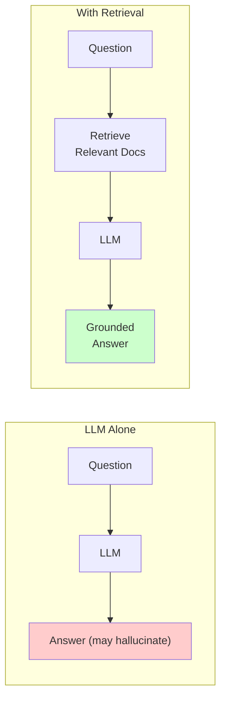
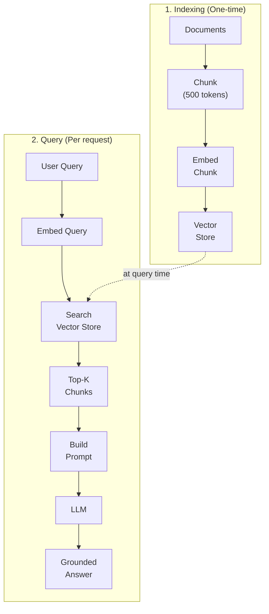
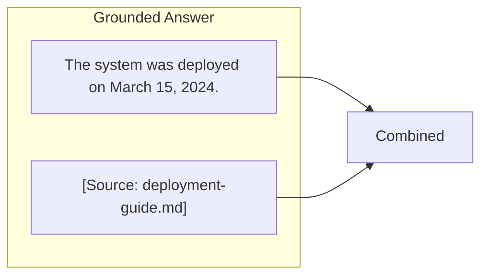

# Lesson 4: Retrieval, Grounding, and Citations

## Learning Outcome

By the end of this lesson, you will be able to:
- Implement basic retrieval-augmented generation (RAG)
- Ground responses in specific knowledge sources
- Add citations to agent outputs
- Identify when retrieval is and isn't needed

## Prerequisites

- Read [Embeddings and similarity](/docs/courses/shared/embeddings-vectorization-and-similarity.md)
- Read [Chunking and retrieval primitives](/docs/courses/shared/chunking-and-retrieval-primitives.md)

---

## Concept: Why Retrieval?

LLMs have two fundamental limitations:

1. **Knowledge cutoff** — They don't know about recent events or private data
2. **Hallucination** — They can generate plausible but incorrect information



### When Retrieval Helps

| Situation | Retrieval? | Why |
|-----------|-----------|-----|
| Answering questions about your company | ✅ Yes | Private knowledge |
| Recent news or events | ✅ Yes | Knowledge cutoff |
| Technical documentation | ✅ Yes | Precise facts needed |
| General knowledge ("What is Python?") | ❌ No | LLM already knows |
| Creative writing | ❌ No | No factual grounding needed |

---

## Concept: The 2-Step RAG Pattern

The classic RAG pattern has two steps:



### Retrieval vs. Context Window

Retrieval is often better than stuffing everything into context:

| Approach | Pros | Cons |
|----------|------|------|
| **Long context** | Simpler implementation | Higher cost, quality degrades |
| **Retrieval** | Targeted, cheaper | Additional complexity |
| **Hybrid** | Best of both | Most complex |

---

## Concept: Grounding and Citations

Grounding means ensuring answers come from specific sources. Citations make this verifiable.

### Grounding Prompt Pattern

```python
grounding_prompt = """
Answer the question using ONLY the provided context.
If the answer is not in the context, say "I don't know based on the provided information."

Context:
---
{retrieved_chunks}
---

Question: {user_question}

Answer with citations: [Source: filename]
"""
```

### Citation Format



### Citation Schema

```python
from pydantic import BaseModel
from typing import Optional

class GroundedAnswer(BaseModel):
    answer: str
    sources: list[str]
    confidence: float
    
    # Optional: specific citations with quotes
    citations: Optional[list[dict]] = None
```

---

## Concept: Retrieval Failure Modes

### Common Issues

| Issue | Cause | Solution |
|-------|-------|----------|
| **Irrelevant chunks** | Poor embeddings | Use better model, add filters |
| **Missed relevant docs** | Low recall | Hybrid search, lower threshold |
| **Stale data** | Outdated index | Refresh index periodically |
| **Prompt injection** | Malicious docs | Sanitize retrieved content |

### Prompt Injection Risk

⚠️ **Never trust retrieved content without sanitization**

```python
# ❌ Dangerous: Retained doc content in prompt
prompt = f"""
Answer based on this document:

{doc_content}  # Could contain injected instructions!
"""

# ✅ Safer: Citation only, not raw content
prompt = f"""
Answer based on documents with IDs: {doc_ids}
Cite the source in your response.
"""
```

---

## Example: Building a Q&A System with RAG

### Step 1: Define the Schema

```python
from pydantic import BaseModel

class Document(BaseModel):
    content: str
    source: str
    chunk_id: str

class QAResponse(BaseModel):
    answer: str
    sources: list[str]
    confidence: float
```

### Step 2: Index Documents

```python
from agentflow.storage.store import QdrantStore
from agentflow.core.embedding import OpenAIEmbedding

# Initialize embedding model and store
embedding_model = OpenAIEmbedding("text-embedding-3-small")
vector_store = QdrantStore(collection_name="knowledge_base")

def index_documents(documents: list[Document]):
    for doc in documents:
        # Embed the content
        embedding = embedding_model.embed(doc.content)
        
        # Store in vector database
        vector_store.add(
            id=doc.chunk_id,
            vector=embedding,
            payload={
                "content": doc.content,
                "source": doc.source
            }
        )
```

### Step 3: Retrieve and Answer

```python
def rag_query(question: str, top_k: int = 5) -> QAResponse:
    # 1. Embed the question
    query_embedding = embedding_model.embed(question)
    
    # 2. Retrieve relevant chunks
    results = vector_store.search(
        vector=query_embedding,
        top_k=top_k
    )
    
    # 3. Build context
    context = "\n\n".join([
        f"[Source: {r.payload['source']}]\n{r.payload['content']}"
        for r in results
    ])
    
    # 4. Generate answer with grounding
    prompt = f"""
    Answer the question using the provided sources.
    Cite each statement with [Source: filename].
    
    Sources:
    {context}
    
    Question: {question}
    """
    
    response = llm.generate(
        prompt,
        response_format=QAResponse
    )
    
    return response
```

### Step 4: Run the System

```python
# Index some documents
documents = [
    Document(content="AgentFlow was founded in 2024...", source="about.md", chunk_id="1"),
    Document(content="To install AgentFlow: pip install...", source="install.md", chunk_id="2"),
]

index_documents(documents)

# Query
result = rag_query("When was AgentFlow founded?")
print(result.answer)
# "AgentFlow was founded in 2024. [Source: about.md]"
```

---

## Exercise: Add Citations to an Existing Agent

### Your Task

Take a simple Q&A agent and add:

1. **Citation support** — Every factual statement includes a source
2. **"Don't know" handling** — When retrieval returns nothing relevant
3. **Confidence scoring** — Rate answer confidence based on retrieval quality

### Template

```python
class CitationAwareAgent:
    def __init__(self, vector_store, llm):
        self.store = vector_store
        self.llm = llm
    
    def query(self, question: str) -> dict:
        # 1. Retrieve relevant documents
        # 2. Check if retrieval is sufficient
        # 3. Generate answer with citations
        # 4. Calculate confidence
        pass
```

### Test Cases

| Question | Expected |
|----------|----------|
| "When was AgentFlow founded?" | Answer with source citation |
| "What is the meaning of life?" | "I don't have information about this" |
| "Tell me about [undocumented topic]" | "I don't have information about this" |

---

## What You Learned

1. **Retrieval grounds knowledge** — Use it when LLM knowledge is insufficient
2. **Citations build trust** — Always cite sources for factual claims
3. **Retrieval can fail** — Have fallback for when retrieval returns nothing
4. **Watch for injection** — Never blindly trust retrieved content

---

## Common Failure Mode

**Retrieval without citation**

Retrieving context but not citing sources:

```python
# ❌ No citation
prompt = f"Answer based on: {retrieved_context}"

# ✅ With citation
prompt = f"""
Answer based on [Source: {source}].
{retrieved_context}
Cite sources in your response.
"""
```

---

## Next Step

Continue to [Lesson 5: State, memory, threads, and streaming](./lesson-5-state-memory-threads-and-streaming.md) to build conversation-aware applications.

### Or Explore

- [Qdrant Memory Tutorial](/docs/tutorials/from-examples/qdrant-memory.md) — Vector store setup
- [Memory and Store concepts](/docs/concepts/memory-and-store.md) — Memory architecture
