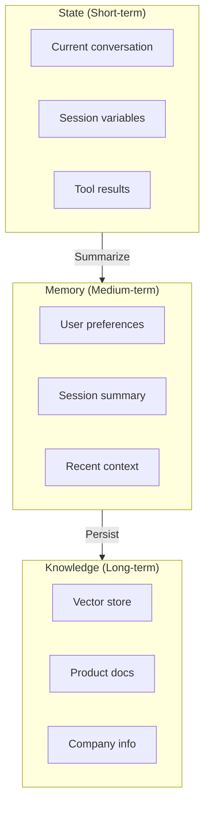
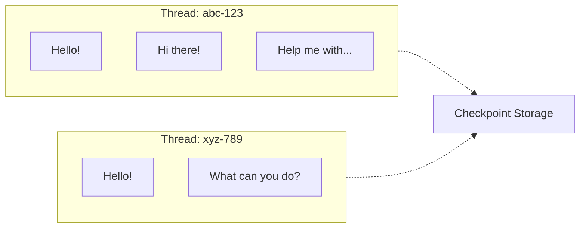
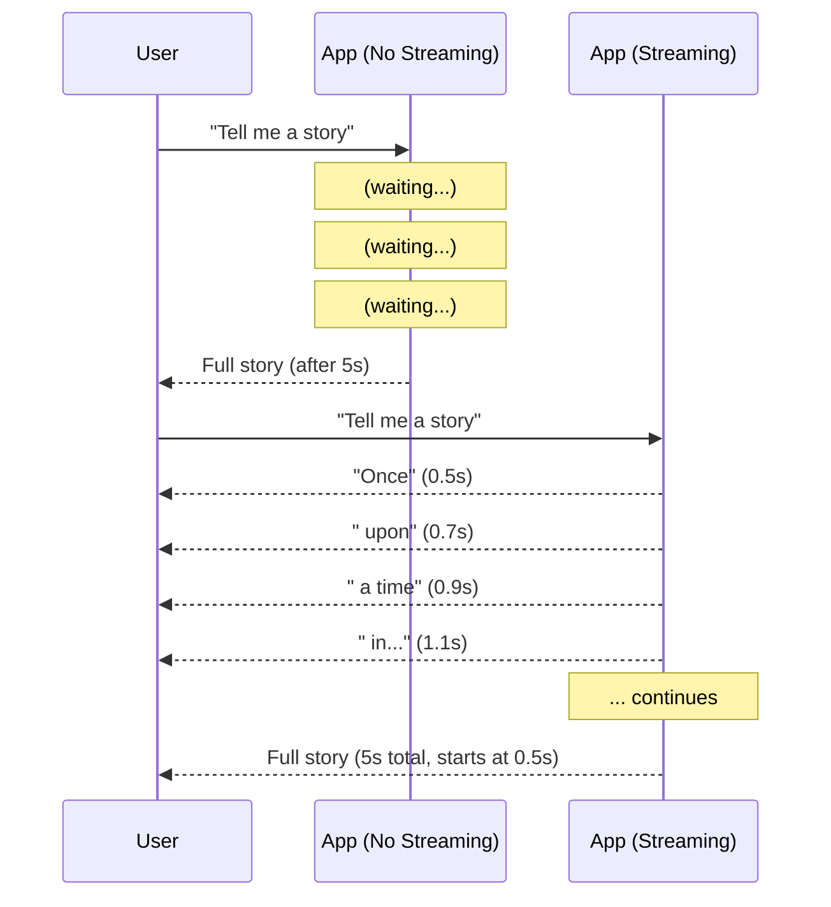

# Lesson 5: State, Memory, Threads, and Streaming

## Learning Outcome

By the end of this lesson, you will be able to:
- Implement conversation state with checkpointing
- Design memory patterns for short-term and long-term storage
- Add streaming for better user experience

## Prerequisites

- Read [Tokenization and context windows](/docs/courses/shared/tokenization-and-context-windows.md)
- [Checkpointing and threads concepts](/docs/concepts/checkpointing-and-threads.md)

---

## Concept: State vs. Memory vs. Knowledge

These terms are often confused but have distinct meanings:



| Concept | Lifetime | Storage | Use Case |
|---------|----------|---------|----------|
| **State** | Current request | In-memory | Active conversation |
| **Memory** | Session/thread | Checkpointer | Conversation continuity |
| **Knowledge** | Permanent | Vector store | Grounding, RAG |

---

## Concept: Threads and Checkpointing

A **thread** is a persistent conversation context identified by a unique ID.



### Why Checkpointing Matters

| Without Checkpointing | With Checkpointing |
|----------------------|-------------------|
| Every request needs full history | Only thread_id needed |
| Context grows unbounded | State can be summarized |
| Server restart = conversation lost | Resume from checkpoint |
| No debugging visibility | Full replay possible |

---

## Concept: Streaming for Better UX

Streaming sends tokens incrementally instead of waiting for the complete response.



### When to Use Streaming

| Use Streaming | Don't Use Streaming |
|--------------|---------------------|
| Long responses | Quick factual answers |
| User watching | Background processing |
| Real-time interaction | Batch operations |

---

## Example: Threaded Chat with Checkpointing

### Step 1: Define State Schema

```python
from pydantic import BaseModel
from typing import Optional
from agentflow.core.state import Message

class ChatState(BaseModel):
    messages: list[Message]
    thread_id: str
    user_id: Optional[str] = None
    metadata: dict = {}
```

### Step 2: Create Checkpointed Graph

```python
from agentflow.core.graph import StateGraph
from agentflow.storage.checkpointer import InMemoryCheckpointer

# Create checkpointer
checkpointer = InMemoryCheckpointer()

# Build graph with checkpointing
builder = StateGraph(ChatState)

@builder.node
def chat_node(state: ChatState) -> ChatState:
    messages = state.messages
    
    # Generate response
    response = llm.generate(
        messages=[m.dict() for m in messages]
    )
    
    messages.append(Message(role="assistant", content=response))
    return state.copy(update={"messages": messages})

builder.add_node("chat", chat_node)
builder.set_entry_point("chat")
builder.set_finish_point("chat")

# Compile with checkpointer
app = builder.compile(checkpointer=checkpointer)
```

### Step 3: Use Threads

```python
# First message - creates new thread
result1 = app.invoke(
    {
        "messages": [Message(role="user", content="Hello!")],
        "thread_id": "user-123-session-1",
        "user_id": "user-123"
    }
)

# Second message - same thread, context preserved
result2 = app.invoke(
    {
        "messages": [Message(role="user", content="What did I just say?")],
        "thread_id": "user-123-session-1",  # Same thread!
        "user_id": "user-123"
    }
)
# Agent remembers "Hello!"
```

---

## Example: Streaming Responses

### Server-Side Streaming

```python
from fastapi import FastAPI
from sse_starlette.sse import EventSourceResponse

app = FastAPI()

@app.post("/stream/{thread_id}")
async def stream_chat(thread_id: str, message: str):
    async def event_generator():
        async for chunk in app.graph.astream(
            {"messages": [Message(role="user", content=message)], "thread_id": thread_id}
        ):
            yield {
                "event": "message",
                "data": chunk.content
            }
    
    return EventSourceResponse(event_generator())
```

### Client-Side Handling

```python
import httpx

async def stream_response(thread_id: str, message: str):
    async with httpx.AsyncClient() as client:
        async with client.post(
            f"/stream/{thread_id}",
            json={"message": message},
            timeout=None
        ) as response:
            async for line in response.aiter_lines():
                if line.startswith("data:"):
                    print(line[5:], end="", flush=True)
```

### AgentFlow Streaming

```python
# Using AgentFlow's built-in streaming
from agentflow.core.streaming import StreamChunk

for chunk in app.stream({"messages": [Message(role="user", content="Hello!")]}):
    if isinstance(chunk, StreamChunk):
        print(chunk.content, end="", flush=True)
```

---

## Example: Memory Patterns

### Short-term Memory (Thread State)

```python
class ShortTermMemory:
    """In-memory conversation history"""
    
    def __init__(self, max_turns: int = 10):
        self.history: list[Message] = []
        self.max_turns = max_turns
    
    def add(self, role: str, content: str):
        self.history.append(Message(role=role, content=content))
        
        # Trim if too long
        if len(self.history) > self.max_turns:
            self.history = self.history[-self.max_turns:]
    
    def get_context(self) -> list[Message]:
        return self.history
```

### Long-term Memory (Persistent Store)

```python
from agentflow.storage.store import QdrantStore

class LongTermMemory:
    """Persistent memory using vector store"""
    
    def __init__(self):
        self.store = QdrantStore(collection_name="user_memory")
    
    def remember(self, user_id: str, fact: str, embedding: list):
        """Store a fact about a user"""
        self.store.add(
            id=f"{user_id}:{hash(fact)}",
            vector=embedding,
            payload={"user_id": user_id, "fact": fact}
        )
    
    def recall(self, user_id: str, query: str, embedding: list) -> list[str]:
        """Recall facts about a user"""
        results = self.store.search(
            vector=embedding,
            filter={"user_id": user_id}
        )
        return [r.payload["fact"] for r in results]
```

---

## Exercise: Add Memory to Your Agent

### Your Task

Implement a memory system with:

1. **Thread persistence** — Maintain conversation across requests
2. **Memory summarization** — Summarize old messages when context is full
3. **User preferences** — Remember user preferences across sessions

### Template

```python
class MemoryfulAgent:
    def __init__(self):
        self.checkpointer = InMemoryCheckpointer()
        self.memory_store = QdrantStore(collection_name="user_preferences")
        self.max_context_tokens = 8000
    
    def query(self, thread_id: str, message: str, user_id: str) -> str:
        # 1. Load thread state
        # 2. Retrieve user preferences
        # 3. Build context (history + preferences)
        # 4. Check if summarization needed
        # 5. Generate response
        # 6. Save thread state
        pass
```

### Test Scenarios

| Scenario | Expected Behavior |
|----------|------------------|
| New conversation | Start fresh |
| Return to thread | Remember previous context |
| Ask about preferences | Recall saved preferences |
| Very long conversation | Summarize old messages |

---

## What You Learned

1. **State vs. memory vs. knowledge** — Each serves a different purpose
2. **Threads enable continuity** — Same thread_id = shared context
3. **Checkpointing enables recovery** — Resume from any point
4. **Streaming improves UX** — Show progress, reduce perceived latency

---

## Common Failure Mode

**No memory or truncation strategy**

Starting with no memory design leads to:

```python
# ❌ No strategy - context grows forever
def chat(messages):
    messages.append(new_message)  # Keeps growing!
    return llm.generate(messages)

# ✅ With strategy - manage context
def chat(thread_id, new_message):
    history = load_thread(thread_id)
    context = build_context(history, max_tokens=8000)
    if too_long:
        context = summarize_old_messages(context)
    # ... generate and save
```

---

## Next Step

Continue to [Lesson 6: Multimodal and client/server integration](./lesson-6-multimodal-and-client-server-integration.md) to connect your agent to frontends and handle files.

### Or Explore

- [Streaming concepts](/docs/concepts/streaming.md) — Streaming architecture
- [React Streaming Tutorial](/docs/tutorials/from-examples/react-streaming.md) — Frontend integration
