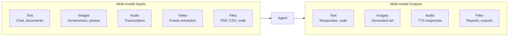
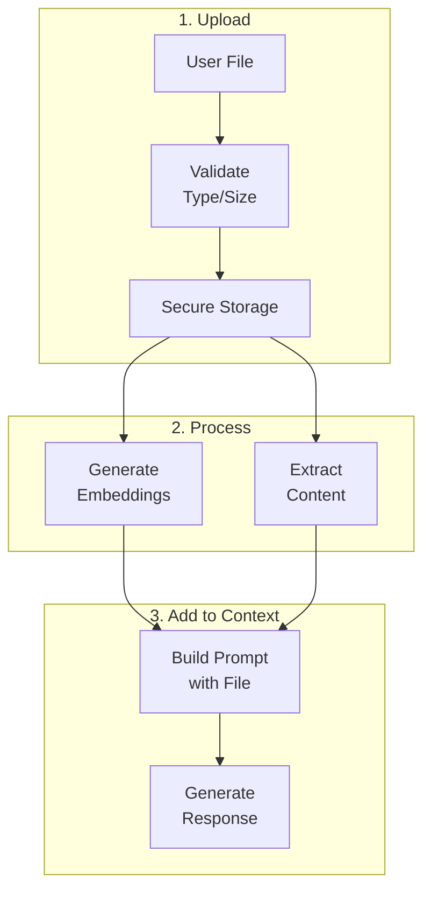
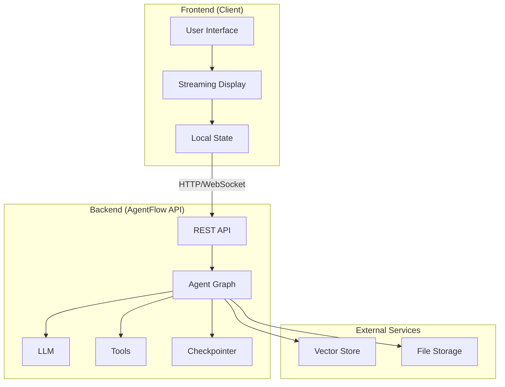

# Lesson 6: Multimodal and Client/Server Integration

## Learning Outcome

By the end of this lesson, you will be able to:
- Build multimodal agents that handle images and files
- Connect agents to frontend clients via API
- Design clean separation between UI and agent logic

## Prerequisites

- Lesson 5: State and memory
- [Streaming concepts](/docs/concepts/streaming)

---

## Concept: GenAI Apps Are Not Just Text Chat

Modern GenAI applications handle multiple modalities:



### Common Multimodal Patterns

| Pattern | Input | Output | Use Case |
|---------|-------|--------|----------|
| **Vision + Chat** | Image + text | Text | Screenshot analysis |
| **Document Q&A** | PDF + question | Text + citations | Contract review |
| **Image Generation** | Text prompt | Image | Creative tools |
| **Voice Assistant** | Audio | Audio | Hands-free interaction |

---

## Concept: File Upload Workflows

### Typical File Handling Pipeline



### File Type Handling

| File Type | How to Handle | Considerations |
|-----------|--------------|----------------|
| **Images** | Vision API, base64 encoding | Size limits, processing cost |
| **PDF** | Text extraction, OCR | Complex layouts harder |
| **Code files** | Direct text reading | Preserve syntax |
| **CSV/JSON** | Structured parsing | Validate schema |
| **Documents** | Convert to markdown | Preserve formatting |

---

## Concept: Client/Server Architecture

### Clean Separation of Concerns



### Responsibilities

| Layer | Responsibilities |
|-------|-----------------|
| **Client** | UI rendering, user input, streaming display, local caching |
| **API** | Request routing, auth, rate limiting, response formatting |
| **Agent** | LLM calls, tool execution, state management |
| **Storage** | File storage, vector store, checkpoint storage |

---

## Example: Multimodal Agent

### Image Understanding

You do not hand-build provider-specific content parts like `image_url`. A message is a list of typed content blocks, and an `ImageBlock` wraps a `MediaRef` that is either a URL or inline base64. The agent translates those blocks into whatever shape the provider expects.

```python
import base64

from agentflow.core.graph import StateGraph, Agent
from agentflow.core.state import ImageBlock, MediaRef, Message, TextBlock
from agentflow.utils import START, END

vision_agent = Agent(model="gpt-4o")   # vision-capable model

builder = StateGraph()
builder.add_node("vision", vision_agent)
builder.add_edge(START, "vision")
builder.add_edge("vision", END)
app = builder.compile()

def analyze_image(image_path: str, question: str) -> str:
    """Analyze an image and answer questions about it."""
    with open(image_path, "rb") as f:
        image_data = base64.b64encode(f.read()).decode()

    message = Message(
        role="user",
        content=[
            TextBlock(text=question),
            ImageBlock(
                media=MediaRef(kind="data", data_base64=image_data, mime_type="image/jpeg")
            ),
        ],
    )

    result = app.invoke({"messages": [message]}, config={"thread_id": "vision-1"})
    return result["messages"][-1].text()
```

For an image that already lives on the web, use `MediaRef(kind="url", url=..., mime_type=...)` and skip the base64 step entirely. Compile with a `media_store` (see [Media](/docs/reference/python/media)) and large inline blobs are offloaded automatically, so checkpoints hold a reference rather than the bytes.

### Document Q&A

A tool is a plain function: annotate the parameters, describe them in the docstring, and return a plain value. Errors go back to the model as ordinary return values so it can recover.

```python
import PyPDF2

from agentflow.core.llm import call_llm
from agentflow.utils.decorators import tool

def extract_text(file_path: str, max_pages: int = 10) -> str:
    """Extract text from a PDF."""
    with open(file_path, "rb") as f:
        reader = PyPDF2.PdfReader(f)
        return "\n\n".join(page.extract_text() for page in reader.pages[:max_pages])

@tool(name="read_document", description="Read text from a document file")
async def read_document(file_path: str, question: str | None = None) -> str:
    """Read and optionally answer questions about a document.

    Args:
        file_path: Path to the document to read.
        question: Optional question to answer from the document.
    """
    try:
        content = extract_text(file_path)
    except Exception as e:
        return f"Error: could not read {file_path}: {e}"

    if question:
        # Answer question about document
        text, *_ = await call_llm(
            "gpt-4o",
            f"Based on this document, answer: {question}\n\n{content}",
        )
        return text

    return content[:5000]   # Limit output
```

Tools may be sync or async — `ToolNode` handles both. `call_llm` returns the tuple `(text, input_tokens, output_tokens, cache_read_tokens)`, so the answer is the first element.

Agents can also read PDFs directly as a `DocumentBlock` instead of through a tool; `MultimodalConfig(document_handling=DocumentHandling.EXTRACT_TEXT)` controls how they are processed.

---

## Example: API Server with Streaming

### FastAPI Server Setup

```python
from fastapi import FastAPI, HTTPException
from fastapi.responses import StreamingResponse
from pydantic import BaseModel
from typing import Optional

app = FastAPI()

class ChatRequest(BaseModel):
    message: str
    thread_id: str
    user_id: Optional[str] = None

@app.post("/api/chat")
async def chat(request: ChatRequest):
    """Non-streaming chat endpoint."""
    result = await agent.ainvoke(
        thread_id=request.thread_id,
        message=request.message,
        user_id=request.user_id
    )
    return {"response": result["response"], "thread_id": request.thread_id}

@app.post("/api/chat/stream")
async def chat_stream(request: ChatRequest):
    """Streaming chat endpoint."""
    async def generate():
        async for chunk in agent.astream(
            thread_id=request.thread_id,
            message=request.message
        ):
            yield f"data: {chunk.json()}\n\n"
    
    return StreamingResponse(
        generate(),
        media_type="text/event-stream"
    )
```

### File Upload Endpoint

```python
from fastapi import UploadFile, File

@app.post("/api/upload")
async def upload_file(file: UploadFile = File(...)):
    """Upload a file for processing."""
    # Validate file type
    allowed_types = ["image/jpeg", "image/png", "application/pdf", "text/plain"]
    if file.content_type not in allowed_types:
        raise HTTPException(400, f"File type {file.content_type} not allowed")
    
    # Save file securely
    file_id = save_file(file)
    
    return {"file_id": file_id, "filename": file.filename}

def save_file(file: UploadFile) -> str:
    """Save uploaded file to secure storage."""
    import uuid
    import os
    
    file_id = str(uuid.uuid4())
    path = f"/secure_storage/{file_id}"
    
    os.makedirs(os.path.dirname(path), exist_ok=True)
    
    with open(path, "wb") as f:
        content = await file.read()
        f.write(content)
    
    return file_id
```

---

## Example: Frontend Client Integration

### React Client Component

```tsx
import { useState } from 'react';
import { AgentFlowClient, Message } from '@10xscale/agentflow-client';

// Local shape for what we render, distinct from the SDK's Message.
type ChatMessage = { role: 'user' | 'assistant'; content: string };

const client = new AgentFlowClient({
  baseUrl: 'http://localhost:8000'
});

export function ChatInterface() {
  const [messages, setMessages] = useState<ChatMessage[]>([]);
  const [input, setInput] = useState('');
  const [threadId] = useState('user-123-thread-1');

  const sendMessage = async () => {
    if (!input.trim()) return;

    const userMessage = { role: 'user' as const, content: input };
    setMessages(prev => [...prev, userMessage]);
    setInput('');

    try {
      // Streaming response
      const stream = client.stream(
        [Message.text_message(input)],
        { config: { thread_id: threadId } }
      );

      const assistantMessage = { role: 'assistant' as const, content: '' };
      setMessages(prev => [...prev, assistantMessage]);

      for await (const chunk of stream) {
        // StreamChunk has no `content` field. Check `event`, then read
        // `message`, `state`, or `data`.
        if (chunk.event !== 'message' || !chunk.message) continue;

        const text = chunk.message.text();
        setMessages(prev => {
          const updated = [...prev];
          updated[updated.length - 1].content += text;
          return updated;
        });
      }
    } catch (error) {
      console.error('Chat error:', error);
    }
  };

  return (
    <div className="chat-container">
      <div className="messages">
        {messages.map((m, i) => (
          <div key={i} className={`message ${m.role}`}>
            {m.content}
          </div>
        ))}
      </div>
      <div className="input-area">
        <input
          value={input}
          onChange={e => setInput(e.target.value)}
          onKeyDown={e => e.key === 'Enter' && sendMessage()}
          placeholder="Type a message..."
        />
        <button onClick={sendMessage}>Send</button>
      </div>
    </div>
  );
}
```

---

## Exercise: Build a Full-Stack Chat App

### Your Task

Build a complete chat application with:

1. **Backend** — FastAPI server with:
   - Chat endpoint (streaming)
   - File upload endpoint
   - Thread management

2. **Frontend** — React component with:
   - Message display
   - Streaming text
   - File upload button

### Template Structure

```
my-agent-app/
├── backend/
│   ├── main.py          # FastAPI app
│   ├── agent.py         # Agent logic
│   └── models.py        # Pydantic models
├── frontend/
│   ├── Chat.tsx         # Main component
│   └── api.ts           # Client wrapper
└── docker-compose.yml
```

---

## What You Learned

1. **GenAI is multimodal** — Text is just one modality
2. **Files need processing** — Extract content, generate embeddings
3. **Clean architecture** — Separate client, API, and agent responsibilities
4. **Streaming improves UX** — Send tokens as they arrive

---

## Common Failure Mode

**Thick frontend, thin backend**

Don't put business logic in the frontend:

```python
# ❌ Thin backend - logic in frontend
@app.post("/chat")
def chat(message: str):
    return {"response": "OK"}  # Frontend does everything!

# ✅ Thick backend - logic in agent
@app.post("/chat")
def chat(message: str, thread_id: str):
    result = agent.process(thread_id, message)
    return {"response": result}
```

---

## Next Step

Continue to [Lesson 7: Evals, safety, cost, and release](./lesson-7-evals-safety-cost-and-release.md) to learn how to ship with confidence.

### Or Explore

- [Connect Client Tutorial](/docs/get-started/connect-client) — Full client integration
- [Playground Tutorial](/docs/how-to/api-cli/open-playground) — Using the playground
