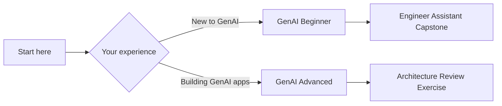

# GenAI Courses

Build real GenAI applications with AgentFlow. These courses teach you how to ship production-grade systems, not just explain LLM concepts in isolation.

## Two tracks for different experience levels

---

## GenAI Beginner

**For software engineers new to LLM applications.**

Go from "I know what an LLM is" to "I can build a production-shaped GenAI app with AgentFlow."

### What you will build

A small engineer-facing assistant that:
- Answers using a curated knowledge source
- Uses one or two tools safely
- Accepts file or multimodal input
- Returns structured output
- Supports thread continuity or memory
- Streams responses to a client
- Includes a lightweight evaluation and release checklist

### What you will learn

| Lesson | Topic |
|--------|-------|
| 1 | Use cases, models, and the LLM app lifecycle |
| 2 | Prompting, context engineering, and structured outputs |
| 3 | Tools, files, and MCP basics |
| 4 | Retrieval, grounding, and citations |
| 5 | State, memory, threads, and streaming |
| 6 | Multimodal and client/server integration |
| 7 | Evals, safety, cost, and release |

### Prerequisites

- Python basics (functions, classes, async)
- Can read and write API request/response formats
- No prior LLM or agent experience needed

### Time commitment

- 7 lessons × 30-45 minutes each
- 1 capstone exercise
- 1 shared release checklist

[Start the Beginner course](./genai-beginner/index.md)

---

## GenAI Advanced

**For engineers who understand the basics and need to make reliable architecture choices.**

Design runtime boundaries, choose between single-agent and multi-agent patterns, and prepare AgentFlow systems for production.

### What you will learn

| Lesson | Topic |
|--------|-------|
| 1 | Agentic product fit and system boundaries |
| 2 | Single-agent runtime and bounded autonomy |
| 3 | Context engineering, long context, and caching |
| 4 | Knowledge systems and advanced RAG |
| 5 | Router, manager, and specialist patterns |
| 6 | Handoffs, human review, and control surfaces |
| 7 | Memory, checkpoints, artifacts, and durable execution |
| 8 | Observability, testing, security, and deployment |

### Prerequisites

- Completed the GenAI Beginner course (or equivalent experience)
- Comfortable with AgentFlow core concepts
- Building or maintaining GenAI applications in production

### Time commitment

- 8 lessons × 45-75 minutes each
- 1 architecture review exercise
- 1 production readiness worksheet

[Start the Advanced course](./genai-advanced/index.md)

---

## Shared foundations

Both courses depend on shared foundational concepts:

| Topic | Description |
|-------|-------------|
| [LLM basics for engineers](./shared/llm-basics-for-engineers.md) | Mental model of what an LLM is, does well, and where it fails |
| [Transformer basics](./shared/transformer-basics.md) | Enough architecture intuition to understand attention and context windows |
| [Tokenization and context windows](./shared/tokenization-and-context-windows.md) | Token budgets, prompt size, chunking, and cost reasoning |
| [Embeddings and similarity](./shared/embeddings-vectorization-and-similarity.md) | Vectorization, cosine similarity, and nearest-neighbor retrieval |
| [Chunking and retrieval primitives](./shared/chunking-and-retrieval-primitives.md) | From embeddings theory to real retrieval systems |
| [Prompt and output patterns](./shared/prompt-and-output-patterns-cheatsheet.md) | Reusable quick-reference for both tracks |

---

## How the courses reinforce AgentFlow's value proposition

These courses teach you to:

1. **Start simple** — pick the right use case before adding complexity
2. **Add tools and structured outputs** — reliable interfaces between model and code
3. **Introduce memory and checkpoints** — durable conversation state
4. **Grow into multi-agent only when needed** — not every problem needs orchestration
5. **Ship with testing, safety, and deployment discipline** — production-minded from day one

:::note Draft
This curriculum is actively being developed. Share feedback in the [AgentFlow GitHub repository](https://github.com/10xscale/agentflow).
:::
