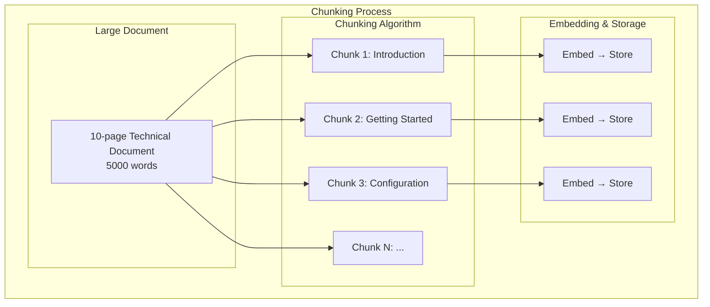
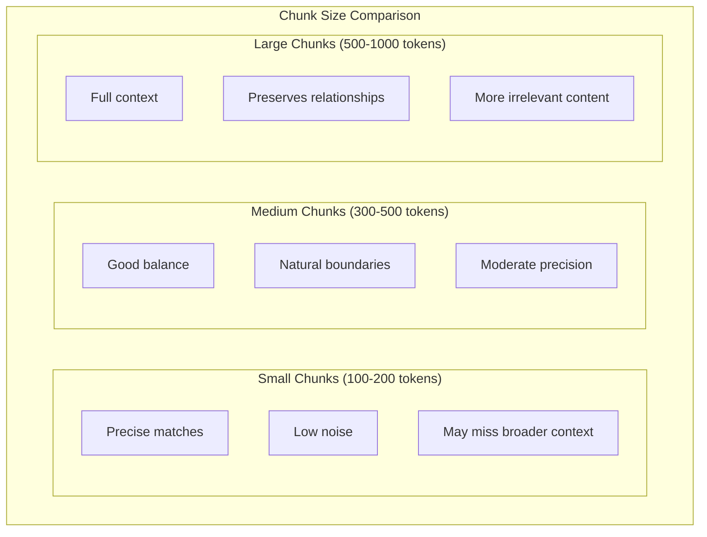
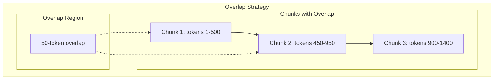
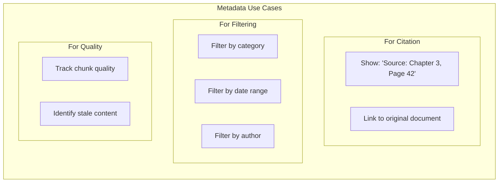
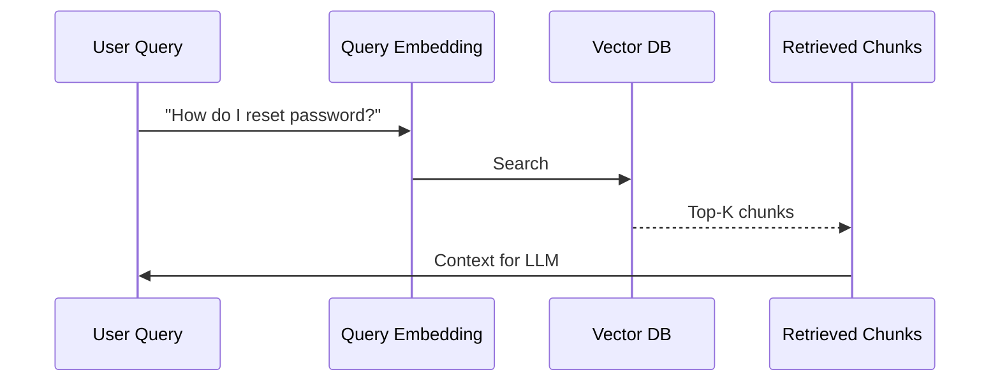
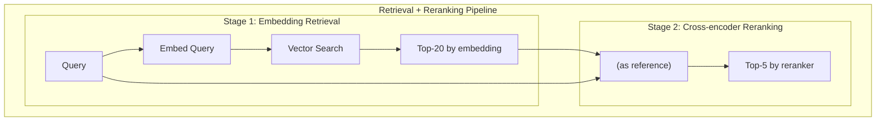
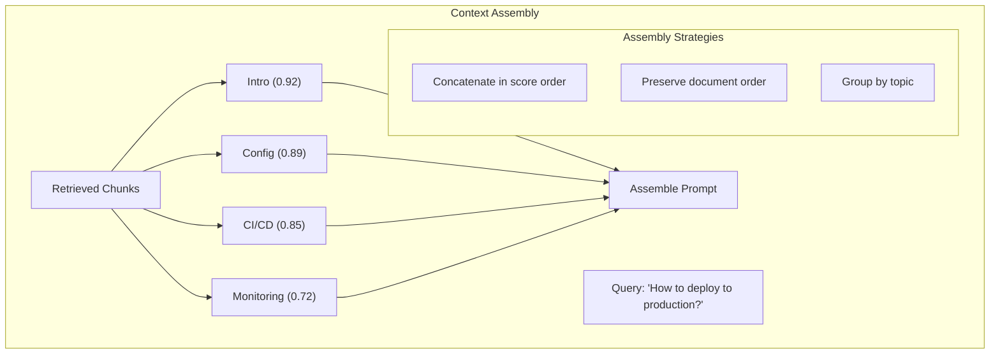
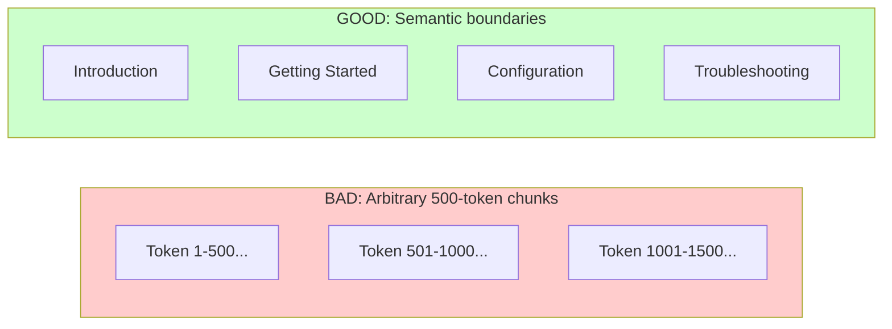
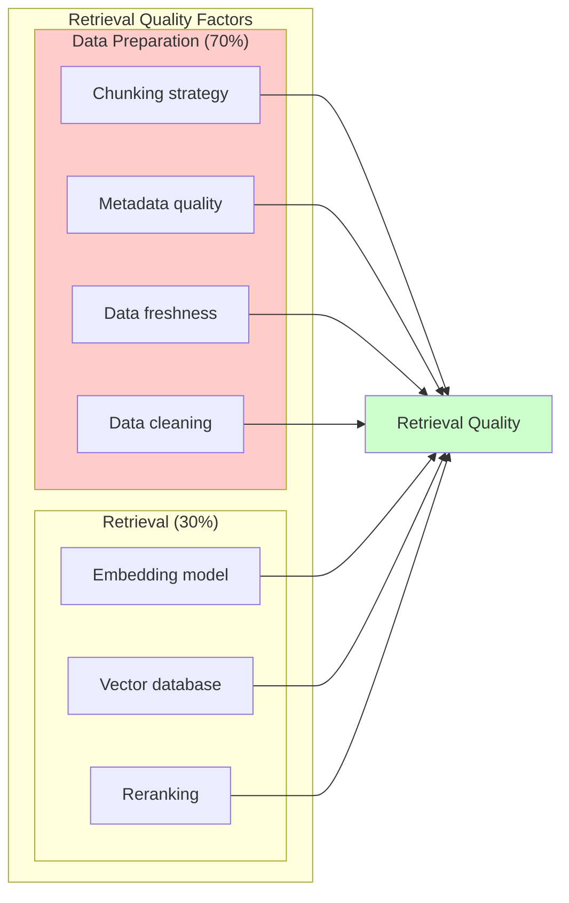

# Chunking and Retrieval Primitives

This page bridges the gap between understanding embeddings and building real retrieval systems. Learn how to split documents, retrieve relevant chunks, and assemble context for generation.

**Prerequisites for:**
- [Beginner: Lesson 4 - Retrieval, grounding, and citations](../genai-beginner/lesson-4-retrieval-grounding-and-citations.md)
- [Advanced: Lesson 4 - Knowledge systems and advanced RAG](../genai-advanced/lesson-4-knowledge-systems-and-advanced-rag.md)

---

## What Is Chunking?

Chunking is the process of splitting documents into smaller, semantically coherent pieces for embedding and retrieval.



### Why Chunk?

| Without Chunks | With Chunks |
|----------------|--------------|
| Single embedding for entire document | Focused embeddings per topic |
| Generic matches | Specific matches |
| Wasted context | Efficient context usage |

---

## Chunking Strategies

### 1. Fixed-Size Chunking

The simplest approach—split by token or character count:

```python
def chunk_by_tokens(text: str, chunk_size: int = 500, overlap: int = 50) -> list[str]:
    """Simple fixed-size token chunking."""
    tokens = text.split()  # Simplified
    chunks = []
    
    for i in range(0, len(tokens), chunk_size - overlap):
        chunk = " ".join(tokens[i:i + chunk_size])
        chunks.append(chunk)
    
    return chunks
```

**Problem:** May cut mid-sentence or mid-paragraph.

### 2. Sentence-Based Chunking

Split at sentence boundaries for coherent chunks:

```python
import re

def chunk_by_sentences(text: str, max_tokens: int = 500) -> list[str]:
    """Chunk at sentence boundaries."""
    # Split by sentence-ending punctuation
    sentences = re.split(r'(?<=[.!?])\s+', text)
    
    chunks = []
    current_chunk = []
    current_tokens = 0
    
    for sentence in sentences:
        sentence_tokens = len(sentence.split())
        
        if current_tokens + sentence_tokens > max_tokens and current_chunk:
            chunks.append(" ".join(current_chunk))
            current_chunk = [sentence]
            current_tokens = sentence_tokens
        else:
            current_chunk.append(sentence)
            current_tokens += sentence_tokens
    
    if current_chunk:
        chunks.append(" ".join(current_chunk))
    
    return chunks
```

### 3. Paragraph-Based Chunking

Split at paragraph breaks for semantic coherence:

```python
def chunk_by_paragraphs(text: str, max_tokens: int = 500) -> list[str]:
    """Chunk at paragraph boundaries."""
    paragraphs = text.split("\n\n")
    
    chunks = []
    current = []
    current_tokens = 0
    
    for para in paragraphs:
        para_tokens = len(para.split())
        
        if current_tokens + para_tokens > max_tokens and current:
            chunks.append("\n\n".join(current))
            current = [para]
            current_tokens = para_tokens
        else:
            current.append(para)
            current_tokens += para_tokens
    
    if current:
        chunks.append("\n\n".join(current))
    
    return chunks
```

### 4. Semantic Chunking

Use embeddings to find natural topic boundaries:

```python
def semantic_chunk(text: str, embedding_model, threshold: float = 0.7) -> list[str]:
    """Split at semantic boundaries using embeddings."""
    sentences = split_into_sentences(text)
    
    if len(sentences) <= 2:
        return [" ".join(sentences)]
    
    chunks = []
    current_chunk = [sentences[0]]
    
    for i in range(1, len(sentences)):
        # Check similarity between consecutive sentences
        prev_emb = embedding_model.embed(current_chunk[-1])
        curr_emb = embedding_model.embed(sentences[i])
        
        similarity = embedding_model.cosine_similarity(prev_emb, curr_emb)
        
        if similarity < threshold:
            # New topic - start new chunk
            chunks.append(" ".join(current_chunk))
            current_chunk = [sentences[i]]
        else:
            current_chunk.append(sentences[i])
    
    if current_chunk:
        chunks.append(" ".join(current_chunk))
    
    return chunks
```

---

## Chunk Size Tradeoffs

| Chunk Size | Pros | Cons | Best For |
|------------|------|------|----------|
| **Small (100-200 tokens)** | Precise retrieval, less noise | May lose context | Factual Q&A |
| **Medium (300-500 tokens)** | Balanced | Mid-sentence cuts possible | General Q&A |
| **Large (500-1000 tokens)** | Preserves context | Less precise, more noise | Summarization |
| **Very large (1000+ tokens)** | Full context | Lower quality per chunk | Long documents |



### Recommended Sizes by Use Case

| Use Case | Recommended Size | Overlap |
|----------|-----------------|---------|
| Q&A on specific facts | 200-500 tokens | 50-100 tokens |
| Document summarization | 500-1000 tokens | 100-200 tokens |
| Code understanding | Function/class boundaries | 0-50 tokens |
| Chat with conversation | 1000-2000 tokens | 200-400 tokens |
| Legal document review | 500-800 tokens | 50-100 tokens |

---

## Overlap Strategy

Overlap ensures context isn't lost at chunk boundaries:



```python
def chunk_with_overlap(
    text: str,
    chunk_size: int = 500,
    overlap: int = 50
) -> list[dict]:
    """Create overlapping chunks with source tracking."""
    tokens = text.split()
    chunks = []
    
    for i in range(0, len(tokens), chunk_size - overlap):
        chunk_tokens = tokens[i:i + chunk_size]
        chunk_text = " ".join(chunk_tokens)
        
        chunks.append({
            "text": chunk_text,
            "start_token": i,
            "end_token": i + len(chunk_tokens),
            "chunk_id": f"chunk_{len(chunks)}"
        })
    
    return chunks
```

---

## Metadata, Citations, and Source Tracking

Every chunk should carry metadata for citation and filtering:

```python
from dataclasses import dataclass
from typing import Optional
from datetime import datetime

@dataclass
class DocumentChunk:
    chunk_id: str
    document_id: str
    content: str
    
    # Source information
    source: str
    page_number: Optional[int] = None
    section_title: Optional[str] = None
    
    # Processing metadata
    chunk_index: int
    total_chunks: int
    
    # Temporal metadata
    created_at: datetime = None
    updated_at: datetime = None
    
    # Filtering metadata
    category: Optional[str] = None
    tags: list[str] = None
    author: Optional[str] = None
    
    # Quality metadata
    embedding_version: str = "1.0"
    processing_notes: Optional[str] = None
```

### Why Metadata Matters



---

## Query vs. Document Embeddings

| Type | Purpose | Storage |
|------|---------|---------|
| **Query embedding** | Represents the user's question | Computed at runtime |
| **Document embedding** | Represents each chunk | Pre-computed and stored |



### Why Separate Embeddings?

- Queries are short (user questions)
- Documents are longer (chunked content)
- Different optimal embeddings exist
- Cross-encoders can improve ranking

---

## Top-k Retrieval

The simplest retrieval strategy: find the k most similar chunks:

```python
def retrieve_top_k(
    query: str,
    chunks: list[DocumentChunk],
    embedding_model,
    vector_store,
    top_k: int = 5
) -> list[dict]:
    """Simple top-k retrieval."""
    
    # Embed query
    query_vector = embedding_model.embed(query)
    
    # Search vector store
    results = vector_store.search(
        vector=query_vector,
        top_k=top_k
    )
    
    # Format results
    return [
        {
            "content": r.payload["content"],
            "source": r.payload["source"],
            "chunk_id": r.id,
            "score": r.score
        }
        for r in results
    ]
```

### Retrieval Quality Metrics

| Metric | Formula | Target |
|--------|---------|--------|
| **Recall** | Relevant retrieved / Total relevant | > 0.9 |
| **Precision** | Relevant retrieved / Retrieved | > 0.7 |
| **MRR** | 1 / rank of first relevant | > 0.8 |

---

## Reranking: Improving Retrieval Quality

Top-k with embeddings can miss contextually relevant results. **Reranking** uses a more expensive model to reorder results:



### Why Rerank?

| Problem | Embedding Retrieval | With Reranking |
|---------|-------------------|-----------------|
| Misses semantic matches | Can happen | Better |
| Slow for large corpora | Fast | Slower |
| Handles exact matches | Poor | Excellent |
| Cost | Low | Higher |

### Implementation

```python
from sentence_transformers import CrossEncoder

# Initialize reranker
reranker = CrossEncoder("cross-encoder/ms-marco-MiniLM-L-6-v2")

def retrieve_with_rerank(
    query: str,
    chunks: list[DocumentChunk],
    embedding_model,
    vector_store,
    initial_k: int = 20,
    final_k: int = 5
) -> list[dict]:
    """Retrieve with cross-encoder reranking."""
    
    # 1. Initial embedding-based retrieval
    query_vector = embedding_model.embed(query)
    initial_results = vector_store.search(query_vector, top_k=initial_k)
    
    # 2. Prepare pairs for reranking
    pairs = [
        (query, chunk.content) 
        for chunk in [r.payload for r in initial_results]
    ]
    
    # 3. Rerank with cross-encoder
    scores = reranker.predict(pairs)
    
    # 4. Combine and sort
    scored_results = [
        {**r, "rerank_score": s}
        for r, s in zip(initial_results, scores)
    ]
    scored_results.sort(key=lambda x: x["rerank_score"], reverse=True)
    
    return scored_results[:final_k]
```

---

## Context Assembly

Retrieving chunks is only part of the solution. You need to assemble them into coherent context:



### Assembly Strategies

| Strategy | When to Use | Implementation |
|---------|------------|-----------------|
| **Score order** | Best results are clearly top | Sort by retrieval score |
| **Document order** | Sequence matters | Sort by source document |
| **By sub-question** | Complex multi-part queries | Group chunks per sub-question |
| **Summary + full** | Very large retrieved set | Summarize top, use full |

### Implementation

```python
def assemble_context(
    query: str,
    chunks: list[DocumentChunk],
    strategy: str = "score_order",
    max_tokens: int = 4000
) -> dict:
    """Assemble retrieved chunks into prompt context."""
    
    match strategy:
        case "score_order":
            sorted_chunks = sorted(chunks, key=lambda x: x["score"], reverse=True)
        
        case "document_order":
            sorted_chunks = sorted(chunks, key=lambda x: (x["source"], x["chunk_index"]))
        
        case "by_topic":
            # Group by topic/section
            sorted_chunks = group_by_topic(chunks)
    
    # Build context with citations
    context_parts = []
    total_tokens = 0
    
    for chunk in sorted_chunks:
        chunk_tokens = len(chunk["content"].split())
        
        if total_tokens + chunk_tokens > max_tokens:
            break
        
        context_parts.append(
            f"[Source: {chunk['source']}]\n{chunk['content']}"
        )
        total_tokens += chunk_tokens
    
    return {
        "context": "\n\n---\n\n".join(context_parts),
        "sources": list(set(c["source"] for c in chunks[:len(context_parts)])),
        "tokens_used": total_tokens
    }
```

---

## Common Failure Modes

### 1. Chunks Cut Mid-Thought

```python
# BAD: Mid-sentence boundary
chunk = """
The agent will route the customer to the billing department because their 
account has an outstanding balance that
"""  # What happens "that"? Cut off!

# GOOD: Full thought preserved
chunk = """
The agent will route the customer to the billing department because their 
account has an outstanding balance.
"""
```

### 2. Losing Important Metadata

```python
# BAD: No source tracking
chunk = "The configuration value should be set to 'production'."

# GOOD: Full context preserved
chunk = {
    "content": "The configuration value should be set to 'production'.",
    "source": "docs/api-reference.md",
    "section": "Environment Variables",
    "page": 42,
    "last_updated": "2024-01-15"
}
```

### 3. Ignoring Semantic Boundaries



### 4. Retrieval Quality Is a Data Preparation Problem



Even the best retrieval algorithm can't compensate for poorly prepared documents. Investment in data preparation typically yields better returns than algorithm tuning.

---

## Complete Retrieval Implementation

```python
from dataclasses import dataclass
from typing import Optional

@dataclass
class RetrievalResult:
    content: str
    source: str
    score: float
    chunk_id: str

class RAGRetriever:
    def __init__(
        self,
        embedding_model,
        vector_store,
        reranker: Optional = None
    ):
        self.embedding_model = embedding_model
        self.vector_store = vector_store
        self.reranker = reranker
    
    def retrieve(
        self,
        query: str,
        top_k: int = 5,
        use_rerank: bool = True,
        max_context_tokens: int = 4000
    ) -> dict:
        """Complete retrieval pipeline."""
        
        # 1. Embed query
        query_vector = self.embedding_model.embed(query)
        
        # 2. Initial retrieval
        initial_k = 20 if use_rerank else top_k
        results = self.vector_store.search(query_vector, top_k=initial_k)
        
        # 3. Rerank if enabled
        if use_rerank and self.reranker:
            pairs = [(query, r.payload["content"]) for r in results]
            scores = self.reranker.predict(pairs)
            
            for r, s in zip(results, scores):
                r.score = s
            
            results.sort(key=lambda x: x.score, reverse=True)
            results = results[:top_k]
        
        # 4. Assemble context
        return self._assemble_context(results, max_context_tokens)
    
    def _assemble_context(
        self,
        results: list,
        max_tokens: int
    ) -> dict:
        context_parts = []
        sources = set()
        total_tokens = 0
        
        for r in results:
            chunk_tokens = len(r.payload["content"].split())
            
            if total_tokens + chunk_tokens > max_tokens:
                break
            
            context_parts.append(
                f"[Source: {r.payload['source']}]\n{r.payload['content']}"
            )
            sources.add(r.payload["source"])
            total_tokens += chunk_tokens
        
        return {
            "context": "\n\n---\n\n".join(context_parts),
            "sources": list(sources),
            "chunk_count": len(context_parts),
            "tokens_used": total_tokens
        }
```

---

## Key Takeaways

1. **Chunk size affects precision vs. context** — Smaller chunks are more targeted; larger preserve context.

2. **Chunk boundaries matter** — End at sentence or paragraph boundaries, never mid-thought.

3. **Overlap prevents context loss** — Small overlap ensures information isn't lost at boundaries.

4. **Metadata enables citation and filtering** — Always store source, page, and relevant metadata.

5. **Reranking improves precision** — Cross-encoder reranking reorders embedding results for better accuracy.

6. **Context assembly affects generation** — How you combine chunks affects output quality.

7. **Data preparation is 70% of retrieval quality** — Better chunks beat better algorithms.

---

## What You Learned

- Chunking strategies: fixed-size, sentence-based, paragraph-based, semantic
- Chunk size tradeoffs and recommended sizes by use case
- Overlap strategy to prevent context loss
- Metadata and citation tracking for retrieval results
- Top-k retrieval with optional cross-encoder reranking
- Context assembly strategies and token budgeting
- Common failure modes and why data preparation matters more than algorithms

---

## Prerequisites Map

This page supports these lessons:

| Course | Lesson | Dependency |
|--------|--------|------------|
| Beginner | Lesson 4: Retrieval, grounding, and citations | Full page |
| Advanced | Lesson 4: Advanced RAG | Full page |

---

## Next Step

Continue to [Prompt and output patterns cheatsheet](./prompt-and-output-patterns-cheatsheet.md) for reusable patterns for both courses.

Or jump directly to a course:

- [Beginner: Lesson 2 - Prompting and structured outputs](../genai-beginner/lesson-2-prompting-context-and-structured-outputs.md)
- [Beginner: Lesson 4 - Retrieval, grounding, and citations](../genai-beginner/lesson-4-retrieval-grounding-and-citations.md)
