# Embeddings and Similarity

Embeddings are how we convert text into numbers that computers can compare and reason about. This page covers the practical concepts you need for building retrieval systems.

**Prerequisites for:**
- [Beginner: Lesson 4 - Retrieval, grounding, and citations](../genai-beginner/lesson-4-retrieval-grounding-and-citations.md)
- [Advanced: Lesson 4 - Knowledge systems and advanced RAG](../genai-advanced/lesson-4-knowledge-systems-and-advanced-rag.md)

---

## What Are Embeddings?

An embedding is a vector (list of numbers, typically 384 to 3072 dimensions) that represents the meaning of text. Similar texts have similar vectors.

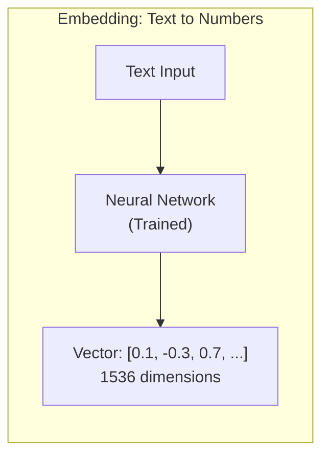

### Why Embeddings Matter

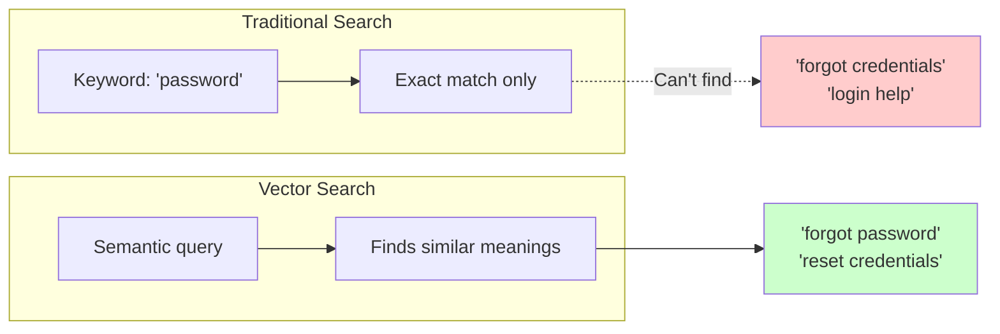

Traditional keyword search only finds exact matches. Vector search finds *semantically similar* content.

### Embedding Examples

```mermaid
flowchart TB
    subgraph Examples["Embedding Space"]
        subgraph Query["Query"]
            Q["'How do I reset my password?'"]
        end
        
        subgraph Close["Close Vectors (High Similarity)"]
            C1["'I forgot my login credentials'"]
            C2["'Click forgot password to reset'"]
        end
        
        subgraph Far["Far Vectors (Low Similarity)"]
            F1["'What is the weather?'"]
            F2["'Buy groceries online'"]
        end
    end
    
    Q -.-> |"High"| C1
    Q -.-> |"High"| C2
    Q -.x |"Low"| F1
    Q -.x |"Low"| F2
    
    style Close fill:#ccffcc
    style Far fill:#ffcccc
```

---

## How Embeddings Work

### The Embedding Process

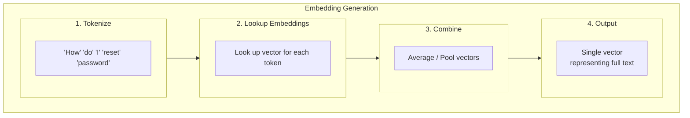

### Common Embedding Models

| Model | Dimensions | Cost | Best For |
|-------|-----------|------|----------|
| OpenAI `text-embedding-3-small` | 1536 | Low | General purpose, cost-sensitive |
| OpenAI `text-embedding-3-large` | 3072 | Medium | Higher accuracy needs |
| OpenAI `text-embedding-ada-002` | 1536 | Lowest | Legacy compatibility |
| Cohere `embed-english-v3.0` | 1024 | Medium | English text |
| Cohere `embed-multilingual-v3.0` | 1024 | Medium | Multi-language |
| sentence-transformers `all-MiniLM-L6-v2` | 384 | Free (open-source) | Local/privacy-sensitive |
| Google `text-embedding-004` | 768 | Medium | Vertex AI users |

### Embedding Generation in Code

```python
from agentflow.core.embedding import EmbeddingModel

# Initialize embedding model
embedding_model = EmbeddingModel("text-embedding-3-small")

# Generate embeddings
query = "How do I reset my password?"
doc = "Click 'Forgot Password' to reset your credentials"

query_vector = embedding_model.embed(query)
doc_vector = embedding_model.embed(doc)

# Compute similarity
similarity = embedding_model.cosine_similarity(query_vector, doc_vector)
print(f"Similarity: {similarity:.2f}")  # e.g., 0.89
```

### Embedding Output

```python
# What an embedding looks like
embedding = embedding_model.embed("Hello, world!")

print(f"Type: {type(embedding)}")  # numpy array
print(f"Shape: {embedding.shape}")  # (1536,)
print(f"Sample values: {embedding[:5]}")  # First 5 values
# Output: [-0.002  0.004 -0.001  0.023 -0.008]
```

---

## Semantic Similarity

Semantic similarity measures how related two pieces of text are in *meaning*, not just word overlap.

### Why Semantic > Keyword

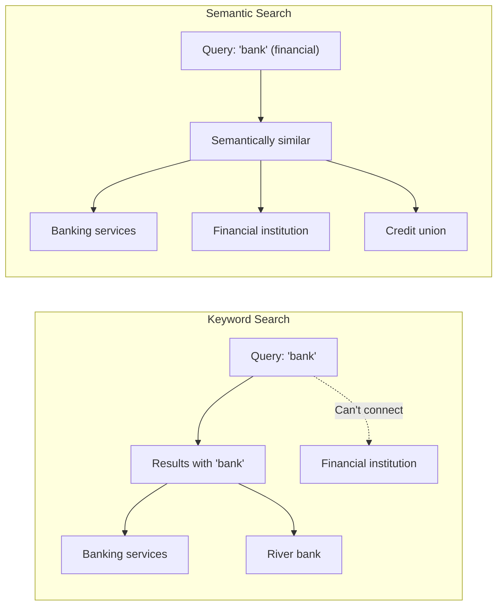

### Similarity Examples

| Text A | Text B | Similarity | Why |
|--------|--------|-----------|-----|
| "How to reset password" | "Click forgot password link" | 0.89 | Same concept |
| "How to reset password" | "Weather forecast" | 0.12 | Different topics |
| "The cat sat on mat" | "A feline rested on carpet" | 0.85 | Paraphrase |
| "I love pizza" | "I enjoy Italian food" | 0.78 | Related concept |
| "Call the doctor" | "Phone medical professional" | 0.82 | Synonyms |

---

## Cosine Similarity Explained

**Cosine similarity** measures the angle between two vectors. Values range from -1 to 1:

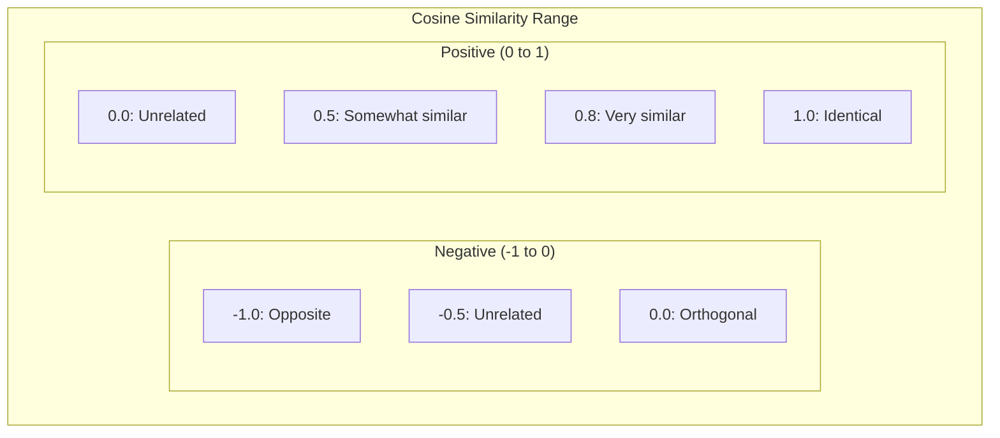

### The Math (Visualized)

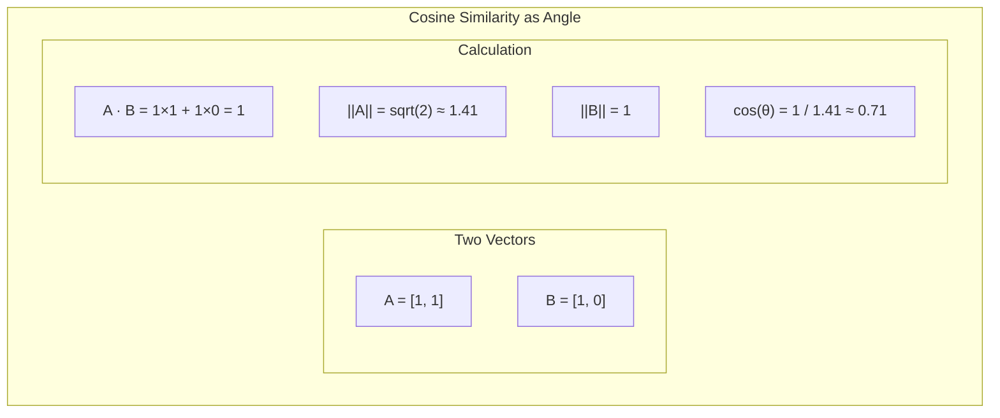

### Formula

```
similarity = (A · B) / (||A|| × ||B||)
```

Where:
- `A · B` = dot product of vectors
- `||A||` = magnitude of A (length)
- `||B||` = magnitude of B (length)

### Intuition

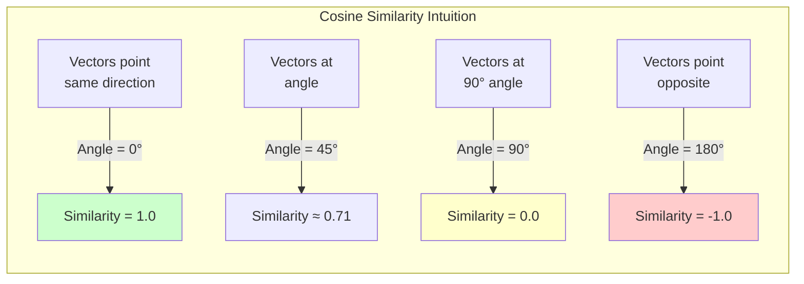

---

## Vector Storage and Databases

### Vector Databases

Vector databases are specialized databases optimized for storing and searching embeddings:

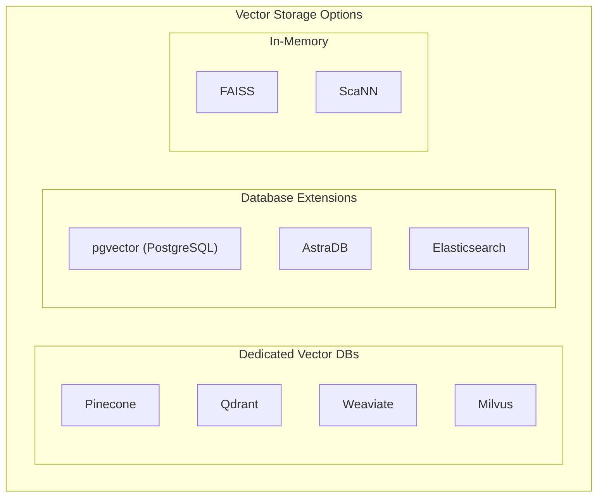

### When to Use Each

| Option | Best For | Scalability | Cost |
|--------|----------|-------------|------|
| **Pinecone** | Managed cloud service | High | Pay-per-use |
| **Qdrant** | Self-hosted or cloud | High | Free (self-hosted) |
| **pgvector** | Already using PostgreSQL | Medium | Included with PG |
| **FAISS** | Offline/batch processing | High | Free |
| **In-memory** | Small datasets, testing | Low | Free |

### AgentFlow Integration

```python
from agentflow.storage.store import QdrantStore
from agentflow.core.embedding import OpenAIEmbedding

# Initialize
embedding_model = OpenAIEmbedding("text-embedding-3-small")
vector_store = QdrantStore(collection_name="knowledge_base")

# Add documents
documents = [
    "How to reset your password",
    "Click 'Forgot Password' on the login page",
    "Contact support for account issues"
]

for i, doc in enumerate(documents):
    vector = embedding_model.embed(doc)
    vector_store.add(
        id=f"doc_{i}",
        vector=vector,
        payload={"text": doc}
    )

# Search
query_vector = embedding_model.embed("I forgot my login")
results = vector_store.search(vector=query_vector, top_k=2)
```

---

## Nearest-Neighbor Retrieval

In vector search, we find the k nearest neighbors to a query vector:

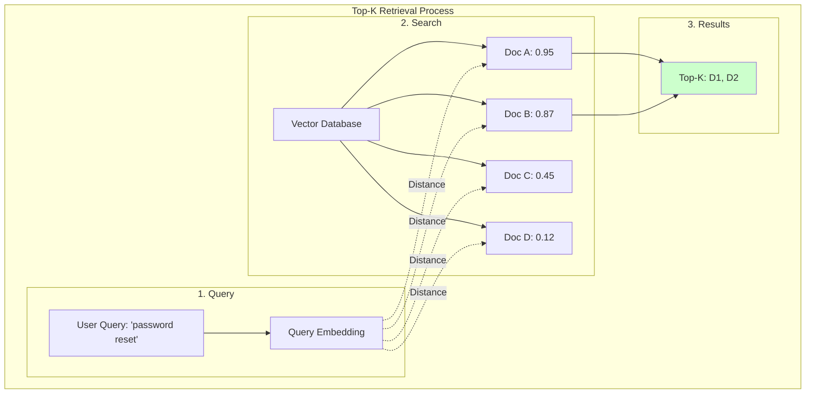

### Implementation

```python
def retrieve_top_k(
    query: str,
    documents: list[str],
    embedding_model,
    top_k: int = 5
) -> list[dict]:
    """Retrieve top-k similar documents."""
    
    # 1. Embed the query
    query_vector = embedding_model.embed(query)
    
    # 2. Score all documents
    scored = []
    for doc in documents:
        doc_vector = embedding_model.embed(doc)
        score = embedding_model.cosine_similarity(query_vector, doc_vector)
        scored.append({"text": doc, "score": score})
    
    # 3. Sort and return top-k
    scored.sort(key=lambda x: x["score"], reverse=True)
    return scored[:top_k]

# Usage
results = retrieve_top_k(
    query="password reset help",
    documents=[
        "How to reset your password",
        "Weather forecast for today",
        "Forgot password flow",
        "Configure email notifications"
    ],
    embedding_model=embedding_model,
    top_k=2
)

# Returns:
# [
#   {"text": "Forgot password flow", "score": 0.92},
#   {"text": "How to reset your password", "score": 0.89}
# ]
```

---

## Limits of Embeddings

Embeddings are powerful but have limitations:

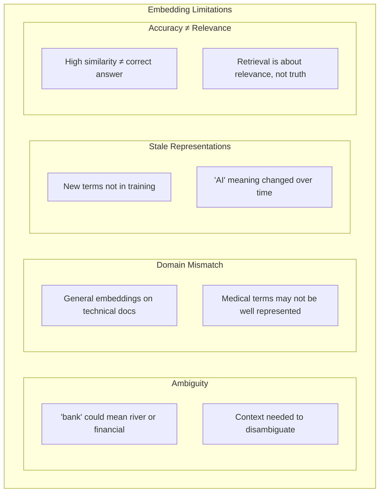

### ⚠️ Critical Warning: High Similarity ≠ Factual Correctness

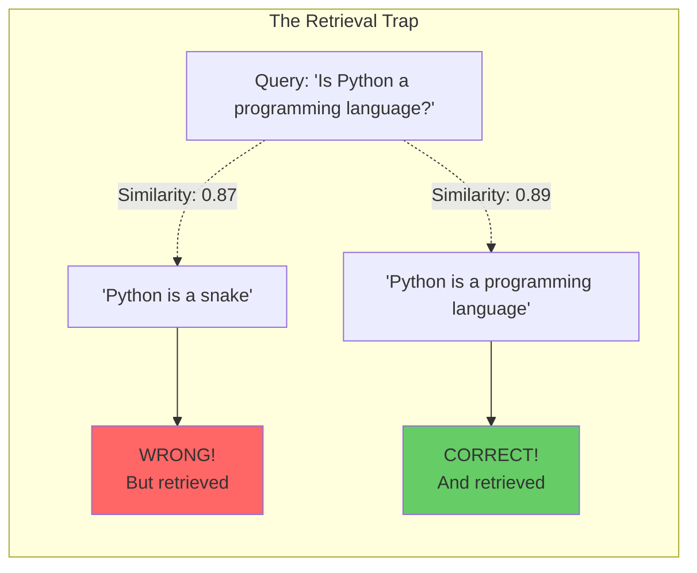

Both documents have similar high similarity scores, but only one is correct. **Retrieval finds related content; verification is still required.**

### Mitigation Strategies

| Limitation | Mitigation |
|-----------|-----------|
| **Ambiguity** | Use context in query, rerank with cross-encoder |
| **Domain mismatch** | Fine-tune embeddings or use domain-specific models |
| **Stale representations** | Refresh embeddings periodically |
| **Accuracy ≠ relevance** | Always cite sources, validate facts |

---

## Cosine Similarity vs Cosine Distance

| Term | Definition | Range | Use Case |
|------|-----------|-------|----------|
| **Cosine Similarity** | How alike vectors are | -1 to 1 | Higher = more similar |
| **Cosine Distance** | How different vectors are | 0 to 2 | Lower = more similar |

```
cosine_distance = 1 - cosine_similarity
```

```python
similarity = 0.9
distance = 1 - similarity  # 0.1

# Most vector DBs expose similarity, not distance
# But internally use distance for ranking
```

---

## Hybrid Search: Combining Keyword + Vector

Vector search finds semantic matches but can miss exact keyword matches. Hybrid search combines both:

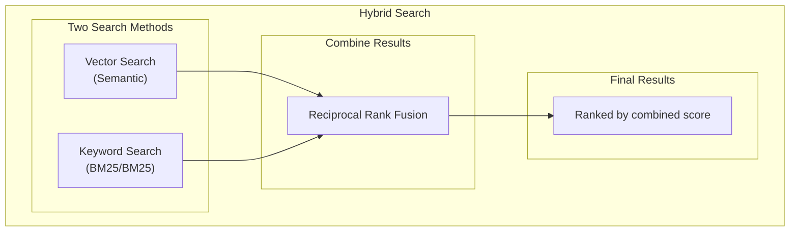

### Implementation

```python
def hybrid_search(
    query: str,
    vector_store,
    embedding_model,
    top_k: int = 10
) -> list[dict]:
    # 1. Vector search
    query_vector = embedding_model.embed(query)
    vector_results = vector_store.search(query_vector, top_k * 2)
    
    # 2. Keyword search (simplified with in-memory)
    keyword_scores = bm25_search(query, documents)
    
    # 3. Reciprocal Rank Fusion
    combined_scores = {}
    
    for rank, result in enumerate(vector_results):
        doc_id = result["id"]
        combined_scores[doc_id] = combined_scores.get(doc_id, 0) + (1 / (60 + rank))
    
    for rank, (doc_id, score) in enumerate(keyword_scores.items()):
        combined_scores[doc_id] = combined_scores.get(doc_id, 0) + (1 / (60 + rank))
    
    # 4. Sort by combined score
    ranked = sorted(combined_scores.items(), key=lambda x: x[1], reverse=True)
    
    return ranked[:top_k]
```

---

## Key Takeaways

1. **Embeddings are semantic vectors** — Similar meaning produces similar vectors in high-dimensional space.

2. **Cosine similarity measures closeness** — Values near 1.0 mean related content; near 0 means unrelated.

3. **Nearest-neighbor retrieval finds relevant documents** — Sort by similarity, return top-k.

4. **Vector databases enable efficient search** — Specialized for storing and searching millions of vectors.

5. **High similarity ≠ factual correctness** — Retrieval finds related content; you must still verify accuracy.

6. **Hybrid search improves recall** — Combining keyword and vector search catches more relevant results.

---

## What You Learned

- Embeddings convert text to semantic vectors in high-dimensional space
- Cosine similarity measures the angle between vectors (higher = more similar)
- Nearest-neighbor retrieval finds semantically similar content
- Vector databases enable efficient storage and search
- Retrieval quality depends on both embeddings and source data quality
- High similarity doesn't guarantee factual correctness

---

## Prerequisites Map

This page supports these lessons:

| Course | Lesson | Dependency |
|--------|--------|------------|
| Beginner | Lesson 4: Retrieval, grounding, and citations | Full page |
| Advanced | Lesson 4: Advanced RAG | Full page |
| Advanced | Lesson 3: Context engineering | Embedding costs |

---

## Next Step

Continue to [Chunking and retrieval primitives](./chunking-and-retrieval-primitives.md) to learn how to prepare documents for retrieval.

Or jump directly to a course:

- [Beginner: Lesson 4 - Retrieval, grounding, and citations](../genai-beginner/lesson-4-retrieval-grounding-and-citations.md)
- [Advanced: Lesson 4 - Knowledge systems and advanced RAG](../genai-advanced/lesson-4-knowledge-systems-and-advanced-rag.md)
