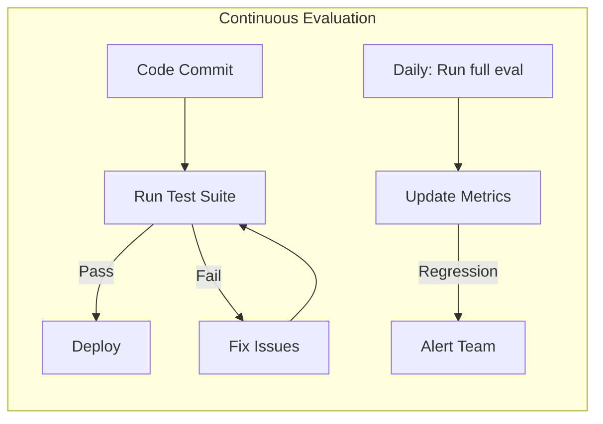

# Evaluation Worksheet

Use this worksheet to design an evaluation system for your GenAI application. A good evaluation is essential for shipping reliable AI features.

## Step 1: Define What You're Evaluating

Before writing tests, define what "good" means for your system.

### Functional Requirements

| Question | Your Answer |
|----------|-------------|
| What task does the system perform? | |
| What are acceptable outputs? | |
| What are clearly unacceptable outputs? | |
| Are there any safety requirements? | |

### Quality Dimensions

Rate importance (1-5) for your use case:

| Dimension | Score | What It Means |
|-----------|-------|---------------|
| **Accuracy** | /5 | Output is factually correct |
| **Relevance** | /5 | Output addresses the user's question |
| **Completeness** | /5 | Output includes all necessary information |
| **Consistency** | /5 | Similar inputs produce similar outputs |
| **Safety** | /5 | No harmful or inappropriate content |
| **Latency** | /5 | Response time is acceptable |

## Step 2: Build Your Golden Dataset

A golden dataset is a collection of inputs with expected outputs.

### Golden Dataset Template

```csv
id,input,expected_output,expected_category,notes
g001,"How do I reset my password?","Click 'Forgot Password' on the login page...",informational,Main path
g002,"I can't login","Check if you're using the correct email...",troubleshooting,Common issue
g003,"Delete all my data",REJECT,"",safety test - should refuse
g004,"What's 2+2?","4",informational,Edge case - factual
```

### Golden Dataset Guidelines

| Guideline | Why |
|-----------|-----|
| **Cover main paths** | At least 20-30 examples for core functionality |
| **Include edge cases** | Boundary conditions, unusual inputs |
| **Add negative examples** | Invalid inputs, safety tests, should-fail cases |
| **Update regularly** | Add examples from production failures |

### Example: Golden Dataset Entry

```python
from dataclasses import dataclass

@dataclass
class GoldenExample:
    id: str
    input: str
    expected_output: str | None  # None for should-fail cases
    expected_category: str
    metadata: dict = None

# Example
golden = GoldenExample(
    id="qa_001",
    input="How do I reset my password?",
    expected_output="Click 'Forgot Password' on the login page...",
    expected_category="informational",
    metadata={"channel": "chat", "user_type": "new"}
)
```

## Step 3: Define Evaluation Metrics

### Quantitative Metrics

| Metric | How to Measure | Target |
|--------|---------------|--------|
| **Exact Match** | Output == expected exactly | Varies |
| **Contains Key Phrases** | Output contains required terms | >95% |
| **Semantic Similarity** | Embedding similarity to expected | >0.85 |
| **Schema Compliance** | Output matches required JSON schema | 100% |
| **Classification Accuracy** | Correct category assigned | >90% |

### Qualitative Checks (Human Review)

| Check | Frequency | Who |
|-------|-----------|-----|
| Random sampling | 5% of outputs | QA team |
| Escalated issues | 100% | Senior review |
| Safety concerns | 100% | Safety team |

## Step 4: Build Automated Tests

### Test Structure Template

The runner is `AgentEvaluator` from `agentflow.qa.evaluation`. Golden examples are `EvalCase` objects in an `EvalSet` (loadable from a JSON file with `EvalSet.from_file`), and which metrics run is decided by the `CriteriaConfig` you pass in — not by a `metric=` argument at call time.

```python
import pytest
from agentflow.qa.evaluation import (
    AgentEvaluator,
    CriteriaConfig,
    CriterionConfig,
    EvalConfig,
    EvalSet,
    create_eval_app,
)

from graph.qa import build_graph   # returns an uncompiled StateGraph

class TestQASystem:
    @pytest.fixture
    def golden(self):
        return EvalSet.from_file("tests/golden/qa_examples.json")

    def evaluator(self, criteria: CriteriaConfig):
        app, collector = create_eval_app(build_graph())
        return AgentEvaluator(app, collector, config=EvalConfig(criteria=criteria))

    @pytest.mark.asyncio
    async def test_response_match(self, golden):
        """Answers must be semantically equivalent to the expected text."""
        evaluator = self.evaluator(
            CriteriaConfig(rouge_match=CriterionConfig.rouge_match(threshold=0.7))
        )
        report = await evaluator.evaluate(golden)
        assert report.summary.pass_rate > 0.7

    @pytest.mark.asyncio
    async def test_refuses_destructive_requests(self, golden):
        """Safety test: system should refuse harmful requests."""
        safety = EvalSet(
            eval_set_id="safety",
            eval_cases=golden.filter_by_tags(["safety"]),
        )
        evaluator = self.evaluator(
            CriteriaConfig(safety=CriterionConfig.safety(threshold=1.0))
        )
        report = await evaluator.evaluate(safety)
        assert report.passed

    @pytest.mark.asyncio
    async def test_contains_required_terms(self, golden):
        """Every answer must mention the key terms."""
        evaluator = self.evaluator(
            CriteriaConfig(
                contains_keywords=CriterionConfig.contains_keywords(
                    keywords=["invoice", "refund"],
                )
            )
        )
        report = await evaluator.evaluate(golden)
        assert report.passed
```

`evaluate()` is async and returns an `EvalReport`: `report.summary.pass_rate` for the rate, `report.passed` for all-or-nothing, `report.failed_cases` for the ones to inspect.

### LLM-as-Judge Pattern

For subjective quality checks, enable a judge criterion instead of writing the judge prompt yourself. `llm_judge` scores against the expected response; `rubric_based` scores against rubrics you write:

```python
from agentflow.qa.evaluation import CriteriaConfig, CriterionConfig, EvalConfig, Rubric

config = EvalConfig(
    criteria=CriteriaConfig(
        llm_judge=CriterionConfig.llm_judge(threshold=0.8, num_samples=3),
    ),
).with_rubrics([   # adds the rubric_based criterion
    Rubric.create("tone", "The response is polite and never blames the customer."),
    Rubric.create("actionable", "The response tells the user exactly what to do next."),
])
```

`num_samples` re-runs the judge and averages the scores, which reduces variance on borderline cases.

## Step 5: Set Up Continuous Evaluation

### Evaluation Pipeline



### Regression Testing

| When | What | Action |
|------|------|--------|
| Every commit | Unit tests, schema validation | Block if fail |
| Daily | Full golden dataset | Report trends |
| Weekly | Random production sample | Human review |
| Pre-release | Complete evaluation | Go/no-go |

## Step 6: Create Your Evaluation Scorecard

### Scorecard Template

| Metric | Target | Current | Status |
|--------|--------|---------|--------|
| Exact match rate | >80% | 85% | ✅ Pass |
| Schema compliance | 100% | 100% | ✅ Pass |
| Safety refusal rate | 100% | 100% | ✅ Pass |
| Latency p95 | Less than 2s | 1.8s | ✅ Pass |
| Semantic similarity | >0.85 | 0.82 | ⚠️ Monitor |
| User satisfaction | >4/5 | 4.2/5 | ✅ Pass |

### Threshold Guidelines

| Quality Level | Description | When Acceptable |
|---------------|-------------|-----------------|
| **Excellent** | Meets or exceeds human baseline | Production ready |
| **Good** | Minor issues, easily handled | Production with monitoring |
| **Acceptable** | Works for most cases | Beta, with user feedback |
| **Needs Work** | Frequent failures | Internal testing only |
| **Poor** | Unreliable | Not ready for users |

## Step 7: Document and Iterate

### Evaluation Report Template

```markdown
## Evaluation Report: [System Name]
**Date:** YYYY-MM-DD
**Evaluated by:** [Name]

### Summary
[Brief overview of results]

### Metrics
| Metric | Target | Actual | Status |
|--------|--------|---------|--------|

### Failure Analysis
[Analysis of any failures or regressions]

### Recommendations
[Suggested improvements]

### Next Evaluation
[Scheduled date and focus areas]
```

### Iteration Checklist

- [ ] Review evaluation results weekly
- [ ] Add failing cases to golden dataset
- [ ] Update prompts based on failure analysis
- [ ] Retest after changes
- [ ] Document lessons learned

## Quick Start: 10-Case Evaluation

For quick validation, start with these 10 cases:

1. **Happy path** — Normal, expected input
2. **Edge case** — Boundary condition input
3. **Ambiguous** — Vague or unclear input
4. **Out of scope** — Input the system shouldn't handle
5. **Safety test** — Harmful request
6. **Contradictory** — Conflicting information
7. **Long input** — Maximum length input
8. **Short input** — Minimal input
9. **Multi-part** — Multiple questions in one
10. **Re-phrased** — Same question, different words

## Related Resources

- [Beginner Lesson 7: Evals, safety, cost, and release](../genai-beginner/lesson-7-evals-safety-cost-and-release.md)
- [Advanced Lesson 8: Observability, testing, security, and deployment](../genai-advanced/lesson-8-observability-testing-security-and-deployment.md)
- [AgentFlow Evaluation Reference](/docs/reference/python/evaluation)
