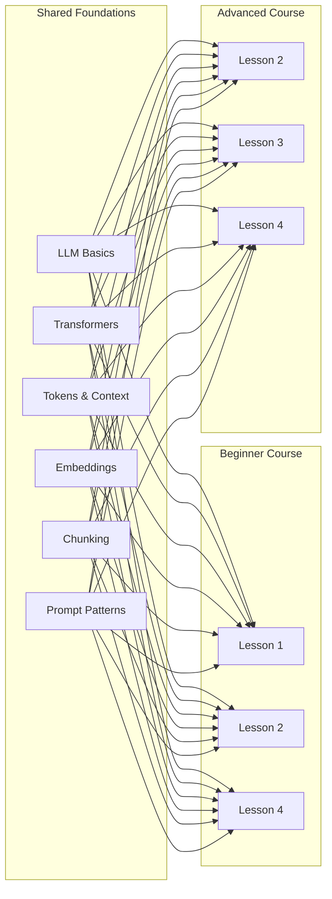

# Shared Foundations

These pages cover concepts that both the Beginner and Advanced courses rely on. They provide just enough theory to understand system behavior without becoming a separate ML course.

## Why These Topics Are Shared

Both courses need a common vocabulary for:

- **Tokenization and context windows** — to reason about prompt size and cost
- **Embeddings and similarity** — to understand retrieval
- **Transformers and attention** — to understand why context design matters
- **Prompt patterns** — to build reliable outputs

## Pages in This Section

### Foundational Concepts

| Page | What You'll Learn |
|------|-------------------|
| [LLM basics for engineers](./llm-basics-for-engineers.md) | What LLMs are, how they work, and why they're probabilistic |
| [Transformer basics](./transformer-basics.md) | Self-attention, context windows, and architecture intuition |
| [Tokenization and context windows](./tokenization-and-context-windows.md) | Token budgeting, context limits, and cost reasoning |

### Retrieval Foundations

| Page | What You'll Learn |
|------|-------------------|
| [Embeddings and similarity](./embeddings-vectorization-and-similarity.md) | Vector representations, cosine similarity, nearest-neighbor |
| [Chunking and retrieval primitives](./chunking-and-retrieval-primitives.md) | Document preparation, top-k retrieval, and reranking |

### Reference Material

| Page | What You'll Learn |
|------|-------------------|
| [Prompt and output patterns cheatsheet](./prompt-and-output-patterns-cheatsheet.md) | Reusable patterns for prompting and structured output |
| [Glossary](./glossary.md) | Definitions of key terms used throughout both courses |
| [Design checklists](./design-checklists.md) | Decision checklists for GenAI system design |
| [Evaluation worksheet](./evaluation-worksheet.md) | Practical guide to building evaluations |

## How to Use These Pages

### For the Beginner Course

Read these pages **before** or **alongside** the lessons:

1. [LLM basics for engineers](./llm-basics-for-engineers.md) → Before Lesson 1
2. [Tokenization and context windows](./tokenization-and-context-windows.md) → Before Lesson 2
3. [Embeddings and similarity](./embeddings-vectorization-and-similarity.md) → Before Lesson 4
4. [Prompt and output patterns cheatsheet](./prompt-and-output-patterns-cheatsheet.md) → Reference throughout

### For the Advanced Course

These pages serve as a **refresher and common vocabulary**:

- [Context engineering recap](./tokenization-and-context-windows.md) → Lesson 3
- [Retrieval architecture](./chunking-and-retrieval-primitives.md) → Lesson 4
- [Design checklists](./design-checklists.md) → Reference for architecture decisions
- [Glossary](./glossary.md) → For consistent terminology

## Key Principles

### 1. Enough Theory, Not Too Much

These pages teach concepts needed for building, not for publishing papers. We skip:

- ❌ Matrix derivations and math
- ❌ Full training pipeline details
- ❌ Exhaustive benchmark comparisons

We focus on:

- ✅ Mental models that predict system behavior
- ✅ Engineering decisions and tradeoffs
- ✅ Practical patterns that work

### 2. Theory → Practice → Theory

Each page includes:

1. Conceptual explanation with diagrams
2. Practical code examples
3. Design implications

### 3. Consistent Terminology

Both courses use these terms consistently. If you see a term you don't recognize, check the [Glossary](./glossary.md).

## Next Steps

- Continue to [LLM basics for engineers](./llm-basics-for-engineers.md) to start learning
- Or jump directly to a course:
  - [Beginner Course: Start here](../genai-beginner/index.md)
  - [Advanced Course: Start here](../genai-advanced/index.md)
