# LLM Basics for Engineers

This page gives software engineers the mental model needed to build GenAI systems. It focuses on practical understanding, not academic theory.

**Prerequisites for:**
- [Beginner: Lesson 1 - Use cases, models, and the LLM app lifecycle](../genai-beginner/lesson-1-use-cases-models-and-app-lifecycle.md)
- [Beginner: Lesson 2 - Prompting and structured outputs](../genai-beginner/lesson-2-prompting-context-and-structured-outputs.md)
- [Advanced: Lesson 1 - Agentic product fit](../genai-advanced/lesson-1-agentic-product-fit-and-system-bounded-autonomy.md)

---

## What is an LLM?

A Large Language Model (LLM) is a neural network trained to predict the next token given all previous tokens. This task is called **next-token prediction**.

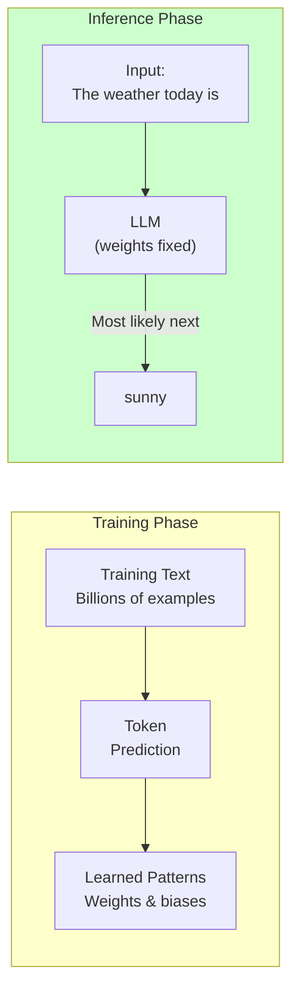

The model learns statistical patterns from billions of text examples during training. It doesn't "understand" language the way humans do—it has learned to produce outputs that are statistically likely to follow given inputs.

### Key Mental Model

Think of an LLM as an extremely sophisticated autocomplete:

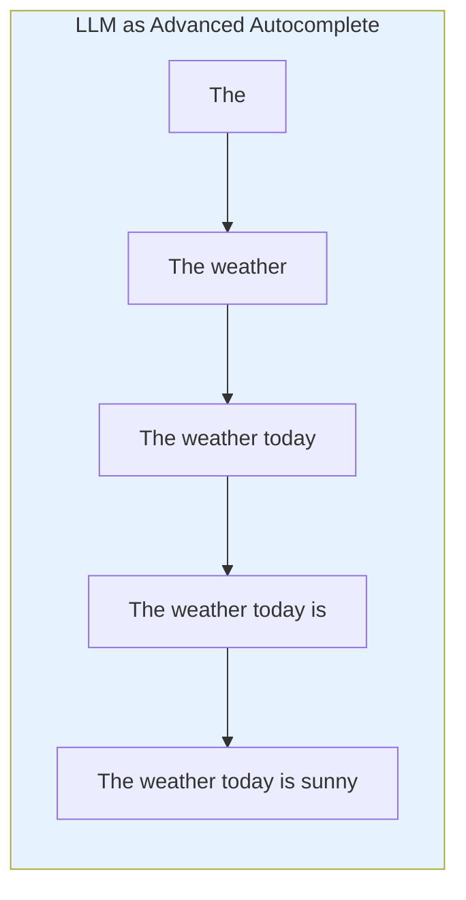

When you type "The weather today is", the model predicts what comes next based on patterns it learned. The difference from simple autocomplete is scale—LLMs consider the entire context, not just the previous few words.

---

## How LLMs Work: A Simplified View

### The Transformer Architecture

Modern LLMs use the **Transformer** architecture, which processes entire sequences in parallel using **self-attention**.

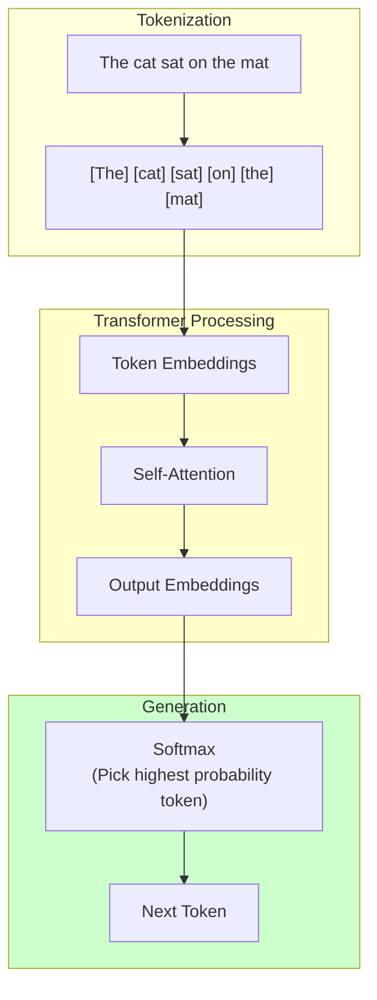

**Don't worry about the math.** You don't need to understand attention mechanics to build GenAI systems. What matters is understanding the implications:

1. **Context matters** — The model considers all input tokens when generating
2. **Probabilistic** — There's randomness in token selection
3. **Expensive** — Computation grows with sequence length

---

## Pretraining vs. Instruction Tuning

LLMs go through two main training phases:

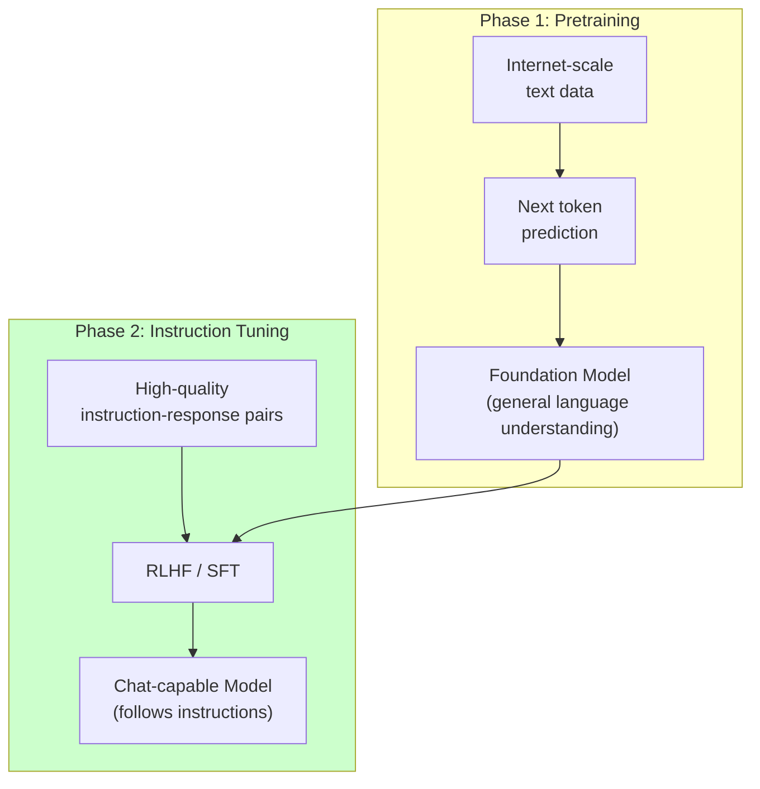

| Phase | What Happens | Result |
|-------|-------------|--------|
| **Pretraining** | Model learns language patterns from vast text | "Base model" - can complete text |
| **Instruction tuning** | Model trained on instruction-response pairs | "Instruct model" - follows directions |
| **RLHF** (optional) | Human feedback to align with preferences | Better at being helpful |

### Why This Matters for You

Most foundation models you use (GPT-4, Claude, Gemini) are instruction-tuned. They can:
- Follow explicit instructions
- Engage in multi-turn conversation
- Reason step by step when prompted

But they still behave like next-token predictors—they just have learned to make those predictions in ways that are useful for humans.

---

## Prompts, Outputs, Reasoning, and Tool Use

These are the building blocks of GenAI applications:

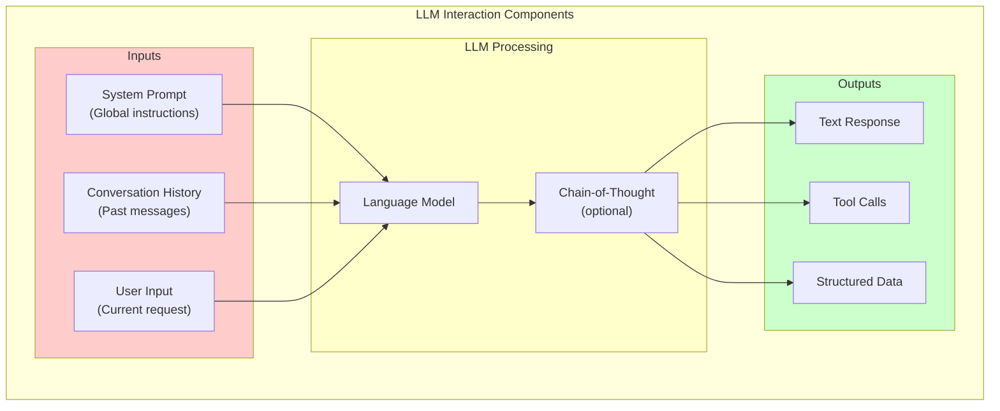

| Concept | What It Is | In Your Application |
|---------|-----------|---------------------|
| **Prompt** | Everything you send to the model | System instructions + user message + history |
| **Output** | The model's generated text | Response, analysis, or structured data |
| **Reasoning** | Internal chain of thought | Often hidden; can be exposed with chain-of-thought |
| **Tool use** | Model calling external functions | Defined by tool schemas; model decides when to call |

### System vs. User Prompts

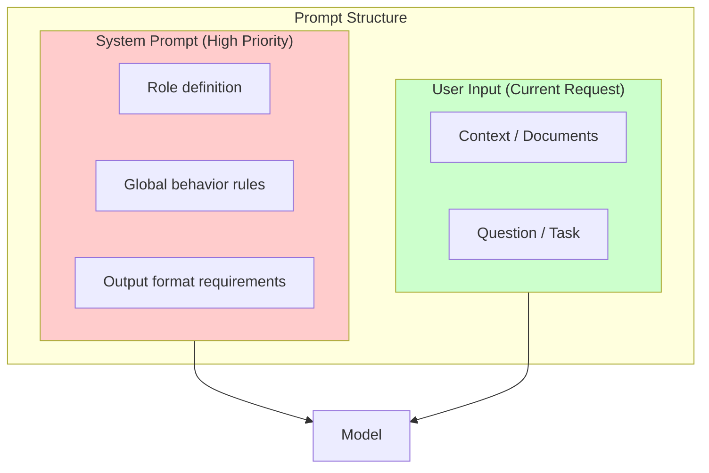

System prompts define *how* the model should behave. User prompts define *what* it should do.

---

## Why GenAI Apps Are Probabilistic

Unlike traditional software where `f(x)` always returns the same `y`, LLMs are probabilistic:

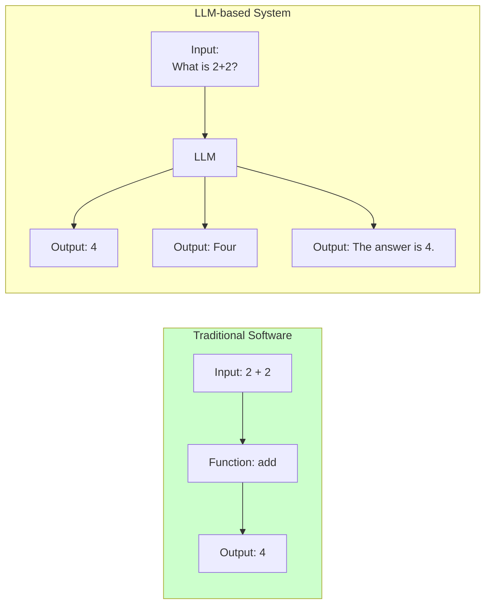

### Why Outputs Vary

| Factor | Effect |
|--------|--------|
| **Temperature setting** | Higher = more random, lower = more deterministic |
| **Random sampling** | Models sample from probability distribution |
| **Context window differences** | Slight variations in how context is processed |

### What This Means for You

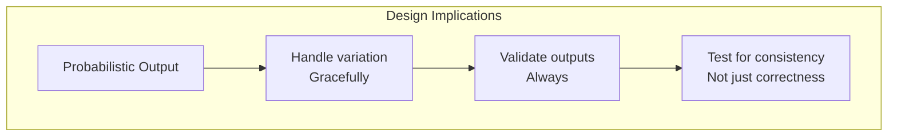

Production GenAI systems need:
1. **Output validation** — Check that outputs match expected formats
2. **Graceful degradation** — Handle unexpected outputs without crashing
3. **Retry logic** — Some failures are just bad luck
4. **Evaluation** — Measure quality, not just correctness

---

## Common Failure Modes

Understanding failure modes helps you design reliable systems:

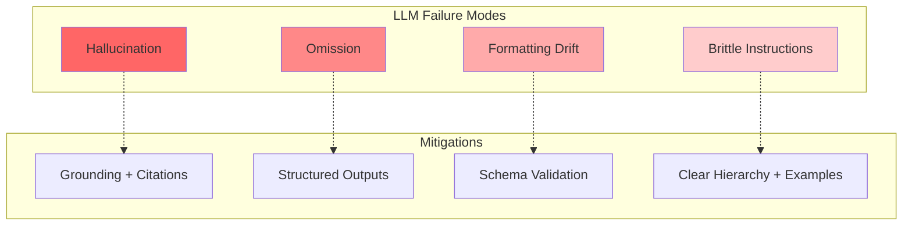

### 1. Hallucination

**What it looks like:** The model generates confident but incorrect information.

**Why it happens:** LLMs learn patterns, not facts. They predict likely text, which can include made-up details.

```python
# ❌ Without grounding - hallucination risk
prompt = """
Q: When was AgentFlow founded?
A: AgentFlow was founded in
"""
# Model might say 2023, 2024, or 2025 - it doesn't actually know

# ✅ With grounding - more reliable
prompt = """
Based on the following context, answer the question.

Context: AgentFlow is a multi-agent orchestration framework developed by 10xScale. 
The company was founded in 2024.

Q: When was AgentFlow founded?
A: According to the context, AgentFlow was founded in 2024.
"""
```

**Mitigations:**
- Retrieve from authoritative sources
- Always cite sources
- Use structured outputs for facts
- Test with known truths

### 2. Omission

**What it looks like:** The model fails to include important information in the response.

**Why it happens:** Limited context window, unclear instructions, or the model deciding something isn't relevant.

```python
# ❌ Vague request - likely omission
prompt = "Tell me about Python."
# Could cover history, syntax, libraries, or none of these

# ✅ Explicit requirements - less likely omission
prompt = """
Provide a concise overview of Python covering:
1. Primary use cases (web, data, AI)
2. Key strengths (readability, libraries)
3. Typical deployment environments

Keep response under 200 words.
"""
```

**Mitigations:**
- Be explicit about what's needed
- Use numbered lists or structured formats
- Set clear boundaries on scope
- Check for required fields in outputs

### 3. Formatting Drift

**What it looks like:** Output format varies unexpectedly between calls.

**Why it happens:** Models interpret format instructions loosely, especially with complex schemas.

```python
# ❌ Text instructions - format drift
prompt = "Return the user's name and email in JSON format."
# Could return: {"name": "...", "email": "..."}
# Or: {"Name": "...", "Email": "..."}
# Or: {"user": {"name": "...", "email": "..."}}

# ✅ Schema definition - consistent format
prompt = """
Return a JSON object with exactly this schema:
{
    "name": "string (the user's full name)",
    "email": "string (the user's email address)"
}

Do not include any other fields.
"""
```

**Mitigations:**
- Use structured outputs (JSON schemas)
- Validate outputs with schema validation
- Provide examples of expected format
- Test format consistency

### 4. Brittle Instruction Following

**What it looks like:** The model follows most instructions but fails on edge cases or unusual inputs.

**Why it happens:** Models generalize from training examples but may not apply instructions to novel situations.

```python
# ❌ Single instruction - brittle
prompt = """
Always respond in JSON format.
"""
# Works for normal inputs, but may fail on edge cases

# ✅ With examples - more robust
prompt = """
Always respond in JSON format matching this schema.

Examples:
Input: "What is your name?"
Output: {"response": "My name is a helpful assistant."}

Input: "Tell me a joke"
Output: {"response": "Why did the developer go broke? Because he used up all his cache."}

Now respond to:
{user_input}
"""
```

**Mitigations:**
- Provide few-shot examples for complex tasks
- Use clear, positive instructions (what to do, not what not to do)
- Test edge cases explicitly
- Combine with validation, not just prompting

---

## The Four Pillars of GenAI Applications

A GenAI application combines four components:

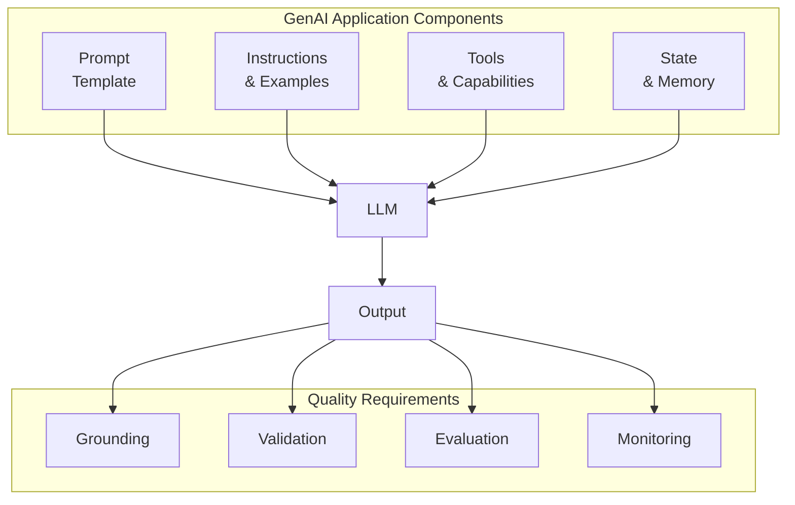

| Component | Purpose | Your Responsibility |
|-----------|---------|-------------------|
| **Prompt** | Frame the context and question | Template design, context management |
| **Instructions** | Define expected behavior | Clear hierarchy, examples |
| **Tools** | Extend capabilities beyond text | Safe tool design, clear schemas |
| **State** | Maintain conversation continuity | Checkpointing, memory management |
| **Grounding** | Ensure factual correctness | Retrieval, citations |
| **Validation** | Verify output quality | Schema validation, error handling |
| **Evaluation** | Measure system quality | Test suites, metrics |
| **Monitoring** | Track production behavior | Logging, alerting |

---

## Production Readiness Checklist

Before deploying a GenAI system, verify:

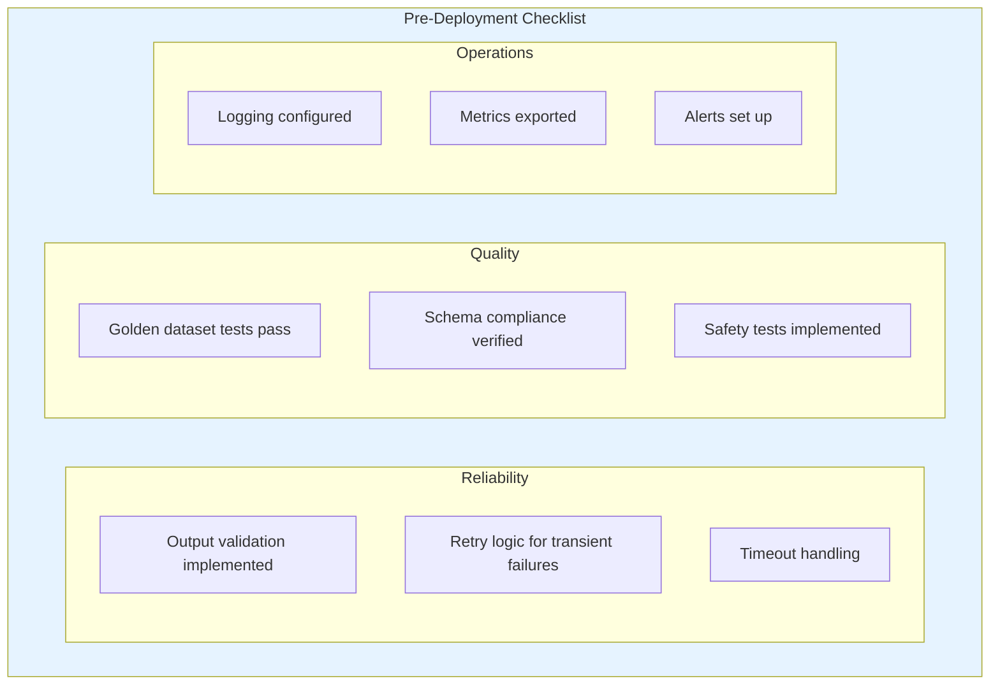

| Category | Checklist Item | Why It Matters |
|----------|---------------|-----------------|
| **Reliability** | Output validation | Prevents malformed outputs from breaking downstream |
| **Reliability** | Retry logic | Handles transient API failures |
| **Reliability** | Timeouts | Prevents hung requests |
| **Quality** | Golden tests | Catches regressions before users |
| **Quality** | Schema validation | Ensures consistent outputs |
| **Quality** | Safety tests | Prevents harmful outputs |
| **Operations** | Logging | Debugging production issues |
| **Operations** | Metrics | Understanding system behavior |
| **Operations** | Alerts | Proactive issue detection |

---

## Key Takeaways

1. **LLMs are next-token predictors** — They generate text that statistically follows from the input. They learned patterns, not facts.

2. **Outputs are probabilistic** — The same prompt can produce different outputs. Design for variation with validation and error handling.

3. **Failures are predictable** — Hallucination, omission, formatting drift, and instruction brittleness have known, implementable mitigations.

4. **Reliability requires more than prompting** — Grounding, structured outputs, validation, and evaluation patterns are essential for production.

5. **Production systems need four pillars** — Prompt design, tool design, state management, and quality assurance.

---

## What You Learned

- LLMs are trained on next-token prediction and fine-tuned for instruction following
- GenAI outputs are probabilistic—same input can produce different outputs
- Common failure modes are hallucination, omission, formatting drift, and instruction brittleness
- Each failure mode has specific, implementable mitigations
- Production GenAI apps combine prompts, instructions, tools, state, and quality assurance

---

## Prerequisites Map

This page supports these lessons:

| Course | Lesson | Dependency |
|--------|--------|------------|
| Beginner | Lesson 1: Use cases, models, and the LLM app lifecycle | Full page |
| Beginner | Lesson 2: Prompting and structured outputs | Failure modes, reliability |
| Beginner | Lesson 7: Evals, safety, cost, and release | Production checklist |
| Advanced | Lesson 1: Agentic product fit | Architecture decisions |

---

## Next Step

Continue to [Transformer basics](./transformer-basics.md) to understand the architecture that enables LLMs to process context.

Or jump directly to a course:

- [Beginner: Lesson 1 - Use cases, models, and the LLM app lifecycle](../genai-beginner/lesson-1-use-cases-models-and-app-lifecycle.md)
- [Advanced: Lesson 1 - Agentic product fit and system boundaries](../genai-advanced/lesson-1-agentic-product-fit-and-system-bounded-autonomy.md)
