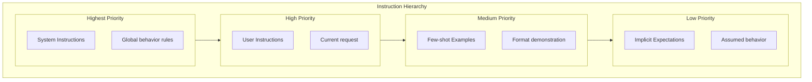

# Prompt and Output Patterns Cheatsheet

This cheatsheet covers the essential patterns for effective prompting and reliable output handling. Bookmark this page—you'll reference it often.

**Supports:**
- [Beginner: Lesson 2 - Prompting and structured outputs](../genai-beginner/lesson-2-prompting-context-and-structured-outputs.md)
- [Advanced: Lesson 3 - Context engineering](../genai-advanced/lesson-3-context-engineering-long-context-and-caching.md)

---

## Instruction Hierarchy

Instructions have a precedence order. Higher-priority instructions override lower-priority ones:



| Level | What | Example |
|-------|------|---------|
| **System** | Global behavior | "You are a helpful assistant that..." |
| **User** | Current request | "Summarize this document..." |
| **Examples** | Format demonstration | Input → Output pairs |
| **Implicit** | Assumed behavior | User expects JSON unless told otherwise |

### Conflict Resolution

```python
# System says one thing
system = """
Always respond in XML format.
"""

# User says another
user = """
Format the response as JSON.
"""

# Resolution: System instructions typically take priority
# But if user explicitly contradicts, clarify or defer to user
```

---

## Examples vs. Schemas

| Approach | Best for | Example |
|----------|---------|---------|
| **Few-shot examples** | Format, tone, style | Show 3 examples of good responses |
| **JSON Schema** | Structure, validation | Define exact fields and types |
| **Combined** | Complex tasks | Examples showing schema usage |

### Few-Shot Prompting

```python
prompt = """
Classify the sentiment of customer feedback as POSITIVE, NEGATIVE, or NEUTRAL.

Examples:
Input: "This product is amazing, love it!"
Output: POSITIVE

Input: "Terrible experience, would not recommend."
Output: NEGATIVE

Input: "The product arrived on time."
Output: NEUTRAL

Now classify:
Input: "Works fine, nothing special."
Output:"""
```

### Schema Definition

```python
prompt = """
Extract order information from the text and respond with this JSON schema:

{
  "order_id": "string (e.g., ORD-12345)",
  "items": ["array of item names"],
  "total": "number (price in dollars)",
  "status": "enum: pending | shipped | delivered | cancelled"
}

Text: "Hi, I placed order #ORD-9876 for two laptops and a mouse, total $2,499.00. When will it ship?"
"""
```

---

## Structured Output Patterns

### JSON Output (Recommended)

```python
system_instruction = """
You are a helpful assistant. 
Always respond with valid JSON matching this schema:
{
  "answer": "string (your response)",
  "confidence": "number (0.0 to 1.0)",
  "sources": ["array of source names used"]
}
"""
```

### Enum-Constrained Output

```python
system_instruction = """
Classify the priority level. Respond with ONLY one of:
- urgent (needs immediate attention)
- high (important but not critical)
- medium (standard priority)
- low (can wait)

Do not include any other text.
"""
```

### Markdown-Formatted Structured Output

```python
prompt = """
Format your response as follows:

## Summary
[One paragraph summary]

## Key Points
- [Point 1]
- [Point 2]
- [Point 3]

## Action Items
- [ ] [Action 1]
- [ ] [Action 2]
"""
```

---

## Tool Calling Patterns

### Tool Schema Definition

```python
tools = [
    {
        "type": "function",
        "function": {
            "name": "get_weather",
            "description": "Get the current weather for a location",
            "parameters": {
                "type": "object",
                "properties": {
                    "location": {
                        "type": "string",
                        "description": "City name, e.g., 'San Francisco'"
                    },
                    "unit": {
                        "type": "string",
                        "enum": ["celsius", "fahrenheit"],
                        "default": "celsius"
                    }
                },
                "required": ["location"]
            }
        }
    }
]
```

### Tool Use Guidelines

| Guideline | Why | Example |
|-----------|-----|---------|
| **Descriptive names** | Clear what tool does | `get_weather` not `weather` |
| **Explicit descriptions** | Model knows when to use | "Get weather for a city" |
| **Type constraints** | Prevents invalid arguments | `unit: enum["celsius", "fahrenheit"]` |
| **Required fields marked** | Model provides essential params | `required: ["location"]` |
| **No secrets in descriptions** | Descriptions are logged | Use env vars, not keys |
| **Safe operations only** | Prevent harmful actions | Never allow DELETE without approval |

### Tool Error Handling

```python
@tool(name="file_read")
def file_read(path: str) -> ToolResult:
    """Read file with security checks."""
    try:
        # Security: validate path
        if not is_safe_path(path):
            return ToolResult(error="Access denied: invalid path")
        
        # Read file
        with open(path) as f:
            content = f.read()
        
        return ToolResult(result=content)
    
    except PermissionError:
        return ToolResult(error="Permission denied")
    except FileNotFoundError:
        return ToolResult(error="File not found")
    except Exception as e:
        return ToolResult(error=f"Unexpected error: {str(e)}")
```

---

## Grounding and Citation Patterns

### Basic Grounding

```python
prompt = """
Answer the question based ONLY on the provided context.
If the answer is not in the context, say "I don't know based on the provided information."

Context:
---
{retrieved_chunks}
---

Question: {user_query}
"""
```

### Citation Format

```python
prompt = """
Answer the question using the provided documents. 
For each piece of information you use, cite the source using [Source: filename] notation.

Context:
---
{chunk_1}
---
{chunk_2}
---

Question: {user_query}
"""
```

### Example Response with Citations

```json
{
  "answer": "AgentFlow was founded in 2024 as a multi-agent orchestration framework. [Source: about.md]",
  "sources": ["about.md"]
}
```

---

## Chain-of-Thought Prompting

### Basic Chain-of-Thought

```python
prompt = """
Solve this problem step by step.

Problem: If a train travels 60 miles per hour for 2.5 hours, how far does it travel?

Think step by step:
1. Identify what we're solving for
2. Identify known values
3. Apply the formula
4. Calculate the answer

Show your reasoning:
"""
```

### Zero-Shot CoT

```python
prompt = """
A doctor gives a patient 3 pills and says "Take one every hour." 
How long will the pills last?

Think step by step. Show your work.
"""
```

---

## System Prompt Patterns

### Role Definition

```python
system_prompt = """
You are a [ROLE] with expertise in [DOMAIN].

Your responsibilities:
1. [Responsibility 1]
2. [Responsibility 2]
3. [Responsibility 3]

Guidelines:
- Always [positive behavior]
- Never [negative behavior]
- If unsure, [fallback behavior]
"""
```

### Constraining Behavior

```python
system_prompt = """
You are a customer support assistant.

IMPORTANT CONSTRAINTS:
- NEVER make up information - say "I don't know" if uncertain
- NEVER access private data without explicit user consent
- NEVER make financial transactions without human approval
- ALWAYS cite sources when providing factual information
- ALWAYS verify sensitive data with the user before sharing
"""
```

---

## Quick Reference: Prompt Structure

```
+------------------------------------------------------------------+
| SYSTEM INSTRUCTIONS (Highest Priority)                            |
| - Role definition                                                 |
| - Global behavior rules                                           |
| - Hard constraints                                               |
+------------------------------------------------------------------+
| CONTEXT / BACKGROUND (Optional)                                   |
| - Retrieved documents                                            |
| - Conversation history                                            |
| - User profile                                                   |
+------------------------------------------------------------------+
| TASK DEFINITION                                                  |
| - What to do                                                     |
| - Specific instructions                                          |
+------------------------------------------------------------------+
| FORMAT INSTRUCTIONS (High Priority)                              |
| - Output schema                                                  |
| - Citation requirements                                          |
| - Structure                                                      |
+------------------------------------------------------------------+
| FEW-SHOT EXAMPLES (For Complex Formats)                          |
| - Input → Output pairs                                           |
| - Edge cases                                                     |
+------------------------------------------------------------------+
| CURRENT INPUT (Last for Emphasis)                               |
| - User's question                                                |
| - Data to process                                                |
+------------------------------------------------------------------+
```

---

## Anti-Patterns

### Don't Do These

| Anti-Pattern | Problem | Better Approach |
|-------------|---------|----------------|
| **"Be helpful"** | Too vague | Specific instructions: "Explain concisely in 2-3 sentences" |
| **Contradicting instructions** | Confuses the model | Pick one approach |
| **Asking multiple things at once** | Gets partial responses | One clear task per request |
| **Assuming model knows context** | May hallucinate | Always provide necessary context |
| **No output format specified** | Inconsistent responses | Always specify format |
| **Overly long prompts** | Dilutes key instructions | Put important instructions first and last |
| **Negative framing** | "Don't do X" often fails | Positive framing: "Do X instead" |
| **Single instruction only** | Brittle on edge cases | Multiple examples or validation |

### Do These Instead

| Pattern | Example |
|---------|---------|
| **Specific instructions** | "Summarize in exactly 3 bullet points" |
| **Clear format** | "Respond with valid JSON matching this schema" |
| **Explicit boundaries** | "Answer ONLY using the provided documents" |
| **End with the task** | Place the question/instruction at the end |
| **Show the output format** | Include example output in few-shot |
| **Positive framing** | "Do X" not "Don't do Y" |
| **Multiple examples** | Show edge cases explicitly |

---

## Error Recovery Patterns

### Malformed Output Handling

```python
def parse_with_fallback(response: str) -> dict:
    try:
        return json.loads(response)
    except json.JSONDecodeError:
        # Try to extract JSON from markdown code blocks
        match = re.search(r'```(?:json)?\s*([\s\S]*?)\s*```', response)
        if match:
            return json.loads(match.group(1))
        
        # Try to extract JSON from text
        match = re.search(r'\{[\s\S]*\}', response)
        if match:
            try:
                return json.loads(match.group())
            except:
                pass
        
        # Last resort: ask for correction
        return {"error": "Could not parse response", "raw": response}
```

### Retry with Clarification

```python
def generate_with_retry(
    prompt: str, 
    max_retries: int = 3,
    schema: type = None
) -> str:
    for attempt in range(max_retries):
        response = llm.generate(prompt)
        
        if is_valid_format(response, schema):
            return response
        
        # Add correction prompt
        prompt += f"""
\n\nPrevious response was not valid. Please correct:
- Expected format: {schema}
- Received: {response[:200]}...
"""
    
    raise ValueError(f"Failed after {max_retries} attempts")
```

### Validation Loop

```python
from pydantic import BaseModel, ValidationError

class OutputSchema(BaseModel):
    answer: str
    confidence: float

def validated_generation(prompt: str, max_attempts: int = 3) -> OutputSchema:
    for attempt in range(max_attempts):
        response = llm.generate(prompt)
        
        try:
            return OutputSchema.parse_raw(response)
        except ValidationError as e:
            prompt += f"\n\nValidation error: {e}\nPlease regenerate."
    
    raise ValueError("Failed to generate valid output")
```

---

## Context Management Patterns

### Context Truncation

```python
def build_prompt(
    system: str,
    history: list[Message],
    user_message: str,
    max_tokens: int = 8000
) -> list[dict]:
    """Build prompt with automatic truncation."""
    
    messages = [
        {"role": "system", "content": system},
        *history,
        {"role": "user", "content": user_message}
    ]
    
    # Truncate from oldest messages if too long
    while count_tokens(messages) > max_tokens and len(messages) > 3:
        messages.pop(1)  # Remove oldest non-system message
    
    return messages
```

### Summarization for Long Context

```python
async def summarize_if_needed(
    messages: list[Message],
    max_history_tokens: int = 4000
) -> list[Message]:
    """Summarize old messages if history too long."""
    
    if count_tokens(messages) <= max_history_tokens:
        return messages
    
    # Separate recent and old messages
    recent = messages[-10:]  # Keep last 10 messages
    old = messages[:-10]
    
    # Summarize old messages
    summary_prompt = f"""
Summarize this conversation concisely, keeping key facts and user preferences:

{format_messages(old)}
"""
    
    summary = await llm.generate(summary_prompt)
    
    return [
        {"role": "system", "content": f"Earlier conversation summary: {summary}"},
        *recent
    ]
```

---

## Common Prompt Templates

### QA Template

```python
qa_template = """
Answer the question based on the provided context.

Context:
---
{context}
---

Question: {question}

Instructions:
- Answer directly and concisely
- If the answer is not in the context, say "I don't know"
- Cite sources as [Source: filename]
"""
```

### Classification Template

```python
classification_template = """
Classify the following text into one of these categories: {categories}

Text: {text}

Respond with ONLY the category name. No explanation.
"""
```

### Extraction Template

```python
extraction_template = """
Extract the following information from the text:

Fields to extract:
{schema}

Text: {text}

Respond with JSON matching the schema.
"""
```

### Summarization Template

```python
summarization_template = """
Summarize the following text with these requirements:
- Length: {length} (e.g., "2 sentences", "100 words")
- Focus: {focus}
- Format: {format}

Text:
{text}
"""
```

---

## Key Takeaways

1. **Instruction hierarchy matters** — System > User > Examples > Implicit
2. **Examples beat descriptions for complex formats** — Show, don't just tell
3. **Always specify output format** — JSON schema, enum constraints, or structure
4. **Grounding prevents hallucinations** — Cite sources explicitly
5. **Positive framing beats negative** — "Do X" works better than "Don't do Y"
6. **Error recovery is essential** — Validate outputs and retry with correction
7. **Context management prevents overflow** — Truncate or summarize when needed

---

## What You Learned

- Instruction hierarchy and precedence
- When to use examples vs. schemas
- Structured output patterns for reliability
- Tool calling schema design
- Grounding and citation patterns
- Chain-of-thought prompting
- Error recovery and validation
- Context management patterns
- Common anti-patterns to avoid

---

## Prerequisites Map

This page supports these lessons:

| Course | Lesson | Dependency |
|--------|--------|------------|
| Beginner | Lesson 2: Prompting and structured outputs | Full page |
| Advanced | Lesson 3: Context engineering | Error recovery, context management |

---

## Next Step

This cheatsheet supports both courses. Continue to:

- [Beginner: Lesson 2 - Prompting, context engineering, and structured outputs](../genai-beginner/lesson-2-prompting-context-and-structured-outputs.md)
- [Advanced: Lesson 3 - Context engineering, long context, and caching](../genai-advanced/lesson-3-context-engineering-long-context-and-caching.md)
