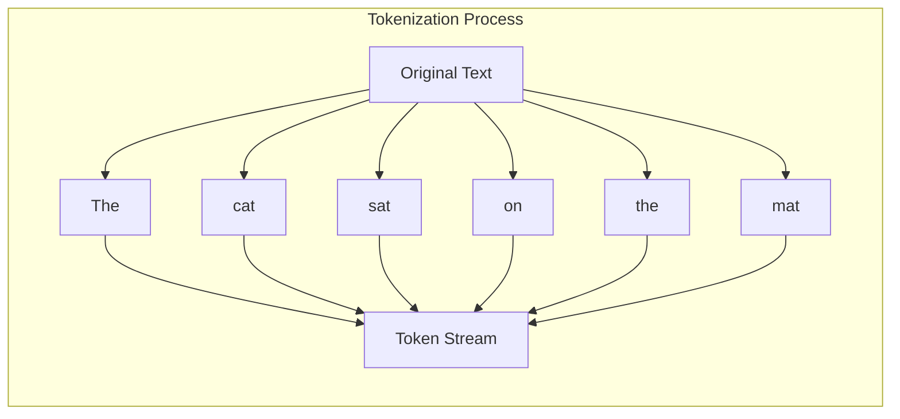
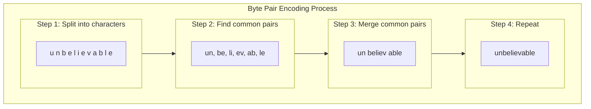
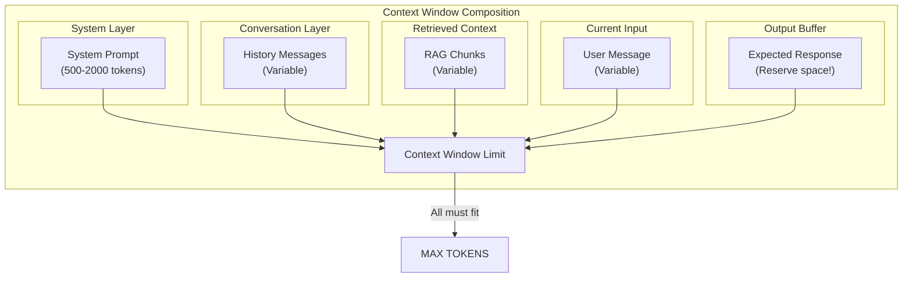
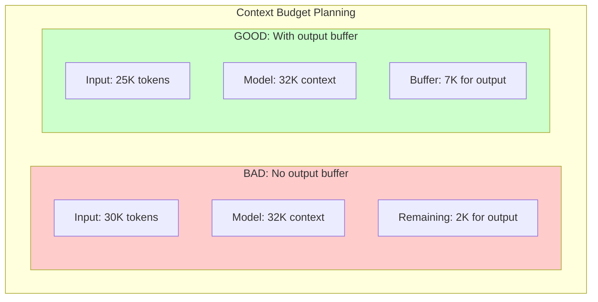
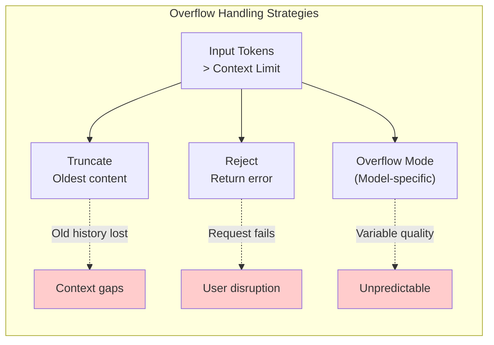
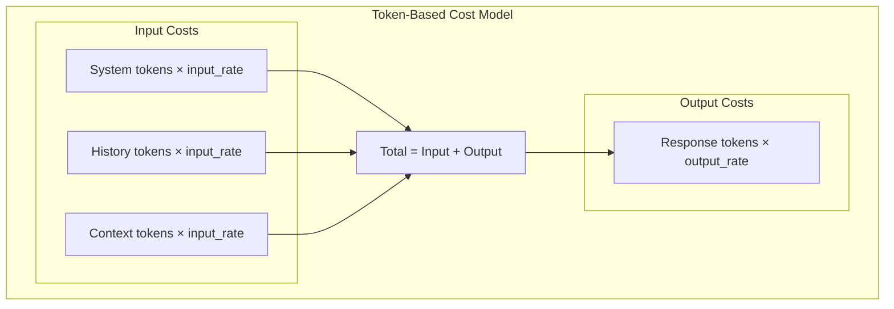
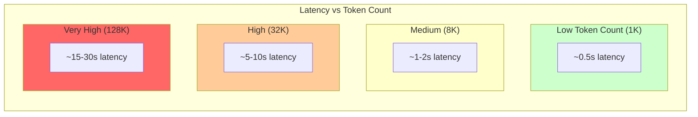
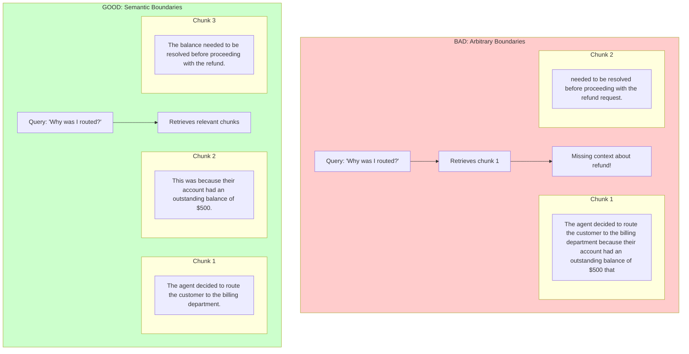

# Tokenization and Context Windows

Tokens are the basic units that LLMs process. Understanding tokenization helps you:
- Estimate costs before making API calls
- Design prompts that fit in context windows
- Make intelligent chunking decisions for retrieval
- Optimize for latency and throughput

**Prerequisites for:**
- [Beginner: Lesson 2 - Prompting and structured outputs](../genai-beginner/lesson-2-prompting-context-and-structured-outputs.md)
- [Beginner: Lesson 4 - Retrieval, grounding, and citations](../genai-beginner/lesson-4-retrieval-grounding-and-citations.md)
- [Beginner: Lesson 5 - State, memory, threads, and streaming](../genai-beginner/lesson-5-state-memory-threads-and-streaming.md)
- [Advanced: Lesson 3 - Context engineering, long context, and caching](../genai-advanced/lesson-3-context-engineering-long-context-and-caching.md)

---

## What Are Tokens?

A token is not a word—it's a subword unit that the model's tokenizer extracts from text.



### Token Examples by Type

| Text | Approximate Tokens | Why |
|------|-------------------|-----|
| "hello" | 1 | Common short word |
| "world" | 1 | Common short word |
| "AgentFlow" | 2-3 | Technical/compound word |
| "transformer" | 2-3 | Longer word |
| "大语言模型" (Chinese) | 2-3 | Non-English |
| "🤖🚀💡" (emojis) | 2-5 | Emojis tokenize oddly |
| "12345" | 1 | Numbers often compress |
| "abc123!" | 3-4 | Mixed characters |

### Tokenization Algorithms

Most LLMs use variations of Byte Pair Encoding (BPE):



**Key insight:** Common words like "the", "is", "ing" become single tokens. Rare or technical words get split into subwords.

---

## Why Token Count ≠ Word Count

Tokenizers learn from training data, so they recognize common word combinations as single tokens:

```mermaid
flowchart TB
    subgraph Comparison["Token Count vs Word Count"]
        subgraph Compressed["Common words (1 token each)"]
            CW1["the"]
            CW2["is"]
            CW3["are"]
            CW4["and"]
            CW5["you"]
        end
        
        subgraph Expanded["Technical/Rare words (multiple tokens)"]
            EW1["agent" "flow"]
            EW2["trans" "former"]
            EW3["embed" "ding"]
        end
    end
    
    style Compressed fill:#ccffcc
    style Expanded fill:#ffcccc
```

### Rule of Thumb

**1 token ≈ 4 characters in English ≈ 0.75 words**

But this varies significantly:

| Content Type | Token/Word Ratio | Example |
|-------------|-----------------|---------|
| Conversational text | ~0.7 | "Hello, how are you?" |
| Technical code | ~0.5 | `def function(param):` |
| Mathematical symbols | Variable | `f(x) = Σx²` |
| Non-English text | Higher | 3x for Chinese |

---

## Token Counting in Practice

### Using tiktoken (OpenAI)

```python
import tiktoken

# Create encoding for specific model
enc = tiktoken.get_encoding("cl100k_base")  # GPT-4 tokenizer

text = "Hello, world! How are you today?"

tokens = enc.encode(text)
print(f"Text: {text}")
print(f"Tokens: {tokens}")
print(f"Token count: {len(tokens)}")
print(f"Tokenized: {[enc.decode([t]) for t in tokens]}")
```

Output:
```
Text: Hello, world! How are you today?
Tokens: [9906, 11, 1917, 0, 1661, 526, 4993, 1802]
Token count: 8
Tokenized: ['Hello', ',', ' world', '!', ' How', ' are', ' you', ' today', '?']
```

### Using Anthropic's Token Counter

```python
# For Claude models
# Anthropic provides token counting in their SDK

from anthropic import Anthropic

client = Anthropic()

# Count tokens without making an API call
def count_tokens(text: str) -> int:
    response = client.messages.count_tokens(
        model="claude-3-opus-20240229",
        max_tokens=1,  # Minimal request
        messages=[{"role": "user", "content": text}]
    )
    return response.usage.input_tokens
```

---

## Token Budgeting Heuristics

Use these rough estimates for planning:

| Use Case | Token Estimate | Notes |
|----------|---------------|-------|
| Short question | 50-200 | "What is Python?" |
| Typical email | 200-500 | Short to medium emails |
| One page of text | 300-400 | ~250 words |
| Code file (100 lines) | 400-600 | Depends on density |
| Single document page | 300-800 | With formatting |
| Long article | 2000-4000 | ~5-10 pages |
| Full conversation (10 turns) | 2000-5000 | Depends on message length |

### Counting in AgentFlow

```python
from agentflow.core.utils import count_tokens

# Count tokens for a full prompt
def estimate_prompt_cost(
    system_prompt: str,
    messages: list[Message],
    expected_response_tokens: int = 500
) -> dict:
    system_tokens = count_tokens(system_prompt)
    history_tokens = sum(count_tokens(m.content) for m in messages)
    
    total_input = system_tokens + history_tokens
    total_output = expected_response_tokens
    total = total_input + total_output
    
    return {
        "system_tokens": system_tokens,
        "history_tokens": history_tokens,
        "input_tokens": total_input,
        "output_tokens": total_output,
        "total_tokens": total,
        "estimated_cost": total * 0.00001  # Rough estimate for GPT-4
    }
```

---

## Context Windows Deep Dive

The context window is the maximum number of tokens a model can process in a single request. This includes **everything**:



### Common Context Window Sizes

| Model | Context Window | Cost Implication |
|-------|---------------|------------------|
| GPT-3.5 Turbo | 16K tokens | Baseline |
| GPT-4 Turbo | 128K tokens | ~4x GPT-4 base |
| GPT-4o | 128K tokens | Optimized pricing |
| Claude 3 Haiku | 200K tokens | Fast, affordable |
| Claude 3 Sonnet | 200K tokens | Balanced |
| Claude 3 Opus | 200K tokens | Highest quality |
| Claude 3.5 Sonnet | 200K tokens | Best overall |
| Gemini 1.5 Flash | 1M tokens | Massive context |
| Gemini 1.5 Pro | 1M tokens | Highest capability |

---

## The Output Buffer Problem

**Critical:** Your context window must leave room for the response!



### Budget Planning Example

```python
# For a 32K context model with expected 2K response:

CONTEXT_LIMIT = 32000
OUTPUT_BUFFER = 2000  # Reserve for response
EFFECTIVE_LIMIT = CONTEXT_LIMIT - OUTPUT_BUFFER  # 30000

def build_prompt(
    system_prompt: str,
    history: list[Message],
    retrieved_context: list[str],
    user_message: str
) -> dict:
    # Calculate current tokens
    tokens = {
        "system": count_tokens(system_prompt),
        "history": sum(count_tokens(m.content) for m in history),
        "retrieved": sum(count_tokens(c) for c in retrieved_context),
        "user": count_tokens(user_message)
    }
    
    tokens["total"] = sum(tokens.values())
    tokens["within_limit"] = tokens["total"] <= EFFECTIVE_LIMIT
    
    if not tokens["within_limit"]:
        # Strategies to reduce:
        # 1. Truncate oldest history
        # 2. Reduce retrieved chunks
        # 3. Use summarization
        tokens["overage"] = tokens["total"] - EFFECTIVE_LIMIT
    
    return tokens
```

---

## Truncation Risk and Overflow Behavior

When input exceeds the context window:



### Prevention Strategies

| Strategy | How It Works | When to Use |
|----------|-------------|-------------|
| **Count before send** | Calculate tokens before API call | Always |
| **History summarization** | Condense old messages | Long conversations |
| **Retrieval limits** | Limit chunk count | RAG systems |
| **Graceful truncation** | Keep recent, discard old | Chat applications |
| **Context compression** | Summarize retrieved content | Large document Q&A |

```python
class ContextManager:
    def __init__(self, max_tokens: int, output_buffer: int = 500):
        self.max_tokens = max_tokens
        self.output_buffer = output_buffer
        self.effective_limit = max_tokens - output_buffer
    
    def truncate_to_fit(
        self,
        messages: list[Message],
        retrieved: list[str] = None
    ) -> tuple[list[Message], list[str]]:
        """Truncate messages and retrieved content to fit context."""
        
        while True:
            total = self._count_all(messages, retrieved)
            
            if total <= self.effective_limit:
                break
            
            # Strategy: Remove oldest messages first
            if len(messages) > 2:  # Keep at least system + last message
                messages = messages[1:]  # Remove oldest
            elif retrieved and len(retrieved) > 1:
                retrieved = retrieved[:-1]  # Remove oldest chunk
            else:
                # Last resort: truncate the last message
                messages[-1] = self._truncate_message(messages[-1])
        
        return messages, retrieved
    
    def _count_all(self, messages, retrieved):
        msg_tokens = sum(count_tokens(m.content) for m in messages)
        ret_tokens = sum(count_tokens(r) for r in (retrieved or []))
        return msg_tokens + ret_tokens
```

---

## Why Tokenization Matters for Cost and Latency

### The Cost Equation



### Cost Examples by Model

| Model | Input Cost | Output Cost | 1K Tokens Total |
|-------|-----------|-------------|------------------|
| GPT-4o | $5/1M | $15/1M | ~$0.02 |
| GPT-4o Mini | $0.15/1M | $0.60/1M | ~$0.00075 |
| Claude 3.5 Sonnet | $3/1M | $15/1M | ~$0.018 |
| Claude 3 Haiku | $0.25/1M | $1.25/1M | ~$0.0015 |

### Latency Scaling



---

## Practical Example: Email Assistant Token Budget

### Full Implementation

```python
class EmailAssistantBudget:
    """Token budget management for an email assistant."""
    
    # Model: GPT-4 Turbo (128K context)
    MODEL_CONTEXT = 128000
    OUTPUT_BUFFER = 2000  # Reserve for response
    EFFECTIVE_LIMIT = MODEL_CONTEXT - OUTPUT_BUFFER  # 126000
    
    def __init__(self):
        self.system_prompt = """
        You are a helpful email assistant for Acme Corp.
        Be professional, concise, and actionable.
        Always prioritize urgent items.
        
        Company policies:
        - Refunds within 30 days
        - Support hours: 9am-5pm EST
        - Escalation: support@acme.com
        """
    
    def plan_prompt(self, email_text: str, query: str) -> dict:
        """Plan a prompt within token budget."""
        
        # Count all components
        system_tokens = count_tokens(self.system_prompt)
        email_tokens = count_tokens(email_text)
        query_tokens = count_tokens(query)
        
        # Check if everything fits
        available = self.EFFECTIVE_LIMIT - system_tokens - email_tokens
        
        if query_tokens > available:
            # Query too long - truncate
            query = self._truncate(query, available)
            query_tokens = count_tokens(query)
        
        return {
            "system_prompt": self.system_prompt,
            "email_text": email_text,
            "query": query,
            "tokens": {
                "system": system_tokens,
                "email": email_tokens,
                "query": query_tokens,
                "total_input": system_tokens + email_tokens + query_tokens,
                "remaining_for_response": self.OUTPUT_BUFFER
            },
            "within_budget": True
        }
    
    def _truncate(self, text: str, max_tokens: int) -> str:
        """Truncate text to max tokens."""
        tokens = count_tokens(text)
        if tokens <= max_tokens:
            return text
        # Simple truncation - take first N characters
        ratio = max_tokens / tokens
        return text[:int(len(text) * ratio)]
```

---

## Chunk Boundaries: Critical for Retrieval

Poor chunk boundaries during document processing lead to retrieval failures:



### Good Chunking Rules

1. **End at sentence boundaries** — Never cut mid-sentence
2. **End at paragraph boundaries** — Natural topic breaks
3. **Preserve context** — Keep related sentences together
4. **Respect semantic units** — Don't split code functions

---

## Key Takeaways

1. **Tokens ≠ words** — One token is typically 1-4 characters. Use proper tokenizers for accurate counts.

2. **Context includes everything** — System, history, retrieved context, input, AND output buffer.

3. **Always reserve output buffer** — Never fill context to 100%. Leave room for the response.

4. **Token count directly affects cost and latency** — Optimize prompts to minimize unnecessary tokens.

5. **Chunk boundaries affect retrieval quality** — End chunks at semantic boundaries, never mid-thought.

---

## What You Learned

- Tokens are subword units, not words, and vary by tokenizer
- Context windows include all input plus reserved output buffer
- Token count affects API cost (per-token pricing) and latency
- Poor chunk boundaries create retrieval failures
- Always count tokens before sending to API

---

## Prerequisites Map

This page supports these lessons:

| Course | Lesson | Dependency |
|--------|--------|------------|
| Beginner | Lesson 2: Prompting and structured outputs | Token budgeting, cost estimation |
| Beginner | Lesson 4: Retrieval, grounding, and citations | Chunk boundaries |
| Beginner | Lesson 5: State and memory | Context management |
| Advanced | Lesson 3: Context engineering | Full page |

---

## Next Step

Continue to [Embeddings and similarity](./embeddings-vectorization-and-similarity.md) to understand how text is converted to numbers for retrieval.

Or jump directly to a course:

- [Beginner: Lesson 4 - Retrieval, grounding, and citations](../genai-beginner/lesson-4-retrieval-grounding-and-citations.md)
- [Advanced: Lesson 3 - Context engineering, long context, and caching](../genai-advanced/lesson-3-context-engineering-long-context-and-caching.md)
