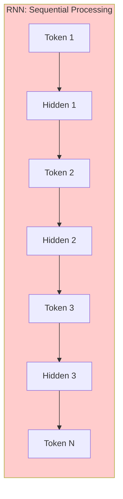
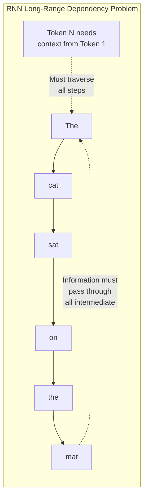
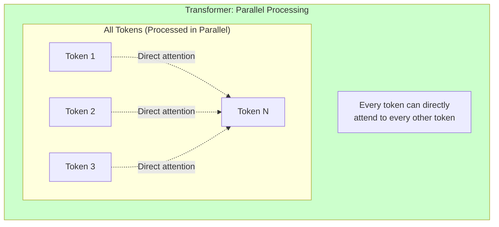
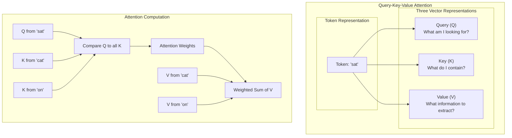
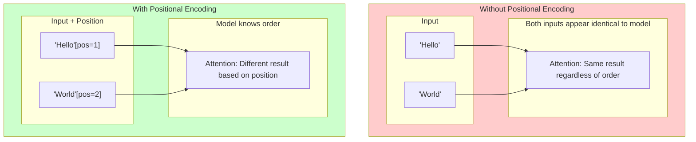
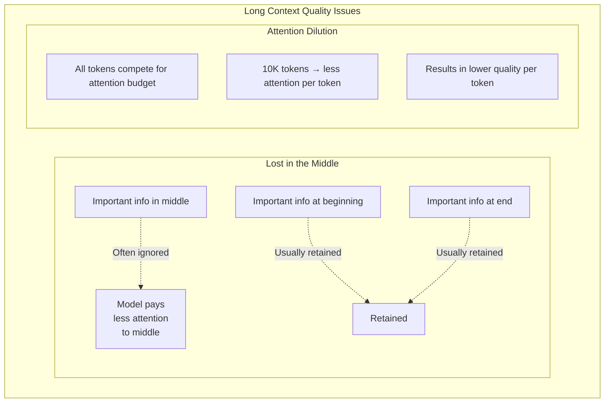
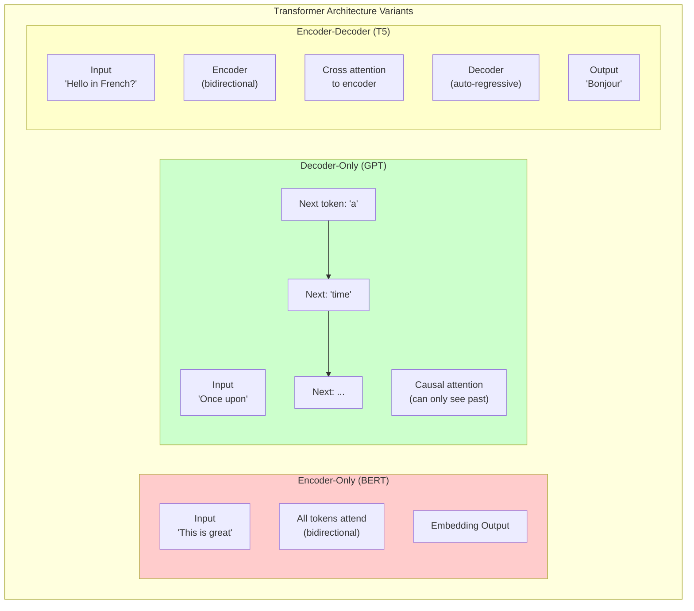
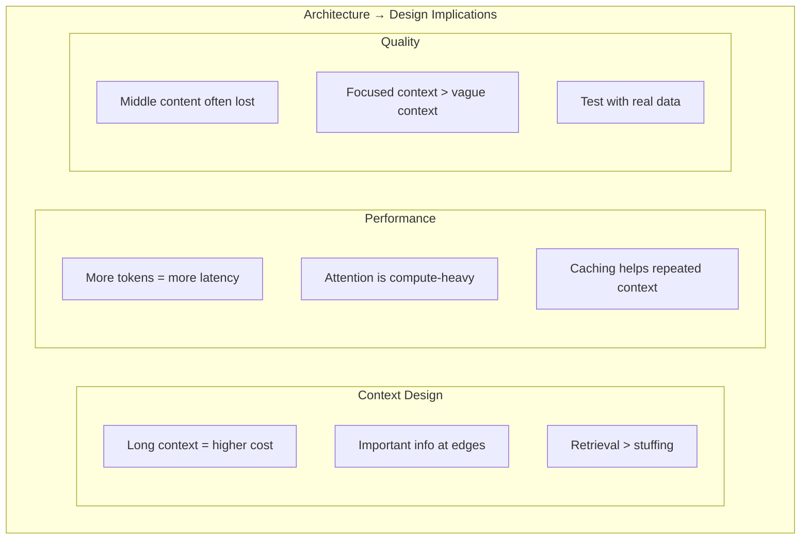

# Transformer Basics

This page explains the transformer architecture at a conceptual level. You don't need to understand the math to build GenAI systems, but understanding *why* transformers handle sequences differently helps with design decisions.

**Prerequisites for:**
- [Beginner: Lesson 1 - Use cases, models, and the LLM app lifecycle](../genai-beginner/lesson-1-use-cases-models-and-app-lifecycle.md)
- [Beginner: Lesson 2 - Prompting and structured outputs](../genai-beginner/lesson-2-prompting-context-and-structured-outputs.md)
- [Advanced: Lesson 3 - Context engineering, long context, and caching](../genai-advanced/lesson-3-context-engineering-long-context-and-caching.md)

---

## The Evolution from RNNs to Transformers

Before transformers, sequence modeling relied on Recurrent Neural Networks (RNNs) like LSTMs and GRUs.

### RNN Processing: Sequential and Slow



**The problem:** To understand Token 100, the model had to process Tokens 1-99 first. Information from early tokens had to "travel" through every intermediate step, getting diluted or lost along the way.



### Transformer Processing: Parallel and Direct



**The breakthrough:** Transformers process all tokens simultaneously. Any token can directly "attend to" any other token in a single step—no sequential passing required.

---

## Self-Attention: The Key Innovation

Self-attention is the mechanism that allows each token to "look at" all other tokens simultaneously.

### How Attention Works: Query, Key, Value

Each token is represented as three vectors during attention:



### Why This Matters for Language Understanding

In the sentence "The cat sat on the mat", attention captures relationships:

```mermaid
flowchart TB
    subgraph Sentence["The cat sat on the mat"]
        Words["The" "cat" "sat" "on" "the" "mat"]
    end
    
    subgraph Relations["Attention Captures These Relations"]
        subgraph Direct["Direct Relationships"]
            R1["'sat' ←→ 'cat'\n(subject-verb agreement)"]
            R2["'sat' ←→ 'on the mat'\n(preposition phrase)"]
            R3["'the' ←→ 'mat'\n(determiner-noun)"]
        end
        
        subgraph Complex["Complex Relationships"]
            R4["'The' ←→ 'cat'\nEven though separated by 'cat sat on the'"]
        end
    end
```

Without sequential processing, the model can directly learn that "sat" relates to "cat" (subject-verb agreement), even though "cat" comes before "sat".

---

## Tokens and Positional Information

### What Are Tokens?

LLMs don't process words directly—they process **tokens**. A token is typically:

| Text | Approximate Tokens | Why |
|------|-------------------|-----|
| "The" | 1 | Common word |
| "cat" | 1 | Common word |
| "AgentFlow" | 2-3 | Uncommon compound |
| "transformer" | 2-3 | Longer word |
| "🚀" | 2-5 | Emoji (varies by model) |

**Rule of thumb:** 1 token ≈ 4 characters in English ≈ 0.75 words

### Why Tokenization Matters

Different tokenizers behave differently:

```mermaid
flowchart LR
    subgraph Tokenizers["Tokenizer Differences"]
        T1["'unbelievable'"]
        
        subgraph OpenAI["OpenAI Tokenizer"]
            O1["un" "believe" "able"]
        end
        
        subgraph Generic["Generic Tokenizer"]
            G1["unbeliev" "able"]
        end
        
        T1 --> O1
        T1 --> G1
    end
```

**Implication:** Tokenization affects:
- Cost (more tokens = more money)
- Latency (more tokens = slower)
- Chunk boundaries (where you split documents)

### Positional Encoding: Adding Order Awareness

Self-attention has no inherent sense of order—it treats tokens as a "bag of words". **Positional encoding** fixes this by adding position information:



**Important:** Without positional encoding, "Hello World" and "World Hello" would be treated identically. With it, the model knows the difference.

---

## Why Transformers Handle Long Sequences Better

### The Path Length Problem

```mermaid
flowchart TB
    subgraph Comparison["RNN vs Transformer Path Length"]
        subgraph RNNPath["RNN: O(N) Path Length"]
            R1["T1"] --> R2["T2"]
            R2 --> R3["T3"]
            R3 --> RDots["..."]
            RDots --> RN["TN"]
            
            RN -.-> |"N-1 steps to connect"| R1
            
            RNNNote["Information from T1\nmust pass through\nT2, T3, ..., TN-1"]
        end
        
        subgraph TFPath["Transformer: O(1) Path Length"]
            TT1["T1"]
            TT2["T2"]
            TT3["T3"]
            TTDots["..."]
            TTN["TN"]
            
            TT1 -.-> |"1 step"| TTN
            TT2 -.-> |"1 step"| TTN
            TT3 -.-> |"1 step"| TTN
            
            TFNote["T1 directly connects\nto TN in 1 step"]
        end
    end
    
    RN -.x R1
```

| Model | Path Length | Consequence |
|-------|-------------|-------------|
| RNN | O(N) | Long-range dependencies dilute |
| Transformer | O(1) | Direct connections regardless of distance |

**This is why modern LLMs can work with context windows of 128K+ tokens.**

---

## Why Long Context Still Has Tradeoffs

Despite transformers handling longer sequences better, long context has real quality and cost tradeoffs.

### Quality Tradeoffs



| Issue | Description | Mitigation |
|-------|-------------|-------------|
| **Lost in the middle** | Models often pay less attention to middle content | Put important info at beginning or end |
| **Attention dilution** | More tokens = less attention per token | Use retrieval instead of stuffing context |
| **Stale representations** | Models trained on shorter context may not generalize | Test with actual long context |

### Cost Tradeoffs

```mermaid
flowchart LR
    subgraph CostModel["Token Cost Model"]
        subgraph Input["Input Side"]
            I1["System prompt"]
            I2["Conversation history"]
            I3["Retrieved context"]
            I4["Current input"]
        end
        
        subgraph Output["Output Side"]
            O1["Response tokens"]
        end
        
        subgraph Total["Total = Sum of All"]
            Total["Total tokens × price per token"]
        end
        
        I1 & I2 & I3 & I4 --> Total
        Total --> O1
    end
```

| Context Size | Approximate Cost | Latency Impact |
|-------------|-----------------|----------------|
| 4K tokens | 1x baseline | Baseline |
| 32K tokens | ~3-4x | +50-100% |
| 128K tokens | ~10-15x | +200-400% |

**Design implication:** Don't use 128K when 4K suffices. More tokens cost more and often produce worse results for focused tasks.

---

## Architecture Variants: Encoder, Decoder, and Combinations

There are three main transformer variants:



| Variant | Processing | Best For | Examples |
|---------|------------|----------|----------|
| **Encoder-only** | Bidirectional (sees all tokens) | Classification, extraction, embeddings | BERT, RoBERTa |
| **Decoder-only** | Causal (sees only past tokens) | Text generation, chat | GPT-4, Claude, Llama |
| **Encoder-decoder** | Encoder for input, decoder for output | Translation, summarization | T5, BART |

**Most modern LLMs are decoder-only** because they're optimized for generative tasks like chat and text completion.

---

## Practical Implications for GenAI Systems

### What This Means for Your Designs



### Design Guidelines

| Guideline | Reason |
|-----------|--------|
| **Minimize context when possible** | Every token costs money and latency |
| **Put important info at start or end** | "Lost in the middle" phenomenon |
| **Use retrieval for specific information** | Targeted retrieval > long context |
| **Test with actual context lengths** | Quality degrades non-linearly |
| **Cache stable context** | System prompts can often be cached |

---

## Key Takeaways

1. **Transformers use self-attention** — Each token can attend to all other tokens in parallel, enabling direct long-range dependencies.

2. **Positional encoding adds order awareness** — Without it, "Hello World" and "World Hello" are identical.

3. **Long context has real tradeoffs** — More tokens mean higher cost, more latency, and often lower per-token quality.

4. **Retrieval beats stuffing for specific queries** — Targeted retrieval is usually cheaper and more accurate than long context.

5. **Architecture affects capability** — Most modern LLMs are decoder-only transformers optimized for generation.

---

## What You Learned

- Self-attention allows parallel processing and direct long-range dependencies
- Positional encoding gives transformers order awareness
- Long context has quality (lost in middle) and cost tradeoffs
- Most modern LLMs are decoder-only transformers
- Context design decisions directly impact cost and quality

---

## Prerequisites Map

This page supports these lessons:

| Course | Lesson | Dependency |
|--------|--------|------------|
| Beginner | Lesson 1: Use cases, models, and the LLM app lifecycle | Self-attention, context windows |
| Beginner | Lesson 2: Prompting and structured outputs | Cost and latency implications |
| Advanced | Lesson 3: Context engineering, long context, and caching | Full page |
| Advanced | Lesson 4: Advanced RAG | Why retrieval often beats long context |

---

## Next Step

Continue to [Tokenization and context windows](./tokenization-and-context-windows.md) to understand how text is split into tokens and how this affects your GenAI applications.

Or jump directly to a course:

- [Beginner: Lesson 1 - Use cases, models, and the LLM app lifecycle](../genai-beginner/lesson-1-use-cases-models-and-app-lifecycle.md)
- [Advanced: Lesson 3 - Context engineering, long context, and caching](../genai-advanced/lesson-3-context-engineering-long-context-and-caching.md)
