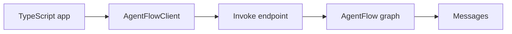
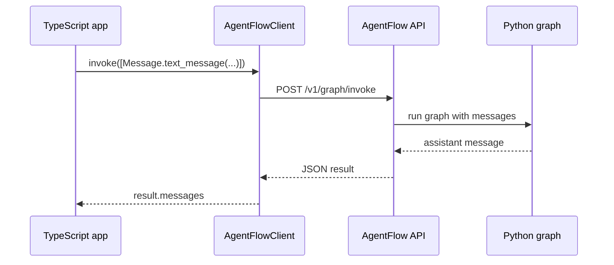

# Connect client

Use `AgentFlowClient` when your TypeScript application needs to call a running AgentFlow API.

The client does not import Python code. It sends HTTP requests to the API server you started with `agentflow api`.



Keep the API server running from [Expose with API](./expose-with-api.md):

```bash
agentflow api --host 127.0.0.1 --port 8000
```

## Install the client

In your TypeScript project:

```bash
npm install @10xscale/agentflow-client
```

## Call the graph

Create `call-agentflow.ts`:

```typescript
import { AgentFlowClient, Message } from "@10xscale/agentflow-client";

const client = new AgentFlowClient({
  baseUrl: "http://127.0.0.1:8000",
});

const result = await client.invoke(
  [Message.text_message("Hello from TypeScript.")],
  {
    config: {
      thread_id: "golden-path-client",
    },
    response_granularity: "low",
  },
);

console.log(result.messages.at(-1)?.text());
```

Run it with the TypeScript runner used by your project. For example, if your project uses `tsx`:

```bash
npx tsx call-agentflow.ts
```

Expected output:

```text
AgentFlow API received: Hello from TypeScript.
```

## What this call does

`AgentFlowClient` sends messages to `/v1/graph/invoke`. The `Message.text_message` helper creates the same message shape used by the Python API.



The `config.thread_id` value identifies the conversation thread for this request. Use a stable ID when you want later calls to continue the same thread.

## Next step

Open the hosted playground with [Open Playground](./open-playground.md).
