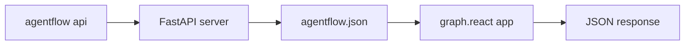
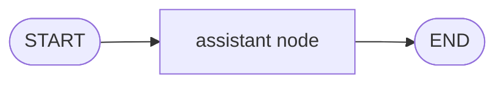
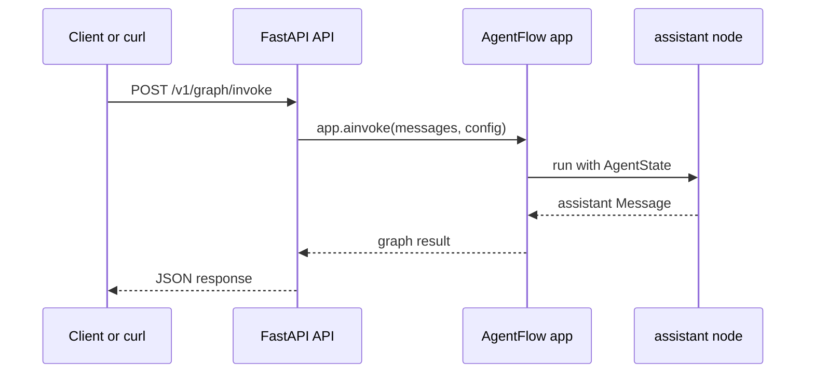

# Expose with API

The API server loads a compiled graph from `agentflow.json`. Use the CLI scaffold, then replace the starter graph with the minimal graph from this guide.

At a high level, the CLI starts a FastAPI server, the server reads your config, and the configured graph handles each request.



## Initialize the app

From your project folder:

```bash
agentflow init
```

This creates:

- `agentflow.json`
- `graph/react.py`
- `graph/__init__.py`

The default config points to `graph.react:app`, so keep the file name and exported variable.

The important part is the `agent` value. It uses Python import notation:

```text
module.path:exported_variable
```

For the scaffolded project, `graph.react:app` means:

- Import the `graph/react.py` module.
- Find the `app` variable in that module.
- Use that compiled AgentFlow graph for API requests.

## Replace the graph

Replace `graph/react.py` with:

```python
from agentflow.core.graph import StateGraph
from agentflow.core.state import AgentState, Message
from agentflow.utils import END


def assistant(state: AgentState) -> Message:
    latest = state.context[-1].text()
    return Message.text_message(
        f"AgentFlow API received: {latest}",
        role="assistant",
    )


graph = StateGraph(AgentState)
graph.add_node("assistant", assistant)
graph.set_entry_point("assistant")
graph.add_edge("assistant", END)

app = graph.compile()
```

The graph itself is still the same simple flow you tested locally:



Your `agentflow.json` should include:

```json
{
  "agent": "graph.react:app",
  "env": ".env",
  "auth": null,
  "checkpointer": null,
  "injectq": null,
  "store": null,
  "thread_name_generator": null
}
```

## Start the API

Run:

```bash
agentflow api --host 127.0.0.1 --port 8000
```

The server runs until you stop it.

When a request comes in, the API converts the request body into AgentFlow messages, invokes the compiled graph, and returns the graph output as JSON.



## Open Swagger docs

The AgentFlow API server is a FastAPI app, so Swagger UI is available while the server is running:

```text
http://127.0.0.1:8000/docs
```

Use this page to inspect available endpoints and try requests from the browser. For the golden path, the most useful endpoint is:

```text
POST /v1/graph/invoke
```

You can also use Swagger UI to confirm the request schema before wiring a client.

## Verify with curl

In another terminal:

```bash
curl -X POST "http://127.0.0.1:8000/v1/graph/invoke" \
  -H "Content-Type: application/json" \
  -d '{
    "messages": [
      {
        "role": "user",
        "content": [
          {"type": "text", "text": "Hello from curl"}
        ]
      }
    ],
    "config": {
      "thread_id": "golden-path-api"
    },
    "response_granularity": "low"
  }'
```

You should see a JSON response with a message that includes:

```text
AgentFlow API received: Hello from curl
```

## Next step

Call the same server from TypeScript in [Connect Client](./connect-client.md).
