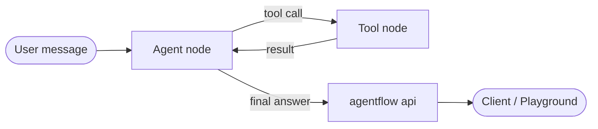
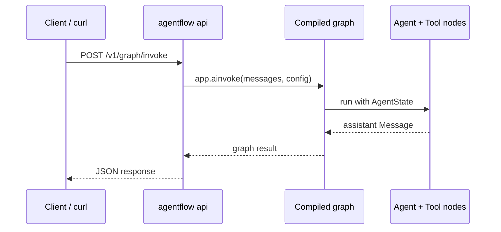

# Your first agent

If you ran `agentflow init`, you already have a working agent — open `graph/agent.py` and you're ready to go.

This page walks through building one from scratch so you understand every part of it before you start customizing.



## Set up your environment

Create a `.env` file in your project root:

```bash
GEMINI_API_KEY=your-google-ai-studio-key
```

Then load it at the top of your agent file:

```python
from dotenv import load_dotenv
load_dotenv()
```

Get a free API key at [Google AI Studio](https://aistudio.google.com/app/apikey).

## Option 1 — Prebuilt ReactAgent

The **ReAct** pattern (Reason + Act) is the most common agent architecture. The agent reasons about the user's message, decides whether to call a tool, observes the result, and repeats until it has a final answer.

AgentFlow's `ReactAgent` implements this loop for you — no graph wiring needed.

```python
from dotenv import load_dotenv
from agentflow.prebuilt import ReactAgent

load_dotenv()


def get_weather(location: str) -> str:
    """Get the current weather for a location."""
    return f"The weather in {location} is sunny and 24°C."


app = ReactAgent(
    model="gemini-2.0-flash",
    provider="google",
    tools=[get_weather],
).compile()

result = app.invoke(
    {"messages": [Message.text_message("What's the weather in London?")]},
    config={"thread_id": "my-first-agent", "recursion_limit": 10},
)

print(result["messages"][-1].text())
```

Add the import at the top of the file:

```python
from agentflow.core.state import Message
```

Run it:

```bash
python agent.py
```

The agent calls `get_weather`, reads the result, and responds in natural language. The entire ReAct loop — tool decision, execution, final response — is handled by the prebuilt.

## Option 2 — StateGraph with Agent and ToolNode

When you need custom routing, multiple nodes, your own state, or finer control over the tool loop — build the graph explicitly. This is what `ReactAgent` does under the hood.

```python
import logging
from dotenv import load_dotenv
from agentflow.core import Agent, StateGraph, ToolNode
from agentflow.core.state import AgentState, Message
from agentflow.storage.checkpointer import InMemoryCheckpointer
from agentflow.utils.constants import END

load_dotenv()

logger = logging.getLogger(__name__)
checkpointer = InMemoryCheckpointer()


def get_weather(location: str) -> str:
    """Get the current weather for a location."""
    return f"The weather in {location} is sunny and 24°C."


tool_node = ToolNode([get_weather])

agent = Agent(
    model="gemini-2.0-flash",
    provider="google",
    system_prompt=[
        {"role": "system", "content": "You are a helpful weather assistant."},
    ],
    tool_node=tool_node,
)


def should_use_tools(state: AgentState) -> str:
    """Route to TOOL if the agent made tool calls, otherwise end."""
    if not state.context:
        return "TOOL"
    last = state.context[-1]
    if hasattr(last, "tools_calls") and last.tools_calls and last.role == "assistant":
        return "TOOL"
    if last.role == "tool":
        return "MAIN"
    return END


graph = StateGraph()
graph.add_node("MAIN", agent)
graph.add_node("TOOL", tool_node)
graph.add_conditional_edges("MAIN", should_use_tools, {"TOOL": "TOOL", END: END})
graph.add_edge("TOOL", "MAIN")
graph.set_entry_point("MAIN")

app = graph.compile(checkpointer=checkpointer)

result = app.invoke(
    {"messages": [Message.text_message("What's the weather in London?")]},
    config={"thread_id": "my-first-agent", "recursion_limit": 10},
)

print(result["messages"][-1].text())
```

The graph is explicit about every transition. `should_use_tools` decides whether to call a tool or end — you can extend this function to add fallback nodes, retry logic, or route to entirely different agents.

Use this approach when your agent needs to grow beyond a single pattern.

## Configure the API server

Before serving your agent, create an `agentflow.json` in your project root. This tells the CLI where your compiled `app` lives and how the server should behave.

```json
{
  "agent": "graph.agent:app",
  "env": ".env",
  "auth": null
}
```

| Field | What it does |
|---|---|
| `agent` | Python import path to your compiled graph — `module:variable` |
| `env` | `.env` file to load before the server starts |
| `auth` | Auth middleware — `null` disables auth, set to a class path to enable |

## Serve it as an API

Once `agentflow.json` is in place, start the server:

```bash
agentflow api --host 127.0.0.1 --port 8000
```

When a request arrives, the API converts the request body into AgentFlow messages, runs the graph, and returns the result as JSON:



Your agent is now a production HTTP server. Open the auto-generated API docs in your browser:

- **Swagger UI** — `http://127.0.0.1:8000/docs`
- **ReDoc** — `http://127.0.0.1:8000/redoc`

Every endpoint — invoke, stream, WebSocket, thread state, memory — is listed and interactive. Use Swagger to try requests directly from the browser before writing any client code.

## Verify with curl

In a second terminal, confirm the agent is responding:

```bash
curl -X POST "http://127.0.0.1:8000/v1/graph/invoke" \
  -H "Content-Type: application/json" \
  -d '{
    "messages": [
      {
        "role": "user",
        "content": [{"type": "text", "text": "What is the weather in London?"}]
      }
    ],
    "config": {
      "thread_id": "my-first-agent",
      "recursion_limit": 10
    }
  }'
```

You should get a JSON response with the agent's reply in `messages[-1].content`.

## Test it in the playground

To chat with your agent without writing any client code:

```bash
agentflow play
```

This opens a hosted playground connected to your running API. Send messages, inspect thread state, and replay runs — all before writing a single line of TypeScript.

## Next step

[Connect Client](./connect-client.md) — call your agent from a TypeScript application using the `@10xscale/agentflow-client` package.
