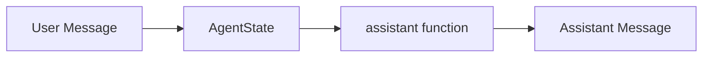
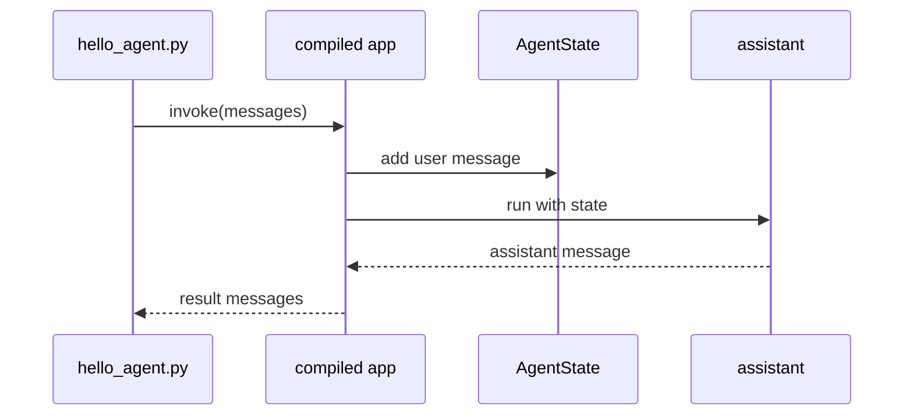

# First Python agent

Start with a graph that does not call an external model. This verifies your AgentFlow install and the current import paths before you add provider credentials.

This page runs the graph directly in Python:



Create `hello_agent.py`:

```python
from agentflow.core.graph import StateGraph
from agentflow.core.state import AgentState, Message
from agentflow.utils import END


def assistant(state: AgentState) -> Message:
    latest = state.context[-1].text()
    return Message.text_message(
        f"AgentFlow received: {latest}",
        role="assistant",
    )


graph = StateGraph(AgentState)
graph.add_node("assistant", assistant)
graph.set_entry_point("assistant")
graph.add_edge("assistant", END)

app = graph.compile()

result = app.invoke(
    {"messages": [Message.text_message("Ship the golden path docs.")]},
    config={"thread_id": "get-started-demo"},
)

print(result["messages"][-1].text())
```

Run it:

```bash
python hello_agent.py
```

Expected output:

```text
AgentFlow received: Ship the golden path docs.
```

## What happened

The graph used the default `AgentState`, added one node, marked that node as the entry point, and ended after the node returned an assistant message.



The important current imports are:

```python
from agentflow.core.graph import StateGraph
from agentflow.core.state import AgentState, Message
from agentflow.utils import END
```

Keep the `config={"thread_id": "get-started-demo"}` value in the example. A thread ID lets the runtime group messages and state for a run, which becomes more important when you add checkpointing later.

## Next step

Expose the same graph with the API in [Expose with API](./expose-with-api.md).
