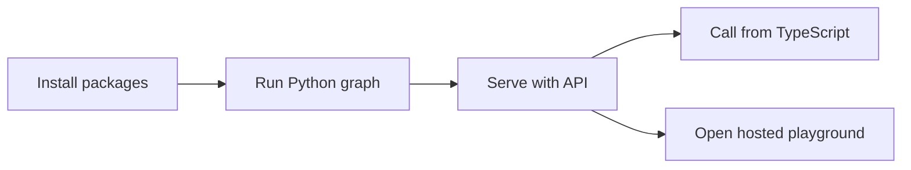
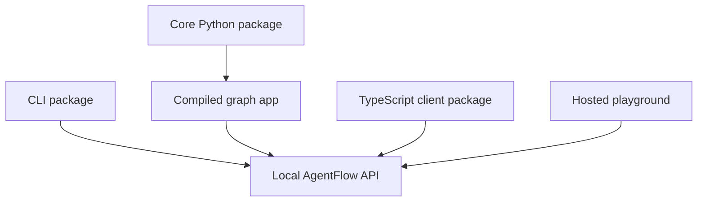

# Get started

This path takes you from a new project to a Python agent served by the AgentFlow API, tested in the hosted playground, and called from TypeScript.

It intentionally avoids advanced concepts. The goal is one working app first.



## Golden path

| Step | Page | Outcome |
| --- | --- | --- |
| 1 | [What is AgentFlow?](./what-is-agentflow.md) | Understand what AgentFlow provides before installing it. |
| 2 | [Installation](./installation.md) | Install the Python library, CLI, and TypeScript client. |
| 3 | [First Python Agent](./first-python-agent.md) | Run a minimal graph locally. |
| 4 | [Expose with API](./expose-with-api.md) | Serve the graph with `agentflow api`. |
| 5 | [Connect Client](./connect-client.md) | Call the API with `AgentFlowClient`. |
| 6 | [Open Playground](./open-playground.md) | Start the API and hosted playground with `agentflow play`. |

## Prerequisites

You need:

- Python 3.12 or newer.
- Node.js 20 or newer if you want to run the TypeScript client example.
- A terminal where you can install Python and npm packages.

The first local graph example does not call an LLM, so you can verify the framework before adding provider keys.

## How the pieces connect

The Python library owns the graph runtime. The CLI creates and serves a project around that graph. The TypeScript client and hosted playground both talk to the same local API server.



## Commands you will use

```bash
pip install 10xscale-agentflow 10xscale-agentflow-cli
npm install @10xscale/agentflow-client
agentflow init
agentflow api
agentflow play
```

## What you will have

By the end, you will have:

- A local `graph/react.py` file that exports `app`.
- An `agentflow.json` file that points the API to that graph.
- A running API server on `http://127.0.0.1:8000`.
- A hosted playground session opened by `agentflow play`.
- A minimal TypeScript `AgentFlowClient` call.

## Next step

Start with [What is AgentFlow?](./what-is-agentflow.md).
