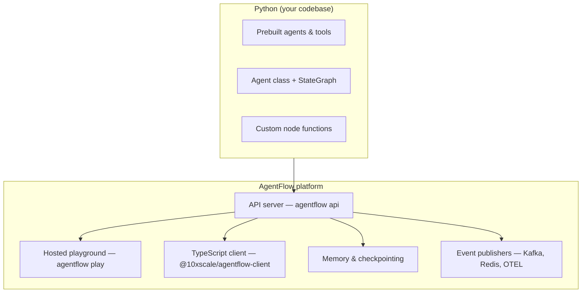

# Get started

Most AI agent libraries give you a way to call an LLM and chain some functions together. AgentFlow goes further — it gives you the entire vertical: a typed graph runtime in Python, a production-ready API server, a TypeScript client, and a hosted playground, all working together out of the box.

You write agent logic once. The rest of the stack — serving, threading, memory, streaming, authentication, observability — is already there.

## How the full stack fits together



The Python layer is where you define behavior. The platform layer handles everything around it.

## Three ways to build agents

AgentFlow is designed so you start simple and only reach for more power when you need it.

### Layer 1 — Prebuilt agents and tools

Drop-in agents for the most common patterns. Zero graph wiring required.

```python
from agentflow.prebuilt import ReactAgent

app = ReactAgent(
    model="gpt-4o",
    tools=[search, calculator],
).compile()
```

Available prebuilt agents: `ReactAgent`, `RAGAgent`, `RouterAgent`, `SupervisorTeam`, `Swarm`, `PlanActReflect`.  
Available prebuilt tools: web search, file operations, memory, URL fetch, handoff.

### Layer 2 — Agent class and StateGraph

When you need custom state, routing, multi-agent handoffs, or your own base class — drop down to `Agent` and `StateGraph`.

```python
from agentflow.core.graph import StateGraph, Agent, ToolNode
from agentflow.core.state import AgentState

graph = StateGraph(AgentState)
graph.add_node("agent", Agent(model="gpt-4o", tools=[search]))
graph.add_node("tools", ToolNode([search]))
graph.add_conditional_edges("agent", route_tools)
graph.add_edge("tools", "agent")
app = graph.compile()
```

Every prebuilt agent is built on this layer. You can subclass `BaseAgent` to swap in your own LLM call, validation logic, or execution strategy.

### Layer 3 — Custom node functions (advanced)

For full control, skip the `Agent` class entirely. Nodes are just async functions that read state and return updates. The graph calls them in sequence. No abstraction between you and the execution.

```python
async def my_node(state: AgentState) -> dict:
    ...
    return {"context": [...]}

graph.add_node("my_node", my_node)
```

This is covered in [How-to → Python Library → Advanced](/how-to/python).

## What the platform provides

Once your graph is defined, `agentflow api` wraps it in a production-ready HTTP server. You get:

| Capability | How |
|---|---|
| REST + streaming endpoints | Automatic, no extra code |
| Thread management | Each conversation gets a persistent thread ID |
| Long-term memory | Plug in Postgres, Qdrant, or Mem0 |
| Checkpointing | Resume interrupted runs across restarts |
| Authentication | API key or custom auth middleware |
| Rate limiting | Configurable per-route |
| Event publishing | Kafka, Redis, RabbitMQ, OpenTelemetry |
| Docker packaging | `agentflow docker` generates production Dockerfiles |

The TypeScript client (`@10xscale/agentflow-client`) and hosted playground (`agentflow play`) both call this same server. You can test in the playground during development and switch to the client in production without changing the server.

## Coding agent support (SKILL)

AgentFlow ships with native skill definitions (SKILL.md) for AI coding agents. When you open this project in Codex, Claude Code, or GitHub Copilot, the agent already understands AgentFlow's patterns, conventions, and best practices — so it generates correct graph code, not generic LLM wrapper code.

Run `agentflow skills` to see it in action

## Prerequisites

- Python 3.12 or newer
- Node.js 20 or newer (for the TypeScript client)
- An LLM provider API key (OpenAI or Google) — only needed when you make actual LLM calls

The first local example does not call an LLM, so you can verify the framework before adding credentials.

## Golden path

| Step | Page | Outcome |
|---|---|---|
| 1 | [What is AgentFlow?](./what-is-agentflow.md) | Understand the runtime model |
| 2 | [Installation](./installation.md) | Install Python library, CLI, and TypeScript client |
| 3 | [First Python Agent](./first-python-agent.md) | Run a graph locally |
| 4 | [Expose with API](./expose-with-api.md) | Serve the graph with `agentflow api` |
| 5 | [Connect Client](./connect-client.md) | Call the API from TypeScript |
| 6 | [Open Playground](./open-playground.md) | Chat with the agent in the hosted playground |

Start with [What is AgentFlow?](./what-is-agentflow.md).
