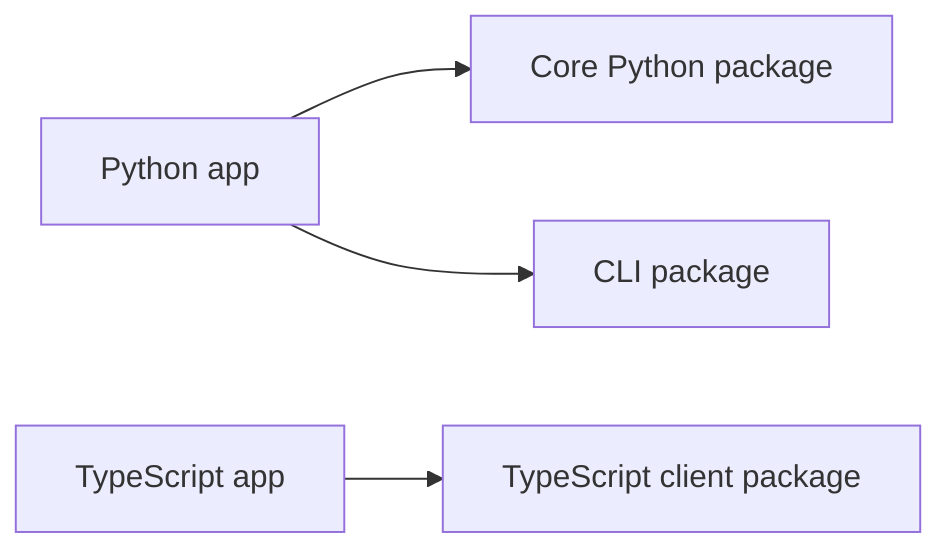

# Installation

Install the packages you need for the golden path.



## Python packages

Create a project folder and virtual environment:

```bash
mkdir hello-agentflow
cd hello-agentflow
python -m venv .venv
source .venv/bin/activate
```

Install the core Python library and CLI:

```bash
pip install 10xscale-agentflow 10xscale-agentflow-cli
```

Verify the CLI is available:

```bash
agentflow version
```

The core library gives you `StateGraph`, `AgentState`, and `Message`. The CLI gives you commands like `agentflow init`, `agentflow api`, and `agentflow play`.

## TypeScript client

If your app calls AgentFlow from TypeScript, install the client package:

```bash
npm install @10xscale/agentflow-client
```

You can do this in your application project or in a small Node.js test project.

The client package does not run your graph. It sends requests to a running AgentFlow API server.

## Model provider keys

The first Python example in this guide does not call a model. When you switch to an LLM-backed agent, set the credentials for the provider you use:

```bash
# OpenAI
export OPENAI_API_KEY="your-openai-key"

# Google Gemini (via Google AI Studio)
export GEMINI_API_KEY="your-gemini-key"

# Vertex AI (Gemini on Google Cloud)
export GOOGLE_CLOUD_PROJECT="your-gcp-project-id"
```

See the [Providers](../providers/index.md) section for per-provider setup, authentication, and full examples.

For this guide, provider keys are optional until you replace the demo node with an LLM-backed agent.

## Contributor workspace

If you are working inside the AgentFlow repository instead of a new app, use the shared repository virtual environment:

```bash
cd /Users/shudipto/Projects/agentflow
source /Users/shudipto/Projects/agentflow/.venv/bin/activate
```

Then move into the package you are changing before running package-specific commands:

```bash
cd agentflow
```

## Package roles

| Package | Install when |
| --- | --- |
| `10xscale-agentflow` | You build Python graphs, agents, tools, state, checkpointers, or storage. |
| `10xscale-agentflow-cli` | You want `agentflow init`, `agentflow api`, and `agentflow play`. |
| `@10xscale/agentflow-client` | You call an AgentFlow API from TypeScript. |

## Next step

Build your [first Python agent](./first-python-agent.md).
