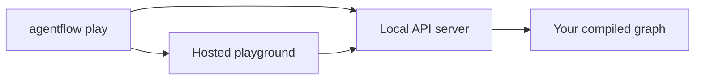
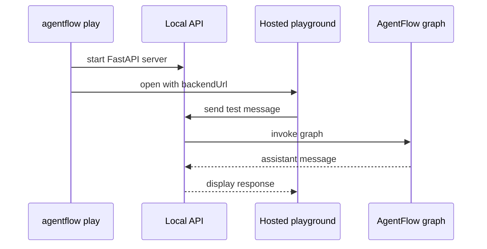

# Open playground

Use `agentflow play` to start the local API server and open the hosted playground for that API.

The playground is a hosted testing surface. Your graph still runs locally through the API server.



From the project folder that contains `agentflow.json`, run:

```bash
agentflow play --host 127.0.0.1 --port 8000
```

The CLI starts the same API server as `agentflow api`. When the server is reachable, it opens the hosted playground with your local backend URL attached.

The backend URL is passed to the hosted playground as a query parameter so the playground knows which local API to call.



## What not to run

For this get-started path, do not start a separate playground project. The playground entry point is only:

```bash
agentflow play
```

## If the browser does not open

Keep the `agentflow play` process running and open the URL printed by the CLI. It includes a `backendUrl` query parameter that points at your local API.

## What to test

In the playground, send:

```text
Hello from the playground.
```

The graph from this guide should respond with:

```text
AgentFlow API received: Hello from the playground.
```

## Next step

Now that the golden path works, continue with the beginner path or add a model-backed `Agent` node.
