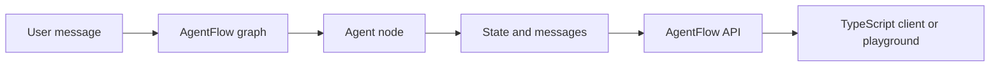
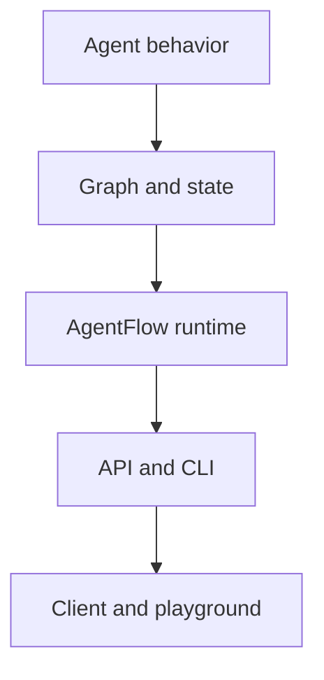

# What is AgentFlow?

AgentFlow is a framework for building agent applications that can grow from a local prototype into a production service.

It gives you a consistent structure for:

- Defining graph-based agent workflows.
- Passing typed state and messages between nodes.
- Adding tools and multi-agent routing.
- Persisting runs with checkpointers and storage.
- Exposing a graph through an API and CLI.
- Calling that API from TypeScript.
- Testing a running API in the hosted playground.

AgentFlow is not only a prompt helper. It is the runtime layer around an agent app: graph execution, state, API serving, and client integration.

## The short version

With AgentFlow, you write the agent behavior. The framework handles the reusable app plumbing around it.

## Runtime layers

In the get-started path, you only touch a small part of each layer. The same shape scales later when you add tools, streaming, storage, and production checkpointers.

| Layer | What it does in the golden path |
| --- | --- |
| Agent behavior | The `assistant` function reads the latest message and returns a response. |
| Graph and state | `StateGraph` controls execution and stores messages in `AgentState`. |
| Runtime | `app.invoke` or `app.ainvoke` runs the compiled graph. |
| API and CLI | `agentflow api` exposes the graph over HTTP. |
| Client and playground | TypeScript and the hosted playground call the same API. |

## What you build first

The golden path starts with a tiny Python graph:

- It receives a user message.
- It runs one node.
- It returns one assistant message.
- It can be served by the API.
- It can be called from TypeScript or opened in the hosted playground.

You will add model calls, tools, memory, streaming, and production checkpointers after the first app works.

## Next step

Install the packages in [Installation](./installation.md).
