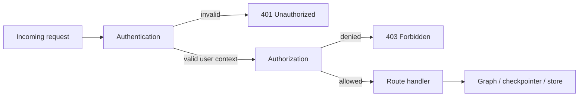
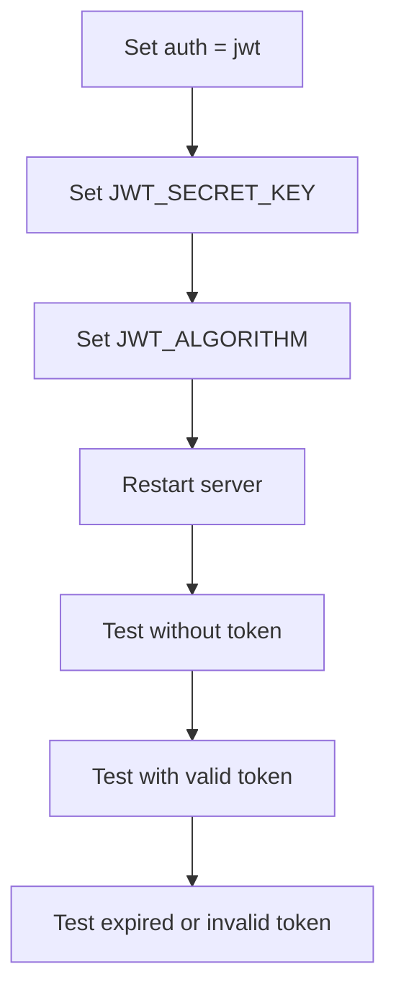
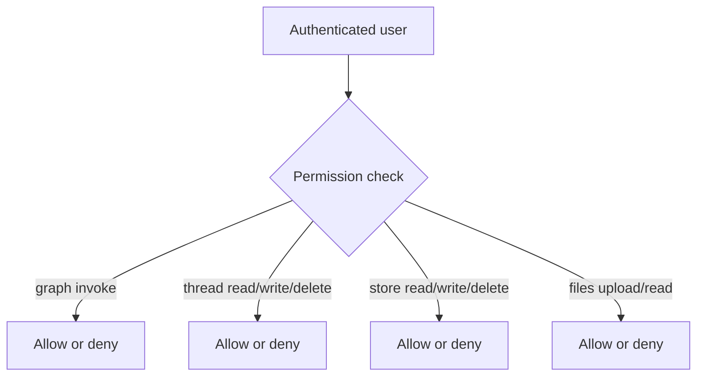

# Auth and authorization

This guide turns the authentication reference into production guidance. It focuses on practical deployment choices, testing steps, and common failure modes.

For API-level details, see [Authentication Reference](/docs/reference/api-cli/auth).

## Authentication vs authorization

- authentication answers: who is calling the API?
- authorization answers: what are they allowed to do?

In production, you often need both.

## Security model



## Recommended production choices

### Option 1: JWT auth for internal or frontend-backed apps

Use JWT when:

- your app already has an identity provider
- clients can attach bearer tokens
- you want a standard stateless pattern

Example `agentflow.json`:

```json
{
  "agent": "graph.react:app",
  "env": ".env",
  "auth": "jwt"
}
```

Required environment variables:

```bash
JWT_SECRET_KEY=replace-with-long-random-secret
JWT_ALGORITHM=HS256
```

Recommended production posture:

- use HTTPS everywhere
- use short-lived tokens
- rotate signing secrets intentionally
- avoid exposing anonymous graph invocation routes

### Option 2: custom auth for API keys or internal identity systems

Use custom auth when:

- you already have an existing auth service
- you need API-key-style access
- you want custom user context attached to requests

Example `agentflow.json`:

```json
{
  "agent": "graph.react:app",
  "auth": {
    "method": "custom",
    "path": "graph.auth:ApiKeyAuth"
  }
}
```

## JWT deployment checklist



### Verify JWT is actually enforced

Test without a token:

```bash
curl -X POST http://127.0.0.1:8000/v1/graph/invoke \
  -H "Content-Type: application/json" \
  -d '{"messages": [{"role": "user", "content": "hello"}], "config": {"thread_id": "t1"}}'
```

Expected result:

- HTTP `401`
- request is rejected before graph execution

Then test with a valid token:

```bash
curl -X POST http://127.0.0.1:8000/v1/graph/invoke \
  -H "Authorization: Bearer <token>" \
  -H "Content-Type: application/json" \
  -d '{"messages": [{"role": "user", "content": "hello"}], "config": {"thread_id": "t1"}}'
```

Expected result:

- HTTP `200`
- normal graph response

### Failure behavior to expect

| Symptom | Likely cause | Fix |
|---|---|---|
| `401 Unauthorized` on every request | missing bearer token or bad secret | verify token and `JWT_SECRET_KEY` |
| valid token still rejected | mismatched algorithm | verify `JWT_ALGORITHM` |
| works locally but fails in prod | production secret differs from issuer secret | align signing configuration |
| random auth failures after deploy | secret rotation not coordinated | rotate keys intentionally and update issuers/consumers together |

## Custom auth deployment checklist

If you implement a custom backend, make sure it is production-safe.

Your backend should:

- reject missing credentials clearly
- reject invalid credentials consistently
- return a minimal user context dict
- avoid blocking slow network lookups on every request if you can cache or validate efficiently
- never log raw secrets or tokens

Minimal custom auth shape:

```python
from agentflow_cli.src.app.core.auth.base_auth import BaseAuth


class ApiKeyAuth(BaseAuth):
    async def authenticate(self, request) -> dict | None:
        api_key = request.headers.get("X-API-Key")
        if not api_key:
            return None
        if api_key != "expected-key":
            return None
        return {"user_id": "service-user", "role": "service"}
```

## Authorization for permissions

Authentication alone is not enough if you want to restrict dangerous operations.

Examples of operations you may want to control more tightly:

- graph invocation
- graph streaming
- thread deletion
- message deletion
- memory store writes

Example authorization config:

```json
{
  "authorization": "graph.auth:my_authorization_backend"
}
```

## Permission boundaries



A good production pattern is:

- broad access for invoke/stream to app users
- stricter access for delete operations
- admin-only access for memory-store or management routes when needed

## Production recommendations

1. never run a public production API with `"auth": null`
2. require HTTPS in front of the API
3. disable `/docs` and `/redoc` on public deployments unless intentionally exposed
4. keep auth secrets outside version control
5. test both `401` and `403` paths before release

## Troubleshooting quick table

| Symptom | Cause | Fix |
|---|---|---|
| requests succeed without credentials | auth not enabled | set `auth` in `agentflow.json` and restart |
| `403 Forbidden` for valid users | authorization backend too restrictive | inspect backend rules and returned user context |
| frontend works locally but not in production | missing CORS origin or missing auth header forwarding | fix `ORIGINS` and proxy/header config |
| JWT works in curl but not in browser app | frontend is not attaching `Authorization` header | inspect client config and browser network tab |

## Related docs

- [Authentication Reference](/docs/reference/api-cli/auth)
- [Environment Variables](/docs/how-to/production/environment-variables)
- [API Server Troubleshooting](/docs/troubleshooting/api-server)

## What you learned

- How to choose between JWT and custom auth in production.
- Why authorization should be treated separately from authentication.
- How to validate that security controls are truly active after deployment.
