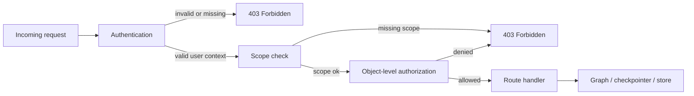
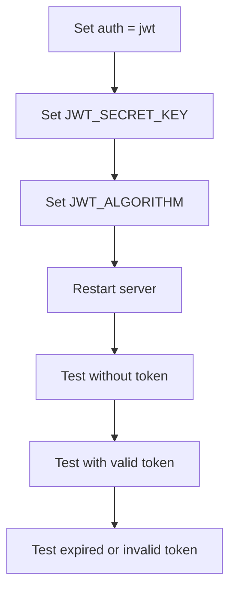
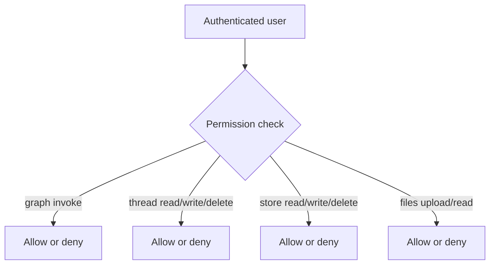

# Auth and authorization

This guide turns the authentication reference into production guidance. It focuses on practical deployment choices, testing steps, and common failure modes.

For API-level details, see [Authentication Reference](/docs/reference/api-cli/auth).

## Authentication vs authorization

- authentication answers: who is calling the API?
- authorization answers: what are they allowed to do?

In production, you often need both.

## Security model



:::note Everything is 403, not 401
The built-in JWT backend signals every failure with `UserAccountError`, which the error handler
returns as **HTTP 403** with a code in the body. Missing credentials, an expired token, and an
insufficient scope all produce 403; only the `error_code` distinguishes them. Do not build client
logic that keys on 401. On WebSocket routes the same failures become close code `1008`.
:::

## Recommended production choices

### Option 1: JWT auth for internal or frontend-backed apps

Use JWT when:

- your app already has an identity provider
- clients can attach bearer tokens
- you want a standard stateless pattern

Example `agentflow.json`:

```json
{
  "agent": "graph.react:app",
  "env": ".env",
  "auth": "jwt"
}
```

Required environment variables:

```bash
JWT_SECRET_KEY=replace-with-long-random-secret
JWT_ALGORITHM=HS256
```

Recommended production posture:

- use HTTPS everywhere
- use short-lived tokens
- rotate signing secrets intentionally
- avoid exposing anonymous graph invocation routes

### Option 2: custom auth for API keys or internal identity systems

Use custom auth when:

- you already have an existing auth service
- you need API-key-style access
- you want custom user context attached to requests

Example `agentflow.json`:

```json
{
  "agent": "graph.react:app",
  "auth": {
    "method": "custom",
    "path": "graph.auth:ApiKeyAuth"
  }
}
```

## JWT deployment checklist



### Verify JWT is actually enforced

Test without a token:

```bash
curl -X POST http://127.0.0.1:8000/v1/graph/invoke \
  -H "Content-Type: application/json" \
  -d '{"messages": [{"role": "user", "content": "hello"}], "config": {"thread_id": "t1"}}'
```

Expected result: **HTTP `403`**, with `REVOKED_TOKEN` in the body, and the request rejected before graph execution.

```json
{
  "error": {
    "code": "REVOKED_TOKEN",
    "message": "Invalid token, please login again",
    "details": []
  },
  "metadata": {"status": "error"}
}
```

With no `Authorization` header there is no credential to extract, so the backend raises immediately with `REVOKED_TOKEN`. The code reads oddly for a request that presented nothing at all, but it is the correct thing to assert on: it is what "no usable credential" produces. Assert on the status and the code, not on the message text, which is redacted differently under `MODE=production`.

Then test with a valid token:

```bash
curl -X POST http://127.0.0.1:8000/v1/graph/invoke \
  -H "Authorization: Bearer <token>" \
  -H "Content-Type: application/json" \
  -d '{"messages": [{"role": "user", "content": "hello"}], "config": {"thread_id": "t1"}}'
```

Expected result:

- HTTP `200`
- normal graph response

### Failure behavior to expect

Every row below is HTTP `403`; the `error.code` in the body is what tells them apart.

| `error.code` | Likely cause | Fix |
|---|---|---|
| `REVOKED_TOKEN` | No credential presented at all | Attach `Authorization: Bearer <token>`, or the `agentflow-bearer` subprotocol on a WebSocket |
| `EXPIRED_TOKEN` | `exp` is in the past | Refresh the token; check for clock skew between issuer and server |
| `INVALID_TOKEN` | Bad signature, mismatched algorithm, or **no `user_id` claim** | Verify `JWT_SECRET_KEY` and `JWT_ALGORITHM`; confirm the issuer emits `user_id`, not just `sub` |
| `JWT_SETTINGS_NOT_CONFIGURED` | `JWT_SECRET_KEY` or `JWT_ALGORITHM` unset at request time | Set both; the config load also checks them at startup |
| `Missing required scope: <resource>:<action>` | The identity carries scopes that do not include this endpoint's | Widen the role's scopes, or check that `scopes_for` is not returning an empty list |

Two claim requirements catch people out repeatedly:

- **`user_id` is mandatory** and `sub` is not accepted in its place. An identity provider that emits only `sub` needs a mapping step before the token reaches AgentFlow.
- **`exp` is mandatory.** Decoding uses `options={"require": ["exp"]}`, so a non-expiring token is rejected rather than accepted forever.

Other recurring causes:

| Symptom | Likely cause | Fix |
|---|---|---|
| Works locally but fails in production | Production secret differs from the issuer's | Align signing configuration |
| Random auth failures after a deploy | Uncoordinated secret rotation | Rotate keys intentionally and update issuers and consumers together |
| `ImportError` mentioning PyJWT | The `jwt` extra is not installed | `pip install "10xscale-agentflow-cli[jwt]"` |

## Custom auth deployment checklist

If you implement a custom backend, make sure it is production-safe.

Your backend should:

- reject missing credentials clearly
- reject invalid credentials consistently
- return a minimal user context dict
- avoid blocking slow network lookups on every request if you can cache or validate efficiently
- never log raw secrets or tokens

Minimal custom auth shape. `authenticate` is **synchronous** and takes
`(request, response, credential)` — declaring it `async def` returns an un-awaited coroutine
and breaks auth silently.

```python
from typing import Any

from fastapi import Request, Response
from fastapi.security import HTTPAuthorizationCredentials

from agentflow_cli import BaseAuth


class ApiKeyAuth(BaseAuth):
    def authenticate(
        self,
        request: Request,
        response: Response,
        credential: HTTPAuthorizationCredentials | None,
    ) -> dict[str, Any] | None:
        # API keys ride in a custom header, not the bearer credential — read headers directly.
        api_key = request.headers.get("X-API-Key")
        if not api_key or api_key != "expected-key":
            return None
        return {"user_id": "service-user", "role": "service"}
```

## Authorization

Authentication alone is not enough if you want to restrict dangerous operations or keep each
user's threads private. Authorization is configured separately, via the `authorization` key.

### Owner-only access is the production default

The framework ships an `ownership` backend that makes a thread accessible **only to the user
who created it** — read, stream, stop, fix, delete, and even a fresh `invoke`/`stream` on
someone else's thread are all rejected up front with 403, before the model runs. With
`MODE=production` this is the **default**: object-level isolation is enforced even if you never
set `authorization`. Development defaults to `allow_all` for frictionless local iteration. Your
explicit choice always wins.

```json
{ "agent": "graph.react:app", "auth": "jwt", "authorization": "ownership" }
```

It is **scalable** — ownership is immutable, so it is cached by `ThreadOwnershipResolver`:
a bounded in-process LRU (10,000 entries, no expiry) in front of an optional shared Redis tier
(key prefix `af:authz:owner`, also no expiry). After the first lookup an authorization check is an
in-memory hit, not a database round-trip per request. Negative results are never cached, so a
thread that does not exist yet cannot be mistakenly attributed to a later caller.

Ownership resolves from `BaseCheckpointer.aget_thread_owner` on a checkpointer that implements it
(Postgres, SQLite, in-memory). With none configured there are no persisted threads to protect, so
requests pass through with a warning.

### Operational requirements for ownership

Three things to get right when running ownership in production:

1. **Give the L2 cache a Redis.** Set `redis` in `agentflow.json`, or `REDIS_URL` in the
   environment. Without one, every worker keeps its own L1 cache and each pays its own first
   database lookup per thread. If the `redis` package is not installed the server logs a warning
   at startup and runs L1-only; watch for that line after a dependency change.
2. **Evict on delete.** The server does this for you when a thread is deleted through
   `DELETE /v1/threads/{thread_id}`. If you delete threads out of band, straight from the
   database, the cached owner survives and the id cannot be reused by a different user until the
   process restarts.
3. **Close on shutdown.** The lifespan handler calls `aclose()` on the backend, which closes the
   L2 client. A custom backend that opens its own connections must implement `aclose()` or leak
   them across reloads.

If you write a caching authorization backend of your own, implement both `evict(thread_id)` and
`aclose()`. They are the contract the server calls into.

### Role-based access control

For roles → scopes without writing code, use the RBAC config block. It layers scope enforcement
on top of owner-only isolation:

```json
{
  "authorization": {
    "backend": "rbac",
    "roles": {
      "admin":  ["*"],
      "member": ["graph:invoke", "graph:stream", "graph:read", "checkpointer:read"]
    },
    "default_scopes": ["graph:read"],
    "isolation": "owner"
  }
}
```

This loads `RoleBasedAuthorizationBackend`. `backend` also accepts `"role_based"` or `"roles"`,
`type` is an accepted alias for `backend`, and `role_scopes` is an accepted alias for `roles` —
useful to know when reading someone else's config, but pick one spelling and stay with it.

An endpoint requires the scope `"<resource>:<action>"` (for example `graph:invoke`,
`checkpointer:delete`). A role granting `"*"` gets every scope. `default_scopes` is granted to
everyone, including a user with no role at all.

Available scopes: `graph:{invoke,stream,stop,fix,setup,read}`,
`checkpointer:{read,write,delete}`, `store:{read,write,delete}`, `files:{upload,read}`,
`config:read`.

:::warning An empty scope list denies everything
Scopes resolve from `scopes_for` on the authorization backend first, and fall back to the
identity's own `scopes` claim only when that returns `None`. The three outcomes are not
interchangeable:

- `None` means unrestricted; the check is skipped. This is why nothing breaks before you issue
  scopes.
- A non-empty list restricts to exactly those pairs.
- An **empty list denies every endpoint**, because no required scope can be a member of it.

`RoleBasedAuthorizationBackend.scopes_for` always returns a list, never `None`. So the moment you
switch to RBAC, a user whose role is not in the `roles` table and for whom `default_scopes` is
empty is locked out of everything. Give `default_scopes` a sensible floor, and roll RBAC out
against a staging environment first.
:::

### Custom authorization backend

For arbitrary rules, point `authorization` at your own class:

```json
{ "authorization": "graph.auth:my_authorization_backend" }
```

See the [Authentication reference](/docs/reference/api-cli/auth) for the full
`AuthorizationBackend` interface (`authorize`, `isolation_scope`, `scopes_for`).

### Data isolation is enforced in the storage layer too

API-layer checks (ownership, scopes) decide *access*. The **data layer** (checkpointer, store)
enforces *isolation* from a trusted policy the server stamps after each successful check:
`user["authz"] = {user_id, scope, scopes}`, where `scope` comes from the backend's
`isolation_scope()` (`"owner"` or `"none"`). Every service copies that trusted `user` into
`config["user"]`, so the policy reaches the core library and cannot be forged by the client —
with `owner` scope, the checkpointer and store partition every row to the caller.

## Permission boundaries



A good production pattern is:

- broad access for invoke/stream to app users
- stricter access for delete operations
- admin-only access for memory-store or management routes when needed

## The server refuses to boot with an unprotected route

Every non-public route must carry a `RequirePermission` dependency. That is checked once at
startup, after the routers are mounted. If a route is missing its guard the server raises and
does not start:

```
RuntimeError: Refusing to start: the following routes are not protected by RequirePermission.
Add the dependency, or add the path to the public allowlist if it is intentionally open:
  - POST /v1/my-new-endpoint
```

This is the failure you want: a forgotten guard becomes a loud deploy-time error instead of a
silent open endpoint. If you hit it after adding a route of your own, add the dependency rather
than widening the allowlist.

Exactly three paths are public: `/ping`, `/v1/evals/runs`, and `/v1/evals/runs/{run_id}`.

:::warning The eval endpoints are unauthenticated
`/v1/evals/runs*` serves the contents of `eval_reports/` to anyone who can reach the port,
regardless of your `auth` setting. Before deploying, either keep `eval_reports/` out of the image
and working directory, or block `/v1/evals/*` at your ingress. See
[REST API: Evals](/docs/reference/rest-api/evals).
:::

## Production recommendations

1. never run a public production API with `"auth": null`
2. require HTTPS in front of the API
3. disable `/docs` and `/redoc` on public deployments unless intentionally exposed
4. keep auth secrets outside version control
5. block or remove the public eval endpoints
6. test both the rejected and the accepted paths before release, asserting on `error.code` rather than on 401 versus 403

## Troubleshooting quick table

| Symptom | Cause | Fix |
|---|---|---|
| requests succeed without credentials | auth not enabled | set `auth` in `agentflow.json` and restart; the server logs a warning at startup when auth is disabled |
| `403 Forbidden` for valid users | authorization backend too restrictive, or an empty resolved scope list | inspect backend rules and the returned user context; check `default_scopes` |
| `403 Missing required scope: ...` | the identity's scopes do not cover this endpoint | add the `"<resource>:<action>"` pair to the role, or to `default_scopes` |
| user cannot read a thread they created | a different `user_id` between the two requests, or the thread was created before auth was enabled | check the `user_id` claim is stable across token refreshes |
| ownership seems not to apply | the checkpointer does not implement `aget_thread_owner`, or none is configured | look for the "cannot resolve thread ownership" warning in the logs and switch to a checkpointer that supports it |
| WebSocket closes immediately with `1008` | auth or authorization rejected at the handshake | check the token transport; browsers should use the `agentflow-bearer` subprotocol |
| frontend works locally but not in production | missing CORS origin or missing auth header forwarding | fix `ORIGINS` and proxy/header config |
| JWT works in curl but not in browser app | frontend is not attaching `Authorization` header | inspect client config and browser network tab |

## Related docs

- [Authentication Reference](/docs/reference/api-cli/auth)
- [Environment Variables](/docs/how-to/production/environment-variables)
- [API Server Troubleshooting](/docs/troubleshooting/api-server)

## What you learned

- How to choose between JWT and custom auth in production.
- Why authorization should be treated separately from authentication.
- How to validate that security controls are truly active after deployment.
