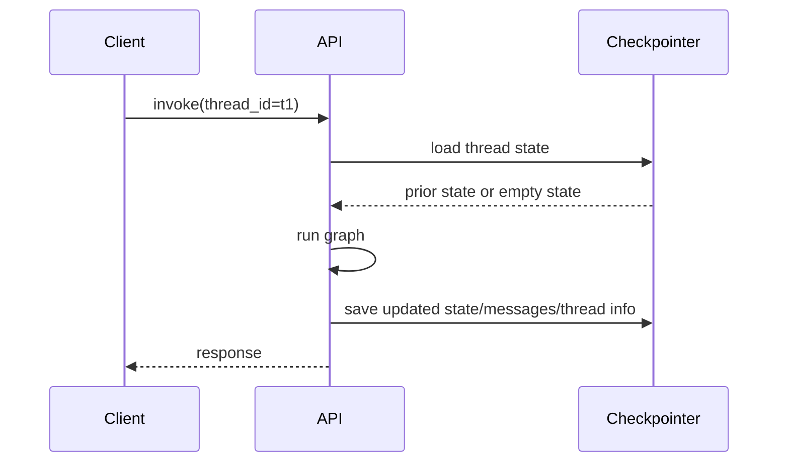
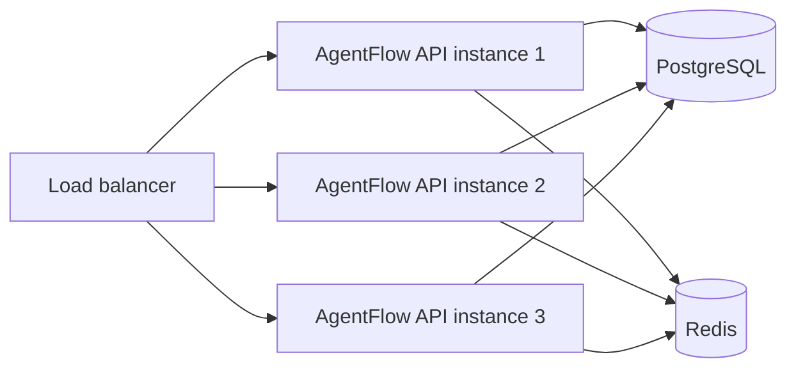

# Checkpointing

Checkpointing is what makes threads durable. Without it, every request is effectively stateless. With it, the API can remember prior messages, state snapshots, and thread metadata across requests.

## Development vs production choice

Use:

- `InMemoryCheckpointer` for local development and tests
- `PgCheckpointer` for production or any multi-instance deployment

## Checkpoint lifecycle



## Development setup

For local work:

```python
from agentflow.storage.checkpointer import InMemoryCheckpointer

my_checkpointer = InMemoryCheckpointer()
```

```json
{
  "agent": "graph.react:app",
  "checkpointer": "graph.dependencies:my_checkpointer"
}
```

This is perfect when you want:

- quick startup
- no external services
- disposable state

Do not use it in production because all state disappears on process restart and cannot be shared across workers.

## Production setup

For durable, shared state use `PgCheckpointer`.

Example shape:

```python
from agentflow.storage.checkpointer import PgCheckpointer

my_checkpointer = PgCheckpointer(
    postgres_dsn="postgresql://user:password@db/agentflow",
    redis_url="redis://redis:6379/0",
)
```

Then point `agentflow.json` to it:

```json
{
  "agent": "graph.react:app",
  "checkpointer": "graph.dependencies:my_checkpointer"
}
```

Why this is the production choice:

- survives restarts
- supports multiple app instances
- gives shared thread/message/state storage
- separates fast access and durable storage concerns

## Deployment topology



If you want multiple API instances, they must share the same durable checkpointer backend.

## Verification steps

After enabling checkpointing, verify actual thread persistence.

### 1. Invoke the graph with a thread ID

```bash
curl -X POST http://127.0.0.1:8000/v1/graph/invoke \
  -H "Content-Type: application/json" \
  -d '{"messages": [{"role": "user", "content": "Remember my name is Alice"}], "config": {"thread_id": "demo-thread"}}'
```

### 2. Send a follow-up request with the same thread ID

```bash
curl -X POST http://127.0.0.1:8000/v1/graph/invoke \
  -H "Content-Type: application/json" \
  -d '{"messages": [{"role": "user", "content": "What is my name?"}], "config": {"thread_id": "demo-thread"}}'
```

### 3. Inspect thread endpoints

```bash
curl http://127.0.0.1:8000/v1/threads
curl http://127.0.0.1:8000/v1/threads/demo-thread/messages
curl http://127.0.0.1:8000/v1/threads/demo-thread/state
```

If checkpointing is working, these endpoints should return persisted data instead of empty results.

## Production recommendations

1. never rely on in-memory persistence for public or shared deployments
2. use one shared durable backend across all workers
3. test restart behavior before release
4. monitor database and Redis connectivity as first-class dependencies
5. back up your database if thread history matters operationally or legally

## Common failure modes

| Symptom | Cause | Fix |
|---|---|---|
| thread history disappears after restart | using `InMemoryCheckpointer` | switch to `PgCheckpointer` |
| one worker sees state and another does not | workers are not sharing the same backend | point all instances at the same Postgres/Redis |
| `/v1/threads` returns errors | database or checkpointer config issue | validate DSN, connectivity, and startup logs |
| request works but no thread data appears later | missing or inconsistent `thread_id` | use a stable `thread_id` per conversation |

## Related docs

- [Checkpointing and Threads](/docs/concepts/checkpointing-and-threads)
- [Configure agentflow.json](/docs/how-to/api-cli/configure-agentflow-json)
- [Deployment](/docs/how-to/production/deployment)

## What you learned

- When in-memory checkpointing is enough and when it is not.
- How durable checkpointing supports production thread persistence.
- How to verify checkpointing with real API calls instead of assumptions.
