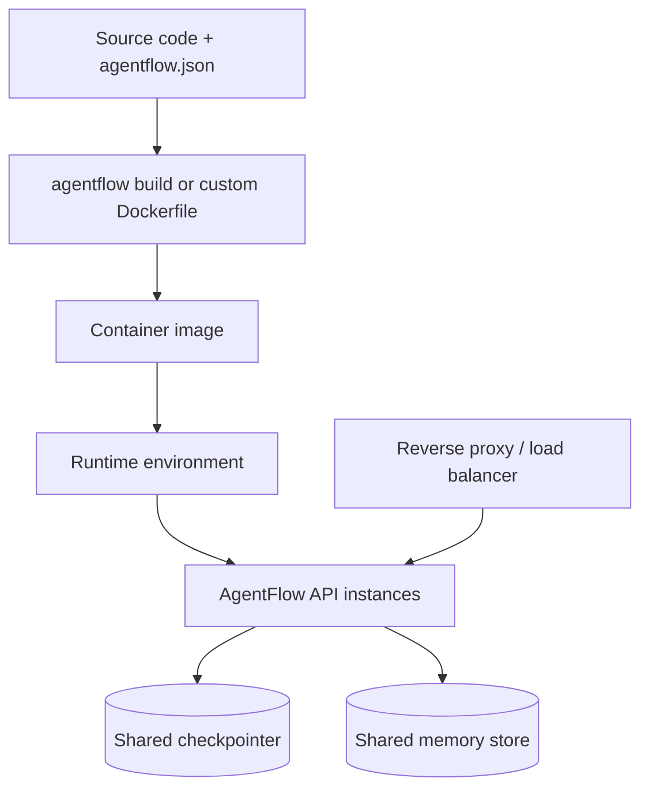
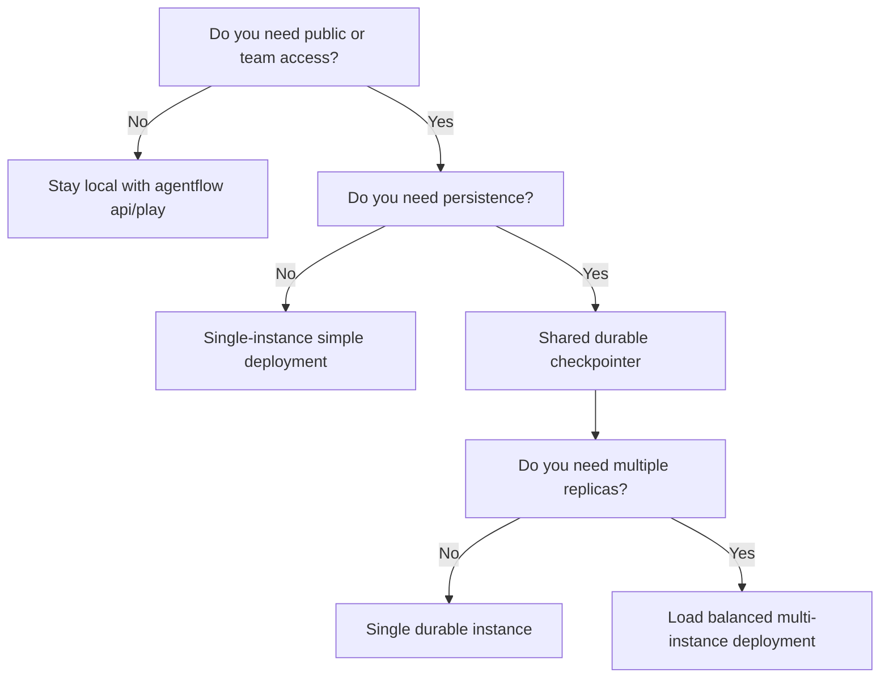

# Deployment

This page is the sprint 10 production deployment guide. It focuses on the decisions teams need once an agent moves beyond local testing.

If you need generated container files, start with [Generate Docker Files](/docs/how-to/api-cli/generate-docker-files).

## Production deployment model



## Development defaults vs production settings

| Area | Development default | Production recommendation |
|---|---|---|
| host | `127.0.0.1` or local-only use | `0.0.0.0` behind a proxy/load balancer |
| reload | enabled during iteration | `--no-reload` |
| checkpointer | in-memory or omitted | shared durable backend |
| docs endpoints | enabled | disable or restrict |
| auth | often disabled locally | enable auth for public or shared deployments |
| playground | `agentflow play` | use only for testing, not as your deployment model |

## Minimum production command

```bash
MODE=production agentflow api --no-reload --host 0.0.0.0 --port 8000
```

This is the baseline, not the full story. A production-ready deployment usually also needs:

- a reverse proxy or ingress
- durable checkpointing
- environment-based secret injection
- auth enabled
- health checks

## Container path

If you want the fastest path to a deployable image:

```bash
agentflow build --docker-compose
```

Then review the generated files and run them with production environment values.

Use the dedicated guide for the actual generated file format:

- [Generate Docker Files](/docs/how-to/api-cli/generate-docker-files)

## Core production checklist

### 1. Run with no reload

Do not use file watching in production.

```bash
agentflow api --no-reload
```

### 2. Use shared persistence

If your deployment has more than one instance, they must share persistence backends.

- shared checkpointer for threads and messages
- shared store for long-term memory if used

### 3. Secure the API

Before public deployment:

- enable auth
- restrict `ORIGINS`
- disable public docs endpoints if appropriate
- use HTTPS through a proxy or load balancer

### 4. Verify health and startup

At minimum, verify:

```bash
curl http://127.0.0.1:8000/ping
curl http://127.0.0.1:8000/v1/graph
```

### 5. Test restart behavior

A deployment is not production-ready until you confirm:

- restart does not lose important thread state
- all instances can read shared state
- auth still works after restart

## Deployment decision tree



## Reverse proxy considerations

Most production deployments sit behind a reverse proxy or ingress.

Plan for:

- HTTPS termination
- forwarded headers
- optional `ROOT_PATH` if served under a subpath
- request body limits appropriate for media or large inputs

## Release verification checklist

Before shipping a deployment, verify:

1. `GET /ping` succeeds
2. `GET /v1/graph` succeeds
3. auth-protected routes reject missing credentials
4. valid credentials work
5. thread persistence survives a restart
6. `/docs` and `/redoc` exposure matches your policy
7. browser clients from allowed origins can connect
8. browser clients from disallowed origins cannot connect

## Common mistakes

- treating `agentflow play` as a deployment strategy instead of a testing workflow
- deploying multiple instances with in-memory checkpointing
- leaving `--reload` enabled in containers
- exposing public docs endpoints without deciding to do so intentionally
- deploying without verifying restart behavior and thread continuity

## Related docs

- [Generate Docker Files](/docs/how-to/api-cli/generate-docker-files)
- [Environment Variables](/docs/how-to/production/environment-variables)
- [Checkpointing](/docs/how-to/production/checkpointing)
- [Production Troubleshooting](/docs/how-to/production/troubleshooting)

## What you learned

- Which settings turn a local AgentFlow API into a production service.
- Why persistence, auth, and restart testing matter as much as the startup command.
- How `agentflow build` fits into the deployment path.
