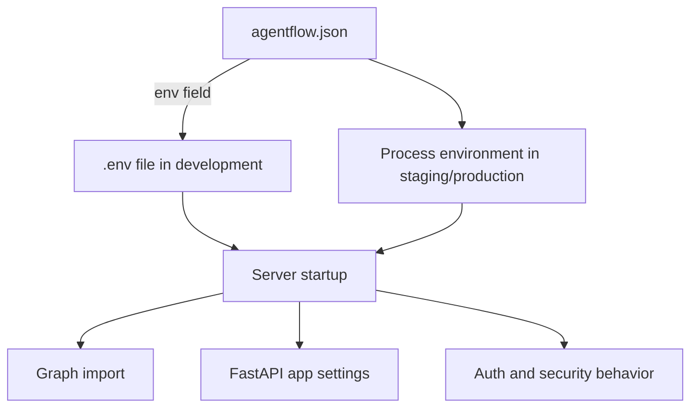

# Environment variables

This guide explains which environment variables matter in production, how to set them safely, and how to distinguish local development defaults from production-ready values.

For the complete variable reference, see [Environment Variables](/docs/reference/api-cli/environment).

## What this page covers

You will learn how to:

- decide which variables belong in `.env` versus the process environment
- keep development defaults out of production
- set secure values for auth, CORS, API docs, and runtime behavior
- verify that your deployment is using the values you expect

## Configuration flow



## Development vs production

The most important production rule is simple:

- use `.env` files for local development convenience
- use real process or container environment variables in production

### Development pattern

```json
{
  "agent": "graph.react:app",
  "env": ".env"
}
```

```bash
GOOGLE_API_KEY=...
JWT_SECRET_KEY=dev-only-secret
MODE=development
```

This is convenient because the CLI loads `.env` before importing your graph.

### Production pattern

```bash
export MODE=production
export JWT_SECRET_KEY='long-random-secret'
export JWT_ALGORITHM=HS256
export ORIGINS=https://app.example.com
export DOCS_PATH=
export REDOCS_PATH=
agentflow api --no-reload --host 0.0.0.0 --port 8000
```

In production, secrets should come from:

- container environment settings
- platform secret managers
- Kubernetes Secrets
- cloud runtime configuration

## High-priority variables

These are the variables most teams should review before production launch.

| Variable | Development default / common value | Production recommendation |
|---|---|---|
| `MODE` | `development` | Set `production` |
| `LOG_LEVEL` | `INFO` or `DEBUG` | Usually `INFO` or `WARNING` |
| `IS_DEBUG` | `true` | Disable debug output |
| `ORIGINS` | `*` during local testing | Restrict to known domains |
| `JWT_SECRET_KEY` | simple local secret | long random secret from secret manager |
| `JWT_ALGORITHM` | `HS256` | explicit value, usually `HS256` |
| `DOCS_PATH` | `/docs` | empty or internal-only |
| `REDOCS_PATH` | `/redoc` or `/redocs` | empty or internal-only |
| `ROOT_PATH` | `/` | set when serving behind a reverse proxy subpath |

## Security-related environment variables

### `MODE`

Use:

```bash
MODE=production
```

Why it matters:

- signals that the server is no longer running in a development context
- pairs naturally with `--no-reload`
- helps teams avoid accidentally keeping insecure defaults

### `ORIGINS`

Development often uses:

```bash
ORIGINS=*
```

Production should not.

Use:

```bash
ORIGINS=https://app.example.com,https://admin.example.com
```

If you leave `ORIGINS=*` in production, any website can attempt browser-based requests to your API.

### `DOCS_PATH` and `REDOCS_PATH`

Development:

```bash
DOCS_PATH=/docs
REDOCS_PATH=/redoc
```

Production recommendation:

```bash
DOCS_PATH=
REDOCS_PATH=
```

That disables public interactive API documentation unless you intentionally expose it.

### `JWT_SECRET_KEY` and `JWT_ALGORITHM`

Only required when `auth` is set to `"jwt"` in `agentflow.json`.

Use explicit values:

```bash
JWT_SECRET_KEY=replace-with-a-long-random-secret
JWT_ALGORITHM=HS256
```

Do not:

- commit these values to git
- embed them into Dockerfiles
- reuse weak development keys in production

## Runtime and routing variables

### `ROOT_PATH`

Use this when your app is mounted under a subpath such as `/agentflow` behind a reverse proxy.

```bash
ROOT_PATH=/agentflow
```

Without the correct `ROOT_PATH`, generated docs links and some proxied request handling may behave incorrectly.

### `LOG_LEVEL`

Good defaults:

- development: `DEBUG` or `INFO`
- production: `INFO` or `WARNING`

Too much debug logging in production can expose sensitive request details and add noise when you need logs for real incidents.

## Example production environment file

This is a deploy-time example, not something to commit:

```bash
MODE=production
LOG_LEVEL=INFO
IS_DEBUG=false
ORIGINS=https://app.example.com
ALLOWED_HOST=api.example.com
JWT_SECRET_KEY=replace-with-secret-manager-value
JWT_ALGORITHM=HS256
DOCS_PATH=
REDOCS_PATH=
ROOT_PATH=/
```

## Verification checklist

After deployment, verify:

1. `GET /ping` succeeds
2. browser requests from allowed origins work
3. browser requests from disallowed origins fail
4. `/docs` and `/redoc` are disabled if intended
5. JWT-protected endpoints reject missing or invalid tokens
6. logs do not show debug-only noise or secrets

## Common mistakes

- Shipping `.env` files inside container images.
- Leaving `ORIGINS=*` in production.
- Forgetting to disable docs endpoints on public deployments.
- Setting `MODE=production` but still running `agentflow api --reload`.
- Mixing local secrets and production secrets in the same config file.

## Related docs

- [Environment Variables Reference](/docs/reference/api-cli/environment)
- [Deployment](/docs/how-to/production/deployment)
- [Auth and Authorization](/docs/how-to/production/auth-and-authorization)

## What you learned

- Which environment variables have the biggest production impact.
- How to separate development convenience from production safety.
- How to verify that deployed environment settings are actually in effect.
