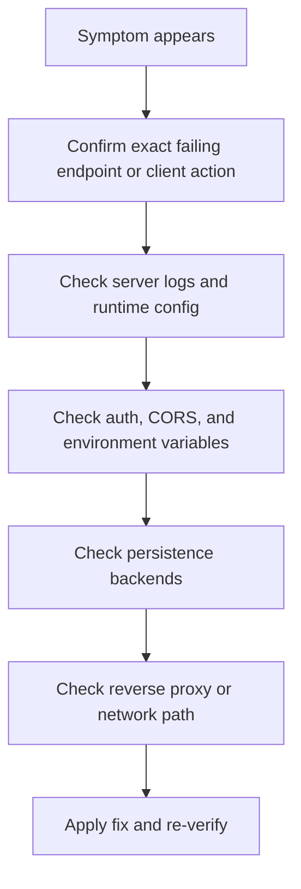

# Production troubleshooting

This page focuses on issues that usually appear after an agent leaves local development: deployment failures, state drift, auth mismatches, and cross-service connectivity problems.

If you need a narrower troubleshooting guide, use the dedicated pages:

- [Installation](/docs/troubleshooting/installation)
- [API Server](/docs/troubleshooting/api-server)
- [Client](/docs/troubleshooting/client)
- [Playground](/docs/troubleshooting/playground)

## Production troubleshooting workflow

## Issue: deployment starts but requests fail immediately

**Symptoms**

- `/ping` works but graph routes fail
- first invoke request returns 500
- logs mention import or dependency errors

**Likely causes**

- graph import path is wrong in `agentflow.json`
- environment variables required by the graph are missing
- production image does not include all dependencies

**Fix**

- verify `python -c "from graph.react import app; print(app)"`
- verify deploy-time secrets are present
- verify the image or runtime installed all required Python packages

## Issue: threads vanish after restart

**Symptoms**

- conversation history works until the process restarts
- `/v1/threads` becomes empty after deployment recycle

**Likely cause**

- `InMemoryCheckpointer` is still being used

**Fix**

- switch to a durable shared checkpointer such as `PgCheckpointer`
- verify restart behavior before re-releasing

## Issue: one replica sees thread history and another does not

**Symptoms**

- state appears inconsistent across instances
- one request remembers context, the next does not

**Likely cause**

- instances are not sharing the same persistence backend

**Fix**

- point all replicas to the same Postgres/Redis-backed checkpointer
- confirm the same `thread_id` is being used by the caller

## Issue: auth works in curl but fails in browser clients

**Symptoms**

- curl with bearer token succeeds
- frontend requests fail or never send credentials

**Likely causes**

- browser client is not attaching the auth header
- proxy strips `Authorization`
- CORS configuration blocks browser requests

**Fix**

- inspect the browser network tab
- verify frontend client config
- verify proxy forwards `Authorization`
- verify `ORIGINS` includes the real frontend origin

## Issue: production deployment exposes too much

**Symptoms**

- `/docs` and `/redoc` are publicly reachable
- cross-origin browser access is broader than intended

**Likely causes**

- `DOCS_PATH` / `REDOCS_PATH` still enabled
- `ORIGINS=*` still set

**Fix**

- disable docs endpoints or restrict exposure intentionally
- replace wildcard origins with explicit domains

## Issue: requests time out only in production

**Symptoms**

- local requests are fine
- deployed requests are slow or timing out

**Likely causes**

- external tools or providers are slower in the deployed environment
- reverse proxy timeouts are too aggressive
- graph is making too many sequential calls

**Fix**

- inspect server logs for slow nodes or tools
- tune proxy timeout settings
- prefer streaming where appropriate
- reduce expensive tool-call chains if possible

## Issue: `agentflow play` works locally but deployed users cannot connect

**Symptoms**

- local playground sessions are fine
- deployed frontend or shared users fail to connect reliably

**Likely cause**

- `agentflow play` was used as a testing tool, but the deployed system needs a proper hosted API endpoint and browser-safe networking setup

**Fix**

- deploy with `agentflow api` behind HTTPS and correct CORS/auth settings
- treat `agentflow play` as an interactive test path, not the deployment architecture

## Quick production checklist

1. confirm exact runtime command
2. confirm active `agentflow.json`
3. confirm environment variables in the live process
4. confirm auth and CORS behavior from a real client
5. confirm persistence with restart testing
6. confirm proxy and network path

## Related docs

- [Deployment](/docs/how-to/production/deployment)
- [Environment Variables](/docs/how-to/production/environment-variables)
- [API Server Troubleshooting](/docs/troubleshooting/api-server)

## What you learned

- How to troubleshoot production failures by separating runtime, config, network, auth, and persistence layers.
- Which failures are usually caused by development defaults leaking into production.
