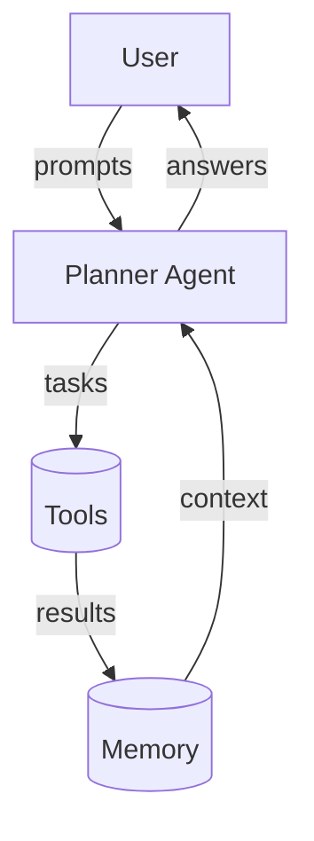

# AgentFlow Docs

Welcome! This site is built with MkDocs and Material, managed via uv.

- Beautiful UI using Material for MkDocs
- Mermaid diagrams for agent/system graphs
- Ready for API docs with mkdocstrings (Python)

## Quick start

- Edit Markdown under `docs/`
- Navigation is defined in `mkdocs.yml`
- Start a local server with: `uv run mkdocs serve`

## Example: Mermaid diagram

