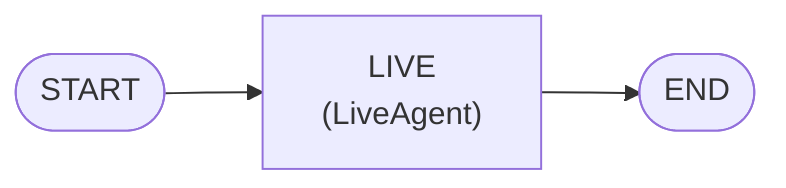

# AudioAgent

A prebuilt realtime audio-to-audio agent backed by Gemini Live — mirrors `ReactAgent`'s construction surface while wrapping a `LiveAgent` as the graph root.

**Import path:** `agentflow.prebuilt.agent`

---

## Concept

`AudioAgent` opens a persistent WebSocket to Gemini Live and runs a duplex audio session. Unlike `ReactAgent`, the provider owns the turn loop. Agentflow wraps it in a graph node (`LiveAgent`) and exposes a separate execution path — `arealtime()` — that drives the session.

### Session graph



The graph is a single node. The `LIVE -> END` edge exists only to satisfy graph validation; it is never traversed during a realtime session because `LiveAgent` holds the WebSocket for the full session lifetime.

### Tool loop

Tools are registered through a `ToolNode` at build time and advertised to the Gemini Live session at connect time. When the model requests a tool call, `LiveAgent` dispatches it through the same `ToolNode` path used by `ReactAgent` (parallel execution, callbacks, publisher events), then feeds the result back over the socket without interrupting the audio stream. Barge-in works normally — an `interrupted` event discards any in-flight tool result accumulation.

### System prompt and skills

`system_prompt`, `skills`, and `memory` are all supported. At connect time, the agent flattens them — including any `{field}` placeholder interpolation from `AgentState` — into a single `system_instruction` string sent to Gemini Live. This snapshot is fixed for the session; the model cannot receive a new system prompt mid-session. Dynamic behavior after connect goes through `set_skill` or memory tools.

### Execution path

A graph containing a `LiveAgent` must be driven with `arealtime()` (async generator) or `realtime()` (sync wrapper). Calling `invoke`, `ainvoke`, `stream`, or `astream` raises a `RuntimeError`.

### Transcripts and storage

Audio is never stored at rest. Finished speech turns are persisted as `Message` objects with `metadata={"modality": "audio"}` — both user (input transcription) and model (output transcription).

### Provider requirement

`LiveAgent` v1 resolves the provider from the model string and requires `"google"`. Passing any other provider string raises a `ValueError` at construction time.

---

## Installation

```bash
pip install "10xscale-agentflow[realtime]"
```

Set your credentials:

```bash
export GEMINI_API_KEY=your-api-key
```

For Vertex AI, set `GOOGLE_GENAI_USE_VERTEXAI=1` with standard ADC credentials.

---

## Constructor Parameters

| Parameter | Type | Default | Description |
|---|---|---|---|
| `model` | `str` | required | Gemini Live model identifier (e.g. `"gemini-live-2.5-flash-preview"`) |
| `realtime_config` | `RealtimeConfig \| None` | `None` | Voice, modalities, VAD, reconnect policy, and other session settings. If `None`, a `RealtimeConfig(model=model)` is created automatically. |
| `system_prompt` | `list[dict] \| None` | `None` | System-role messages. Flattened into `system_instruction` at connect time; supports `{field}` placeholders interpolated from state. |
| `tools` | `Iterable[Callable] \| None` | `None` | Tool functions exposed to the model. Executed by a `ToolNode` during the session. |
| `client` | `Any` | `None` | FastMCP client for MCP-hosted tools. |
| `pass_user_info_to_mcp` | `bool` | `False` | Forward `user_id` / `config` to MCP tool calls. |
| `skills` | `SkillConfig \| None` | `None` | Dynamic skill injection; flattened into `system_instruction` at connect. |
| `memory` | `MemoryConfig \| None` | `None` | Long-term semantic memory; preloaded into `system_instruction` at connect. |
| `realtime_client_factory` | `Callable[[], RealtimeClient] \| None` | `None` | Override the default `GeminiLiveClient` factory. Useful for testing or custom transport. |
| `live_node_name` | `str` | `"LIVE"` | Graph node name for the `LiveAgent` step. |
| `state` | `AgentState \| None` | `None` | Custom `AgentState` subclass. |
| `context_manager` | `BaseContextManager \| None` | `None` | Custom context manager (e.g. for context trimming across reseed). |
| `publisher` | `BasePublisher \| list[BasePublisher] \| None` | `None` | Event publisher(s) for observability. |
| `id_generator` | `BaseIDGenerator` | `DefaultIDGenerator()` | Snowflake / custom ID generator. |
| `container` | `Any \| None` | `None` | InjectQ DI container. |

---

## `compile()` Parameters

| Parameter | Type | Default | Description |
|---|---|---|---|
| `checkpointer` | `BaseCheckpointer` | `None` | Persist and restore transcripts and the session resumption handle across sessions. |
| `store` | `BaseStore` | `None` | Long-term cross-thread storage. |
| `callback_manager` | `CallbackManager` | default | Lifecycle hooks (`on_graph_start`, `on_graph_end`, `on_turn_start`, `on_turn_end`). |
| `shutdown_timeout` | `float` | `30.0` | Seconds to wait for clean shutdown. |

`compile()` does not accept `media_store`, `interrupt_before`, or `interrupt_after`. Realtime media (images, video frames) is sent directly to the model via `LiveInputQueue.send_image()` — it is never routed through a media store. Interrupt hooks are not applicable to the realtime execution path.

---

## Full Code

### Minimal example

```python
import asyncio
from agentflow.core.realtime.base import RealtimeConfig
from agentflow.core.realtime.queue import LiveInputQueue
from agentflow.prebuilt.agent import AudioAgent

MODEL = "gemini-live-2.5-flash-preview"

app = AudioAgent(
    MODEL,
    realtime_config=RealtimeConfig(model=MODEL, voice="Puck"),
    system_prompt=[{"role": "system", "content": "You are a concise voice assistant."}],
).compile()


async def main():
    queue = LiveInputQueue()
    queue.send_text("Hello, what can you do?")

    async for event in app.arealtime(queue, {"thread_id": "demo-1"}):
        if event.type == "output_transcript" and event.finished:
            print(f"agent: {event.text}")
        elif event.type == "turn_complete":
            queue.close()

    await app.aclose()


asyncio.run(main())
```

### With tools

```python
import asyncio
from agentflow.core.realtime.base import RealtimeConfig
from agentflow.core.realtime.queue import LiveInputQueue
from agentflow.prebuilt.agent import AudioAgent

MODEL = "gemini-live-2.5-flash-preview"


def get_weather(city: str) -> str:
    """Return the current weather for a city."""
    return f"Sunny, 24°C in {city}"


app = AudioAgent(
    MODEL,
    realtime_config=RealtimeConfig(model=MODEL, voice="Aoede"),
    system_prompt=[{
        "role": "system",
        "content": "You are a helpful voice assistant. Use tools when they help you answer.",
    }],
    tools=[get_weather],
).compile()


async def main():
    queue = LiveInputQueue()
    queue.send_text("What's the weather in Tokyo?")

    async for event in app.arealtime(queue, {"thread_id": "tools-1"}):
        if event.type == "tool_call":
            print(f"calling tool: {event.name}({event.args})")
        elif event.type == "tool_result":
            print(f"tool result: {event.result}")
        elif event.type == "output_transcript" and event.finished:
            print(f"agent: {event.text}")
        elif event.type == "turn_complete":
            queue.close()

    await app.aclose()


asyncio.run(main())
```

### With a checkpointer (persistent sessions)

A checkpointer stores both the transcript `Message` history and the session resumption handle. On reconnect, Agentflow either resumes via the provider handle (no reseed overhead) or falls back to replaying the full transcript into the new session.

```python
import asyncio
from agentflow.core.realtime.base import RealtimeConfig
from agentflow.core.realtime.queue import LiveInputQueue
from agentflow.prebuilt.agent import AudioAgent
from agentflow.storage.checkpointer import InMemoryCheckpointer

MODEL = "gemini-live-2.5-flash-preview"

checkpointer = InMemoryCheckpointer()

app = AudioAgent(
    MODEL,
    realtime_config=RealtimeConfig(model=MODEL, voice="Puck"),
).compile(checkpointer=checkpointer)


async def main():
    queue = LiveInputQueue()
    queue.send_text("Remember that my name is Alex.")

    async for event in app.arealtime(queue, {"thread_id": "persist-1"}):
        if event.type == "output_transcript" and event.finished:
            print(f"agent: {event.text}")
        elif event.type == "turn_complete":
            queue.close()

    await app.aclose()


asyncio.run(main())
```

### Handling barge-in

When the user speaks over the model, the provider emits an `interrupted` event. Discard any audio playback buffer on your side and resume listening.

```python
async for event in app.arealtime(queue, {"thread_id": "barge-1"}):
    if event.type == "audio_delta":
        playback_buffer.extend(event.data)
    elif event.type == "interrupted":
        playback_buffer.clear()   # flush in-flight model audio
    elif event.type == "turn_complete":
        pass  # flush and play remaining buffer
```

### VAD and push-to-talk

Voice activity detection (VAD) is enabled by default. To switch to push-to-talk (manual activity), disable VAD and signal boundaries explicitly:

```python
from agentflow.core.realtime.base import RealtimeConfig, VADConfig
from agentflow.core.realtime.queue import LiveInputQueue

config = RealtimeConfig(
    model="gemini-live-2.5-flash-preview",
    vad=VADConfig(enabled=False),
)
app = AudioAgent("gemini-live-2.5-flash-preview", realtime_config=config).compile()

queue = LiveInputQueue()
queue.send_activity_start()
queue.send_audio(pcm_bytes, sample_rate=16000)
queue.send_activity_end()
```

---

## `RealtimeConfig` key fields

| Field | Type | Default | Description |
|---|---|---|---|
| `model` | `str` | required | Gemini Live model name. |
| `voice` | `str \| None` | `None` | Voice name (e.g. `"Puck"`, `"Aoede"`, `"Charon"`). |
| `response_modalities` | `list[str]` | `["AUDIO"]` | Must contain exactly one entry (`"AUDIO"` or `"TEXT"`). |
| `system_instruction` | `str \| None` | `None` | Direct string instruction; overridden if `system_prompt` / `skills` / `memory` are set on the agent. |
| `input_audio_transcription` | `bool` | `True` | Emit `input_transcript` events for user speech. |
| `output_audio_transcription` | `bool` | `True` | Emit `output_transcript` events for model speech. |
| `vad` | `VADConfig` | enabled | Voice-activity-detection settings. |
| `session_resumption` | `bool` | `True` | Enable provider-level session resumption on reconnect. |
| `context_window_compression` | `bool` | `False` | Ask the provider to compress its context window. |
| `reconnect` | `ReconnectConfig` | see below | Reconnect backoff policy for error-driven drops. |
| `tools_tags` | `list[str] \| None` | `None` | Filter which `ToolNode` tools are advertised by tag. |

`ReconnectConfig` defaults: `base_delay=0.5`, `max_delay=10.0`, `max_attempts=5`. Provider-initiated `go_away` rotations always reconnect immediately (no backoff).

---

## RealtimeEvent types

| Event type | When emitted |
|---|---|
| `audio_delta` | A chunk of PCM16 model audio output (24 kHz). |
| `input_transcript` | Streamed text of the user's speech. `finished=True` carries the complete turn. |
| `output_transcript` | Streamed text of the model's speech. `finished=True` carries the complete turn. |
| `tool_call` | Model requested a tool invocation. `LiveAgent` handles dispatch automatically; emit is for observability. |
| `tool_result` | Tool finished; result has been sent back to the model. |
| `turn_complete` | Model finished generating a turn. |
| `interrupted` | Barge-in detected; flush audio playback. |
| `session_update` | Provider issued or refreshed a resumption handle. |
| `go_away` | Provider will close the socket; reconnect is triggered automatically. |
| `error` | Normalized provider error. `fatal=True` means the session ended. |

---

## Further reading

- [How to build a realtime audio agent](../../how-to/python/use-realtime-audio.md) — end-to-end guide covering WAV file I/O, microphone streaming, image input, and the API WebSocket bridge.
- [Realtime reference](../../reference/python/realtime.md) — full API surface for `RealtimeConfig`, `VADConfig`, `ReconnectConfig`, `LiveInputQueue`, `RealtimeClient`, and all event types.
