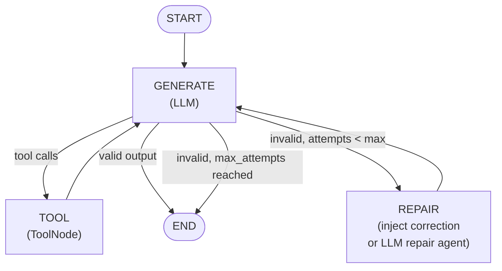
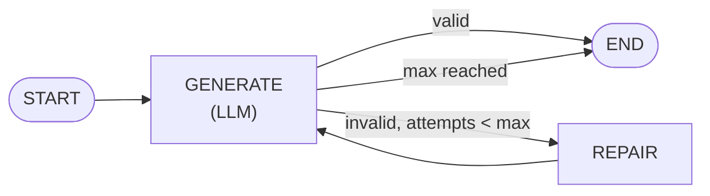

# StructuredOutputAgent

An agent that guarantees its output matches a Pydantic schema — with automatic validation and self-repair on failure.

**Import path:** `agentflow.prebuilt.agent`

---

## Concept

Standard LLMs sometimes produce malformed JSON or output that does not conform to your schema. `StructuredOutputAgent` adds a validation-and-repair loop: if the output fails validation, it injects a correction message that includes the exact error and the full JSON Schema, then tries again.

### Full graph — with tools



### Without tools

When no tools are supplied, the TOOL node is omitted and the loop is purely generate → validate → repair:



### Routing logic

```python
def _route(state: AgentState) -> str:
    last = state.context[-1]

    # Tool calls take priority — run them before validating.
    if has_tools and last.tools_calls:
        return "TOOL"

    attempts = state.execution_meta.internal_data.get("soa_attempts", 0)
    is_valid, _ = _validate_message(last, adapter)

    if is_valid:
        return END

    if attempts >= max_attempts:
        return END          # best-effort — return what we have

    return "REPAIR"
```

### Two-stage validation

The validator tries two paths in order:

1. `message.parsed_content` — populated by the provider SDK when native structured-output mode is used. Validated directly as a Python object.
2. `message.text()` — parsed as JSON (markdown code fences stripped first), then validated with `pydantic.TypeAdapter`.

### Two repair modes

| Mode | When | What happens |
|---|---|---|
| **Lightweight** (default) | `repair_system_prompt=None` | A small async function injects a `user` message containing the validation error + full JSON Schema, then increments the attempt counter. No extra LLM call. |
| **LLM repair** | `repair_system_prompt=[...]` set | A second `Agent` instance receives the correction prompt and actively rewrites the output. Uses more tokens but can fix structural problems the lightweight mode cannot. |

The repair message (lightweight mode) reads:

```
Your previous response did not conform to the required output schema.
Validation error:
<pydantic error>

Target JSON Schema:
<full JSON Schema>

Please produce a response that is valid JSON and strictly matches the schema above.
Output only the JSON object — no extra text or code fences.
```

---

## Constructor Parameters

| Parameter | Type | Default | Description |
|---|---|---|---|
| `model` | `str` | required | LLM model identifier |
| `provider` | `str` | required | LLM provider (`"openai"`, `"google"`, `"anthropic"`) |
| `output_schema` | `type` | required | Pydantic `BaseModel` or `TypedDict` subclass |
| `tools` | `Iterable[Callable]` | `None` | Optional tools for the GENERATE↔TOOL loop |
| `system_prompt` | `list[dict]` | `None` | System prompt for the generation agent |
| `max_attempts` | `int` | `2` | Max validation+repair cycles before returning best-effort |
| `repair_system_prompt` | `list[dict] \| None` | `None` | Set to enable a dedicated LLM repair agent |
| `reasoning_config` | `dict \| bool` | `True` | Applied to the generation (and repair) agent |
| `memory` | `MemoryConfig` | `None` | Long-term memory |
| `retry_config` | `Any` | `True` | Retry on LLM errors |
| `fallback_models` | `list` | `None` | Backup models |
| `trim_context` | `bool` | `False` | Trim old messages when context grows long |

---

## `compile()` Parameters

| Parameter | Type | Default | Description |
|---|---|---|---|
| `checkpointer` | `BaseCheckpointer` | `None` | Persist and restore conversation state |
| `store` | `BaseStore` | `None` | Long-term cross-thread storage |
| `interrupt_before` | `list[str]` | `None` | Pause before the named nodes |
| `interrupt_after` | `list[str]` | `None` | Pause after the named nodes |
| `callback_manager` | `CallbackManager` | default | Lifecycle hooks |
| `media_store` | `BaseMediaStore` | `None` | Binary/media file storage |
| `shutdown_timeout` | `float` | `30.0` | Seconds to wait for clean shutdown |

---

## Full Code

### Pydantic model output

```python
import asyncio
from dotenv import load_dotenv
from pydantic import BaseModel, Field
from agentflow.prebuilt.agent import StructuredOutputAgent
from agentflow.core.state import Message

load_dotenv()


class ProductAnalysis(BaseModel):
    product_name: str
    sentiment: str = Field(description="positive, negative, or neutral")
    score: float = Field(ge=0.0, le=10.0)
    key_points: list[str]


agent = StructuredOutputAgent(
    model="gpt-4o-mini",
    provider="openai",
    output_schema=ProductAnalysis,
    system_prompt=[{
        "role": "system",
        "content": "Analyze the given product review and return a structured analysis.",
    }],
    max_attempts=3,
)

app = agent.compile()


async def main():
    result = await app.ainvoke(
        {"messages": [Message.text_message(
            "Review: 'Amazing build quality but the battery life is terrible.'"
        )]},
        config={"thread_id": "struct-1"},
    )
    print(result["context"][-1].text())
    # {"product_name": "...", "sentiment": "neutral", "score": 6.5, "key_points": [...]}


asyncio.run(main())
```

### TypedDict output

```python
from typing import TypedDict
from agentflow.prebuilt.agent import StructuredOutputAgent

class WeatherReport(TypedDict):
    city: str
    temperature_celsius: float
    conditions: str

agent = StructuredOutputAgent(
    model="gpt-4o-mini",
    provider="openai",
    output_schema=WeatherReport,
    system_prompt=[{"role": "system", "content": "Extract weather data as JSON."}],
)
app = agent.compile()
```

### With tools and structured output

Tools run inside the GENERATE↔TOOL loop before validation is attempted. The final response must still match the schema:

```python
from agentflow.prebuilt.agent import StructuredOutputAgent
from agentflow.prebuilt.tools import google_web_search
from pydantic import BaseModel

class ProductAnalysis(BaseModel):
    product_name: str
    sentiment: str
    score: float
    key_points: list[str]

agent = StructuredOutputAgent(
    model="gpt-4o-mini",
    provider="openai",
    output_schema=ProductAnalysis,
    tools=[google_web_search],
    system_prompt=[{
        "role": "system",
        "content": (
            "Search for reviews of the given product, then return a structured analysis. "
            "Output must be valid JSON matching the required schema."
        ),
    }],
    max_attempts=2,
)
app = agent.compile()
```

### With a dedicated LLM repair agent

Use this when the lightweight repair prompt is not enough — for example when the schema is complex or the model frequently produces structurally broken JSON:

```python
from agentflow.prebuilt.agent import StructuredOutputAgent
from pydantic import BaseModel

class ProductAnalysis(BaseModel):
    product_name: str
    sentiment: str
    score: float
    key_points: list[str]

agent = StructuredOutputAgent(
    model="gpt-4o",
    provider="openai",
    output_schema=ProductAnalysis,
    max_attempts=2,
    repair_system_prompt=[{
        "role": "system",
        "content": (
            "You are a JSON repair expert. Fix the JSON to match the schema exactly. "
            "Output only valid JSON — no explanation, no code fences."
        ),
    }],
)
```

### Google Gemini

```python
from agentflow.prebuilt.agent import StructuredOutputAgent
from pydantic import BaseModel

class Summary(BaseModel):
    title: str
    body: str
    tags: list[str]

agent = StructuredOutputAgent(
    model="google/gemini-2.5-flash",
    provider="google",
    output_schema=Summary,
    system_prompt=[{
        "role": "system",
        "content": "Summarize the given text into a structured JSON object.",
    }],
    max_attempts=3,
    trim_context=True,
)
app = agent.compile()
```

### Streaming

```python
import asyncio
from agentflow.prebuilt.agent import StructuredOutputAgent
from pydantic import BaseModel
from agentflow.core.state import Message

class MovieReview(BaseModel):
    title: str
    rating: float
    summary: str

agent = StructuredOutputAgent(
    model="gpt-4o-mini",
    provider="openai",
    output_schema=MovieReview,
)
app = agent.compile()


async def main():
    async for event in app.astream(
        {"messages": [Message.text_message("Review the film Inception.")]},
        config={"thread_id": "stream-struct-1"},
    ):
        print(event)


asyncio.run(main())
```

---

## Running with `agentflow play`

**`graph.py`**

```python
from pydantic import BaseModel
from agentflow.prebuilt.agent import StructuredOutputAgent


class SummaryOutput(BaseModel):
    title: str
    summary: str
    tags: list[str]


agent = StructuredOutputAgent(
    model="gpt-4o-mini",
    provider="openai",
    output_schema=SummaryOutput,
    system_prompt=[{
        "role": "system",
        "content": "Summarize the given text. Return a JSON object with title, summary, and tags.",
    }],
    max_attempts=3,
)

app = agent.compile()
```

**`agentflow.json`**

```json
{
  "agent": "graph:app",
  "env": ".env",
  "auth": null,
  "checkpointer": null,
  "injectq": null,
  "store": null,
  "redis": null,
  "thread_name_generator": null
}
```

**`.env`**

```
OPENAI_API_KEY=sk-...
```

```bash
agentflow play
```
