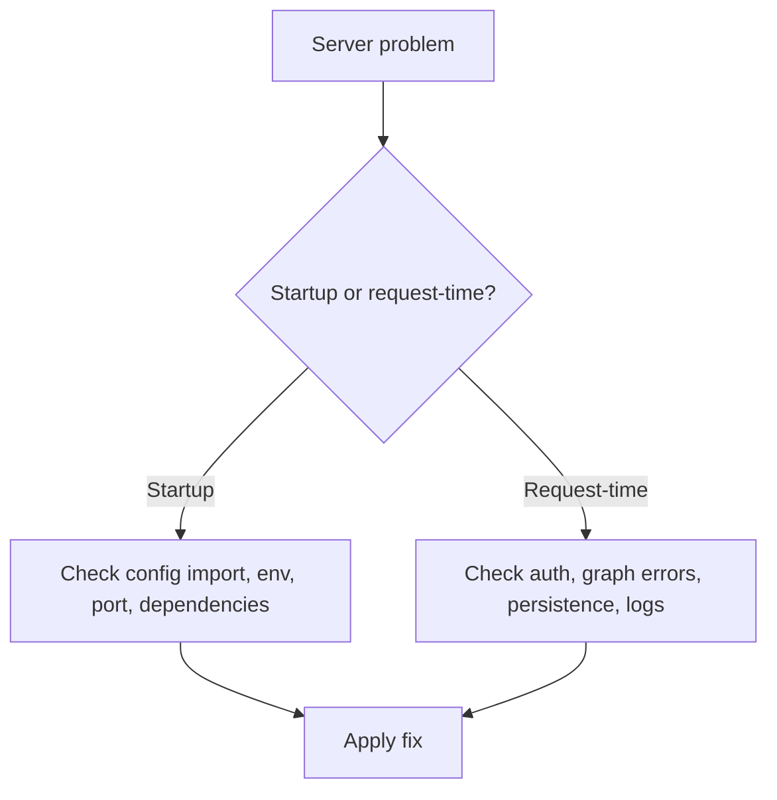

# API server troubleshooting

Use this page when `agentflow api` starts incorrectly, crashes, or serves requests unreliably.

## Server troubleshooting map



## Issue: server does not start

**Symptoms**

- command exits immediately
- stack trace appears before the server binds

**Likely causes**

- invalid `agentflow.json`
- graph import failure
- missing required environment variables

**Fix**

- verify the config file path
- test the graph import manually
- verify required provider keys and dependencies are set before startup

## Issue: `RuntimeError: Refusing to start: the following routes are not protected`

**Symptoms**

- startup aborts with a `RuntimeError` listing one or more routes

```
RuntimeError: Refusing to start: the following routes are not protected by RequirePermission.
Add the dependency, or add the path to the public allowlist if it is intentionally open:
  - POST /v1/my-new-endpoint
```

**Cause**

Every non-public route must carry a `RequirePermission` guard. The check runs once at startup and
walks the whole dependency subtree of every route. This is deliberate: a forgotten guard would
otherwise ship a silently open endpoint.

**Fix**

Add the dependency to the handler:

```python
@router.post("/v1/my-new-endpoint")
async def my_endpoint(
    user: dict[str, Any] = Depends(RequirePermission("graph", "read")),
):
    ...
```

Only three paths are public: `/ping`, `/v1/evals/runs`, and `/v1/evals/runs/{run_id}`. Adding to
that allowlist means editing the frozenset in the source, which is intentional. Do not reach for
it to silence this error on a route that handles user data.

## Issue: `InsecureCorsConfigError` on startup

**Symptoms**

- the server refuses to start in production with a message about CORS and credentials

**Cause**

`ORIGINS="*"` combined with `CORS_ALLOW_CREDENTIALS=true` while `MODE=production`. Starlette
reflects the caller's `Origin` back alongside `Access-Control-Allow-Credentials: true`, which
makes every origin a trusted, credentialed one. Warning about it would not have helped, since the
server would still have served it.

In development the same combination only logs a warning, so this failure usually appears the first
time a working local config is promoted.

**Fix**

Pick one:

```bash
# Name the origins explicitly (the usual answer)
ORIGINS=https://yourapp.com,https://api.yourapp.com
```

```bash
# Or serve a public, non-credentialed API
CORS_ALLOW_CREDENTIALS=false
```

## Issue: `403 Missing required scope: <resource>:<action>`

**Symptoms**

- an authenticated user is rejected on a specific endpoint while others work

**Cause**

The identity carries a scope list that does not include this endpoint's
`"<resource>:<action>"` pair. Scopes resolve from the authorization backend's `scopes_for` first,
and only fall back to the token's own `scopes` claim when that returns `None`.

A common version of this: switching to the RBAC backend. `RoleBasedAuthorizationBackend` always
returns a list, never `None`, so a user whose role is absent from the `roles` table and for whom
`default_scopes` is empty resolves to `[]` and is denied **everything**. An empty list is not the
same as no scopes.

**Fix**

- Add the pair to the role's scopes, or to `default_scopes`
- Confirm the user's `roles` or `role` claim actually matches a key in the `roles` table
- To go back to unrestricted, ensure `scopes_for` returns `None` rather than `[]`

## Issue: WebSocket closes immediately

**Symptoms**

- the socket opens and closes before any application frame is exchanged

**Cause and fix by close code**

| Code | Cause | Fix |
| --- | --- | --- |
| `1008` | Auth or authorization rejected at the handshake, or the wrong socket for the graph type | Check the token transport; browsers should offer `["agentflow-bearer", token]` as the subprotocol. Read `info.is_realtime` on `GET /v1/graph` to pick between `/v1/graph/ws` and `/v1/graph/live`. |
| `1013` | The global rate limit or `websocket.max_connections` was exceeded | Handshakes share the REST rate-limit bucket. Raise the limit, raise `max_connections`, or back off and retry. |
| `1003` | Invalid init frame on `/v1/graph/live`: not JSON, or JSON that is not an object | Send the init control frame as a JSON object first, before any audio |
| `1011` | Unexpected server error during the session | Check server logs; this is not an auth or config rejection |

A `1008` accompanied by an `error` event with `code: "not_live"` or `"not_authorized"` tells you
which of the two `1008` causes applies.

## Issue: port already in use

**Symptoms**

- startup fails with address already in use

**Cause**

- another process already listens on the chosen port

**Fix**

- change the port
- stop the conflicting process

## Issue: `/ping` works but graph routes fail

**Symptoms**

- health check succeeds
- `/v1/graph/invoke` returns 500 or import-related errors

**Likely cause**

- the server itself started, but graph dependencies fail when invoked

**Fix**

- inspect runtime logs
- verify graph dependencies, provider keys, and tool integrations
- reproduce with a minimal invoke payload

## Issue: auto-reload causes unstable behavior

**Symptoms**

- repeated restarts
- duplicate workers
- unstable behavior in Docker or remote filesystems

**Cause**

- reload watcher is not appropriate for that environment

**Fix**

```bash
agentflow api --no-reload
```

Use reload only for active local development.

## Issue: thread endpoints fail

**Symptoms**

- `/v1/threads` returns errors or empty results unexpectedly

**Likely causes**

- no checkpointer configured
- checkpointer backend unavailable
- inconsistent `thread_id` usage

**Error codes**: `STORAGE_NOT_FOUND_000`, `STORAGE_TRANSIENT_000`

**Fix**

- configure a checkpointer
- verify backend connectivity
- use a stable `thread_id`

---

## Error Code Quick Reference

| Symptom | Error Code | Action |
|---------|------------|--------|
| Infinite loop / max iterations | `RECURSION_000` | Increase recursion_limit or fix routing |
| Thread not found | `STORAGE_NOT_FOUND_000` | Verify thread_id, check storage |
| Database timeout | `STORAGE_TRANSIENT_000` | Retry with backoff, check DB health |
| Schema mismatch | `STORAGE_SCHEMA_000` | Run migrations after upgrade |

See [Error Codes Reference](/docs/troubleshooting/error-codes) for full documentation.

## Issue: requests are unexpectedly public

**Symptoms**

- protected routes work without credentials

**Cause**

- auth is disabled or config change did not reload into the running process

**Fix**

- set `auth` in `agentflow.json`
- restart the server
- verify with an unauthenticated curl request

## Related docs

- [Run the API Server](/docs/how-to/api-cli/run-api-server)
- [Production Troubleshooting](/docs/how-to/production/troubleshooting)
- [Auth and Authorization](/docs/how-to/production/auth-and-authorization)

## What you learned

- How to separate startup failures from request-time failures.
- How to trace common API issues back to config, reload mode, auth, or persistence.
