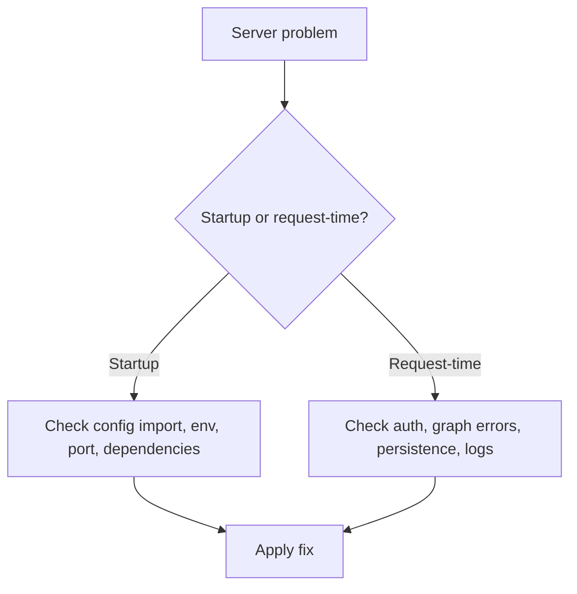

# API server troubleshooting

Use this page when `agentflow api` starts incorrectly, crashes, or serves requests unreliably.

## Server troubleshooting map



## Issue: server does not start

**Symptoms**

- command exits immediately
- stack trace appears before the server binds

**Likely causes**

- invalid `agentflow.json`
- graph import failure
- missing required environment variables

**Fix**

- verify the config file path
- test the graph import manually
- verify required provider keys and dependencies are set before startup

## Issue: port already in use

**Symptoms**

- startup fails with address already in use

**Cause**

- another process already listens on the chosen port

**Fix**

- change the port
- stop the conflicting process

## Issue: `/ping` works but graph routes fail

**Symptoms**

- health check succeeds
- `/v1/graph/invoke` returns 500 or import-related errors

**Likely cause**

- the server itself started, but graph dependencies fail when invoked

**Fix**

- inspect runtime logs
- verify graph dependencies, provider keys, and tool integrations
- reproduce with a minimal invoke payload

## Issue: auto-reload causes unstable behavior

**Symptoms**

- repeated restarts
- duplicate workers
- unstable behavior in Docker or remote filesystems

**Cause**

- reload watcher is not appropriate for that environment

**Fix**

```bash
agentflow api --no-reload
```

Use reload only for active local development.

## Issue: thread endpoints fail

**Symptoms**

- `/v1/threads` returns errors or empty results unexpectedly

**Likely causes**

- no checkpointer configured
- checkpointer backend unavailable
- inconsistent `thread_id` usage

**Fix**

- configure a checkpointer
- verify backend connectivity
- use a stable `thread_id`

## Issue: requests are unexpectedly public

**Symptoms**

- protected routes work without credentials

**Cause**

- auth is disabled or config change did not reload into the running process

**Fix**

- set `auth` in `agentflow.json`
- restart the server
- verify with an unauthenticated curl request

## Related docs

- [Run the API Server](/docs/how-to/api-cli/run-api-server)
- [Production Troubleshooting](/docs/how-to/production/troubleshooting)
- [Auth and Authorization](/docs/how-to/production/auth-and-authorization)

## What you learned

- How to separate startup failures from request-time failures.
- How to trace common API issues back to config, reload mode, auth, or persistence.
