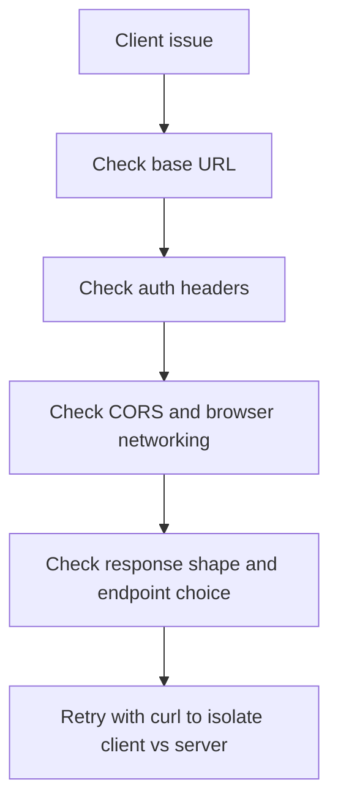

# Client troubleshooting

Use this page when your frontend or programmatic client cannot invoke, stream, or authenticate against an AgentFlow API.

## Client troubleshooting map

## Issue: every request fails immediately

**Symptoms**

- connection errors
- DNS or refused-connection errors

**Likely causes**

- wrong `baseUrl`
- server not running
- reverse proxy route mismatch

**Fix**

- verify the exact API URL with `curl /ping`
- verify the client points at the same URL

## Issue: browser client fails but curl works

**Symptoms**

- browser requests fail while curl succeeds

**Likely causes**

- CORS configuration issue
- missing browser auth header attachment
- mixed-content or HTTPS mismatch

**Fix**

- inspect browser devtools network tab
- verify `ORIGINS`
- verify the browser app is sending credentials and calling the correct scheme/host/port

## Issue: thread continuity is broken

**Symptoms**

- every message feels like a new conversation

**Likely causes**

- missing `thread_id`
- client generates a new thread per request
- no checkpointer configured on the server

**Fix**

- reuse one `thread_id` across a conversation
- verify server-side checkpointing is enabled if persistence is required

## Issue: stream endpoint behaves differently from invoke

**Symptoms**

- invoke works, stream fails or vice versa

**Likely causes**

- wrong endpoint or client method
- client not handling SSE properly
- proxy buffering or timeout issues

**Fix**

- verify the client uses the correct stream method
- test with `curl --no-buffer`
- check intermediary proxy behavior if deployed

## Related docs

- [Connect Client](/docs/get-started/connect-client)
- [TypeScript Client Reference](/docs/reference/client/agentflow-client)
- [API Server Troubleshooting](/docs/troubleshooting/api-server)

## What you learned

- How to isolate client-side failures from server-side failures.
- Why base URL, headers, CORS, and `thread_id` are the first client debugging checkpoints.
