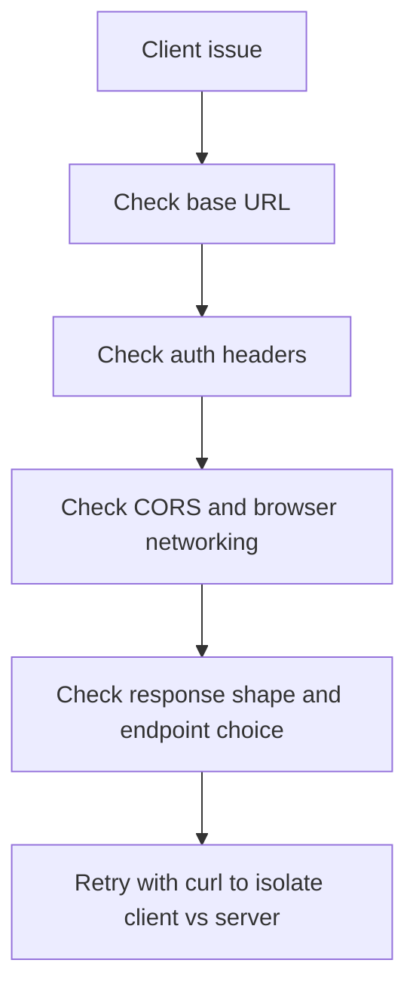

# Client troubleshooting

Use this page when your frontend or programmatic client cannot invoke, stream, or authenticate against an AgentFlow API.

## Client troubleshooting map

## Issue: every request fails immediately

**Symptoms**

- connection errors
- DNS or refused-connection errors

**Likely causes**

- wrong `baseUrl`
- server not running
- reverse proxy route mismatch

**Fix**

- verify the exact API URL with `curl /ping`
- verify the client points at the same URL

## Issue: browser client fails but curl works

**Symptoms**

- browser requests fail while curl succeeds

**Likely causes**

- CORS configuration issue
- missing browser auth header attachment
- mixed-content or HTTPS mismatch

**Fix**

- inspect browser devtools network tab
- verify `ORIGINS`
- verify the browser app is sending credentials and calling the correct scheme/host/port

## Issue: thread continuity is broken

**Symptoms**

- every message feels like a new conversation

**Likely causes**

- missing `thread_id`
- `thread_id` nested under a `configurable` key instead of sitting at the top level of `config`
- client generates a new thread per request
- no checkpointer configured on the server

**Error code**: `STORAGE_NOT_FOUND_000` (if server returns 404)

**Fix**

- pass `{ config: { thread_id: '...' } }`. The server reads `config["thread_id"]` at the top level. A LangGraph-style `config: { configurable: { thread_id } }` is not an error — it is silently ignored, and the server mints a fresh thread for every call, which is exactly this symptom.
- reuse one `thread_id` across a conversation
- verify server-side checkpointing is enabled if persistence is required. `client.graph()` reports it as `data.info.checkpointer`.

---

## Issue: stream endpoint behaves differently from invoke

**Symptoms**

- invoke works, stream fails or vice versa

**Likely causes**

- wrong endpoint or client method
- a hand-rolled parser expecting `data:`-prefixed SSE frames
- proxy buffering or timeout issues

**Fix**

- verify the client uses the correct stream method
- test with `curl --no-buffer`
- check intermediary proxy behavior if deployed

**Note on the wire format**: `POST /v1/graph/stream` is sent with `Content-Type: text/event-stream`, but the body is newline-delimited JSON, not `data:`-prefixed SSE. One JSON object per line. `client.stream()` handles this (and back-to-back objects with no newline) for you; only a hand-written parser needs to care.

---

## Issue: wsStream() or realtime() fails to connect

**Symptoms**

- `No WebSocket implementation available` thrown synchronously
- the socket opens and then closes immediately with a numeric code

**Likely causes and fixes**

| Signal | Cause | Fix |
|---|---|---|
| `No WebSocket implementation available` | Node 18 or 20 has no global `WebSocket`. | Install `ws` and pass it as `webSocketImpl` in the client config. Browsers and Node 21+ need nothing. |
| Close code `1008` on `/v1/graph/live` | The graph is not a live (realtime) agent. A fatal `error` event with `code: 'not_live'` arrives just before the close. | Use `wsStream()` / `stream()` instead, or point the server at an `AudioAgent`-based graph. Check `info.is_realtime` from `client.graph()` first. |
| Close code `1008` on `/v1/graph/ws` | The opposite mismatch: the graph *is* a live agent, so the turn-based socket refuses it. An `error` chunk explains this before the close. | Use `realtime()`. |
| Close code `1008` after the init frame | Not authorized for the requested `thread_id`. | Check the token and the server's `AuthorizationBackend`. |
| Close code `1003` | The init frame was not valid JSON, or not a JSON object. | Only relevant when driving the socket by hand; the client always sends a valid frame. |
| Close code `1013` | The handshake exceeded the global rate limit or the `websocket.max_connections` cap. | Back off and retry; raise the cap on the server if the concurrency is legitimate. |
| Close code `1011` | An unexpected server-side error ended the connection. | Read the server logs. |

**Auth**: the bearer token is never put in the URL. It travels as the second entry of the `agentflow-bearer` WebSocket subprotocol, with an `Authorization` header additionally set on Node. If a proxy strips `Sec-WebSocket-Protocol`, the handshake authenticates as anonymous and is rejected — configure the proxy to pass it through.

**Auth precedence**: on the WebSocket routes `authToken` wins over `auth`, the reverse of the HTTP routes. Setting both to different values makes HTTP and WebSocket calls authenticate differently. Set only one.

**Reconnect behaviour** (`realtime()` only; `wsStream()` does not reconnect):

- An unexpected drop schedules a retry with backoff `min(baseDelay · 2^(n-1), maxDelay)` seconds — defaults `0.5` / `10`, up to `maxAttempts: 5`. Each attempt emits `'reconnecting'` with the attempt number, and a success emits `'reconnected'`.
- The same `thread_id` and the latest resumption handle are re-sent, so the conversation resumes from its checkpoint.
- After `maxAttempts` the session emits one fatal error on both the `'error'` and `'event'` channels: `{ type: 'error', code: 'reconnect_failed', fatal: true }`. Nothing further will arrive; open a new session.
- No reconnect happens after your own `close()` or after any `fatal` error event. Set `reconnect: { enabled: false }` to opt out entirely.

---

## Error Code Quick Reference

| Symptom | Error Code | Action |
|---------|------------|--------|
| Resource not found | `STORAGE_NOT_FOUND_000` | Check thread_id validity |
| Transient failure | `STORAGE_TRANSIENT_000` | Retry request |
| Validation error | `VALIDATION_000` | Check request format |

See [Error Codes Reference](/docs/troubleshooting/error-codes) for full documentation.

---

## Related docs

- [Connect Client](/docs/get-started/connect-client)
- [TypeScript Client Reference](/docs/reference/client/agentflow-client)
- [API Server Troubleshooting](/docs/troubleshooting/api-server)
- [`realtime()` reference](/docs/reference/client/realtime)
- [Error Codes Reference](/docs/troubleshooting/error-codes)

## What you learned

- How to isolate client-side failures from server-side failures.
- Why base URL, headers, CORS, and `thread_id` are the first client debugging checkpoints.
- What each WebSocket close code means, and that WebSocket auth uses a subprotocol rather than a query parameter.
