# Error Codes Reference

All AgentFlow exceptions use structured error codes for programmatic handling and observability.

## Exception Hierarchy

```mermaid
graph TD
    subgraph Base["Base Exceptions"]
        Exception["Exception (Python built-in)"]
    end
    
    subgraph Graph["Graph Exceptions"]
        GraphError["GraphError<br/>Base for graph errors"]
        NodeError["NodeError<br/>Node-specific errors"]
        GraphRecursionError["GraphRecursionError<br/>Recursion limit exceeded"]
        NodeTimeoutError["NodeTimeoutError<br/>Node or tool deadline exceeded"]
    end
    
    subgraph Storage["Storage Exceptions"]
        StorageError["StorageError<br/>Base for storage errors"]
        TransientStorageError["TransientStorageError<br/>Retryable errors"]
        SerializationError["SerializationError<br/>(De)serialization failures"]
        SchemaVersionError["SchemaVersionError<br/>Schema migration errors"]
        ResourceNotFoundError["ResourceNotFoundError<br/>Resource not found"]
        StaleStateError["StaleStateError<br/>Optimistic concurrency conflict"]
        MetricsError["MetricsError<br/>Metrics emission errors"]
    end
    
    subgraph Media["Media Exceptions"]
        UnsupportedMediaInputError["UnsupportedMediaInputError<br/>Unsupported media format"]
    end
    
    subgraph Control["Control Flow"]
        GraphStopRequested["GraphStopRequested<br/>Stop requested mid-node"]
    end

    subgraph Validation["Validation Exceptions"]
        ValidationError["ValidationError<br/>Input validation failures"]
    end
    
    Exception --> GraphError
    Exception --> StorageError
    Exception --> UnsupportedMediaInputError
    Exception --> ValidationError
    Exception --> GraphStopRequested
    
    GraphError --> NodeError
    NodeError --> NodeTimeoutError
    GraphError --> GraphRecursionError
    
    StorageError --> TransientStorageError
    StorageError --> SerializationError
    StorageError --> SchemaVersionError
    StorageError --> ResourceNotFoundError
    StorageError --> StaleStateError
    StorageError --> MetricsError
```



---

## Graph Errors

### GRAPH_000 — Generic Graph Error

**Base error code for general graph operations.**

| Field | Value |
|-------|-------|
| Code | `GRAPH_000` |
| Retryable | No |
| Category | Graph |

**Raised by**: Any graph operation failure.

**Example**:
```python
from agentflow.core.exceptions import GraphError

raise GraphError(
    message="Graph failed to initialize",
    error_code="GRAPH_000",
    context={"graph_name": "my_agent"}
)
```

**Common causes**:
- Invalid graph configuration
- Node initialization failure
- Edge routing error

---

### GRAPH_001+ — Extended Graph Errors

**Extended error codes for specific graph failures.**

| Field | Value |
|-------|-------|
| Codes | `GRAPH_001`, `GRAPH_002`, etc. |
| Retryable | No |
| Category | Graph |

---

## Node Errors

### NODE_000 — Generic Node Error

**Base error code for node-specific errors.**

| Field | Value |
|-------|-------|
| Code | `NODE_000` |
| Retryable | Depends on cause |
| Category | Graph / Node |

**Raised by**: Node execution failures.

**Example**:
```python
from agentflow.core.exceptions import NodeError

raise NodeError(
    message="Node execution failed",
    error_code="NODE_000",
    context={"node_name": "process_data", "input_size": 100}
)
```

**Common causes**:
- Tool execution failure
- Invalid node input
- Node timeout
- Node resource exhaustion

---

### NODE_001+ — Extended Node Errors

**Extended error codes for specific node failures.**

| Field | Value |
|-------|-------|
| Codes | `NODE_001`, `NODE_002`, etc. |
| Retryable | Depends on cause |

---

### NODE_TIMEOUT_000 — Node or Tool Timeout

**A node or a tool call exceeded its allotted execution time.**

| Field | Value |
|-------|-------|
| Code | `NODE_TIMEOUT_000` (default), `NODE_TIMEOUT_001` and above for specific cases |
| Retryable | Sometimes (a transient hang is; a genuinely slow operation is not) |
| Category | Node |
| Base class | `NodeError` |

```python
from agentflow.core.exceptions import NodeTimeoutError
```

Without a deadline, a node that hangs on a half-open socket or an unresponsive MCP server blocks the graph forever: the loop never advances a step, so the recursion limit never trips and the between-nodes stop check is never reached. Timing the call out converts an indefinite hang into a normal node error the execution loop can persist, report, and recover from.

**Common causes**:
- A custom tool that never returns
- An unresponsive MCP server
- A node deliberately doing work longer than the 900s default

**Fix**: Raise the relevant deadline through the `node_timeout` or `tool_timeout` run-config key, or fix the hanging call. Pass `None` or `0` to disable a deadline entirely. See the [graph reference](/docs/reference/python/graph#execution-deadlines).

---

## Recursion Errors

### RECURSION_000 — Recursion Limit Exceeded

**Raised when graph execution exceeds the configured recursion limit.**

| Field | Value |
|-------|-------|
| Code | `RECURSION_000` |
| Retryable | No (requires config change) |
| Category | Graph |

**Example**:
```python
from agentflow.core.exceptions import GraphRecursionError

raise GraphRecursionError(
    message="Recursion limit exceeded in graph execution",
    error_code="RECURSION_000",
    context={"recursion_depth": 100, "max_depth": 50}
)
```

**Common causes**:
- Infinite loop in graph routing
- Tool repeatedly calling itself
- Missing termination condition
- Tool selection cycling

**Fix**: Check your graph for loops, add recursion limits, or increase `recursion_limit` in config.

---

## Storage Errors

### STORAGE_000 — Generic Storage Error

**Base error code for storage layer errors.**

| Field | Value |
|-------|-------|
| Code | `STORAGE_000` |
| Retryable | No |
| Category | Storage |

**Raised by**: General storage operation failures.

---

### STORAGE_TRANSIENT_000 — Transient Storage Error

**Temporary storage failures that may succeed on retry.**

| Field | Value |
|-------|-------|
| Code | `STORAGE_TRANSIENT_000` |
| Retryable | Yes |
| Category | Storage |

**Common causes**:
- Database connection timeout
- Network interruption
- Lock contention
- Temporary resource unavailability

**Example**:
```python
from agentflow.core.exceptions import TransientStorageError

raise TransientStorageError(
    message="Database connection timeout",
    error_code="STORAGE_TRANSIENT_000",
    context={"operation": "read_thread", "timeout_ms": 5000}
)
```

**Recovery**: Implement exponential backoff retry logic.

---

### STORAGE_SERIALIZATION_000 — Serialization Error

**Failed to serialize or deserialize data.**

| Field | Value |
|-------|-------|
| Code | `STORAGE_SERIALIZATION_000` |
| Retryable | No (data is corrupt/invalid) |
| Category | Storage |

**Common causes**:
- Invalid state schema
- Corrupt checkpoint data
- Incompatible schema version
- Invalid message format

**Example**:
```python
from agentflow.core.exceptions import SerializationError

raise SerializationError(
    message="Failed to deserialize state",
    error_code="STORAGE_SERIALIZATION_000",
    context={"thread_id": "abc123", "schema_version": "2"}
)
```

---

### STORAGE_SCHEMA_000 — Schema Version Error

**Schema version detection or migration failed.**

| Field | Value |
|-------|-------|
| Code | `STORAGE_SCHEMA_000` |
| Retryable | No (requires migration) |
| Category | Storage |

**Common causes**:
- Upgrading AgentFlow without running migrations
- Database schema out of sync with code version
- Corrupt schema version table

**Fix**: Run database migrations after upgrading AgentFlow.

---

### STORAGE_NOT_FOUND_000 — Resource Not Found

**Requested resource does not exist in storage.**

| Field | Value |
|-------|-------|
| Code | `STORAGE_NOT_FOUND_000` |
| Retryable | No (resource doesn't exist) |
| Category | Storage |

**Common causes**:
- Invalid `thread_id`
- Thread was deleted
- Checkpoint expired
- Missing required resource

**Example**:
```python
from agentflow.core.exceptions import ResourceNotFoundError

raise ResourceNotFoundError(
    message="Thread not found",
    error_code="STORAGE_NOT_FOUND_000",
    context={"thread_id": "abc123"}
)
```

---

### METRICS_000 — Metrics Error

**Non-critical metrics emission failure.**

| Field | Value |
|-------|-------|
| Code | `METRICS_000` |
| Retryable | No (metrics are non-critical) |
| Category | Observability |

**Note**: This error is typically logged but not raised, as metrics failures should not interrupt operations.

---

### STORAGE_CONFLICT_000 — Stale State

**A durable state write lost its optimistic-concurrency check.**

| Field | Value |
|-------|-------|
| Code | `STORAGE_CONFLICT_000` (default), `STORAGE_CONFLICT_001` for a version mismatch on write |
| Retryable | Yes, after reloading the latest state |
| Category | Storage |
| Base class | `StorageError` |

```python
from agentflow.core.exceptions import StaleStateError
```

The writer based its update on a state version that is no longer current: another execution committed a newer state for the same thread in the meantime. Committing anyway would silently discard that other execution's work, so the write is rejected instead.

**Context keys**: `thread_id`, `expected_version`, `current_version`.

**Common causes**:
- Two requests processing the same `thread_id` concurrently
- Several server replicas serving the same thread
- A retried request racing the original

**Fix**: Treat it as a conflict (HTTP 409). Reload the latest state and retry the turn rather than overwriting blindly. On conflict the checkpointer invalidates its cache for the thread, so the next read comes from Postgres. See [Set up checkpointing](/docs/how-to/python/set-up-checkpointing#optimistic-concurrency-and-stalestateerror).

---

## Control Flow Signals

### GraphStopRequested

**A stop was requested while a node was still running.**

| Field | Value |
|-------|-------|
| Code | None (plain `Exception` subclass, no error code) |
| Retryable | Not applicable |
| Category | Control flow |
| Base class | `Exception` |

```python
from agentflow.core.exceptions import GraphStopRequested
```

This is control flow, not a failure. The execution loop catches it, marks the run stopped, persists that, and returns normally. It exists because a stop observed *during* a node cannot be handled by the between-nodes stop check: the node has to be cancelled first, and the loop needs to tell that cancellation apart from a genuine error.

**Attributes**: `node_name` — the node that was running when the stop arrived.

**Fix**: Nothing to fix. Do not catch it in node code or in a broad `except Exception` around `invoke`, or you will convert a clean stop into an error.

---

## Media Errors

### MEDIA_000 — Unsupported Media Input

**Model cannot accept the given media input type.**

| Field | Value |
|-------|-------|
| Code | `MEDIA_000` (via exception) |
| Retryable | No (requires model change) |
| Category | Media |

**Raised by**: `UnsupportedMediaInputError`

**Attributes**:
| Attribute | Type | Description |
|-----------|------|-------------|
| `provider` | string | Provider identifier (e.g., "openai", "google") |
| `model` | string | Model name (e.g., "gpt-4o", "gemini-1.5-pro") |
| `media_type` | string | Type of media (e.g., "image", "document", "audio") |
| `source_kind` | string | How media was provided ("url", "file_id", "data", "internal_ref") |
| `transports_attempted` | list | Transport modes tried before failure |

**Common causes**:
- Model doesn't support vision but image was provided
- Model doesn't support document input
- External URL not allowed for provider

**Import path**: `UnsupportedMediaInputError` is **not** re-exported from `agentflow.core.exceptions`. Import it from its own module:

```python
from agentflow.core.exceptions.media_exceptions import UnsupportedMediaInputError
```

**Example**:
```python
from agentflow.core.exceptions.media_exceptions import UnsupportedMediaInputError

raise UnsupportedMediaInputError(
    provider="openai",
    model="gpt-4o-mini",
    media_type="image",
    source_kind="url",
    transports_attempted=["inline", "url"]
)
```

**Fix**: Use a vision-capable model (e.g., gpt-4o, gemini-1.5-pro) or remove media inputs.

---

## Validation Errors

### VALIDATION_000 — Input Validation Failed

**Input validation detected a policy violation.**

| Field | Value |
|-------|-------|
| Code | `VALIDATION_000` (via exception) |
| Retryable | No (input is invalid) |
| Category | Security |

**Raised by**: `ValidationError`

**Attributes**:
| Attribute | Type | Description |
|-----------|------|-------------|
| `message` | string | Human-readable error message |
| `violation_type` | string | Type of violation |
| `details` | dict | Additional violation details |

**Common violation types**:

| Violation Type | Description |
|----------------|-------------|
| `prompt_injection` | Direct or indirect prompt injection detected |
| `jailbreak` | Jailbreak attempt detected |
| `content_policy` | Content policy violation |
| `encoding_attack` | Obfuscation via encoding detected |
| `delimiter_confusion` | Conflicting delimiters in input |
| `payload_splitting` | Attack distributed across inputs |
| `system_leak` | Attempt to extract system prompt |

**Example**:
```python
from agentflow.utils.validators import ValidationError

raise ValidationError(
    message="Prompt injection detected",
    violation_type="prompt_injection",
    details={"pattern": "ignore previous instructions"}
)
```

**Fix**: Sanitize user input, use input validators, enable strict mode for production.

---

## Error Code Quick Reference

| Code Prefix | Category | Retryable | Base Class |
|-------------|----------|-----------|------------|
| `GRAPH_000+` | Graph operations | No | `GraphError` |
| `NODE_000+` | Node execution | Depends | `NodeError` |
| `RECURSION_000` | Recursion limits | No | `GraphRecursionError` |
| `NODE_TIMEOUT_000+` | Node or tool deadline exceeded | Sometimes | `NodeTimeoutError` |
| `STORAGE_000` | Generic storage | No | `StorageError` |
| `STORAGE_TRANSIENT_000+` | Retryable storage | Yes | `TransientStorageError` |
| `STORAGE_SERIALIZATION_000` | Serialization | No | `SerializationError` |
| `STORAGE_SCHEMA_000` | Schema/migration | No | `SchemaVersionError` |
| `STORAGE_NOT_FOUND_000` | Resource not found | No | `ResourceNotFoundError` |
| `STORAGE_CONFLICT_000+` | Optimistic concurrency conflict | Yes, after reloading state | `StaleStateError` |
| `METRICS_000` | Metrics | No | `MetricsError` |
| `MEDIA_000` | Media input | No | `UnsupportedMediaInputError` |
| `VALIDATION_000` | Validation | No | `ValidationError` |

---

## Structured Error Responses

All AgentFlow errors include a `to_dict()` method for structured logging and API responses:

```python
try:
    await agent.process(message)
except GraphError as e:
    error_response = e.to_dict()
    # {
    #     "error_type": "GraphRecursionError",
    #     "error_code": "RECURSION_000",
    #     "message": "Recursion limit exceeded",
    #     "context": {"recursion_depth": 100, "max_depth": 50}
    # }
```

---

## Handling Errors

### Basic Error Handling

```python
from agentflow.core.exceptions import (
    GraphError,
    GraphRecursionError,
    StorageError,
    TransientStorageError,
)

try:
    result = await agent.process(message)
except GraphRecursionError as e:
    # Recursion limit exceeded - increase limit or fix loop
    print(f"Recursion error: {e.error_code}")
except TransientStorageError as e:
    # Retry with backoff
    await retry_with_backoff(operation)
except StorageError as e:
    # Non-retryable storage error
    print(f"Storage error: {e.error_code}")
except GraphError as e:
    # Generic graph error
    print(f"Graph error: {e.error_code}")
```

### Retry Logic for Transient Errors

```python
import asyncio

async def retry_with_backoff(func, max_retries=3, base_delay=1.0):
    for attempt in range(max_retries):
        try:
            return await func()
        except TransientStorageError:
            if attempt == max_retries - 1:
                raise
            delay = base_delay * (2 ** attempt)
            await asyncio.sleep(delay)
```

---

## Related Docs

- [Production Troubleshooting](/docs/how-to/production/troubleshooting)
- [Checkpointing Guide](/docs/how-to/production/checkpointing)
- [Error Patterns Guide](/docs/troubleshooting/error-patterns)
- [Validation Reference](/docs/reference/python/testing)
