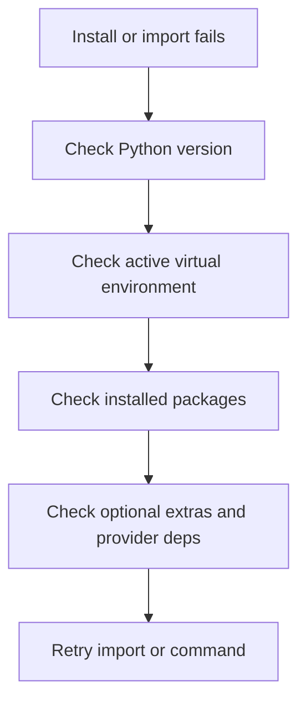

# Installation troubleshooting

Use this page when AgentFlow fails before your app even starts: package install problems, import errors, missing dependencies, or broken Python environments.

## Troubleshooting flow



## Issue: `pip install` fails

**Symptoms**

- install command exits with dependency errors
- build tools or package resolution fails

**Likely causes**

- unsupported Python version
- stale virtual environment
- conflicting previously installed packages

**Fix**

- use Python 3.11+
- create a fresh virtual environment
- reinstall inside the fresh environment

## Issue: `agentflow` command is not found

**Symptoms**

- shell says command not found

**Likely causes**

- CLI package not installed
- virtual environment not activated
- shell path points at a different Python environment

**Fix**

```bash
pip install 10xscale-agentflow-cli
which agentflow
agentflow version
```

If `which agentflow` points somewhere unexpected, activate the correct environment first.

## Issue: imports fail even after install

**Symptoms**

- `ModuleNotFoundError`
- `ImportError` during graph import or script execution

**Likely causes**

- package installed in a different environment
- optional dependency not installed
- import path in your code is outdated

**Fix**

- verify `python -c "import agentflow; print(agentflow.__file__)"`
- verify you are using current import paths in docs and code
- install optional extras when needed

## Issue: optional features fail at runtime

**Symptoms**

- a feature works until you use Postgres, A2A, or another optional integration
- runtime error says a package is missing

**Likely cause**

- optional dependencies were not installed

**Fix**

Install the required extras or packages for the feature you are actually using.

## Issue: environment variables appear to be ignored

**Symptoms**

- provider keys seem unset
- app behaves as if `.env` was not loaded

**Likely causes**

- `env` field missing from `agentflow.json`
- `.env` file in the wrong directory
- variables exported in one shell but server started from another

**Fix**

- verify `agentflow.json` points to the correct `.env`
- verify the file exists relative to the project root
- test with a direct Python import from the same shell session

## Related docs

- [Installation](/docs/get-started/installation)
- [Configure agentflow.json](/docs/how-to/api-cli/configure-agentflow-json)
- [Environment Variables](/docs/how-to/production/environment-variables)

## What you learned

- How to isolate installation problems to Python version, environment activation, missing packages, or missing config.
