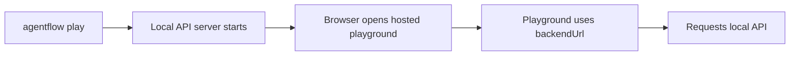

# Playground troubleshooting

This page only covers `agentflow play` and hosted playground connection issues, as required by the sprint plan.

## How `agentflow play` works

The playground is hosted externally. `agentflow play` does not run a separate local frontend.

## Issue: browser opens but playground cannot connect

**Symptoms**

- playground UI loads
- connection status is red or failed

**Likely causes**

- local API did not start correctly
- `backendUrl` points to the wrong host or port
- browser cannot reach the local API

**Fix**

- verify the server terminal shows a running API URL
- test that URL with `curl /ping`
- verify the browser URL contains the correct `backendUrl`

## Issue: playground loads but requests fail silently

**Symptoms**

- UI appears connected
- sending a message does not work or stalls

**Likely causes**

- graph invocation is failing server-side
- auth or CORS behavior blocks the request
- the graph is slow or looping unexpectedly

**Fix**

- inspect browser devtools network panel
- inspect API logs in the terminal running `agentflow play`
- test the same request against the API directly with curl

## Issue: mixed-content or browser security warnings

**Symptoms**

- browser warns about insecure content
- playground is HTTPS, backend is HTTP, and browser blocks requests

**Cause**

- hosted playground is secure, but your backend URL may not be treated as safe in that browser/network context

**Fix**

- use a local setup that your browser allows for development
- if sharing with others, deploy the API behind HTTPS rather than relying on local HTTP access

## Issue: connection works locally but not when sharing the URL

**Symptoms**

- you can use the playground on your machine
- another user cannot connect using the shared playground URL

**Likely cause**

- the backend URL points at your localhost or a private network address only your browser can reach

**Fix**

- deploy the API to a reachable HTTPS endpoint
- share a playground URL that uses the deployed `backendUrl`

## Verification checklist

1. run `agentflow play --host 127.0.0.1 --port 8000`
2. confirm the server terminal shows the local API URL
3. run `curl http://127.0.0.1:8000/ping`
4. confirm the browser URL contains the same host and port in `backendUrl`
5. send a simple test message

## Related docs

- [Open the Playground](/docs/how-to/api-cli/open-playground)
- [API Server Troubleshooting](/docs/troubleshooting/api-server)

## What you learned

- How to troubleshoot the hosted playground by separating browser connectivity from API health.
- Why `agentflow play` is a testing path and not a separate frontend runtime.
