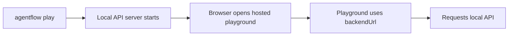

# Playground troubleshooting

This page covers `agentflow play`, hosted playground connection issues, and the states the playground UI shows when a feature is not available for the connected agent.

## How `agentflow play` works

The playground is hosted externally. `agentflow play` does not run a separate local frontend.

## Issue: browser opens but playground cannot connect

**Symptoms**

- playground UI loads
- connection status is red or failed

**Likely causes**

- local API did not start correctly
- `backendUrl` points to the wrong host or port
- browser cannot reach the local API

**Fix**

- verify the server terminal shows a running API URL
- test that URL with `curl /ping`
- verify the browser URL contains the correct `backendUrl`

## Issue: playground loads but requests fail silently

**Symptoms**

- UI appears connected
- sending a message does not work or stalls

**Likely causes**

- graph invocation is failing server-side
- auth or CORS behavior blocks the request
- the graph is slow or looping unexpectedly

**Fix**

- inspect browser devtools network panel
- inspect API logs in the terminal running `agentflow play`
- test the same request against the API directly with curl

## Issue: every page says you are not connected

**Symptoms**

- the playground opens on the Connect page
- Chat, Live, and the Inspect pages refuse to do anything

**Cause**

- there is no active connection. The playground is connect-first by design: `/` is the Connection page, and the other routes need an active backend before they will load anything.

**Fix**

- open Connect (`/`), confirm the backend URL, pick the auth mode that matches the server's `agentflow.json`, and connect
- `agentflow play` pre-fills the URL, so this usually means the connection attempt failed rather than that it was never made — check the capability chips and the error shown on the Connect page

## Issue: the Live page will not start a session

**Symptoms**

- the Live page shows "Live not available for this agent" instead of a session
- or it shows "Not connected" with a button back to Connect

**Cause**

- the connected graph is not a realtime agent. The playground derives a `live` capability chip from `info.is_realtime` in `GET /v1/graph` and gates the page on it, rather than opening a socket the server would immediately close with code `1008`.

**Fix**

- connect an agent whose graph is rooted at a live agent (for example a Gemini live model)
- for a turn-based graph, use Chat instead. The reverse gate also exists: connect a live agent and the **Chat** page refuses, because `WS /v1/graph/ws` and `POST /v1/graph/invoke` reject a realtime graph

## Issue: the microphone does not work on the Live page

**Symptoms**

- tapping the mic shows "Microphone unavailable" or a similar error
- no browser permission prompt appears

**Likely causes**

- the permission prompt was denied, so `getUserMedia` rejects
- the page is not in a secure context. `getUserMedia` requires HTTPS or `localhost`
- another application holds the microphone

**Fix**

- re-allow microphone access for the site in the browser's site settings and reload
- access the playground over `localhost` or HTTPS
- close whatever else is using the mic

Denial is handled, not fatal: the session stays open and the turn is ended cleanly, so you can grant permission and tap the mic again.

## Issue: the paperclip in the chat composer does nothing

**Cause**

- file attachments are not implemented in the playground. The paperclip button in the chat composer is inert, and the **Files** page in the rail is a placeholder marked "Soon".

**Fix**

- there is no playground workaround. File upload works over the API and the TypeScript client; see [How to send images and documents](/docs/how-to/client/send-images-and-documents)

## Issue: an Inspect page is empty

**Symptoms**

- Thread Inspector lists nothing
- Observability says no runs were captured
- Memory Inspector is empty

**Likely causes**

- Thread Inspector and the checkpoint views need a checkpointer configured in `agentflow.json`
- Observability reads the active thread, and shows a placeholder until a run has been recorded for it
- Memory Inspector needs a store configured on the server

**Fix**

- check the capability chips on the connection bar: `checkpointer` and `store` report what the backend actually has
- send a message in Chat first, then open Observability for that thread

## Issue: mixed-content or browser security warnings

**Symptoms**

- browser warns about insecure content
- playground is HTTPS, backend is HTTP, and browser blocks requests

**Cause**

- hosted playground is secure, but your backend URL may not be treated as safe in that browser/network context

**Fix**

- use a local setup that your browser allows for development
- if sharing with others, deploy the API behind HTTPS rather than relying on local HTTP access

## Issue: connection works locally but not when sharing the URL

**Symptoms**

- you can use the playground on your machine
- another user cannot connect using the shared playground URL

**Likely cause**

- the backend URL points at your localhost or a private network address only your browser can reach

**Fix**

- deploy the API to a reachable HTTPS endpoint
- share a playground URL that uses the deployed `backendUrl`

## Verification checklist

1. run `agentflow play --host 127.0.0.1 --port 8000`
2. confirm the server terminal shows the local API URL
3. run `curl http://127.0.0.1:8000/ping`
4. confirm the browser URL contains the same host and port in `backendUrl`
5. connect on the Connect page and check the capability chips
6. send a simple test message in Chat

## Related docs

- [Open the Playground](/docs/how-to/api-cli/open-playground)
- [API Server Troubleshooting](/docs/troubleshooting/api-server)

## What you learned

- How to troubleshoot the hosted playground by separating browser connectivity from API health.
- Why `agentflow play` is a testing path and not a separate frontend runtime.
- That the playground is connect-first, and that Live, Chat, and the Inspect pages gate themselves on capabilities read from `GET /v1/graph`.
- That file attachments are not implemented in the playground yet.
