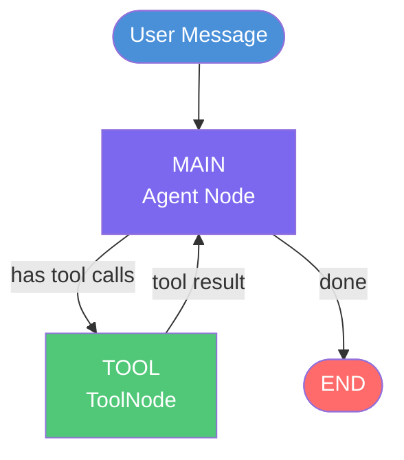
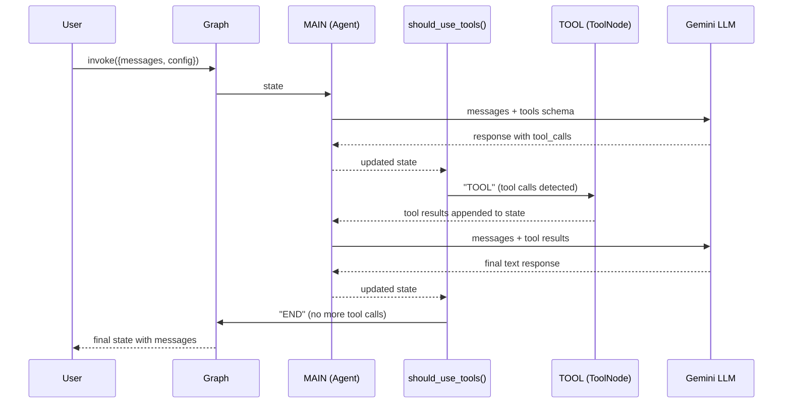

# Agent Class Pattern

**Source example:** [`agentflow/examples/agent-class/graph.py`](https://github.com/10xHub/Agentflow/blob/main/examples/agent-class/graph.py)

## What you will build

A conversational agent that can look up weather information for any city. The agent uses the `Agent` class for LLM orchestration, a `ToolNode` to wrap Python functions as callable tools, and conditional edges to decide whether to call a tool or respond directly to the user.

## Prerequisites

- Python 3.11 or later
- `10xscale-agentflow` installed (`pip install 10xscale-agentflow`)
- A Google Gemini API key (`pip install google-generativeai` and set `GEMINI_API_KEY` in your environment)
- A `.env` file in your project root with `GEMINI_API_KEY=<your_key>`

## How it works



### Execution flow



## Step 1 — Define a tool function

Any Python function can become a tool. Type annotations are used to generate the JSON schema shown to the LLM.

```python
def get_weather(location: str) -> str:
    """Get the current weather for a specific location."""
    # In production this would call a real weather API
    return f"The weather in {location} is sunny"
```

Wrap it in a `ToolNode`:

```python
from agentflow.core.graph import ToolNode

tool_node = ToolNode([get_weather])
```

## Step 2 — Create the StateGraph and add nodes

```python
from agentflow.core.graph import Agent, StateGraph

graph = StateGraph()

graph.add_node(
    "MAIN",
    Agent(
        model="google/gemini-2.5-flash",
        system_prompt=[
            {
                "role": "system",
                "content": "You are a helpful assistant. Help user queries effectively.",
            }
        ],
        tool_node="TOOL",  # tell the Agent which node runs tools
    ),
)
graph.add_node("TOOL", tool_node)
```

## Step 3 — Write the routing function

The routing function inspects the last message in `state.context` and decides where to go next.

```python
from agentflow.core.state.agent_state import AgentState
from agentflow.utils.constants import END


def should_use_tools(state: AgentState) -> str:
    """Route to TOOL if the agent produced tool calls, otherwise END."""
    if not state.context or len(state.context) == 0:
        return "TOOL"

    last_message = state.context[-1]

    if (
        hasattr(last_message, "tools_calls")
        and last_message.tools_calls
        and len(last_message.tools_calls) > 0
        and last_message.role == "assistant"
    ):
        return "TOOL"

    if last_message.role == "tool":
        return "MAIN"

    return END
```

## Step 4 — Wire edges and compile

```python
graph.add_conditional_edges(
    "MAIN",
    should_use_tools,
    {"TOOL": "TOOL", END: END},
)

graph.add_edge("TOOL", "MAIN")   # always return to MAIN after tool runs
graph.set_entry_point("MAIN")

app = graph.compile()
```

## Step 5 — Run the agent

```python
from agentflow.core.state.message import Message

inp = {"messages": [Message.text_message("How is weather in London?")]}
config = {"thread_id": "12345", "recursion_limit": 10}

res = app.invoke(inp, config=config)

for msg in res["messages"]:
    print(f"[{msg.role}] {msg}")
```

Expected output (abbreviated):

```
[user] How is weather in London?
[assistant] <tool call: get_weather(location='London')>
[tool] The weather in London is sunny
[assistant] The weather in London is currently sunny!
```

## Complete source

```python
import os
from dotenv import load_dotenv

from agentflow.core.graph import Agent, StateGraph, ToolNode
from agentflow.core.state.agent_state import AgentState
from agentflow.core.state.message import Message
from agentflow.utils.constants import END

load_dotenv()


def get_weather(location: str) -> str:
    """Get the current weather for a specific location."""
    return f"The weather in {location} is sunny"


tool_node = ToolNode([get_weather])

graph = StateGraph()
graph.add_node(
    "MAIN",
    Agent(
        model="google/gemini-2.5-flash",
        system_prompt=[
            {"role": "system", "content": "You are a helpful assistant. Help user queries effectively."}
        ],
        tool_node="TOOL",
    ),
)
graph.add_node("TOOL", tool_node)


def should_use_tools(state: AgentState) -> str:
    if not state.context or len(state.context) == 0:
        return "TOOL"

    last_message = state.context[-1]

    if (
        hasattr(last_message, "tools_calls")
        and last_message.tools_calls
        and len(last_message.tools_calls) > 0
        and last_message.role == "assistant"
    ):
        return "TOOL"

    if last_message.role == "tool":
        return "MAIN"

    return END


graph.add_conditional_edges("MAIN", should_use_tools, {"TOOL": "TOOL", END: END})
graph.add_edge("TOOL", "MAIN")
graph.set_entry_point("MAIN")

app = graph.compile()

if __name__ == "__main__":
    inp = {"messages": [Message.text_message("How is weather in London?")]}
    config = {"thread_id": "12345", "recursion_limit": 10}
    res = app.invoke(inp, config=config)
    for msg in res["messages"]:
        print(f"[{msg.role}] {msg}")
```

## Key concepts

| Concept | What it does |
|---|---|
| `Agent` | Manages the LLM call lifecycle, injects injectable params, appends results to `state.context` |
| `ToolNode` | Wraps Python callables, executes the tool the LLM requested, returns a tool-result `Message` |
| `should_use_tools` | Routing function — runs after every node, decides the next node by name |
| `add_conditional_edges` | Wires a routing function to a set of possible next nodes |
| `recursion_limit` | Maximum number of hops (including LLM calls and tool calls) before the graph raises an error |

## What you learned

- How to define tools and wrap them in a `ToolNode`.
- How to configure an `Agent` node with a model and system prompt.
- How to write a routing function and wire it with `add_conditional_edges`.
- How the MAIN → TOOL → MAIN loop keeps executing until the LLM produces a plain text reply.

## Next step

→ [Custom State](./custom-state) — learn how to add your own fields to the graph state for domain-specific data.
