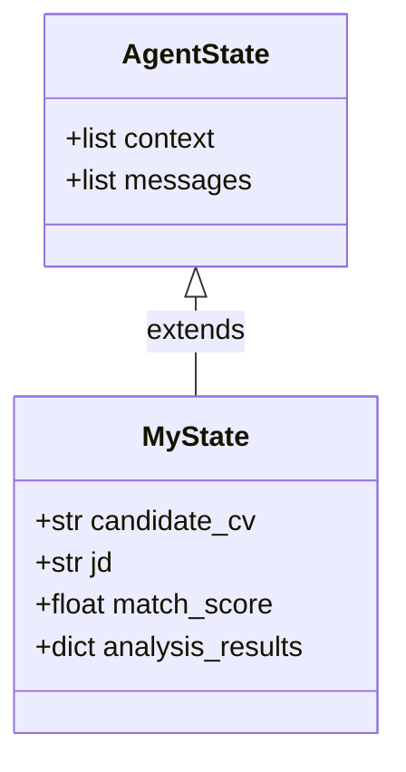
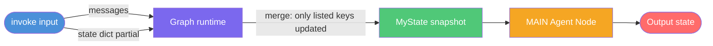
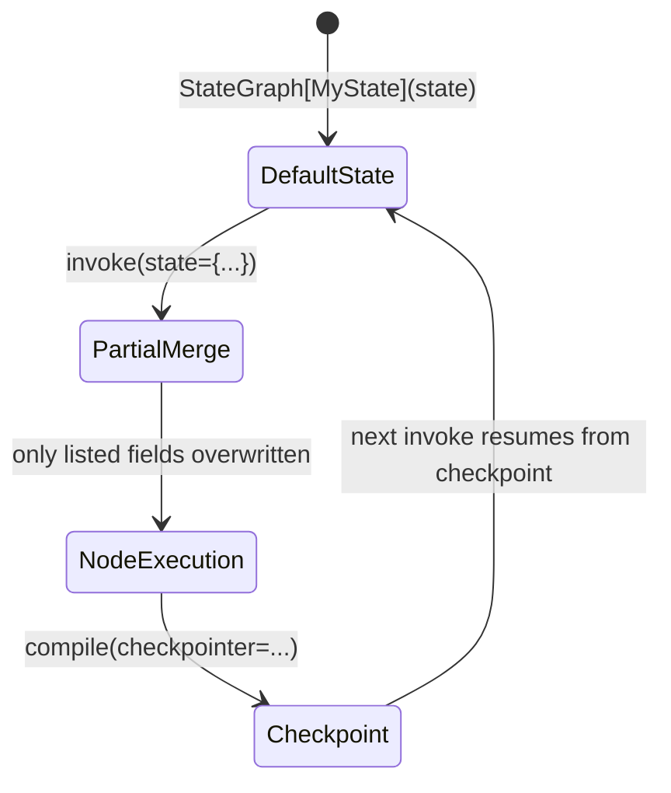

# Custom State

**Source example:** [`agentflow/examples/custom-state/custom_state.py`](https://github.com/10xHub/Agentflow/blob/main/examples/custom-state/custom_state.py)

## What you will build

An HR assistant agent that carries extra fields — candidate CV text, job description, match score, and analysis results — alongside the built-in message history. You will learn how to define a typed custom state, pass it into the graph at compile time, and update individual fields at invoke time without touching unrelated fields.

## Prerequisites

- Python 3.11 or later
- `10xscale-agentflow` installed (`pip install 10xscale-agentflow`)
- A Google Gemini API key set as `GEMINI_API_KEY` in your environment

## Why custom state?

`AgentState` is the default state type. It stores the conversation (`context`) and incoming messages. When your agent needs to carry structured domain data that the LLM or your routing logic needs to read, you subclass `AgentState` and add typed fields.



## Step 1 — Define the custom state

```python
from typing import Any
from agentflow.core.state import AgentState


class MyState(AgentState):
    """Custom state with additional fields for resume matching."""
    candidate_cv: str = ""
    jd: str = ""
    match_score: float = 0.0
    analysis_results: dict[str, Any] = {}
```

All fields must have defaults. Pydantic enforces this. You can add any JSON-serialisable type.

## Step 2 — Create a typed checkpointer

The checkpointer preserves state across turns. Pass the state type as a generic parameter so the checkpointer knows how to (de)serialise it.

```python
from agentflow.storage.checkpointer import InMemoryCheckpointer

checkpointer = InMemoryCheckpointer[MyState]()
```

## Step 3 — Build the graph with typed state

Pass an instance of `MyState` when constructing `StateGraph`. This tells the graph which state type to use.

```python
from agentflow.core import Agent, StateGraph


def create_app(initial_state: MyState | None = None):
    state = initial_state or MyState()

    agent = Agent(
        model="gemini-2.5-flash",
        provider="google",
        system_prompt=[
            {
                "role": "system",
                "content": "You are a helpful HR assistant. Analyse CVs against job descriptions.",
            }
        ],
        trim_context=True,
    )

    graph = StateGraph[MyState](state)
    graph.add_node("MAIN", agent)
    graph.set_entry_point("MAIN")

    return graph.compile(checkpointer=checkpointer)
```

## Step 4 — Run the agent

### Basic invocation

```python
from agentflow.core.state import Message

app = create_app()
res = app.invoke(
    {"messages": [Message.text_message("Hello, can you help me with CV analysis?")]},
    config={"thread_id": "basic_test", "recursion_limit": 10},
)
```

### Pre-populate state fields

Pass custom fields in the `state` key of the input dict to seed the graph with domain context before the LLM runs:

```python
custom_state = MyState()
custom_state.candidate_cv = "John Doe — Senior Python Engineer, 5 years experience"
custom_state.jd = "Looking for Senior Python Developer with 3+ years experience"
custom_state.match_score = 0.85

app = create_app(custom_state)
res = app.invoke(
    {"messages": [Message.text_message("What's the match score for this candidate?")]},
    config={"thread_id": "custom_test"},
)
```

### Partial state update at invoke time

You can update **only specific fields** by passing a `state` dict in the input. Fields you omit remain unchanged.

```python
from agentflow.utils import ResponseGranularity

res = app.invoke(
    {
        "messages": [Message.text_message("Update the job description only.")],
        "state": {"jd": "Looking for Data Scientist with deep learning experience"},
    },
    config={"thread_id": "partial_update_test"},
    response_granularity=ResponseGranularity.FULL,
)

# The returned state reflects the partial update
updated_state = res["state"]
print(updated_state.jd)           # new value
print(updated_state.candidate_cv)  # unchanged
```

## How partial state updates flow



## Complete source

```python
from typing import Any
from dotenv import load_dotenv

from agentflow.core import Agent, StateGraph
from agentflow.core.state import AgentState, Message
from agentflow.storage.checkpointer import InMemoryCheckpointer
from agentflow.utils import ResponseGranularity

load_dotenv()


class MyState(AgentState):
    candidate_cv: str = ""
    jd: str = ""
    match_score: float = 0.0
    analysis_results: dict[str, Any] = {}


checkpointer = InMemoryCheckpointer[MyState]()


def create_app(initial_state: MyState | None = None):
    state = initial_state or MyState()
    agent = Agent(
        model="gemini-2.5-flash",
        provider="google",
        system_prompt=[
            {"role": "system", "content": "You are a helpful HR assistant."},
        ],
        trim_context=True,
    )
    graph = StateGraph[MyState](state)
    graph.add_node("MAIN", agent)
    graph.set_entry_point("MAIN")
    return graph.compile(checkpointer=checkpointer)


if __name__ == "__main__":
    app = create_app()
    res = app.invoke(
        {"messages": [Message.text_message("Hello, can you help with CV analysis?")]},
        config={"thread_id": "demo", "recursion_limit": 10},
    )
    print(res)
```

## State field lifecycle



## Key concepts

| Concept | Details |
|---|---|
| `AgentState` subclass | Add typed, defaulted fields to extend the built-in state |
| `StateGraph[MyState](state)` | Generic parameter tells the runtime which type to use for state (de)serialisation |
| `InMemoryCheckpointer[MyState]` | Preserves and restores typed state across turns |
| Partial state update | Pass `{"state": {"field": value}}` in the input dict — other fields are untouched |
| `ResponseGranularity.FULL` | Returns the full state object in `res["state"]` for inspection |

## What you learned

- How to subclass `AgentState` with custom typed fields.
- How to pass the custom state type to `StateGraph` and `InMemoryCheckpointer`.
- How to seed state before the first LLM call.
- How partial state updates let you modify individual fields without affecting the rest.

## Next step

→ [Google GenAI Adapter](./google-genai) — use the raw `google-genai` SDK alongside AgentFlow's streaming converter.
